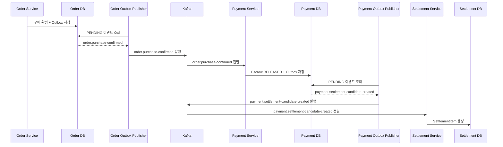
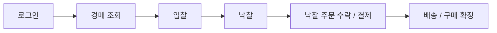
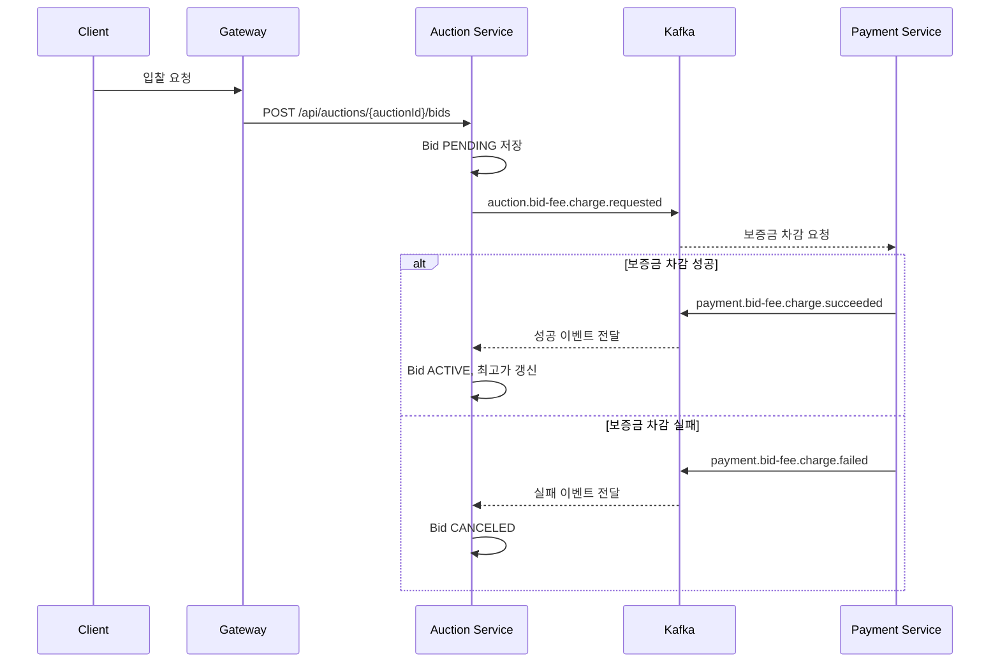
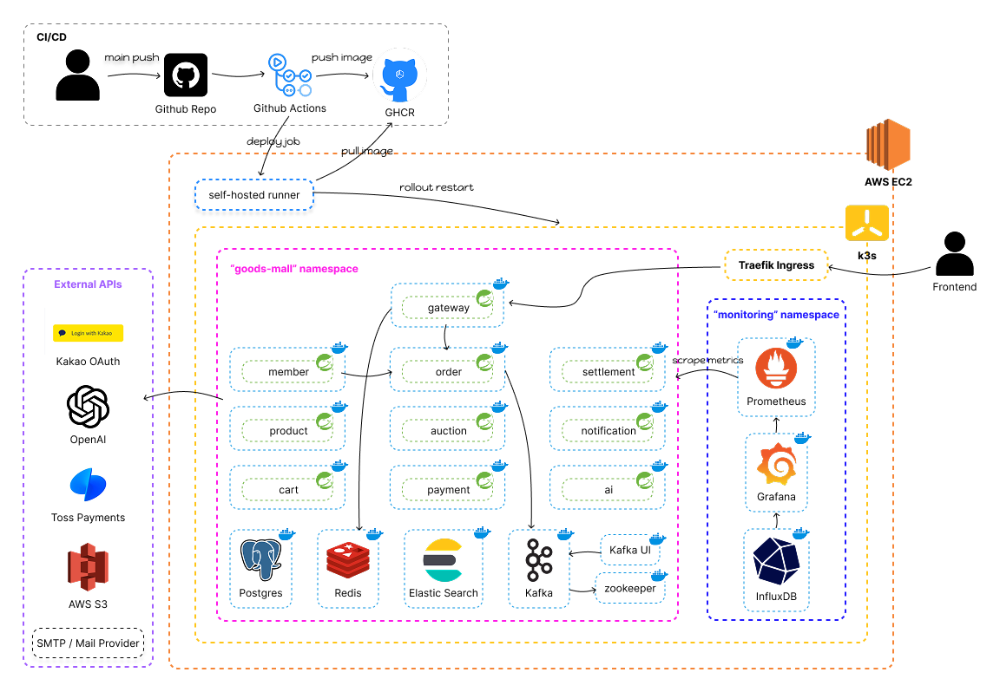
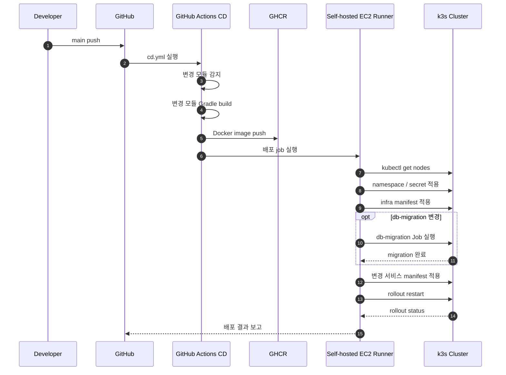

# 🛍️ GoodsMall

> **일반/경매 거래 통합 환경을 위한 고가용성 MSA 기반 굿즈 이커머스 플랫폼**
>
> Hexagonal Architecture 기반의 서비스 책임 분리와 Kafka 중심의 Event-Driven 흐름을 통해 경매, 결제, 정산 도메인의 후속 처리를 비동기적으로 연결했습니다.

<br>

---

## 🚀 핵심 엔지니어링 목표 (Engineering Focus)

GoodsMall 팀은 일반 구매와 경매 구매가 공존하는 거래 도메인에서 서비스 책임을 분리하고, 후속 처리가 많은 경매·결제·정산 흐름을 안정적으로 연결하기 위해 
다음 4가지 과제에 집중했습니다.

*   **이종(Heterogeneous) 거래 흐름의 결합 분리**: 일반 즉시 구매와 경매 낙찰 주문의 라이프사이클을 분리하되, 결제/배송/정산 레이어는 일관된 파이프라인으로 통합
*   **비동기 이벤트 기반의 후속 처리 분리**: 입찰 보증금 예치, 낙찰자 선정, 주문 생성 등 트랜잭션이 무거운 경매 후속 프로세스를 Kafka 이벤트와 Outbox 패턴 기반으로 분리
*   **Escrow 기반 정산 데이터 적재**: 구매 확정 이후 Escrow를 RELEASED 상태로 전환하고, 정산 후보(`SettlementItem`)를 생성해 월별/부분 정산 처리의 입력 데이터로 관리
*   **Gateway 중심 인증 및 접근 제어**: Gateway에서 JWT 검증, Redis 기반 blacklist 확인, role-rule 기반 1차 접근 제어를 수행하고, 검증된 사용자 정보를 내부 서비스로 전달

<br>

---


## 🏗️ 아키텍처 하이라이트 & 기술적 판단

### 1. 왜 계층 분리와 포트/어댑터 구조인가?

서비스별로 application/usecase, domain, infrastructure 계층을 분리해 핵심 유스케이스가 저장소, 메시징, 외부 API 구현에 직접 묶이지 않도록 설계했습니다.

예: Settlement 서비스 구조

```text
service/settlement/src/main/java/com/example/settlement
├── application
│   ├── service        # 월별 정산, 부분 정산 등 유스케이스 구현
│   └── usecase        # controller, scheduler, consumer가 의존하는 유스케이스 인터페이스
├── domain
│   ├── entity         # Settlement, SettlementItem 등 정산 도메인 모델
│   ├── enumtype       # 정산 상태와 타입
│   └── repository     # 도메인 관점의 저장소 인터페이스
├── infrastructure
│   ├── messaging      # Kafka consumer / outbox publisher
│   ├── repository     # Spring Data JPA 기반 repository adapter
│   └── scheduler      # 월별 정산 배치 스케줄러
└── presentation
    └── controller     # API controller
```

이 구조를 통해 정산 유스케이스는 `SettlementItemRepository` 같은 도메인 관점의 인터페이스에 의존하고, 실제 JPA 구현과 Kafka 연동은 infrastructure 계층에서 담당합니다.

<br>

### 2. 이벤트 기반 데이터 일관성 전략

경매 낙찰, 주문 확정, escrow release, 정산 후보 생성처럼 서비스 간 상태 전이가 필요한 흐름은 Kafka 이벤트와 Outbox 패턴으로 연결했습니다.



<br>

---

## 🗺️ 대표 핵심 시나리오: 경매 흐름

### 1. 경매 구매 여정 (End-to-End)
사용자의 실시간 입찰부터 낙찰, 대금 지불 및 배송까지의 유기적인 라이프사이클입니다.



### 2. 입찰 보증금 검증 및 최고가 갱신

입찰 요청은 `Bid`를 먼저 `PENDING`으로 저장한 뒤, Payment Service의 보증금 처리 결과 이벤트를 받아 실제 최고가 반영 여부를 결정합니다.



자세한 흐름은 [docs/01-user-flow.md](docs/01-user-flow.md)를 본다.

<br>

---

## 🛠️ 시스템 아키텍처



배포 리소스와 운영 체크리스트는 [docs/08-deployment.md](docs/08-deployment.md)를 본다.

<br>

---

## 🛠️ 서비스별 핵심 책임 (Bounded Context)

| 서비스명 | 핵심 도메인 책임 (Domain Responsibility) | 상세 문서 |
|---|---|---|
| Gateway | 요청 라우팅, JWT 검증, 1차 role-rule 접근 제어 | [gateway.md](docs/service/gateway.md) |
| Member | 회원 인증, 회원 정보, 판매자 정보, 검증 | [member-service.md](docs/service/member-service.md) |
| Product | 상품 카탈로그, 카테고리, 이미지, 재고 | [product-service.md](docs/service/product-service.md) |
| Cart | 장바구니, 찜 | [cart-service.md](docs/service/cart-service.md) |
| Auction | 경매 생명주기, 입찰 생명주기 | [auction-service.md](docs/service/auction-service.md) |
| Order | 주문 생명주기, 배송, 반품, 구매 확정 | [order-service.md](docs/service/order-service.md) |
| Payment | 지갑, 결제, escrow, 환불, 경매 보증금 | [payment-service.md](docs/service/payment-service.md) |
| Settlement | 정산 후보 집계, 지급 요청, 지급 결과 반영 | [settlement-service.md](docs/service/settlement-service.md) |
| Notification | 알림 생성과 전달 | [notification-service.md](docs/service/notification-service.md) |
| AI | 추천, 임베딩, AI 보조 기능 | [ai-service.md](docs/service/ai-service.md) |

공통 모듈:

- `common-security`: 인증 어노테이션, 인증 헤더 바인딩, 공통 인증 유틸리티
- `common-monitoring`: Actuator / Prometheus 공통 설정
- `db-migration`: Flyway 기반 스키마 마이그레이션

상세 책임은 [docs/03-service-responsibilities.md](docs/03-service-responsibilities.md)와 [docs/service/README.md](docs/service/README.md)를 본다.

<br>

---

## 💻 기술 스택

### Backend

| 기술 | 용도 |
|---|---|
| Java 21 | 서비스 구현 언어 |
| Spring Boot 4 | 마이크로서비스 애플리케이션 기반 |
| Spring Data JPA | 도메인 데이터 영속화 |
| Spring Cloud Gateway | API Gateway와 요청 라우팅 |

### Data / Messaging

| 기술 | 용도 |
|---|---|
| PostgreSQL | 서비스별 주요 관계형 데이터 저장 |
| pgvector | AI 추천/검색 보조를 위한 벡터 저장 |
| Redis | 인증 보조 데이터와 캐시성 데이터 저장 |
| Apache Kafka | 서비스 간 비동기 이벤트 전달 |
| Elasticsearch | 상품 검색 인덱싱 |

### Infra / DevOps

| 기술 | 용도 |
|---|---|
| Docker / Docker Compose | 로컬 인프라 실행 |
| Kubernetes / k3s | 배포 환경 구성 |
| GitHub Actions | CI/CD 자동화 |
| Prometheus / Grafana | 모니터링과 시각화 |

<br>

---

## 💡 빠른 시작

### 사전 준비

- Java 21
- Docker / Docker Compose
- `.env` 파일

환경 변수 설정은 [docs/07-environment-variables.md](docs/07-environment-variables.md)를 참고한다.

### 인프라 구동

```bash
cp .env.infra.example .env
docker compose --env-file .env -f infra/docker/docker-compose.infra.yml up -d
```

`infra/docker/docker-compose.infra.yml`은 PostgreSQL, Kafka, Redis, Elasticsearch, db-migration, Prometheus, Grafana를 실행한다.

### 서비스 실행

각 서비스는 별도 터미널에서 `bootRun`으로 실행한다.

```bash
./gradlew :{module-name}:bootRun
```

### CI/CD 흐름



<br>

---

## 📂 프로젝트 상세 엔지니어링 문서

### 설계 판단

- [docs/09-engineering-decisions.md](docs/09-engineering-decisions.md)

### 서비스 문서

- [docs/service/README.md](docs/service/README.md)

### API 문서

- [docs/api/README.md](docs/api/README.md)

<br>

---

## 👤 My Role — sihoney

* TodayLunchMenu 팀에서 Gateway, Member, Notification 도메인을 담당. 
* 인증&인가 진입점/회원·세션·OAuth 흐름/이벤트 기반 알림 처리를 중심으로 구현
* 본 영역에서 265 커밋(2026-03-25 ~ 2026-06-01)을 기여.

| 영역 | 작업 | 핵심 파일 |
|---|---|---|
| Gateway 인증/인가 | JWT 검증, Redis blacklist 확인, public path / role-rule 기반 접근 제어, 사용자 컨텍스트 헤더 전달 | `service/gateway/.../JwtAuthenticationFilter.java`, `GatewayJwtValidator.java`, `RedisTokenBlacklistStore.java`, `application.yml` |
| Member 인증/세션 | 로그인, 토큰 재발급, 세션 조회/로그아웃, refresh token rotation, Redis 기반 세션/blacklist 관리 | `service/member/.../AuthLoginService.java`, `AuthTokenIssuer.java`, `AuthTokenRefreshService.java`, `AuthSessionService.java` |
| Member 회원 도메인 | 회원 가입/조회/수정/탈퇴, 판매자 전환, 회원 신고/제재, 탈퇴 가능 여부 내부 서비스 연동 | `service/member/.../MemberService.java`, `SellerService.java`, `SellerPromotionService.java`, `MemberWithdrawalCheckFeignAdapter.java` |
| 이벤트 기반 알림 | Kafka 이벤트 소비, eventType별 handler 분기, 알림 inbox 저장, SSE 실시간 전송 | `service/notification/.../NotificationEventConsumer.java`, `NotificationEventHandlerRegistry.java`, `NotificationService.java`, `NotificationPushService.java` |
| 알림 실패 처리 | 중복 이벤트 방지, 재시도/실패 분류, DLQ 발행, SSE 전송 실패 상태 관리 | `DefaultNotificationConsumerExceptionClassifier.java`, `KafkaNotificationDlqPublisher.java`, `Notification.java` |

* Gateway에서 인증 책임을 중앙화하고, 
* Member 서비스에서 세션·OAuth·인증 보조 상태를 Redis와 DB로 분리해 관리했다. 
* Notification 서비스에서는 여러 도메인 이벤트를 사용자 알림으로 변환하면서 inbox 저장, SSE push, 중복 방지, DLQ 실패 처리 흐름을 다뤘다.

<br>
