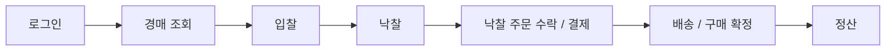
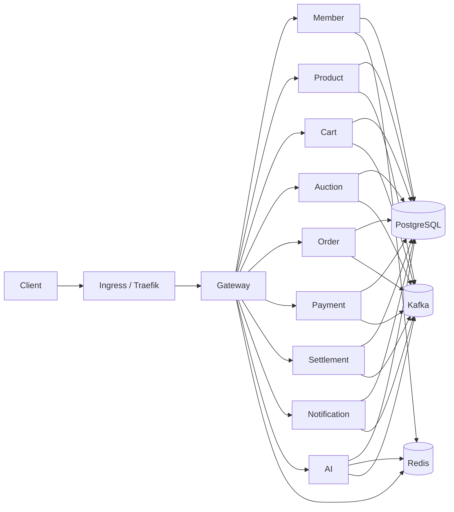
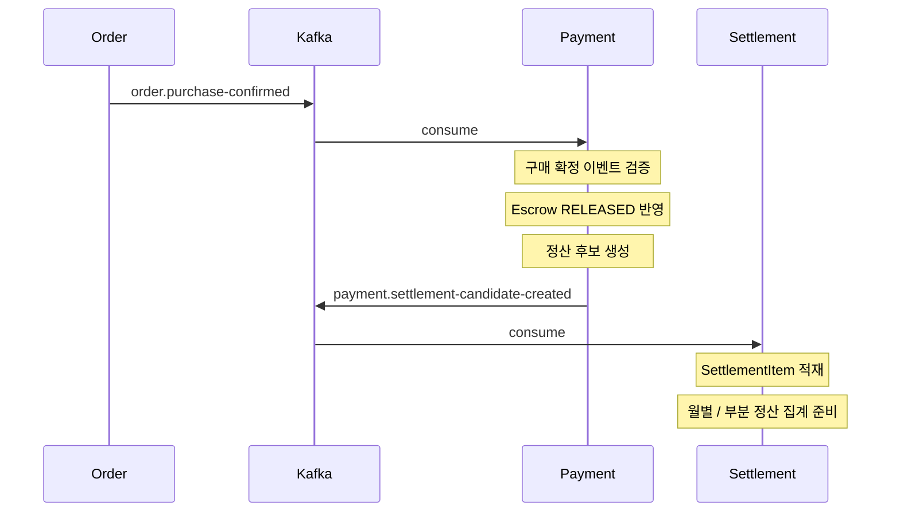

# GoodsMall

> MSA, Hexagonal Architecture, Kafka 이벤트 처리를 적용한 굿즈 이커머스 서비스

---

## 프로젝트 개요

GoodsMall은 일반 구매와 경매 구매를 함께 지원하는 굿즈 이커머스 서비스다.

사용자는 일반 상품을 바로 구매할 수 있고, 경매에 참여해 낙찰 후 주문과 결제로 이어갈 수도 있다. 판매자는 상품 등록, 경매 운영, 주문 처리, 정산까지 하나의 서비스 안에서 관리할 수 있다.

다음 요구사항을 중심으로 설계했다.

- **일반 구매·경매 구매 통합 거래 흐름** -- 일반 상품 주문과 경매 낙찰 주문을 분리된 서비스에서 처리하되, 결제·배송·구매 확정 흐름으로 일관되게 연결
- **경매 낙찰 후속 처리** -- 입찰 보증금, 낙찰자 결정, 낙찰 주문 생성, 낙찰 주문 수락·결제를 Kafka 이벤트 기반 후속 처리로 분리
- **판매자 정산 처리** -- 구매 확정 이후 escrow release, 정산 후보 생성, 월별·부분 정산, 지급 요청을 Settlement 배치와 이벤트 흐름으로 처리
- **거래 상태 알림과 권한 관리** -- 주문·결제·경매 상태 변화를 SSE 알림으로 전달하고, Gateway JWT 검증과 서비스별 권한 검증으로 접근을 제어
- **개인화 추천·판매자 AI 보조** -- 사용자 행동 기반 추천, 상품 임베딩, 상품 등록 초안 보조, 경매 가격 추천을 AI 서비스로 제공

이 서비스는 주문, 결제, 정산, 알림, 추천 기능을 서비스별로 분리하고, 경매·정산처럼 후속 처리가 많은 흐름은 Kafka 기반 비동기 처리로 연결했다.

---

## 핵심 목표

- 서비스 책임 분리
- Gateway 중심 인증 구조
- Kafka 기반 후속 처리
- Redis 기반 세션 / blacklist 관리
- 월별 / 부분 정산 처리
- Kubernetes 기반 운영 배포

---

## 주요 기능

- 회원 가입 / 로그인 / 세션 관리
- 상품 등록 / 조회 / 검색
- 장바구니 / 찜
- 일반 주문 생성 / 결제 / 배송 / 구매 확정
- 경매 생성 / 입찰 / 낙찰 주문 수락
- 지갑 충전 / 출금 / escrow / 환불
- seller 정산 / 부분 정산 / payout 결과 반영
- 알림 생성 / SSE 실시간 알림
- AI 추천 / 상품 임베딩 / 상품 등록 초안 보조 / 경매 가격 추천

---

## 대표 사용자 흐름

현재 프로젝트 구조를 가장 잘 드러내는 대표 흐름은 경매 구매 여정이다.



요약:

1. 사용자가 입찰을 요청하면 `Auction Service`가 `Bid`를 `PENDING`으로 저장하고 보증금 차감 이벤트를 발행한다.
2. `Payment Service`가 보증금을 처리하고 성공/실패 결과를 다시 이벤트로 보낸다.
3. 경매 종료 후 `auction.won` 이벤트로 `Order Service`가 낙찰 주문을 사전 생성한다.
4. 결제 성공 시 `Order Service`가 `order.confirmed`를 발행하고, 이후 배송과 구매 확정 흐름이 이어진다.
5. 구매 확정 후 `Payment Service`가 escrow를 release하고 `Settlement Service`가 정산 후보를 적재한다.

자세한 흐름은 [docs/01-user-flow.md](docs/01-user-flow.md)를 본다.

---

## 시스템 아키텍처



---

## 서비스 책임

| Service | Main Responsibility | 문서 |
|---|---|---|
| Gateway | 요청 라우팅, JWT 검증, 1차 role-rule 접근 제어 | [gateway.md](docs/service/gateway.md) |
| Member | 회원 인증, 회원 정보, 판매자 정보, 검증 | [member-service.md](docs/service/member-service.md) |
| Product | 상품 카탈로그, 카테고리, 이미지, 재고 | [product-service.md](docs/service/product-service.md) |
| Cart | 장바구니, 찜 | [cart-service.md](docs/service/cart-service.md) |
| Auction | 경매 생명주기, 입찰 생명주기 | [auction-service.md](docs/service/auction-service.md) |
| Order | 주문 생명주기, 배송, 반품, 구매 확정 | [order-service.md](docs/service/order-service.md) |
| Payment | 지갑, 결제, escrow, 환불, 경매 보증금 | [payment-service.md](docs/service/payment-service.md) |
| Settlement | 정산 후보 집계, 지급 요청, 지급 결과 반영 | [settlement-service.md](docs/service/settlement-service.md) |
| Notification | 알림 생성과 전달 | [notification-service.md](docs/service/notification-service.md) |
| AI | 추천, 임베딩, AI 보조 기능 | [ai-service.md](docs/service/ai-service.md) |

공통 모듈:

- `common-security`: 인증 어노테이션, 인증 헤더 바인딩, 공통 인증 유틸리티
- `common-monitoring`: Actuator / Prometheus 공통 설정
- `db-migration`: Flyway 기반 스키마 마이그레이션

상세 책임은 [docs/03-service-responsibilities.md](docs/03-service-responsibilities.md)와 [docs/service/README.md](docs/service/README.md)를 본다.

---

## 대표 이벤트 흐름

이 다이어그램은 구매 확정 이후 정산 후보가 생성되는 대표 이벤트 흐름을 보여준다.



프로젝트의 이벤트 기준과 예외 사항은 [docs/05-event-strategy.md](docs/05-event-strategy.md)를 본다.

---

## 빠른 시작

### 사전 준비

- Java 21
- Docker / Docker Compose
- `.env` 파일

환경 변수 설정은 [docs/07-environment-variables.md](docs/07-environment-variables.md)를 참고한다.

### 인프라 구동

```bash
cp .env.example .env
docker compose --env-file .env -f infra/docker/docker-compose.infra.yml up -d
```

`infra/docker/docker-compose.infra.yml`은 PostgreSQL, Kafka, Redis, Elasticsearch, db-migration, Prometheus, Grafana를 실행한다.

기본 접근 경로:

- Swagger UI: `http://localhost:8080/swagger-ui.html`
- Kafka UI: `http://localhost:8089`
- Elasticsearch: `http://localhost:9200`
- Prometheus: `http://localhost:9090`
- Grafana: `http://localhost:3000`

### 서비스 실행

각 서비스는 별도 터미널에서 `bootRun`으로 실행한다.

```bash
./gradlew :{module-name}:bootRun
```

로컬 기본 포트:

- Gateway: `http://localhost:8080`
- Product: `http://localhost:8081`
- Payment: `http://localhost:8082`
- Member: `http://localhost:8083`
- Order: `http://localhost:8084`
- Settlement: `http://localhost:8085`
- Cart: `http://localhost:8086`
- Notification: `http://localhost:8087`
- AI: `http://localhost:8088`
- Auction: `http://localhost:8090`

### CI / CD

- `ci.yml`: `dev`, `main` 대상 PR에서 변경 모듈 build 검증
- `cd.yml`: `main` push에서 변경 모듈 build, GHCR push, k3s cluster 배포

세부 내용은 [docs/08-deployment.md](docs/08-deployment.md)를 본다.

---

## 배포 요약

- Runtime: Kubernetes (`k3s` 기반 cluster)
- Runner: GitHub Actions self-hosted runner (`ec2`, `k3s` label)
- Image Registry: GHCR
- Ingress: Traefik
- Monitoring: Prometheus, Grafana, InfluxDB

---

## 기술 스택

### Backend


### Data / Messaging


### Infra / DevOps


---

## 관련 문서

### 사용자 흐름

- [docs/01-user-flow.md](docs/01-user-flow.md)

### 아키텍처 / 요청 흐름

- [docs/02-architecture.md](docs/02-architecture.md)
- [docs/03-service-responsibilities.md](docs/03-service-responsibilities.md)
- [docs/04-request-flow.md](docs/04-request-flow.md)

### 인증 / 이벤트

- [docs/06-auth-flow.md](docs/06-auth-flow.md)
- [docs/05-event-strategy.md](docs/05-event-strategy.md)

### 배포 / 운영

- [docs/08-deployment.md](docs/08-deployment.md)

### 설계 판단

- [docs/10-engineering-decisions.md](docs/10-engineering-decisions.md)

### 서비스 문서

- [docs/service/README.md](docs/service/README.md)

---

## 원본 저장소

- https://github.com/prgrms-be-adv-devcourse/beadv5_2_TodayLunchMenu_BE

---

## 팀원 소개

| 이름 | GitHub | 담당 서비스 |
|---|---|---|
| 오택률 | [@yellow-pang](https://github.com/yellow-pang) | Payment, Settlement, AI |
| 장명수 | [@MyeongSooJang](https://github.com/MyeongSooJang) | Product, Cart, Auction |
| 황희원 | [@sihoney](https://github.com/sihoney) | Gateway, Member, Notification |
| 박상원 | [@park9707](https://github.com/park9707) | Order, Infra |

GitHub ID는 원본 저장소 및 현재 git 기록 기준으로 반영했다. 담당 서비스는 팀 기준으로 정리했다.

---

## 내 기여

- Gateway 기반 JWT 인증 구조 정리와 인증 흐름 문서화
- Event strategy, request flow, deployment 문서 정리
- 서비스 문서 템플릿 정리와 서비스별 상세 문서 재작성
- 경매, 주문, 결제, 정산, AI 흐름의 책임과 이벤트 연계 구조 정리
