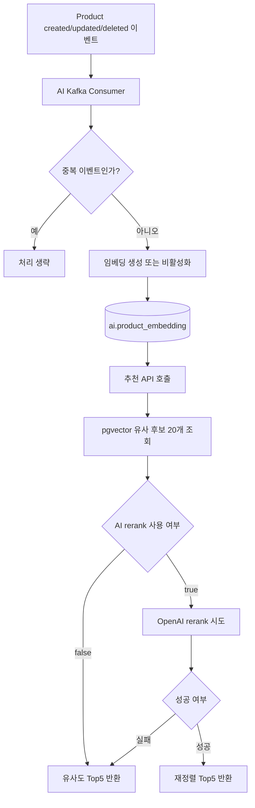

# AI Service

> 이 문서는 `ai` 모듈의 **1차 임시 README**입니다.  
> 현재 구현된 기능과 이미 정리된 초안 문서를 기준으로 작성했으며, 이후 기능 추가와 운영 정책 변경에 따라 수정될 수 있습니다.

`ai` 모듈은 Today Lunch Mall에서 사용하는 AI 기능을 한곳에 모아두는 서비스입니다. 현재는 `pgvector` 기반 연관 상품 추천과 상품 임베딩 관리가 핵심 역할이며, 앞으로 이미지 기반 상품 등록 보조 AI 기능이 추가될 예정입니다.

## 1. 한눈에 보는 역할

| 구분 | 현재 상태 | 설명 |
|---|---|---|
| 연관 상품 추천 | 운영 대상 | 상품 임베딩과 `pgvector` 유사도 검색으로 상세페이지 연관 상품 Top5를 제공합니다. |
| 추천 재정렬 | 옵션 기능 | OpenAI 기반 rerank를 feature flag로 켜서 후보 20개를 재정렬할 수 있습니다. |
| 상품 임베딩 생성/갱신 | 운영 대상 | Product 이벤트를 받아 임베딩을 생성하거나 갱신합니다. |
| 관리자 재색인 | 운영 대상 | 누락 임베딩 보정과 전체 재색인을 관리자 API로 수행합니다. |
| 이벤트 중복 방지 | 운영 대상 | Redis 기반 idempotency 키로 중복 소비를 방지합니다. |
| 이미지 기반 상품 등록 보조 AI | 작업 예정 | `private_docs/12_이미지기반_상품등록보조AI` 문서를 참고해 추후 추가될 예정입니다. 아직 초안 단계이므로 세부 API/흐름은 바뀔 수 있습니다. |

## 2. 현재 제공 기능

### 2.1 연관 상품 추천

- 엔드포인트: `GET /api/ai/recommendations/products/{productId}`
- 응답 정책: 최종 **Top5 고정 반환**
- 처리 방식:
  - 기준 상품의 활성 임베딩 조회
  - `pgvector`로 유사 후보 20개 조회
  - rerank 비활성화 시 유사도 상위 5개 반환
  - rerank 활성화 시 OpenAI 재정렬 시도
  - rerank 실패 시 유사도 Top5로 fallback

### 2.2 상품 임베딩 생성/관리

- Product `created/updated/deleted` 이벤트를 Kafka로 수신합니다.
- 입력 텍스트는 `상품명 + 카테고리명 + 설명` 조합으로 구성합니다.
- 임베딩 모델은 현재 `text-embedding-3-small`을 사용합니다.
- 비활성 상품은 하드 삭제하지 않고 `is_active=false`로 제외합니다.

### 2.3 관리자 API

| Method | Path | 권한 | 설명 |
|---|---|---|---|
| `POST` | `/api/ai/admin/embeddings/backfill-missing` | `ADMIN` | 임베딩이 없는 활성 상품만 찾아 보정합니다. |
| `POST` | `/api/ai/admin/embeddings/reindex-all` | `ADMIN` | 전체 상품을 다시 순회하며 임베딩을 재생성하거나 비활성 처리합니다. |

## 3. 모듈 흐름 요약



## 4. 실행 정보

| 항목 | 값 |
|---|---|
| 서비스 이름 | `ai-service` |
| 내부 실행 포트 | `8091` |
| DB 스키마 | `ai` |
| 주요 저장소 | PostgreSQL + `pgvector`, Redis, Kafka |
| Swagger Docs | `/v3/api-docs` |
| Swagger UI | `/swagger-ui.html` |

직접 호출 기준 기본 주소:

```text
http://localhost:8091
```

Gateway 경유 기준 기본 주소:

```text
http://localhost:8080
```

## 5. 주요 환경변수

| 분류 | 환경변수 |
|---|---|
| DB | `DB_USERNAME`, `DB_PASSWORD` |
| Kafka | `KAFKA_BOOTSTRAP_SERVERS`, `AI_PRODUCT_*_TOPIC`, `AI_PRODUCT_EVENT_CONSUMER_GROUP` |
| Redis | `REDIS_HOST`, `REDIS_PORT` |
| OpenAI | `OPENAI_API_KEY`, `PROJECT_OPENAI_BASE_URL` |
| 추천 옵션 | `AI_RECOMMENDATION_RERANK_ENABLED`, `AI_RECOMMENDATION_RERANK_MODEL`, `AI_RECOMMENDATION_CACHE_TTL_SECONDS` |
| 이벤트 중복 방지 | `AI_EVENT_IDEMPOTENCY_TTL_SECONDS` |

## 6. 패키지 구조

```text
ai
├─ src/main/java/com/example/ai
│  ├─ application
│  ├─ common
│  ├─ config
│  ├─ domain
│  ├─ infrastructure
│  └─ presentation
├─ src/main/resources
└─ docs
```

## 7. 문서 안내

| 문서 | 목적 |
|---|---|
| [pgvector 기반 AI 연관 상품 추천 기능 문서](./docs/pgvector_기반_AI_연관상품_추천_기능.md) | 현재 구현된 추천 기능의 구조, 데이터 흐름, 운영 포인트를 상세히 설명합니다. |

## 8. 작업 예정 메모

- 이미지 기반 상품 등록 보조 AI 기능이 추후 이 모듈에 추가될 예정입니다.
- 관련 아이디어와 흐름은 `private_docs/12_이미지기반_상품등록보조AI` 초안 문서를 참고했습니다.
- 다만 해당 기능은 아직 설계 고정 전 단계이므로, README에는 **작업 예정**으로만 표시하며 상세 문서는 추후 별도로 정리해야 합니다.
