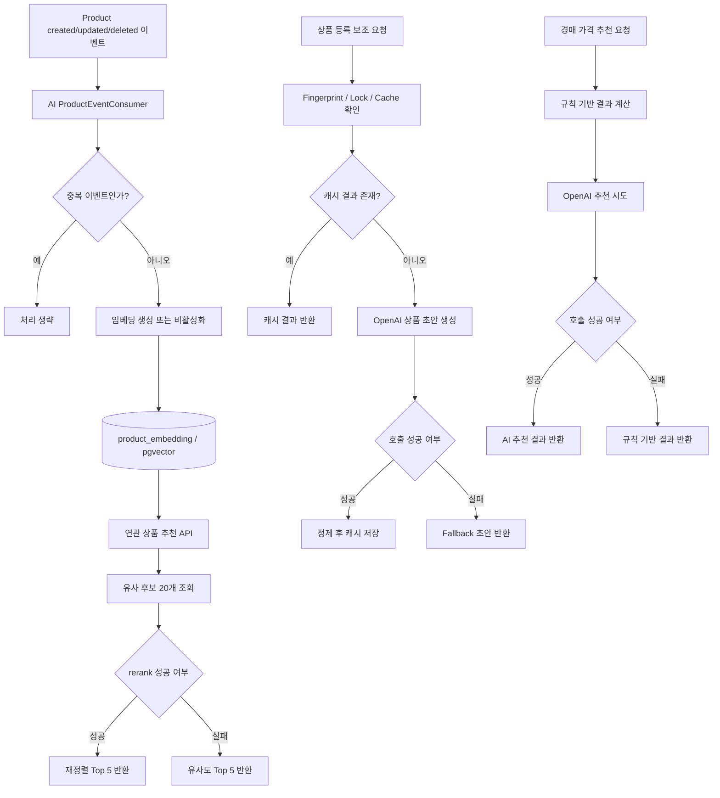

# AI Service

`ai` 모듈은 Today Lunch Mall의 AI 기능을 담당하는 서비스입니다. 현재 구현 범위는 다음 네 가지입니다.

- `pgvector` 기반 연관 상품 추천
- Product 이벤트 기반 상품 임베딩 생성/갱신/비활성화
- 이미지 기반 상품 등록 보조 AI
- 경매 가격 추천 AI

이 README는 배포 방식보다 현재 구현된 기능과 API 계약을 기준으로 정리한 완성본입니다.

## 1. 핵심 역할

| 기능 | 설명 |
|---|---|
| 연관 상품 추천 | 상품 임베딩과 `pgvector` 유사도 검색으로 상세페이지 추천 상품 Top 5를 반환합니다. |
| 추천 재정렬 | 유사 후보 20개를 가져온 뒤 OpenAI rerank를 적용할 수 있으며, 실패 시 유사도 순 결과로 fallback 합니다. |
| 상품 임베딩 관리 | Product Kafka 이벤트를 소비해 임베딩을 생성하거나 갱신하고, 비활성 상품은 추천 대상에서 제외합니다. |
| 관리자 재색인 | 누락 임베딩 백필과 전체 재색인을 관리자 API로 수행합니다. |
| 상품 등록 보조 AI | 판매자가 업로드한 이미지와 현재 입력값을 바탕으로 상품명, 설명, 가격 초안을 추천합니다. |
| 경매 가격 추천 AI | 경매 상태를 기준으로 예상 형성가와 추천 입찰가를 생성하며, OpenAI 실패 시 규칙 기반 결과를 반환합니다. |

## 2. 제공 API

| Method | Path | 설명 |
|---|---|---|
| `GET` | `/api/ai/recommendations/products/{productId}` | 연관 상품 추천 조회 |
| `POST` | `/api/ai/assist/product-draft-from-image` | 이미지 기반 상품 등록 보조 |
| `POST` | `/api/ai/auction-price-recommendation` | 경매 가격 추천 |
| `POST` | `/api/ai/admin/embeddings/backfill-missing` | 누락 임베딩 백필 |
| `POST` | `/api/ai/admin/embeddings/reindex-all` | 전체 임베딩 재색인 |

관리자 API는 `ADMIN` 권한을 전제로 합니다.

## 3. 전체 흐름도



## 4. 기능별 동작

### 3.1 연관 상품 추천

- 기준 상품의 활성 임베딩을 조회합니다.
- `pgvector` 유사도 검색으로 후보 20개를 찾습니다.
- 최종 응답은 항상 최대 5개입니다.
- rerank가 정상 동작하면 OpenAI 기준 재정렬 결과를 사용합니다.
- rerank가 실패하면 유사도 상위 5개를 그대로 반환합니다.
- 추천 결과는 캐시되며, 임베딩 생성/갱신/비활성화가 발생하면 캐시를 비웁니다.

응답 예시:

```json
{
  "success": true,
  "data": [
    {
      "productId": "dddddddd-dddd-dddd-dddd-ddddddddd101",
      "similarityScore": 0.9998
    },
    {
      "productId": "dddddddd-dddd-dddd-dddd-ddddddddd102",
      "similarityScore": 0.9997
    }
  ],
  "error": null
}
```

### 3.2 상품 임베딩 생성/갱신

Kafka로 다음 Product 이벤트를 소비합니다.

- `product.created`
- `product.updated`
- `product.deleted`

동작 방식:

- 이벤트 payload는 `String`으로 수신한 뒤 `ObjectMapper`로 직접 역직렬화합니다.
- 입력 텍스트는 `상품명 + 카테고리명 + 설명` 조합으로 구성합니다.
- `product.deleted` 또는 `INACTIVE` 상태 이벤트는 임베딩을 하드 삭제하지 않고 비활성화합니다.
- 동일 이벤트 중복 처리는 Redis idempotency 키로 방지합니다.
- 이벤트 처리 실패 시 idempotency 키를 해제해 재처리가 가능하도록 합니다.
- 재시도 한도를 초과한 이벤트는 `ai.product-event.dlq`로 발행합니다.

추가 보호 로직:

- `sourceUpdatedAt`이 더 최신인 데이터가 이미 저장돼 있으면 오래된 이벤트는 무시합니다.
- 임베딩 입력 텍스트가 전부 비어 있으면 예외 처리합니다.

### 3.3 관리자 임베딩 API

`POST /api/ai/admin/embeddings/backfill-missing`

- Product 서비스 전체 목록을 조회합니다.
- 비활성 상품은 건너뜁니다.
- 아직 임베딩이 없는 활성 상품만 골라 생성합니다.
- `processedCount`, `successCount`, `skippedCount`, `failedCount`를 반환합니다.

`POST /api/ai/admin/embeddings/reindex-all`

- Product 서비스 전체 목록을 다시 순회합니다.
- 활성 상품은 재임베딩합니다.
- 비활성 상품은 임베딩을 비활성화합니다.
- 결과 집계 형식은 백필 API와 동일합니다.

### 3.4 이미지 기반 상품 등록 보조 AI

엔드포인트:

- `POST /api/ai/assist/product-draft-from-image`
- `multipart/form-data`

요청 파트:

- `images`: 업로드 이미지 목록
- `request`: JSON 문자열

`request` 주요 필드:

- `inputFields`
- `titleDraft`
- `descriptionDraft`
- `priceDraft`
- `categoryName`
- `categoryPathText`
- `thumbnailIndex`

검증 규칙:

- 이미지는 최소 1장, 최대 5장입니다.
- 각 파일은 5MB 이하여야 합니다.
- 전체 요청 크기는 30MB 이하여야 합니다.
- 허용 이미지 형식은 `JPG`, `PNG`, `WEBP`, `GIF` 입니다.
- `inputFields`는 최소 1개 이상 필요합니다.
- `inputFields.fieldKey` 중복은 허용하지 않습니다.
- `thumbnailIndex`가 없으면 `0`번 이미지를 사용합니다.

처리 흐름:

- 요청 fingerprint를 생성합니다.
- 동일 fingerprint 결과가 Redis 캐시에 있으면 재사용합니다.
- 진행 중인 동일 요청이 있으면 잠시 대기 후 캐시 결과를 재사용합니다.
- OpenAI 결과가 오면 fallback 초안과 병합해 정제합니다.
- OpenAI 호출 실패, 응답 파싱 실패, 대기 초과 시에는 fallback 초안을 반환합니다.

응답 필드:

- `suggestedTitle`
- `suggestedDescription`
- `suggestedPrice`
- `suggestedKeywords`
- `notes`

### 3.5 경매 가격 추천 AI

엔드포인트:

- `POST /api/ai/auction-price-recommendation`

필수 요청 필드:

- `auctionId`
- `productId`
- `productName`
- `currentBidPrice`
- `startPrice`
- `bidUnit`
- `nextMinimumBidPrice`
- `bidCount`
- `remainingSeconds`
- `auctionStatus`

선택 요청 필드:

- `hasBid`

추가 검증 규칙:

- `currentBidPrice`, `startPrice`, `bidUnit`, `nextMinimumBidPrice`는 0보다 커야 합니다.
- `currentBidPrice`는 `startPrice`보다 작을 수 없습니다.
- `nextMinimumBidPrice`는 `currentBidPrice`보다 작을 수 없습니다.
- `bidCount`, `remainingSeconds`는 0 이상이어야 합니다.

처리 흐름:

- 먼저 규칙 기반 결과를 계산합니다.
- OpenAI 추천이 성공하면 AI 결과를 사용합니다.
- OpenAI 추천이 실패하면 규칙 기반 결과를 그대로 반환합니다.
- 응답의 `notes`에 fallback 적용 여부를 남깁니다.

응답 필드:

- `expectedFinalPrice`
- `recommendedBidPrice`
- `priceReason`
- `notes`

## 5. 공통 응답 형식

모든 HTTP 응답은 `ApiResponse<T>`를 사용합니다.

성공:

```json
{
  "success": true,
  "data": {
    "...": "..."
  },
  "error": null
}
```

실패:

```json
{
  "success": false,
  "data": null,
  "error": {
    "code": "AI_ASSIST_IMAGE_REQUIRED",
    "message": "이미지는 최소 1개 이상 필요합니다."
  }
}
```

## 6. 주요 예외 코드

| 코드 | 의미 |
|---|---|
| `INVALID_INPUT_VALUE` | 일반 입력값 오류 |
| `AI_ASSIST_IMAGE_REQUIRED` | 상품 등록 보조 요청에 이미지가 없음 |
| `AI_ASSIST_IMAGE_COUNT_EXCEEDED` | 이미지 개수 초과 |
| `AI_ASSIST_IMAGE_TOO_LARGE` | 개별 이미지 용량 초과 |
| `AI_ASSIST_IMAGE_REQUEST_TOO_LARGE` | 전체 multipart 요청 크기 초과 |
| `AI_ASSIST_UNSUPPORTED_IMAGE_TYPE` | 허용하지 않는 이미지 형식 |
| `AI_ASSIST_INPUT_FIELDS_REQUIRED` | `inputFields` 누락 |
| `AI_ASSIST_DUPLICATE_FIELD_KEY` | 중복 `fieldKey` 존재 |
| `AI_PRODUCT_DRAFT_ASSIST_CONFIGURATION_ERROR` | 상품 등록 보조 AI 설정 오류 |
| `AI_PRODUCT_DRAFT_ASSIST_EXTERNAL_CALL_ERROR` | 상품 등록 보조 AI 외부 호출 오류 |
| `AI_PRODUCT_DRAFT_ASSIST_RESPONSE_INVALID_ERROR` | 상품 등록 보조 AI 응답 형식 오류 |
| `AI_AUCTION_PRICE_RECOMMENDATION_REQUEST_INVALID` | 경매 가격 추천 요청 검증 실패 |
| `AI_AUCTION_PRICE_RECOMMENDATION_CONFIGURATION_ERROR` | 경매 가격 추천 AI 설정 오류 |
| `AI_AUCTION_PRICE_RECOMMENDATION_EXTERNAL_CALL_ERROR` | 경매 가격 추천 AI 외부 호출 오류 |
| `AI_AUCTION_PRICE_RECOMMENDATION_RESPONSE_INVALID_ERROR` | 경매 가격 추천 AI 응답 형식 오류 |
| `AI_EMBEDDING_ERROR` | 임베딩 생성/조회/처리 오류 |

예외 처리 특징:

- 인증 오류는 `INVALID_TOKEN`, `FORBIDDEN`으로 내려갑니다.
- `MethodArgumentNotValidException`, 본문 형식 오류 등은 경매 가격 추천 요청 오류 코드로 정리됩니다.
- 예상하지 못한 예외는 `INTERNAL_SERVER_ERROR`로 응답합니다.

## 7. 외부 의존

| 대상 | 사용 목적 |
|---|---|
| PostgreSQL + `pgvector` | 상품 임베딩 저장 및 유사도 검색 |
| Redis | 추천 캐시, 이벤트 idempotency, 상품 등록 보조 요청 lock/cache |
| Kafka | Product 이벤트 소비 및 DLQ 처리 |
| OpenAI | 임베딩 생성, 추천 rerank, 상품 등록 보조, 경매 가격 추천 |
| Product 서비스 | 관리자 재색인 대상 상품 목록 조회 |

## 8. 패키지 구조

```text
ai
├─ src/main/java/com/example/ai
│  ├─ application
│  ├─ common
│  ├─ config
│  ├─ domain
│  ├─ infrastructure
│  └─ presentation
├─ src/main/resources
└─ docs
```
