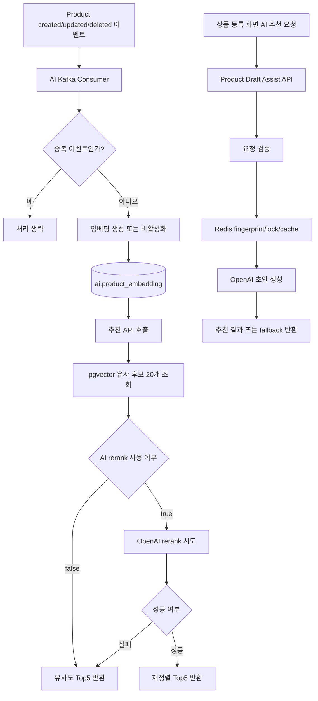

# AI Service

> 이 문서는 `ai` 모듈의 **2차 임시 README**입니다.  
> 현재 구현된 기능과 이미 정리된 초안 문서를 기준으로 작성했으며, 이후 기능 추가와 운영 정책 변경에 따라 수정될 수 있습니다.

`ai` 모듈은 Today Lunch Mall에서 사용하는 AI 기능을 한곳에 모아두는 서비스입니다. 현재는 `pgvector` 기반 연관 상품 추천, 상품 임베딩 관리, 이미지 기반 상품 등록 보조 AI, 경매 가격 추천 AI 내부 API가 구현되어 있습니다.

## 1. 한눈에 보는 역할

| 구분 | 현재 상태 | 설명 |
|---|---|---|
| 연관 상품 추천 | 운영 대상 | 상품 임베딩과 `pgvector` 유사도 검색으로 상세페이지 연관 상품 Top5를 제공합니다. |
| 추천 재정렬 | 옵션 기능 | OpenAI 기반 rerank를 feature flag로 켜서 후보 20개를 재정렬할 수 있습니다. |
| 상품 임베딩 생성/갱신 | 운영 대상 | Product 이벤트를 받아 임베딩을 생성하거나 갱신합니다. |
| 관리자 재색인 | 운영 대상 | 누락 임베딩 보정과 전체 재색인을 관리자 API로 수행합니다. |
| 이벤트 중복 방지 | 운영 대상 | Redis 기반 idempotency 키로 중복 소비를 방지합니다. |
| 이미지 기반 상품 등록 보조 AI | 구현 완료 | 판매자가 이미지와 현재 입력값을 보내면 제목/설명/가격 초안을 추천하고, 실패 시 fallback 초안을 반환합니다. |
| 경매 추천 가격 AI | 구현/인계 준비 | auction 서비스가 호출하는 내부 API를 통해 OpenAI 기반 가격 추천을 생성하고, 실패 시 규칙 기반 fallback 결과를 반환합니다. |

## 2. 현재 제공 기능

### 2.1 연관 상품 추천

- 엔드포인트: `GET /api/ai/recommendations/products/{productId}`
- 응답 정책: 최종 **Top5 고정 반환**
- 처리 방식:
  - 기준 상품의 활성 임베딩 조회
  - `pgvector`로 유사 후보 20개 조회
  - rerank 비활성화 시 유사도 상위 5개 반환
  - rerank 활성화 시 OpenAI 재정렬 시도
  - rerank 실패 시 유사도 Top5로 fallback

### 2.2 상품 임베딩 생성/관리

- Product `created/updated/deleted` 이벤트를 Kafka로 수신합니다.
- 입력 텍스트는 `상품명 + 카테고리명 + 설명` 조합으로 구성합니다.
- 임베딩 모델은 현재 `text-embedding-3-small`을 사용합니다.
- 비활성 상품은 하드 삭제하지 않고 `is_active=false`로 제외합니다.

### 2.3 Kafka 소비 설정 메모

- AI 모듈은 Product 이벤트 payload를 `String`으로 받은 뒤 내부 `ObjectMapper`로 직접 파싱합니다.
- 이 때문에 JSON 전용 consumer factory 대신 `StringDeserializer` 기반 기본 `kafkaListenerContainerFactory`를 명시적으로 등록합니다.
- 현재 기본 consumer group은 `ai-product-embedding-group`이며, 기본 토픽은 `product.created`, `product.updated`, `product.deleted`입니다.
- 이 설정이 없으면 Spring이 기본 listener factory bean을 찾지 못해 AI 서비스가 기동하지 못할 수 있습니다.

### 2.4 관리자 API

| Method | Path | 권한 | 설명 |
|---|---|---|---|
| `POST` | `/api/ai/admin/embeddings/backfill-missing` | `ADMIN` | 임베딩이 없는 활성 상품만 찾아 보정합니다. |
| `POST` | `/api/ai/admin/embeddings/reindex-all` | `ADMIN` | 전체 상품을 다시 순회하며 임베딩을 재생성하거나 비활성 처리합니다. |

### 2.5 이미지 기반 상품 등록 보조 AI

- 엔드포인트: `POST /api/ai/assist/product-draft-from-image`
- 요청 방식: `multipart/form-data`
- 주요 입력:
  - `images`
  - `request.titleDraft`
  - `request.descriptionDraft`
  - `request.priceDraft`
  - `request.categoryName`
  - `request.categoryPathText`
  - `request.thumbnailIndex`
  - `request.inputFields`
- 주요 응답:
  - `suggestedTitle`
  - `suggestedDescription`
  - `suggestedPrice`
  - `suggestedKeywords`
  - `notes`
- 처리 방식:
  - 입력 검증 후 prompt 생성
  - OpenAI multimodal 호출
  - 결과 정제
  - 실패 시 fallback 초안 반환
  - Redis 기반 중복 요청 억제 및 결과 재사용

### 2.6 경매 가격 추천 AI (내부 API)

- 엔드포인트: `POST /internal/ai/auction-price-recommendation`
- 주요 입력:
  - `auctionId`
  - `productId`
  - `currentBidPrice`
  - `startPrice`
  - `productName` (선택)
  - `bidCount` (선택)
  - `remainingSeconds` (선택)
- 주요 응답:
  - `expectedFinalPrice`
  - `recommendedBidPrice`
  - `priceReason`
  - `notes`
- 처리 방식:
  - OpenAI 기반 생성 우선
  - OpenAI 실패 시 규칙 기반 fallback
  - 요청 검증 실패/설정 오류/외부 호출 오류/응답 파싱 오류를 전용 코드로 구분

## 3. 모듈 흐름 요약



## 4. 실행 정보

| 항목 | 값 |
|---|---|
| 서비스 이름 | `ai-service` |
| 내부 실행 포트 | `8088` |
| DB 스키마 | `ai` |
| 주요 저장소 | PostgreSQL + `pgvector`, Redis, Kafka |
| Swagger Docs | `/v3/api-docs` |
| Swagger UI | `/swagger-ui.html` |

직접 호출 기준 기본 주소:

```text
http://localhost:8088
```

Gateway 경유 기준 기본 주소:

```text
http://localhost:8080
```

## 5. 주요 환경변수

| 분류 | 환경변수 |
|---|---|
| DB | `DB_USER_NAME`, `DB_USER_PASSWORD` |
| Kafka | `KAFKA_BOOTSTRAP_SERVERS`, `AI_PRODUCT_*_TOPIC`, `AI_PRODUCT_EVENT_CONSUMER_GROUP` |
| Redis | `REDIS_HOST`, `REDIS_PORT` |
| OpenAI | `OPENAI_API_KEY`, `PROJECT_OPENAI_BASE_URL` |
| 추천 옵션 | `AI_RECOMMENDATION_RERANK_ENABLED`, `AI_RECOMMENDATION_RERANK_MODEL`, `AI_RECOMMENDATION_CACHE_TTL_SECONDS` |
| 이벤트 중복 방지 | `AI_EVENT_IDEMPOTENCY_TTL_SECONDS` |
| 상품 등록 보조 AI | `AI_PRODUCT_DRAFT_ASSIST_ENABLED`, `AI_PRODUCT_DRAFT_ASSIST_MODEL`, `AI_PRODUCT_DRAFT_ASSIST_TEMPERATURE`, `AI_PRODUCT_DRAFT_ASSIST_LOCK_TTL_SECONDS`, `AI_PRODUCT_DRAFT_ASSIST_RESULT_TTL_SECONDS`, `AI_PRODUCT_DRAFT_ASSIST_WAIT_TIMEOUT_MS`, `AI_PRODUCT_DRAFT_ASSIST_POLL_INTERVAL_MS` |
| 경매 가격 추천 AI | `AI_AUCTION_PRICE_RECOMMENDATION_ENABLED`, `AI_AUCTION_PRICE_RECOMMENDATION_MODEL`, `AI_AUCTION_PRICE_RECOMMENDATION_TEMPERATURE`, `AI_AUCTION_PRICE_RECOMMENDATION_CONNECT_TIMEOUT_MS`, `AI_AUCTION_PRICE_RECOMMENDATION_READ_TIMEOUT_MS` |

## 6. 패키지 구조

```text
ai
├─ src/main/java/com/example/ai
│  ├─ application
│  ├─ common
│  ├─ config
│  ├─ domain
│  ├─ infrastructure
│  └─ presentation
├─ src/main/resources
└─ docs
```

## 7. 문서 안내

| 문서 | 목적 |
|---|---|
| [pgvector 기반 AI 연관 상품 추천 기능 문서](./docs/pgvector_기반_AI_연관상품_추천_기능.md) | 현재 구현된 추천 기능의 구조, 데이터 흐름, 운영 포인트를 상세히 설명합니다. |
| [이미지 기반 상품 등록 보조 AI 기능 문서](./docs/이미지_기반_상품등록보조AI_기능.md) | 상품 등록 보조 AI의 요청 계약, fallback, Redis 전략, 예외 구조, 프론트 연동 포인트를 상세히 설명합니다. |
| [경매 가격 추천 AI 인계 가이드](./docs/경매_가격추천AI_인계가이드.md) | auction 담당자가 내부 API를 연결할 때 필요한 계약, 예외 코드, fallback 동작, mock 예시를 정리합니다. |

## 8. 경매 가격 추천 AI 메모

- 경매 추천 가격 AI 내부 API는 현재 구현 및 인계 준비 상태입니다.
- 생성 경로는 `OpenAI 우선 -> 실패 시 규칙 기반 fallback`입니다.
- auction 공개 API 연결은 auction 담당 범위이며, 상세 연결 규칙은 인계 가이드를 따릅니다.
