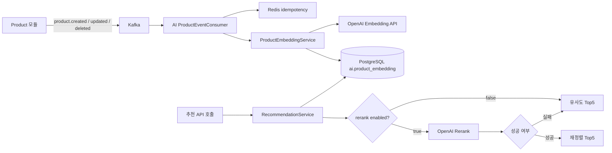
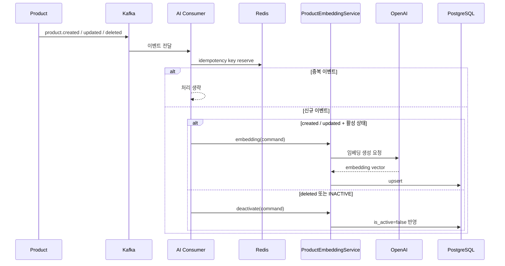
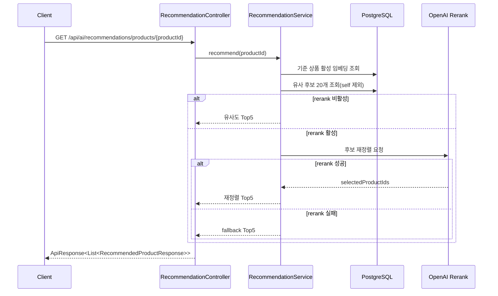

# pgvector 기반 AI 연관 상품 추천 기능

## 1. 문서 목적

이 문서는 `ai` 모듈에 구현된 **pgvector 기반 연관 상품 추천 기능**을 팀원이 빠르게 이해하고, 운영/연동/확장 시 참고할 수 있도록 정리한 상세 문서입니다.  
현재 코드와 `private_docs`에 정리된 설계 초안을 함께 반영했으며, 이미 구현된 내용과 향후 변경 가능성이 있는 내용을 구분해서 설명합니다.

## 2. 기능 개요

이 기능은 상품 상세페이지에서 기준 상품과 의미적으로 가까운 다른 상품을 추천하기 위한 기능입니다. 추천의 핵심은 상품 메타데이터를 텍스트 임베딩으로 변환한 뒤 PostgreSQL의 `pgvector`를 사용해 유사 상품을 검색하는 것입니다.

현재 구현 기준 핵심 정책은 아래와 같습니다.

| 항목 | 현재 정책 |
|---|---|
| 기준 데이터 | 상품명 + 카테고리명 + 설명 |
| 임베딩 모델 | `text-embedding-3-small` |
| 저장소 | PostgreSQL `ai.product_embedding` |
| 유사도 검색 | `pgvector` distance 연산 |
| 후보 수 | 20개 고정 |
| 최종 반환 수 | Top5 고정 |
| 자기 자신 제외 | SQL 레벨에서 제외 |
| 비활성 상품 처리 | `is_active=false`로 추천 대상 제외 |
| 재정렬 | OpenAI 기반 rerank 옵션 제공 |
| fallback | rerank 실패 시 유사도 Top5 반환 |

## 3. 왜 이 구조를 선택했는가

| 선택 항목 | 이유 |
|---|---|
| 외부 임베딩 API 사용 | 초기 구축 속도와 운영 단순성이 중요했기 때문입니다. |
| `pgvector` 사용 | 기존 PostgreSQL 기반 운영 환경과 잘 맞고, 별도 벡터 DB 도입 없이 빠르게 붙일 수 있기 때문입니다. |
| 이벤트 기반 임베딩 갱신 | 상품 변경 시 추천 품질을 늦지 않게 반영할 수 있기 때문입니다. |
| 관리자 재색인 API 제공 | 장애 복구, 누락 보정, 모델/정책 변경 대응이 필요하기 때문입니다. |
| Top5 고정 정책 | 상품 상세페이지 UI 요구와 응답 일관성을 맞추기 쉽기 때문입니다. |
| Redis 캐시/idempotency 적용 | 반복 조회 비용과 이벤트 중복 처리 리스크를 줄이기 위해서입니다. |

## 4. 전체 아키텍처



## 5. 처리 흐름

### 5.1 상품 이벤트 수신 후 임베딩 반영



### 5.2 추천 API 처리



## 6. 현재 코드 기준 구성 요소

| 계층 | 주요 클래스 | 역할 |
|---|---|---|
| Presentation | `RecommendationController` | 연관 상품 추천 조회 API를 제공합니다. |
| Presentation | `EmbeddingAdminController` | 백필/재색인 관리자 API를 제공합니다. |
| Application | `RecommendationService` | 후보 조회, Top5 선택, rerank fallback을 담당합니다. |
| Application | `ProductEmbeddingService` | 임베딩 생성/갱신/비활성화를 담당합니다. |
| Application | `EmbeddingAdminService` | 상품 전체 순회 기반 운영성 작업을 수행합니다. |
| Domain | `ProductEmbedding` | 임베딩 엔티티와 활성/비활성 상태를 표현합니다. |
| Infrastructure | `ProductEventConsumer` | Kafka 이벤트를 읽어 임베딩 작업으로 연결합니다. |
| Infrastructure | `ProductEmbeddingJpaRepository` | `pgvector` 유사도 SQL을 수행합니다. |
| Infrastructure | `OpenAiEmbeddingClient` | OpenAI 임베딩 API 호출을 담당합니다. |
| Infrastructure | `OpenAiRecommendationReranker` | 후보 재정렬용 OpenAI chat completion 호출을 담당합니다. |
| Infrastructure | `ProductCatalogRestClient` | 관리자 재색인 시 Product 서비스 전체 목록을 조회합니다. |
| Infrastructure | `RecommendationCacheConfig` | Redis 캐시 TTL과 캐시 키 생성 규칙을 정의합니다. |

## 7. 데이터 모델

### 7.1 저장 테이블 개념

| 컬럼 | 설명 |
|---|---|
| `embedding_id` | 임베딩 레코드 식별자 |
| `product_id` | 상품 식별자 |
| `embedding` | `vector(1536)` 형태의 임베딩 값 |
| `source_updated_at` | 원본 상품 변경 시각 |
| `is_active` | 추천 대상 여부 |
| `created_at`, `updated_at` | 저장 시각 |

### 7.2 저장 원칙

- 상품별 1개의 활성 임베딩 레코드를 유지합니다.
- 더 오래된 이벤트가 나중에 도착하면 `source_updated_at` 비교로 무시합니다.
- 상품이 삭제되거나 `INACTIVE` 상태면 임베딩을 제거하지 않고 비활성화합니다.

## 8. 추천 SQL 핵심 규칙

현재 추천 후보 조회는 아래 조건을 따릅니다.

| 규칙 | 설명 |
|---|---|
| `is_active = true` | 비활성 상품 제외 |
| `product_id <> :productId` | 자기 자신 제외 |
| 벡터 distance 정렬 | 기준 임베딩과 가까운 상품 순으로 조회 |
| `LIMIT 20` | 후보 수 20개 고정 |

이 구조 덕분에 애플리케이션 계층에서는 이미 정제된 후보를 받아 Top5 선택과 rerank 여부만 결정하면 됩니다.

## 9. API 상세

### 9.1 추천 조회 API

| 항목 | 내용 |
|---|---|
| Method | `GET` |
| Path | `/api/ai/recommendations/products/{productId}` |
| 인증 | 현재 컨트롤러 기준 별도 인증 주석 없음. 실제 노출 정책은 gateway 보안 설정과 함께 확인 필요 |
| 목적 | 기준 상품과 연관된 상품 Top5 조회 |

응답 예시:

```json
{
  "success": true,
  "data": [
    {
      "productId": "11111111-1111-1111-1111-111111111111",
      "similarityScore": 0.9231
    }
  ],
  "error": null
}
```

### 9.2 관리자 API

| Method | Path | 권한 | 설명 |
|---|---|---|---|
| `POST` | `/api/ai/admin/embeddings/backfill-missing` | `ADMIN` | 활성 상품 중 임베딩이 없는 대상만 생성 |
| `POST` | `/api/ai/admin/embeddings/reindex-all` | `ADMIN` | 전체 상품 재처리, 비활성 상품은 비활성화 반영 |

응답은 `processedCount`, `successCount`, `skippedCount`, `failedCount`를 공통으로 반환합니다.

## 10. 외부 연동

### 10.1 Product 모듈

| 연동 방식 | 설명 |
|---|---|
| Kafka 이벤트 수신 | 상품 생성/수정/삭제 이벤트를 수신합니다. |
| REST 조회 | 관리자 작업 시 `/api/products/admin/all` 페이지네이션 API를 호출합니다. |

### 10.2 OpenAI

| 사용 위치 | 설명 |
|---|---|
| 임베딩 생성 | `text-embedding-3-small` 기반 벡터 생성 |
| 추천 재정렬 | `gpt-5.4-nano` 기본값으로 후보 재정렬 |

### 10.3 Redis

| 사용 위치 | 설명 |
|---|---|
| 추천 캐시 | 동일 상품 추천 결과를 TTL 동안 재사용합니다. |
| 이벤트 중복 방지 | 동일 이벤트 재처리를 막기 위한 키 저장소로 사용합니다. |

## 11. 운영 설정값

### 11.1 기본 실행 정보

| 항목 | 값 |
|---|---|
| 서비스 포트 | `8091` |
| 기본 스키마 | `ai` |
| Swagger UI | `/swagger-ui.html` |
| API Docs | `/v3/api-docs` |

### 11.2 핵심 설정값

| 설정 키 | 기본값 | 설명 |
|---|---|---|
| `ai.embedding.model` | `text-embedding-3-small` | 임베딩 모델 |
| `ai.embedding.openai-api-key` | 빈값 | 임베딩 OpenAI API 키 |
| `ai.recommendation.rerank.enabled` | `false` | rerank 사용 여부 |
| `ai.recommendation.rerank.model` | `gpt-5.4-nano` | rerank 모델 |
| `ai.recommendation.rerank.temperature` | `0.0` | rerank temperature |
| `ai.recommendation.rerank.connect-timeout-ms` | `1500` | rerank 연결 타임아웃 |
| `ai.recommendation.rerank.read-timeout-ms` | `2500` | rerank 읽기 타임아웃 |
| `ai.cache.recommendation-ttl-seconds` | `600` | 추천 캐시 TTL |
| `ai.event.idempotency-ttl-seconds` | `259200` | 이벤트 중복 방지 키 TTL |
| `ai.event.product.consumer-group` | `ai-product-embedding-group` | Kafka consumer group |
- rerank.temperature: 0.0으로 설정해 모델이 최대한 추론 없이 후보를 재정렬하도록 유도합니다. (숫자가 높을 수록 추론을 많이 합니다.)


## 12. 안정성 설계 포인트

| 항목 | 설명 |
|---|---|
| stale event 방지 | `source_updated_at`이 더 오래된 이벤트는 무시합니다. |
| duplicate event 방지 | Redis idempotency 키 reserve/release 패턴을 사용합니다. |
| rerank 장애 격리 | rerank 실패 시 추천 API 전체 실패 대신 baseline Top5를 반환합니다. |
| 자기 자신 추천 방지 | SQL에서 기준 상품을 제외합니다. |
| 비활성 상품 노출 방지 | `is_active=true`만 조회합니다. |
| 캐시 무효화 | 임베딩 생성/갱신/비활성화 시 추천 캐시 전체를 비웁니다. |

## 13. 운영자가 알아야 할 점

### 13.1 `backfill-missing`을 쓰는 경우

- 초기 배포 후 일부 상품만 임베딩이 비어 있을 때
- 이벤트 누락이 의심될 때
- 신규 상품 임베딩 보정이 필요할 때

### 13.2 `reindex-all`을 쓰는 경우

- 임베딩 입력 텍스트 규칙이 바뀌었을 때
- 모델 변경 또는 파라미터 변경 후 전체 재처리가 필요할 때
- 장기간 장애 복구 이후 데이터 정합성을 다시 맞춰야 할 때

## 14. 테스트/점검 포인트

| 점검 항목 | 확인 내용 |
|---|---|
| 추천 응답 개수 | 항상 Top5 또는 후보 부족 시 가능한 수만 반환하는지 |
| 자기 자신 제외 | 기준 상품 ID가 응답에 포함되지 않는지 |
| rerank on/off | feature flag 전환에 따라 흐름이 달라지는지 |
| rerank 실패 fallback | OpenAI 오류, 타임아웃, 파싱 오류 시 baseline 반환하는지 |
| 비활성 상품 제외 | `INACTIVE` 상품이 추천에서 빠지는지 |
| 이벤트 중복 처리 | 같은 이벤트를 두 번 보내도 중복 저장되지 않는지 |
| 관리자 API 통계 | processed/success/skipped/failed 수치가 기대와 맞는지 |

## 15. 현재 한계와 변경 가능성

| 항목 | 설명 |
|---|---|
| 이벤트 계약 | Product 발행 토픽명과 payload는 추후 바뀔 가능성이 있습니다. |
| 추천 인증 정책 | 컨트롤러와 gateway 정책을 함께 봐야 최종 노출 정책이 확정됩니다. |
| rerank 품질 | 현재는 후보 ID와 similarity score만으로 재정렬합니다. 상품 상세 메타데이터를 추가하는 방향이 추후 가능할 수 있습니다. |

