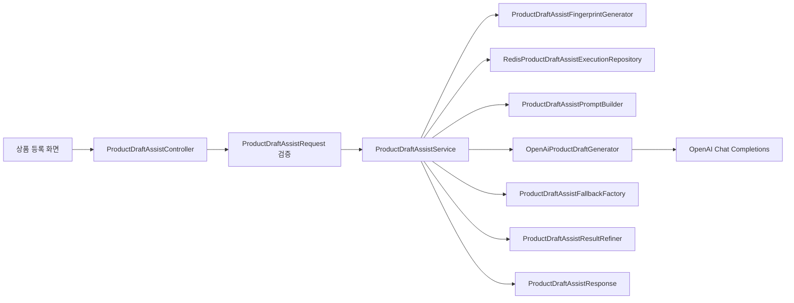
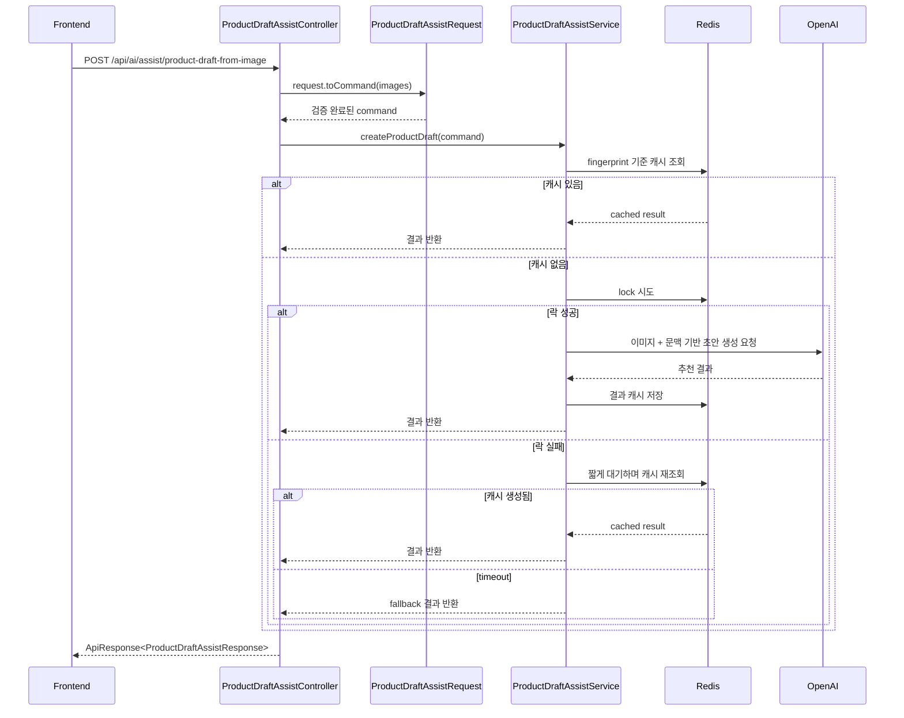
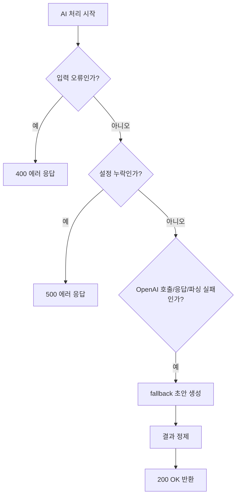
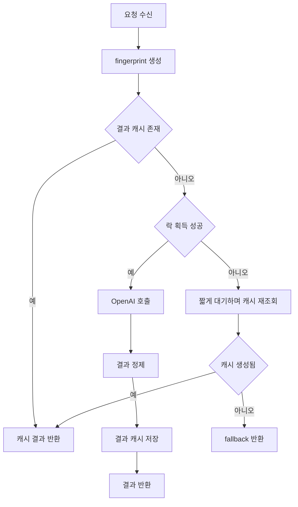

# 이미지 기반 상품 등록 보조 AI 기능

## 1. 문서 목적

이 문서는 `ai` 모듈에 구현된 **이미지 기반 상품 등록 보조 AI 기능**을 팀원이 빠르게 이해하고,
프론트 연동, 운영 설정, 예외 처리, 확장 방향까지 한 번에 파악할 수 있도록 정리한 상세 문서입니다.

현재 코드 기준으로 이미 반영된 내용과, 다음 기능 확장을 위해 염두에 둬야 하는 포인트를 함께 설명합니다.

## 2. 기능 개요

이 기능은 판매자가 상품 등록 화면에서 이미지를 올리고 제목/설명/가격을 작성하는 과정에서,
AI가 이미지와 현재 입력값을 참고해 **입력 초안**을 추천해 주는 기능입니다.

핵심은 "상품 저장"이 아니라 "상품 등록 입력 보조"라는 점입니다.

현재 구현 기준 핵심 정책은 아래와 같습니다.

| 항목 | 현재 정책 |
|---|---|
| 기능 목적 | 상품 등록 입력 초안 추천 |
| 수정 대상 모듈 | `ai` 모듈 중심 |
| 저장 책임 | 기존 `product` 모듈 유지 |
| 요청 방식 | `multipart/form-data` |
| 이미지 저장 여부 | 저장하지 않음, 분석 후 폐기 |
| 입력 구조 | `images` + `request JSON` |
| 주요 추천 항목 | 제목, 설명, 가격 |
| 보조 응답 | 키워드, `notes` |
| AI 모델 기본값 | `gpt-5.4-nano` |
| AI 실패 시 정책 | 가능한 경우 fallback 초안 반환 |
| 중복 요청 대응 | Redis 기반 `락 + 결과 캐시` |

## 3. 왜 이 구조를 선택했는가

| 선택 항목 | 이유 |
|---|---|
| `product` 모듈 미수정 | 저장 구조 변경 없이 AI 보조 기능만 분리하기 위해서입니다. |
| `multipart/form-data` 사용 | 저장 전 로컬 이미지 파일을 가장 단순하게 전달할 수 있기 때문입니다. |
| `request` JSON 파트 사용 | 초안값, 카테고리, 입력칸 메타정보를 구조적으로 전달하기 위해서입니다. |
| `inputFields` 구조화 | 단순 이미지 분석이 아니라 "입력칸을 채우는 AI"이기 때문입니다. |
| fallback 정책 | AI 실패가 상품 등록 흐름 전체를 막지 않게 하기 위해서입니다. |
| Redis `락 + 결과 캐시` | 같은 요청 중복 처리에 따른 OpenAI 비용 증가를 막기 위해서입니다. |
| 처리 실패 예외 세분화 | fallback은 유지하면서도 운영 추적에서는 실패 지점을 구분하기 위해서입니다. |

## 4. 전체 아키텍처

## 5. 처리 흐름

### 5.1 기본 요청 처리

### 5.2 fallback 처리 흐름

설명:
- 프론트가 수정 가능한 문제는 에러로 분리합니다.
- 반대로 AI 처리 과정에서 생기는 실패는 가능한 경우 fallback으로 흡수합니다.
- 이 기능은 "초안 보조"이므로 전면 실패보다 대체 초안이 UX상 더 유리합니다.

## 6. 현재 코드 기준 구성 요소

| 계층 | 주요 클래스 | 역할 |
|---|---|---|
| Presentation | `ProductDraftAssistController` | 이미지 기반 상품 등록 보조 API를 제공합니다. |
| Presentation | `ProductDraftAssistRequest` | multipart 요청의 JSON 파트를 검증하고 command로 변환합니다. |
| Presentation | `ProductDraftAssistResponse` | 추천 결과를 API 응답 DTO로 변환합니다. |
| Application | `ProductDraftAssistService` | 캐시 조회, 락 획득, AI 호출, fallback, 결과 정제를 조율합니다. |
| Application | `ProductDraftAssistPromptBuilder` | system/user prompt를 생성합니다. |
| Application | `ProductDraftAssistFallbackFactory` | 현재 입력값 기반 fallback 초안을 생성합니다. |
| Application | `ProductDraftAssistResultRefiner` | 응답 문자열/가격/키워드를 정리합니다. |
| Application | `ProductDraftAssistFingerprintGenerator` | 같은 요청 판단용 fingerprint를 생성합니다. |
| Domain | `ProductDraftGenerator` | 초안 생성 도메인 추상화입니다. |
| Domain | `ProductDraftAssistExecutionRepository` | 락/결과 캐시 저장소 추상화입니다. |
| Infrastructure | `OpenAiProductDraftGenerator` | OpenAI multimodal chat completion 호출을 담당합니다. |
| Infrastructure | `RedisProductDraftAssistExecutionRepository` | Redis 기반 락/결과 캐시 구현입니다. |
| Infrastructure | `ProductDraftAssistProperties` | 기능 플래그와 timeout/TTL 설정을 바인딩합니다. |

## 7. 요청 데이터 모델

### 7.1 요청 구조

| 파트 | 설명 |
|---|---|
| `images` | AI 분석용 이미지 파일 배열 |
| `request` | JSON 요청 객체 |

### 7.2 `request` 필드

| 필드 | 설명 |
|---|---|
| `titleDraft` | 현재 제목 입력값 |
| `descriptionDraft` | 현재 설명 입력값 |
| `priceDraft` | 현재 가격 입력값 |
| `categoryName` | 선택된 카테고리명 |
| `categoryPathText` | 카테고리 경로 문자열 |
| `thumbnailIndex` | 대표 이미지 인덱스 |
| `inputFields` | 입력칸 메타정보 배열 |

### 7.3 `inputFields` 구조

| 필드 | 설명 |
|---|---|
| `fieldKey` | 내부 식별자 |
| `fieldLabel` | 화면 표시용 라벨 |
| `maxLength` | 길이 제한 |
| `currentValue` | 현재 입력값 |

현재 허용 `fieldKey`:
- `TITLE`
- `DESCRIPTION`
- `PRICE`

### 7.4 왜 `draft`와 `inputFields`를 같이 받는가

| 항목 | 역할 |
|---|---|
| `titleDraft`, `descriptionDraft`, `priceDraft` | 프롬프트에서 자주 쓰는 핵심 초안값 |
| `inputFields.currentValue` | 일반화된 입력칸 현재값 |

설명:
- 둘 다 사용자가 현재 입력한 값이지만 역할이 다릅니다.
- `draft`는 핵심 필드를 명시적으로 다루기 위한 빠른 경로이고,
- `inputFields`는 확장 가능한 입력 계약입니다.

## 8. 검증 규칙

### 8.1 입력 검증 기준

| 항목 | 현재 정책 |
|---|---|
| 최소 이미지 수 | 1 |
| 최대 이미지 수 | 5 |
| 허용 형식 | `image/jpeg`, `image/png`, `image/webp`, `image/gif` |
| 최대 크기 | 장당 5MB |
| `inputFields` | 필수 |
| 중복 `fieldKey` | 허용 안 함 |
| `thumbnailIndex` | 없으면 0, 있으면 범위 검증 |

### 8.2 대표적인 요청 검증 예외

| 예외 | 의미 |
|---|---|
| `ProductDraftAssistImageRequiredException` | 이미지 누락 |
| `ProductDraftAssistImageCountExceededException` | 이미지 수 초과 |
| `ProductDraftAssistImageTooLargeException` | 이미지 크기 초과 |
| `ProductDraftAssistUnsupportedImageTypeException` | 허용되지 않은 형식 |
| `ProductDraftAssistInputFieldsRequiredException` | 입력칸 정보 누락 |
| `ProductDraftAssistInputFieldInvalidException` | 입력칸 메타정보 오류 |
| `ProductDraftAssistDuplicateFieldKeyException` | 중복 fieldKey |
| `ProductDraftAssistThumbnailIndexInvalidException` | 대표 이미지 인덱스 오류 |

## 9. OpenAI 요청 구성

### 9.1 모델과 호출 방식

| 항목 | 값 |
|---|---|
| 기본 모델 | `gpt-5.4-nano` |
| 호출 방식 | `/v1/chat/completions` |
| 입력 형태 | text + image_url(data URL) |
| 응답 형식 | `json_object` |

### 9.2 프롬프트 구성 요소

| 요소 | 설명 |
|---|---|
| 이미지들 | 상품 시각 정보 |
| 대표 이미지 | 우선 참고 이미지 |
| 카테고리명 | 상품군 문맥 |
| 카테고리 경로 | 상위/하위 문맥 |
| 현재 제목/설명/가격 | 사용자가 작성 중인 초안 |
| `inputFields` | 어떤 입력칸을 채워야 하는지 |
| 길이 제한 | 너무 긴 추천 방지 |
| 출력 형식 요구 | JSON 구조 강제 |

## 10. 응답 구조

### 10.1 기본 응답 필드

| 필드 | 설명 |
|---|---|
| `suggestedTitle` | 추천 제목 |
| `suggestedDescription` | 추천 설명 |
| `suggestedPrice` | 추천 가격 |
| `suggestedKeywords` | 보조 키워드 |
| `notes` | 재확인 필요 정보 또는 fallback 안내 |

### 10.2 응답 해석 기준

| 상황 | 의미 |
|---|---|
| `200` + `notes` 없음 | 일반 추천 결과 |
| `200` + `notes` 있음 | 재확인 필요 또는 fallback 가능성 |
| `400` | 입력 수정 필요 |
| `500` | 설정 또는 내부 처리 문제 |

설명:
- 프론트는 `success=true`라고 해서 항상 완전한 AI 생성 결과라고 가정하면 안 됩니다.
- `notes`를 반드시 함께 보여주는 것이 좋습니다.

## 11. fallback 전략

### 11.1 fallback 원칙

- 제목: `titleDraft` 또는 `inputFields.currentValue`
- 설명: `descriptionDraft` 또는 `inputFields.currentValue`
- 가격: `priceDraft` 또는 `inputFields.currentValue`
- 키워드: 빈 배열
- `notes`: 재확인 또는 fallback 안내 문구

### 11.2 fallback을 사용하는 이유

| 이유 | 설명 |
|---|---|
| UX 보호 | 상품 등록 흐름이 완전히 끊기지 않게 하기 위함입니다. |
| 비용 방어 | 실패 직후 같은 요청이 반복되는 비용을 줄이기 위함입니다. |
| 기능 성격 | 이 API는 저장이 아니라 초안 보조 기능이기 때문입니다. |

## 12. Redis 기반 중복 요청 억제

### 12.1 왜 필요한가

- 사용자가 `AI 추천 생성` 버튼을 빠르게 두 번 누를 수 있습니다.
- 동일한 요청이 거의 동시에 두 번 들어오면 OpenAI 비용이 불필요하게 2배 발생할 수 있습니다.

### 12.2 현재 전략

| 구성요소 | 역할 |
|---|---|
| fingerprint | 같은 요청인지 판단 |
| lock | 실제 AI 호출 1회만 허용 |
| result cache | 결과 재사용 |
| wait polling | 뒤늦게 들어온 요청이 결과를 재사용할 수 있게 도움 |

### 12.3 전체 흐름

## 13. 예외 구조

### 13.1 공통 구조

- `ErrorCode`
- `CustomException`
- `AiExceptionHandler`

### 13.2 처리 실패 예외 세분화

| 예외 | 의미 |
|---|---|
| `ProductDraftAssistConfigurationException` | 설정 누락 |
| `ProductDraftAssistExternalCallException` | OpenAI 호출 실패 |
| `ProductDraftAssistResponseInvalidException` | 응답 비정상 또는 파싱 실패 |
| `ProductDraftAssistImageReadException` | 이미지 읽기 실패 |
| `ProductDraftAssistFingerprintException` | fingerprint 생성 실패 |

설명:
- 서비스는 상위 `AiProductDraftAssistException` 기준으로 fallback을 유지합니다.
- 내부적으로는 하위 예외를 나눠서 운영 추적 가능성을 높였습니다.

## 14. 운영 설정값

### 14.1 기본 실행 정보

| 항목 | 값 |
|---|---|
| 서비스 포트 | `8091` |
| Swagger UI | `/swagger-ui.html` |
| API Docs | `/v3/api-docs` |

### 14.2 핵심 설정값

| 설정 키 | 기본값 | 설명 |
|---|---|---|
| `ai.product-draft.assist.enabled` | `false` | 기능 활성화 여부 |
| `ai.product-draft.assist.model` | `gpt-5.4-nano` | 초안 생성 모델 |
| `ai.product-draft.assist.openai-api-key` | `OPENAI_API_KEY` 재사용 | OpenAI API 키 |
| `ai.product-draft.assist.openai-base-url` | `PROJECT_OPENAI_BASE_URL` 재사용 | OpenAI base URL |
| `ai.product-draft.assist.temperature` | `0.2` | 초안 생성 temperature |
| `ai.product-draft.assist.lock-ttl-seconds` | `30` | 락 TTL |
| `ai.product-draft.assist.result-ttl-seconds` | `60` | 결과 캐시 TTL |
| `ai.product-draft.assist.wait-timeout-ms` | `2000` | 락 실패 시 대기 시간 |
| `ai.product-draft.assist.poll-interval-ms` | `150` | 결과 캐시 polling 간격 |
| `ai.product-draft.assist.connect-timeout-ms` | `3000` | 연결 타임아웃 |
| `ai.product-draft.assist.read-timeout-ms` | `10000` | 읽기 타임아웃 |

## 15. 프론트 연동 시 알아야 할 점

### 15.1 프론트 최소 구현 포인트

- `AI 추천 생성` 버튼
- multipart 요청 구성
- `request` JSON 파트 구성
- `inputFields` 전달
- 결과 패널
- `notes` 표시 영역
- `추천값 적용` 버튼
- 에러/로딩 상태 처리

### 15.2 프론트가 주의할 점

| 항목 | 설명 |
|---|---|
| `notes` | 항상 같이 보여주는 것이 좋습니다. |
| fallback | `200 OK`여도 가능성이 있습니다. |
| 저장 버튼 | fallback이라고 해서 막지 않습니다. |
| 자동 적용 | 초기 버전에서는 자동 확정하지 않는 편이 안전합니다. |

## 16. 테스트/점검 포인트

| 점검 항목 | 확인 내용 |
|---|---|
| 이미지 검증 | 개수/형식/크기 제한이 정상 동작하는지 |
| `inputFields` 검증 | 누락, 중복, 잘못된 값이 걸리는지 |
| fallback 동작 | OpenAI 실패 시 초안이 유지되는지 |
| 중복 요청 대응 | 같은 요청 2회 시 OpenAI 호출이 1회만 일어나는지 |
| `notes` 처리 | 프론트가 안내 문구를 함께 표시하는지 |
| 설정 오류 | 기능 비활성 또는 API 키 누락 시 에러 응답이 분리되는지 |

## 17. 현재 한계와 다음 단계

| 항목 | 설명 |
|---|---|
| fieldKey 범위 | 현재는 `TITLE`, `DESCRIPTION`, `PRICE`만 허용합니다. |
| 프론트 실제 연동 | 문서 기준은 정리되었지만 실제 화면 연동은 별도 작업입니다. |
| 용어 정리 | `draft`, `inputFields`는 후속 정리 가능성이 있습니다. |
| 추천 품질 고도화 | 카테고리별 프롬프트 보정, 추가 필드 확장 가능성이 있습니다. |

다음 AI 기능 후보:
- 경매 진행 중 사용자에게 `예상 최종가` 또는 `추천 입찰가`를 보여주는 가격 보조 AI

설명:
- 현재 상품 등록 보조 AI는 판매자 입력 보조 기능입니다.
- 다음 기능은 입찰자 가격 판단 보조 기능이므로, 데이터와 UX 기준을 별도로 잡는 것이 좋습니다.
