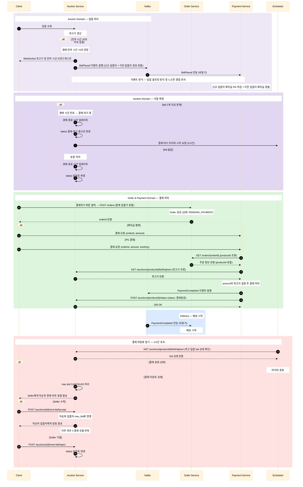

```mermaid
%%{init: {'theme': 'base', 'themeVariables': {'primaryTextColor': '#000000', 'noteBkgColor': '#ffffff', 'noteTextColor': '#000000'}}}%%
sequenceDiagram
autonumber
participant C as Client
participant AS as Auction Service
participant K as Kafka
participant OC as Order Service
participant PC as Payment Service
participant SC as Scheduler
rect rgb(237, 231, 246)
Note over C,K: Auction Domain — 입찰 처리
C->>AS: 입찰 요청
Note over AS: 최고가 갱신
alt 잔여 시간 30초 이내 입찰
Note over AS: 경매 잔여 시간 +5초 연장
end
AS-->>C: WebSocket 최고가 및 잔여 시간 브로드캐스트
%% [설계 의도] 이벤트 방식 사용 이유
%% 1. 입찰이 동시에 여러 건 들어올 수 있어 동기 API 호출 시 블로킹 발생
%% 2. Auction Service의 핵심 책임은 최고가 관리이므로 Payment Service와 느슨하게 연결
%% 3. 수수료 차감/환불 실패 시 재시도 또는 DLQ로 보정 필요
AS->>K: BidPlaced 이벤트 발행 (신규 입찰자 + 이전 입찰자 정보 포함)
K-->>PC: BidPlaced 전달 (비동기)
Note over AS,PC: 이벤트 방식 — 입찰 블로킹 방지 및 느슨한 결합 유지
Note over PC: 신규 입찰자 예치금 5% 차감 + 이전 입찰자 예치금 환불
end

rect rgb(225, 215, 242)
Note over C,SC: Auction Domain — 낙찰 확정
alt bid 1개 이상 존재
Note over AS: 경매 시간 만료 → 결제 대기 중
AS->>AS: 경매 종료 시간 업데이트
AS->>AS: status 결제 대기 중으로 변경
AS->>SC: 결제 대기 타이머 시작 요청 (1시간)
else bid 없음
Note over AS: 유찰 처리
AS->>AS: 경매 종료 시간 업데이트
AS->>AS: status 유찰로 변경
end
end

rect rgb(220, 245, 220)
Note over C,SC: Order & Payment Domain — 결제 처리
C->>OC: 결제하기 버튼 클릭 → POST /orders (현재 입찰가 포함)
Note over OC: Order 생성 (상태: PENDING_PAYMENT)
OC-->>C: orderId 반환
alt 예치금 결제
C->>PC: 결제 요청 (orderId, amount)
else PG 결제
C->>PC: 결제 요청 (orderId, amount, tossKey)
end
PC->>OC: GET /orders/{orderId} (productId 조회)
OC-->>PC: 주문 정보 반환 (productId 포함)
PC->>AS: GET /auctions/{productId}/bid/highest (최고가 조회)
AS-->>PC: 최고가 반환
Note over PC: amount와 최고가 검증 후 결제 처리
PC->>K: PaymentCompleted 이벤트 발행
PC->>AS: POST /auctions/{productId}/status (status: 결제완료)
AS-->>PC: 200 OK
end

rect rgb(219, 234, 254)
Note over OC: Delivery — 배송 시작
K-->>OC: PaymentCompleted 전달 (비동기)
Note over OC: 배송 시작
end

rect rgb(254, 226, 226)
Note over C,SC: 결제 미완료 분기 — 1시간 초과
SC->>AS: GET /auctions/{productId}/bid/highest (최고 입찰 bid 상태 확인)
AS-->>SC: bid 상태 반환
alt 결제 완료 상태
Note over SC: 타이머 종료
else 결제 미완료 상태
AS->>AS: max bid CANCELED 처리
AS-->>C: Seller에게 차순위 판매 여부 알림 발송
alt Seller 수락
C->>AS: POST /auctions/{id}/next-bid/accept
Note over AS: 차순위 입찰자 max_bid로 변경
AS-->>C: 차순위 입찰자에게 알림 발송
Note over AS: 이후 섹션 3 결제 흐름 반복
else Seller 거절
C->>AS: POST /auctions/{id}/next-bid/reject
AS->>AS: status 유찰로 변경
end
end
end
```