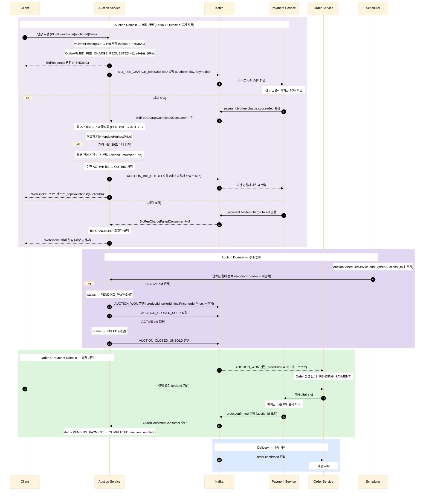

```mermaid
%%{init: {'theme': 'base', 'themeVariables': {'primaryTextColor': '#000000', 'noteBkgColor': '#ffffff', 'noteTextColor': '#000000'}}}%%
sequenceDiagram
autonumber
participant C as Client
participant AS as Auction Service
participant K as Kafka
participant PC as Payment Service
participant OC as Order Service
participant SC as Scheduler
rect rgb(237, 231, 246)
Note over C,PC: Auction Domain — 입찰 처리 (Kafka + Outbox 비동기 흐름)
C->>AS: 입찰 요청 (POST /auctions/{auctionId}/bids)
Note over AS: validatePendingBid → Bid 저장 (status: PENDING)
Note over AS: Outbox에 BID_FEE_CHARGE_REQUESTED 저장 (수수료 10%)
AS-->>C: BidResponse 반환 (PENDING)
%% [설계 의도] Kafka + Outbox 사용 이유
%% 1. 동시 입찰 처리를 위해 입찰 저장과 수수료 차감을 비동기 분리
%% 2. Auction Service의 핵심 책임은 최고가 관리이므로 Payment Service와 느슨하게 연결
%% 3. 수수료 차감/환불 실패 시 DLQ 또는 보상 트랜잭션으로 복구
AS->>K: BID_FEE_CHARGE_REQUESTED 발행 (OutboxRelay, key=bidId)
K-->>PC: 수수료 차감 요청 전달
Note over PC: 신규 입찰자 예치금 10% 차감
alt 차감 성공
    PC->>K: payment.bid-fee.charge.succeeded 발행
    K-->>AS: BidFeeChargeCompletedConsumer 수신
    Note over AS: 최고가 검증 → bid 활성화 (PENDING → ACTIVE)
    Note over AS: 최고가 갱신 (updateHighestPrice)
    alt 잔여 시간 30초 이내 입찰
        Note over AS: 경매 잔여 시간 +5초 연장 (extendTimeIfNearEnd)
    end
    Note over AS: 이전 ACTIVE bid → OUTBID 처리
    AS->>K: AUCTION_BID_OUTBID 발행 (이전 입찰자 환불 트리거)
    K-->>PC: 이전 입찰자 예치금 환불
    AS-->>C: WebSocket 브로드캐스트 (/topic/auctions/{auctionId})
else 차감 실패
    PC->>K: payment.bid-fee.charge.failed 발행
    K-->>AS: BidFeeChargeFailedConsumer 수신
    Note over AS: bid CANCELED, 최고가 롤백
    AS-->>C: WebSocket 에러 알림 (해당 입찰자)
end
end

rect rgb(225, 215, 242)
Note over AS,SC: Auction Domain — 경매 종료
Note over SC: AuctionSchedulerService.endExpiredAuctions (10초 주기)
SC->>AS: 만료된 경매 종료 처리 (findEndable + 비관락)
alt ACTIVE bid 존재
    Note over AS: status → PENDING_PAYMENT
    AS->>K: AUCTION_WON 발행 (productId, sellerId, finalPrice, orderPrice, 낙찰자)
    AS->>K: AUCTION_CLOSED_SOLD 발행
else ACTIVE bid 없음
    Note over AS: status → FAILED (유찰)
    AS->>K: AUCTION_CLOSED_UNSOLD 발행
end
end

rect rgb(220, 245, 220)
Note over C,AS: Order & Payment Domain — 결제 처리
K-->>OC: AUCTION_WON 전달 (orderPrice = 최고가 − 수수료)
Note over OC: Order 생성 (상태: PENDING_PAYMENT)
C->>OC: 결제 요청 (orderId 기반)
OC->>PC: 결제 처리 위임
Note over PC: 예치금 또는 PG 결제 처리
PC->>K: order.confirmed 발행 (auctionId 포함)
K-->>AS: OrderConfirmedConsumer 수신
Note over AS: status PENDING_PAYMENT → COMPLETED (auction.complete)
end

rect rgb(219, 234, 254)
Note over OC,K: Delivery — 배송 시작
K-->>OC: order.confirmed 전달
Note over OC: 배송 시작
end
```
