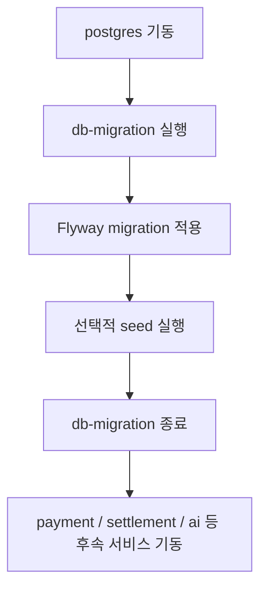

# DB Migration Service

`db-migration` 모듈은 PostgreSQL 스키마를 버전 관리된 SQL로 초기화하고, 로컬/검증 환경에서 필요한 seed 데이터를 선택적으로 적재하는 전용 서비스입니다. 애플리케이션 서비스보다 먼저 한 번 실행되고 종료되는 배치 성격의 모듈이며, 현재 기준으로는 `payment`, `settlement`, `member`, `product`, `cart`, `notification`, `order`, `ai` 스키마 관련 migration을 한 곳에서 관리합니다.

## 1. 한눈에 보는 역할

이 모듈의 핵심 책임은 아래와 같습니다.

- PostgreSQL에 버전 순서대로 Flyway migration을 적용한다.
- 빈 DB에서 `V1`, `V2` 같은 migration 자체가 스키마 생성의 시작점이 되도록 보장한다.
- 개발/검증 환경에서만 seed SQL을 선택적으로 실행한다.
- migration 적용이 끝나면 컨테이너를 종료해 후속 서비스가 기동할 수 있게 한다.
- 스키마 구조와 seed 데이터를 애플리케이션 서비스 코드와 분리해 재현 가능한 초기화 절차를 제공한다.

현재 정책 기준으로 이 모듈은 **Flyway에 `schemas(...)`를 명시적으로 넘기지 않습니다.**  
이유는 Flyway가 관리 스키마와 `flyway_schema_history`를 미리 만들기 시작하면, `V1`, `V2`가 담당해야 하는 스키마 생성 책임이 흐려지고 `payment` 같은 첫 번째 스키마에 history가 고정되는 부작용이 생길 수 있기 때문입니다.

## 2. 실행 정보

| 항목 | 값 |
|---|---|
| 서비스 이름 | `db-migration` |
| 애플리케이션 타입 | `web-application-type=none` |
| 실행 목적 | DB migration + optional seed 후 종료 |
| 기본 프로필 | Docker 기준 `prod` |
| DB | PostgreSQL `goods_mall` |
| Flyway migration 위치 | `classpath:db/migration` |
| seed 위치 | `classpath:db/seed/*.sql` |
| 종료 방식 | migration / seed 완료 후 `System.exit(0)` |

이 모듈은 HTTP 포트를 열지 않습니다.  
즉, 서비스 API를 제공하는 모듈이 아니라 DB 초기화 절차를 수행하는 실행 전용 모듈입니다.

## 3. Docker 기준 실행

### 3.1 컨테이너 빌드/실행 방식

`db-migration/Dockerfile`은 멀티 스테이지 빌드로 구성되어 있습니다.

- 빌드 스테이지: Gradle + JDK 21
- 런타임 스테이지: JRE 21
- 빌드 산출물: `db-migration` bootJar
- 컨테이너 시작 명령: `java -jar /app/app.jar`
- 기본 프로필: compose에서 `SPRING_PROFILES_ACTIVE=prod`

이 모듈은 기동 후 migration과 seed를 수행하고 바로 종료되므로, 일반 서비스처럼 `Up` 상태로 계속 떠 있는 것이 아니라 `Exited (0)`가 정상입니다.

### 3.2 docker-compose 기준 역할

`infra/docker/docker-compose.yml` 기준으로 `db-migration`은 아래 성격으로 사용됩니다.

- 컨테이너 이름: `goods-mall-db-migration`
- `depends_on`: `postgres`
- `restart: "no"`
- 후속 서비스들은 `db-migration: service_completed_successfully`에 의존

즉, 전체 시스템 기동 순서는 대략 아래와 같습니다.



### 3.3 Docker에서 필요한 환경변수

| 분류 | 환경변수 |
|---|---|
| DB | `DB_URL`, `DB_USER_NAME`, `DB_USER_PASSWORD` |
| Spring | `SPRING_PROFILES_ACTIVE` |
| Seed | `DB_SEED_ENABLED`, `DB_SEED_LOCATIONS` |

기본 예시는 [db-migration/.env.example](C:/Dev/beadv5_2_TodayLunchMenu_BE/db-migration/.env.example)에 있고, 실제 Docker Compose 기준 값은 루트 `.env`에서 주입됩니다.
현재 `prod` 프로필 기본값은 배포용 additive seed를 실행하도록 설정되어 있습니다.
운영 환경에서 seed를 끄려면 `DB_SEED_ENABLED=false`를 명시적으로 주입하면 됩니다.

## 4. 현재 코드 구조

| 파일 | 역할 |
|---|---|
| [DbMigrationApplication.java](C:/Dev/beadv5_2_TodayLunchMenu_BE/db-migration/src/main/java/com/todaylunch/dbmigration/DbMigrationApplication.java:1) | 애플리케이션 엔트리포인트, `@ConfigurationPropertiesScan` 활성화 |
| [FlywayExitRunner.java](C:/Dev/beadv5_2_TodayLunchMenu_BE/db-migration/src/main/java/com/todaylunch/dbmigration/FlywayExitRunner.java:1) | migration 실행, seed 실행, 종료 코드 반환 |
| [MigrationFlywayProperties.java](C:/Dev/beadv5_2_TodayLunchMenu_BE/db-migration/src/main/java/com/todaylunch/dbmigration/config/MigrationFlywayProperties.java:1) | `spring.flyway.*` 중 현재 runner가 사용하는 설정 바인딩 |
| [SeedProperties.java](C:/Dev/beadv5_2_TodayLunchMenu_BE/db-migration/src/main/java/com/todaylunch/dbmigration/config/SeedProperties.java:1) | `app.seed.*` 설정 바인딩 |
| [application-prod.yml](C:/Dev/beadv5_2_TodayLunchMenu_BE/db-migration/src/main/resources/application-prod.yml:1) | Docker/배포 환경에서 사용하는 기본 설정 |
| `src/main/resources/db/migration/*.sql` | 버전 관리되는 migration SQL |
| `src/main/resources/db/seed/*.sql` | 배포용 additive seed 및 개발/검증용 seed SQL |

## 5. 동작 흐름

### 5.1 기동 시 실행 순서

1. Spring Boot가 `db-migration` 애플리케이션을 시작한다.
2. `MigrationFlywayProperties`, `SeedProperties`를 바인딩한다.
3. `FlywayExitRunner`가 `spring.flyway.locations` 기준으로 migration 위치를 결정한다.
4. Flyway를 실행해 아직 적용되지 않은 migration을 버전 순서대로 반영한다.
5. `app.seed.enabled=true`면 seed SQL을 지정된 순서로 실행한다.
6. 성공 시 프로세스를 종료하고 후속 서비스가 기동한다.

### 5.2 현재 설계에서 중요한 원칙

1. **스키마 생성 책임은 migration SQL이 가진다.**
   `V1__create_payment_schema.sql`, `V2__create_settlement_schema.sql`처럼 버전 파일이 스키마를 만든다.

2. **Flyway runner는 schema 선생성을 하지 않는다.**
   현재 runner는 `schemas(...)`를 넘기지 않는다.

3. **seed는 migration 이후에만 실행한다.**
   seed는 초기 구조가 완성된 뒤에만 적용된다.

4. **prod 프로필은 기본 seed를 실행하되, 항상 additive/idempotent 해야 한다.**
   기본값은 회원/지갑/카테고리/상품의 배포용 seed를 실행하고, 필요 시 `DB_SEED_ENABLED=false`로 끌 수 있다.

## 6. 설정 상세

### 6.1 `spring.flyway.locations`

현재 runner가 적극적으로 사용하는 Flyway 핵심 설정입니다.

```yaml
spring:
  flyway:
    locations:
      - classpath:db/migration
```

현재 구조에서는 migration SQL 디렉터리를 명시하는 역할만 담당합니다.

### 6.2 `spring.flyway.baseline-on-migrate`

기존 DB를 baseline 기준으로 편입할 때 사용할 수 있는 옵션입니다.

- 기본값: `true`
- 현재 코드에서는 설정 객체로 받아 `Flyway.configure()`에 전달

### 6.3 `spring.flyway.baseline-version`

baseline 버전을 지정합니다.

- 기본값: `0`
- 현재 코드에서는 문자열 버전으로 그대로 전달

### 6.4 `app.seed.enabled`

- `true`: seed 실행
- `false`: seed 생략

운영 기본은 `false`로 보는 것이 안전합니다.

### 6.5 `app.seed.locations`

쉼표로 구분된 seed 경로 목록을 받습니다.

예시:

```text
classpath:db/seed/dev_seed_member.sql,classpath:db/seed/dev_seed_category.sql
```

Spring 바인더가 이를 `List<String>`으로 바인딩하고, runner는 입력 순서대로 실행합니다.

## 7. `schemas`의 역할과 현재 판단

### 7.1 Flyway의 `schemas`는 무엇인가

Flyway의 `schemas`는 “관리 대상 스키마 목록”을 지정하는 설정입니다.  
보통 이 값을 설정하면 Flyway는 해당 스키마를 관리 대상으로 인식하고, 첫 번째 스키마를 기준으로 `flyway_schema_history`를 만들 수 있습니다.

즉 `schemas`는 단순 문서화용 값이 아니라, **Flyway가 DB를 초기화하는 방식 자체에 영향을 주는 설정**입니다.

### 7.2 왜 현재는 빼는가

현재 모듈은 다음 목적 때문에 `schemas`를 활성화하지 않습니다.

- 빈 DB에서 `payment`, `settlement` 같은 스키마가 migration보다 먼저 만들어지는 것을 막기 위해
- `flyway_schema_history`가 `payment`처럼 특정 스키마에 고정돼 버리는 것을 피하기 위해
- 스키마 생성의 시작점을 `V1`, `V2`와 같은 versioned SQL로 유지하기 위해

즉, 현재 기준으로는 **`schemas`를 넣지 않는 것이 의도된 설계**입니다.

### 7.3 나중에 `schemas`를 다시 고려할 수 있는 경우

아래 조건이 충족되면 `schemas`를 다시 도입할 수 있습니다.

- `flyway_schema_history`를 어느 스키마 또는 테이블로 관리할지 명시적으로 합의한 경우
- 스키마 선생성이 migration 전략과 충돌하지 않도록 구조를 다시 설계한 경우
- 단일 history 관리 정책과 멀티 스키마 운영 정책이 문서화된 경우
- 기존 migration 파일(`V1`, `V2` 등)의 역할을 재정의하거나 정리한 경우

즉, `schemas`는 “지금 당장 빠져서 아쉬운 기능”이 아니라, **재도입 시 운영 원칙과 함께 다시 설계해야 하는 옵션**입니다.

## 8. migration / seed 파일 관리 규칙

### 8.1 migration

- `V{번호}__설명.sql` 형식을 사용
- 이미 적용된 버전 파일은 수정하지 않는 것이 원칙
- 구조 변경은 새 버전 migration으로 추가

현재 예시:

- `V1__create_payment_schema.sql`
- `V2__create_settlement_schema.sql`
- `V32__create_ai_schema.sql`
- `V33__create_ai_product_embedding_table.sql`
- `V38__add_unique_index_for_monthly_settlement.sql`

### 8.2 seed

- 운영 경로가 아니라 개발/검증용 데이터 적재 목적
- migration이 끝난 뒤 순차 실행
- 스키마 변경 시 seed SQL도 같이 점검

현재 seed 예시:

- `dev_seed_member.sql`
- `dev_seed_category.sql`
- `dev_seed_product.sql`
- `dev_seed_cart.sql`
- `dev_seed_wallet.sql`
- `dev_seed_payment_settlement.sql`

## 9. 운영 / 디버깅 체크포인트

### 9.1 정상 로그 기대값

정상이라면 대략 아래 흐름이 보여야 합니다.

1. `Starting explicit Flyway migration`
2. migration 버전 적용 로그
3. `Flyway migration finished...`
4. seed enabled 시 `Completed seed script...`
5. 컨테이너 종료 코드 `0`

### 9.2 이상 징후 예시

| 증상 | 의미 |
|---|---|
| `Creating Schema History table "payment"."flyway_schema_history"` | Flyway 실행 컨텍스트가 특정 스키마에 끌리고 있을 가능성 |
| `Successfully applied ... to schema "payment"` | 멀티 스키마가 아니라 단일 스키마 기준으로 migration이 해석되고 있을 가능성 |
| migration 버전이 로컬 repo 최신 버전보다 낮음 | 실행 중인 이미지가 최신 소스를 반영하지 않았을 가능성 |
| seed SQL 실패 | migration과 seed의 스키마 정합성이 깨졌을 가능성 |

### 9.3 현재 확인해야 할 항목

- `db-migration` 컨테이너가 로컬 빌드인지 GHCR 이미지인지
- 실제 이미지 안에 최신 migration 파일이 들어갔는지
- DB 볼륨을 비운 뒤 `V1`부터 실행되는지
- AI 관련 migration(`V32`, `V33`)까지 적용되는지

## 10. 로컬 검증 시 권장 절차

로컬에서 migration 구조를 검증할 때는 아래 순서를 권장합니다.

```powershell
docker compose -p beadv5_2_todaylunchmenu_be down -v
docker compose -p beadv5_2_todaylunchmenu_be build --no-cache db-migration
docker compose -p beadv5_2_todaylunchmenu_be up -d postgres db-migration
docker compose -p beadv5_2_todaylunchmenu_be logs db-migration
```

검증 포인트:

- `db-migration`이 `Exited (0)`인지
- 로그가 `V1`, `V2`부터 시작하는지
- `payment`, `settlement` 스키마를 Flyway가 미리 만든 흔적이 없는지

## 11. 현재 구현상 메모

- 현재 runner는 명시적으로 Flyway를 실행하고, 성공 후 프로세스를 종료합니다.
- `schemas`는 코드와 설정에서 일부러 비활성화되어 있습니다.
- 나중에 `schemas`를 재도입하려면 history 스키마 전략부터 문서화해야 합니다.
- 현재 구조는 “빈 DB 기준 재현 가능한 migration 시작점”을 우선합니다.
- 이 모듈의 문제는 애플리케이션 서비스 문제처럼 보이더라도 실제로는 이미지 버전 불일치에서 시작할 수 있습니다.
