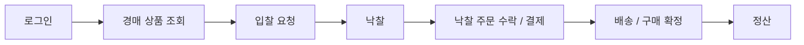
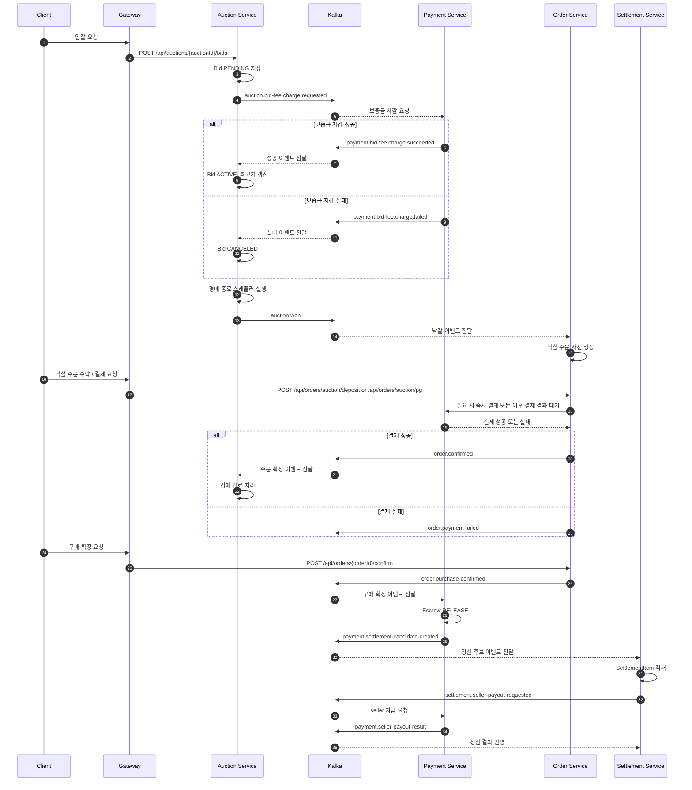

# User Flow

## Overview

이 문서는 현재 프로젝트의 대표 사용자 여정을 구현 기준으로 설명한다.

일반 상품 주문 흐름도 존재하지만, 현재 아키텍처와 이벤트 연계를 가장 잘 드러내는 흐름은 다음 경매 구매 여정이다.

```text
로그인
-> 경매 조회
-> 입찰
-> 낙찰
-> 낙찰 주문 수락 / 결제
-> 배송 / 구매 확정
-> 정산
```

이 흐름에는 `gateway`, `auction`, `order`, `payment`, `settlement`, `notification`이 모두 관여하고, Kafka 기반 비동기 처리와 outbox 패턴이 함께 나타난다.

---

## 1. User Journey



---

## 2. State Transitions

| Step | User Action or System Action | Main Domain State Change | Related Service | Event |
|---|---|---|---|---|
| 1 | 입찰 요청 | `Bid` `PENDING` 생성 | Auction | `auction.bid-fee.charge.requested` |
| 2 | 보증금 차감 성공 | `Bid` `ACTIVE`, 경매 최고가 갱신 | Payment / Auction | `payment.bid-fee.charge.succeeded` |
| 3 | 보증금 차감 실패 | `Bid` `CANCELED` | Payment / Auction | `payment.bid-fee.charge.failed` |
| 4 | 경매 종료 스케줄러 실행 | `Auction` `PENDING_PAYMENT` | Auction | `auction.won` |
| 5 | 낙찰 주문 사전 생성 | `Order` `PENDING_PAYMENT` 생성 | Order | - |
| 6 | 낙찰 주문 수락 | 배송지 반영, 결제 경로 선택 | Order | - |
| 7 | 결제 성공 반영 | `Order` `CONFIRMED`, 배송 생성 | Order | `order.confirmed` |
| 8 | 결제 실패 반영 | 주문 취소 또는 결제 실패 상태 반영 | Order | `order.payment-failed` |
| 9 | 배송 진행 | 배송 상태 변경 | Order | - |
| 10 | 구매 확정 | 주문 완료 처리 | Order | `order.purchase-confirmed` |
| 11 | Escrow release | `Escrow` `RELEASED`, 정산 후보 생성 | Payment | `payment.settlement-candidate-created` |
| 12 | 정산 후보 적재 | `SettlementItem` `UNASSIGNED` 저장 | Settlement | - |
| 13 | 정산 지급 요청 | `Settlement` `PROCESSING` | Settlement | `settlement.seller-payout-requested` |
| 14 | 정산 결과 반영 | `Settlement` `COMPLETED` 또는 `FAILED` | Payment / Settlement | `payment.seller-payout-result` |

---

## 3. Interaction Sequence



---

## Notes

- 이 문서는 대표 경매 구매 여정을 설명한다. 일반 상품 주문은 [04-request-flow.md](04-request-flow.md)와 각 서비스 문서를 기준으로 본다.
- 낙찰 주문 결제는 지갑 결제와 PG 결제 두 경로가 존재한다.
- `order.confirmed`는 Payment Service가 아니라 Order Service가 발행한다.

---

## Related Docs

- [04-request-flow.md](04-request-flow.md)
- [05-event-strategy.md](05-event-strategy.md)
- [service/auction-service.md](service/auction-service.md)
- [service/order-service.md](service/order-service.md)
- [service/payment-service.md](service/payment-service.md)
- [service/settlement-service.md](service/settlement-service.md)
