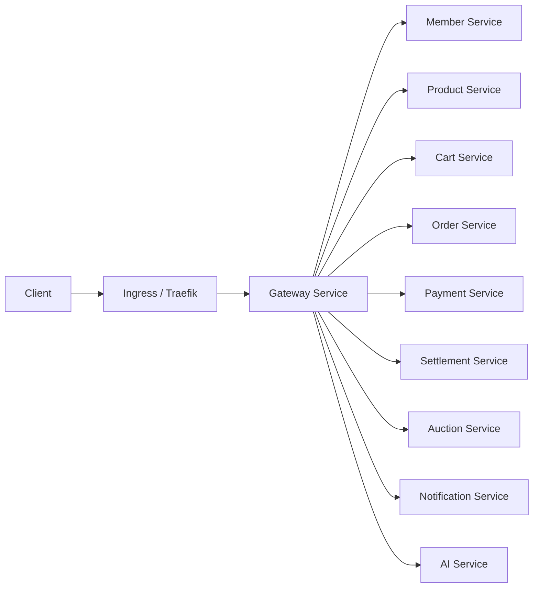
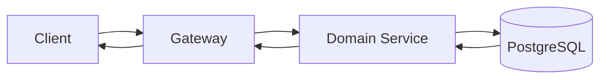
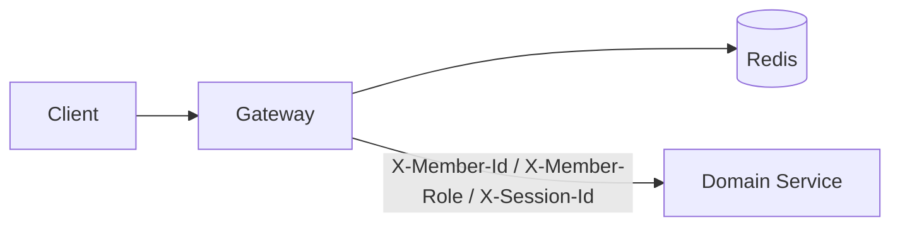
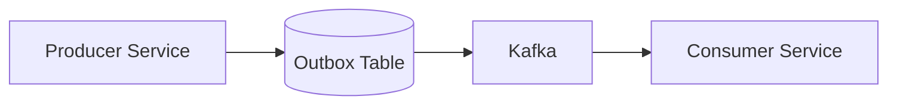
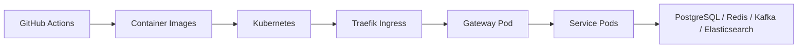

# Architecture

## Table of Contents

- [1. Overview](#1-overview)
- [2. System Context](#2-system-context)
- [3. Module Structure](#3-module-structure)
- [4. Service Responsibilities](#4-service-responsibilities)
- [5. Synchronous Request Architecture](#5-synchronous-request-architecture)
- [6. Authentication Architecture](#6-authentication-architecture)
- [7. Asynchronous Event Architecture](#7-asynchronous-event-architecture)
- [8. Data Architecture](#8-data-architecture)
- [9. Deployment Architecture](#9-deployment-architecture)
- [10. Cross-Cutting Concerns](#10-cross-cutting-concerns)
- [11. Current Limitations](#11-current-limitations)
- [12. Related Docs](#12-related-docs)

---

## 1. Overview

이 문서는 GoodsMall Backend의 전체 시스템 구조, 서비스 경계, 동기/비동기 통신 방식, 데이터 저장소, 배포 구성을 설명한다.

이 문서는 repository에 포함된 코드와 설정을 기준으로 작성한다. VPC, subnet, cloud security group, managed database, 외부 DNS/CDN/WAF처럼 repository에서 확인할 수 없는 운영 인프라 세부사항은 다루지 않는다.

---

## 2. System Context

Gateway는 외부 HTTP 요청의 진입점이다. Kubernetes 환경에서는 ingress가 gateway service로 요청을 전달하고, gateway는 path 기반 route 설정으로 각 도메인 서비스에 요청을 전달한다.

---

## 3. Module Structure

이 프로젝트는 Gradle multi-module 구조를 사용한다.

| Module | Type | Description |
|---|---|---|
| `gateway` | Service | API Gateway, routing, JWT validation |
| `member` | Service | 회원, 인증, 판매자, 계좌 인증 |
| `product` | Service | 상품, 카테고리, 상품 이미지 |
| `cart` | Service | 장바구니, 찜 |
| `order` | Service | 주문, 배송, 반품/클레임 |
| `payment` | Service | 결제, 지갑, escrow, refund, payout |
| `settlement` | Service | 정산 집계, 정산 지급 요청 |
| `auction` | Service | 경매, 입찰 |
| `notification` | Service | 알림 생성과 조회 |
| `ai` | Service | 추천, embedding, 상품 등록 보조 |
| `common-security` | Shared Module | 인증 사용자 header binding, 공통 event envelope |
| `common-monitoring` | Shared Module | 공통 모니터링 구성 |
| `db-migration` | Infra Module | Flyway 기반 schema migration |

---

## 4. Service Responsibilities

| Service | Main Responsibility | Owned State |
|---|---|---|
| Gateway | 요청 라우팅, JWT 검증, role-rule 기반 1차 접근 제어 | - |
| Member | 회원 인증, 사용자 식별, 판매자 정보, 계좌 인증 | Member, Seller, Verification |
| Product | 상품 카탈로그, 카테고리, 상품 이미지 | Product, Category, ProductImage, Stock |
| Cart | 장바구니, 찜 | Cart, CartItem, Wish |
| Auction | 경매 생명주기, 입찰 | Auction, Bid |
| Order | 주문 생명주기, 배송, 반품/클레임 | Order, OrderItem, Delivery, Claim |
| Payment | 결제, 지갑, escrow, refund, payout | Payment, Wallet, Escrow, Refund |
| Settlement | 판매자 정산 처리 | Settlement, SettlementItem |
| Notification | 알림 생성과 전달 상태 | Notification |
| AI | 추천, embedding, 상품 등록 보조 | Embedding, Recommendation Data |

각 서비스는 자신의 상태를 소유한다. 다른 서비스의 상태 변경이 필요한 경우 동기 API 호출보다 Kafka 이벤트 기반 후속 처리를 우선한다. 다만 현재 프로젝트에는 direct publish, raw payload, 일부 outbox 미적용 흐름도 존재한다.

---

## 5. Synchronous Request Architecture

동기 요청은 사용자가 즉시 응답을 기대하는 작업에 사용한다.

주요 처리 흐름:

1. Client가 Gateway로 HTTP 요청을 보낸다.
2. Gateway가 path 기반 route matching을 수행한다.
3. 보호 API인 경우 Gateway가 JWT와 blacklist를 검증한다.
4. Gateway가 `X-Member-Id`, `X-Member-Role`, `X-Session-Id`를 downstream service에 전달한다.
5. 도메인 서비스가 controller, application service, domain, repository 계층을 통해 요청을 처리한다.
6. application service transaction이 commit된 뒤 response DTO를 반환한다.

자세한 내용은 [Request Flow](04-request-flow.md)를 참고한다.

---

## 6. Authentication Architecture

인증 책임은 Gateway에 중앙화되어 있다.

- Gateway는 access token의 서명, issuer, token type, 만료 여부를 검증한다.
- Redis를 통해 access token blacklist와 session blacklist를 확인한다.
- Gateway는 route별 role-rule을 통해 1차 접근 제어를 수행한다.
- 도메인 서비스는 Gateway가 전달한 내부 인증 헤더를 `@CurrentMember`로 복원한다.
- 소유자 검증, 도메인 상태 검증, 세부 authorization은 각 서비스에서 처리한다.

자세한 내용은 [Authentication Flow](06-auth-flow.md)를 참고한다.

---

## 7. Asynchronous Event Architecture

Kafka는 서비스 간 후속 처리를 연결한다.

주요 사용 예:

- 주문/결제 결과 전파
- 정산 후보 생성과 지급 결과 처리
- 경매/입찰 상태 변경 후속 처리
- 알림 생성
- 상품 변경 후 AI embedding/search 동기화

현재 프로젝트의 이벤트 전략은 서비스별 적용 수준이 다르다.

- 일부 producer는 outbox pattern을 사용한다.
- 일부 producer는 Kafka direct publish를 사용한다.
- 일부 이벤트는 `EventEnvelope`가 아닌 raw payload를 사용한다.
- retry, DLQ, idempotency는 서비스별로 적용 수준이 다르다.

자세한 내용은 [Event Strategy](05-event-strategy.md)를 참고한다.

---

## 8. Data Architecture

| Data Store | Used By | Purpose |
|---|---|---|
| PostgreSQL / pgvector | 도메인 서비스, AI | 도메인 상태 저장, migration 대상 schema, AI embedding 저장 |
| Redis | Gateway, Member, Order, AI | token/session blacklist, session/cache, idempotency, 일부 lock/cache |
| Kafka / Zookeeper | 이벤트 producer/consumer 서비스 | 비동기 이벤트 전파 |
| Elasticsearch | Product 관련 검색 인프라 | 상품 검색 index |
| S3 compatible storage | Member/Product 등 | 이미지와 파일 객체 저장 |

schema 관리는 `db-migration` 모듈의 Flyway migration으로 단일화한다. Docker compose와 Kubernetes manifest 모두 PostgreSQL, Redis, Kafka, Elasticsearch 구성을 포함한다.

---

## 9. Deployment Architecture

repository에는 로컬 Docker compose와 Kubernetes manifest가 함께 존재한다.

- 로컬 인프라 실행: `infra/docker/docker-compose.infra.yml`
- Kubernetes namespace, ingress, service, deployment: `infra/k8s/**`
- DB schema migration job: `infra/k8s/db-migration/job.yaml`
- Monitoring manifest: `infra/k8s/monitoring/**`

Kubernetes ingress는 Traefik을 사용하며, 외부 요청은 gateway service의 8080 포트로 전달된다.

자세한 내용은 [Deployment](08-deployment.md)와 [Kubernetes](tech/kubernetes.md)를 참고한다.

---

## 10. Cross-Cutting Concerns

| Concern | Strategy |
|---|---|
| Routing | Gateway path 기반 routing |
| Authentication | Gateway JWT validation |
| Authorization | Gateway role-rule + service-level domain authorization |
| Request validation | Controller DTO Bean Validation |
| Business validation | Application service와 domain method |
| Transaction | Application service use case boundary |
| Persistence | Service별 repository/JPA adapter |
| Async consistency | Kafka event, outbox where applied |
| Idempotency | eventId, business key, status transition 기반 |
| Failure handling | Exception handler, retry/DLQ where applied |
| Migration | Flyway migration via `db-migration` |
| Observability | request logging, service logs, monitoring manifests |

---

## 11. Current Limitations

- 모든 Kafka producer가 outbox pattern을 사용하는 것은 아니다.
- 모든 Kafka consumer에 retry/DLQ가 동일하게 적용되어 있지는 않다.
- 일부 이벤트는 `EventEnvelope`가 아닌 raw payload를 사용한다.
- 일부 direct publish 흐름은 Kafka 발행 실패 시 유실 가능성을 가진다.
- 운영 cloud network, managed service, DNS, WAF, secret manager 세부 구성은 repository만으로 확인할 수 없다.

---

## 12. Related Docs

- [Request Flow](04-request-flow.md)
- [Event Strategy](05-event-strategy.md)
- [Authentication Flow](06-auth-flow.md)
- [Service Responsibilities](03-service-responsibilities.md)
- [Deployment](08-deployment.md)
- [Tech Docs](tech/README.md)
