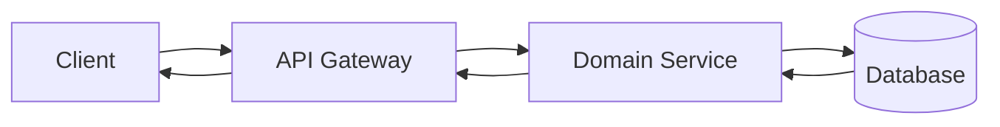

# Request Flow

## Table of Contents

- [1. Overview](#1-overview)
- [2. Overall Request Flow](#2-overall-request-flow)
- [3. Request Processing Steps](#3-request-processing-steps)
- [4. Responsibility by Layer](#4-responsibility-by-layer)
- [5. Sync Request vs Async Event Boundary](#5-sync-request-vs-async-event-boundary)
- [6. Error Response Strategy](#6-error-response-strategy)
- [7. Notes](#7-notes)
- [8. Related Docs](#8-related-docs)

---

## 1. Overview

이 문서는 클라이언트 요청이 API Gateway를 거쳐 각 도메인 서비스로 전달되고, 서비스 내부에서 validation, authorization, transaction, persistence가 처리된 뒤 응답으로 반환되는 동기 요청/응답 흐름을 설명한다.

이 문서의 기본 대상은 보호 API 요청이다. public path 또는 public rule에 해당하는 요청은 Gateway에서 JWT 검증과 인증 헤더 주입을 건너뛴다.

Kafka 기반 후속 처리, 상태 전파, 알림, 정산, 검색/AI 동기화 같은 비동기 흐름은 [05-event-strategy.md](05-event-strategy.md)에서 다룬다.

---

## 2. Overall Request Flow



Gateway는 요청 경로를 기준으로 대상 서비스를 결정한다. 보호 API 요청은 Gateway에서 JWT를 검증하고, 검증된 사용자 정보를 downstream service로 전달한다.

```text
X-Member-Id
X-Member-Role
X-Session-Id
```

각 도메인 서비스는 이 헤더를 `@CurrentMember` argument resolver를 통해 `AuthenticatedMember`로 바꿔 사용한다. public 요청은 이 단계 없이 바로 controller로 들어갈 수 있다.

---

## 3. Request Processing Steps

| Step | Layer | Responsibility |
|---|---|---|
| 1 | Client | HTTP API 요청 전송 |
| 2 | Gateway | route matching, public 여부 판단, 필요 시 JWT 검증과 1차 role-rule 검증 |
| 3 | Gateway | 보호 API인 경우 `X-Member-Id`, `X-Member-Role`, `X-Session-Id` 헤더 추가 |
| 4 | Controller | path variable, query parameter, request body 수신 |
| 5 | Controller / DTO | `@Valid`, Bean Validation 기반 입력 형식 검증 |
| 6 | CurrentMember Resolver | Gateway가 전달한 인증 헤더를 `AuthenticatedMember`로 변환 |
| 7 | Application Service | use case 실행, 트랜잭션 경계 시작, repository 호출 조합 |
| 8 | Domain | 도메인 규칙과 상태 전이 조건 검증 |
| 9 | Repository | DB 조회/저장 |
| 10 | Transaction | use case 단위 상태 변경 commit |
| 11 | Response | service 결과를 response DTO로 변환해 HTTP 응답 반환 |

public path/public rule 요청은 2단계에서 JWT 검증이 생략되고, 3단계 인증 헤더 주입도 수행되지 않는다.

---

## 4. Responsibility by Layer

| Concern | 처리 위치 | 현재 프로젝트 기준 |
|---|---|---|
| Routing | Gateway | `application.yml`의 Spring Cloud Gateway route가 `/api/**` 경로를 각 서비스로 전달 |
| Authentication | Gateway | `JwtAuthenticationFilter`가 Bearer token 검증 |
| Token blacklist check | Gateway | `GatewayJwtValidator`가 access token/session blacklist 확인 |
| 1차 role authorization | Gateway | `gateway.auth.role-rules` 기준 path/method별 허용 role 검사 |
| Auth context propagation | Gateway | `X-Member-Id`, `X-Member-Role`, `X-Session-Id` 헤더 전달 |
| Auth context binding | Domain Service | `CurrentMemberArgumentResolver`가 헤더를 `AuthenticatedMember`로 변환 |
| Request validation | Controller / DTO | `@Valid`, `@NotNull`, `@DecimalMin` 등 Bean Validation 사용 |
| Use case orchestration | Application Service | service가 repository 조회, domain method 호출, 처리 순서 조합 |
| Business rule validation | Domain / Application Service | 도메인 상태, 소유권, 금액, role별 업무 규칙 검증 |
| Transaction | Application Service | `@Transactional` use case service가 주요 트랜잭션 경계 |
| Persistence | Repository | JPA repository adapter를 통해 DB 조회/저장 |
| Response mapping | Controller / DTO | `ApiResponse.success(...)`, response DTO로 결과 반환 |
| Error mapping | Exception Handler | 서비스별 `@RestControllerAdvice`가 예외를 HTTP status와 error body로 변환 |

---

## 5. Sync Request vs Async Event Boundary

동기 요청은 사용자가 즉시 결과를 알아야 하는 작업에 사용한다.

예:

- 로그인
- 상품 조회
- 입찰 요청 접수
- 주문 생성 또는 결제 요청
- 구매 확정 요청

비동기 이벤트는 사용자 응답을 직접 막지 않아도 되는 후속 처리에 사용한다.

예:

- 입찰 보증금 차감
- 낙찰 후 주문 사전 생성
- 주문 확정 후 알림
- 구매 확정 후 escrow release와 정산 후보 생성
- 상품 변경 후 AI embedding/search 동기화

| Flow | Sync Request | Async Event |
|---|---|---|
| 입찰 | 입찰 요청 검증, `PENDING` bid 저장, 접수 응답 | 보증금 차감 요청, 차감 성공 후 bid 활성화 |
| 경매 종료 | 스케줄러가 종료 대상 경매 처리 | 낙찰 이벤트, 주문 사전 생성, 알림 |
| 결제 | 결제 요청 수신 또는 주문 수락 | 결제 결과 전파, 주문 확정, 알림, 정산 후보 생성 |
| 구매 확정 | 구매 확정 요청과 주문 상태 변경 | escrow release, 정산 후보 생성, 알림 |
| 상품 변경 | 상품 생성/수정/삭제 요청 처리 | AI embedding/search 후속 동기화 |

---

## 6. Error Response Strategy

Gateway와 각 서비스는 실패 위치에 따라 응답을 만든다.

| Case | 처리 위치 | HTTP Status | 기준 |
|---|---|---|---|
| 인증 헤더 없음 | Gateway | 401 | Bearer token 없음 또는 형식 오류 |
| JWT 만료/위조/blacklist | Gateway | 401 | `GatewayJwtValidator` 검증 실패 |
| Gateway role-rule 불일치 | Gateway | 403 | path/method에 허용되지 않은 role |
| Request DTO 검증 실패 | Domain Service | 400 | `MethodArgumentNotValidException` |
| 잘못된 path/query/body 값 | Domain Service | 400 | `IllegalArgumentException` 또는 입력 검증 실패 |
| 리소스 없음 | Domain Service | 404 | 도메인 not found 예외 |
| 비즈니스 상태 충돌 | Domain Service | 409 | 진행 중이 아닌 경매, 재고 충돌, 상태 전이 불가 등 |
| downstream 일시 실패 | Domain Service | 502 또는 500 | 다른 서비스 호출 실패 또는 내부 처리 실패 |
| 처리되지 않은 서버 오류 | Gateway 또는 Domain Service | 500 | 예상하지 못한 예외 |

---

## 7. Notes

- Gateway는 인증과 1차 role-rule 검사를 담당하지만, 모든 도메인 권한 규칙을 대체하지는 않는다.
- public path/public rule 요청은 JWT 검증과 인증 헤더 전달 없이 downstream으로 전달된다.
- 도메인별 소유권 검증, 상태 검증, 금액 검증은 각 서비스의 application/domain layer에서 처리한다.
- Kafka 이벤트 발행은 동기 요청 transaction 안에서 outbox로 적재될 수 있지만, Kafka broker로의 실제 발행과 후속 consumer 처리는 비동기 흐름으로 본다.

---

## 8. Related Docs

- [06-auth-flow.md](06-auth-flow.md)
- [05-event-strategy.md](05-event-strategy.md)
- [03-service-responsibilities.md](03-service-responsibilities.md)
- [service/gateway.md](service/gateway.md)
- [service/auction-service.md](service/auction-service.md)
