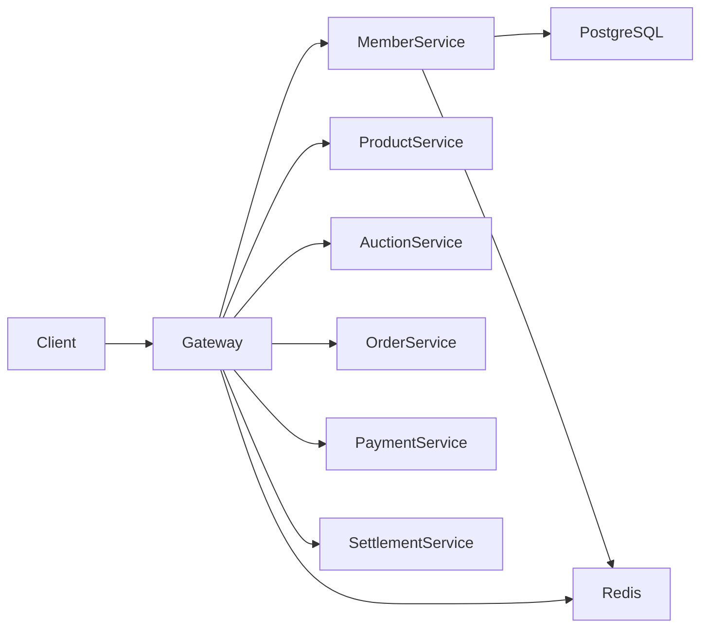
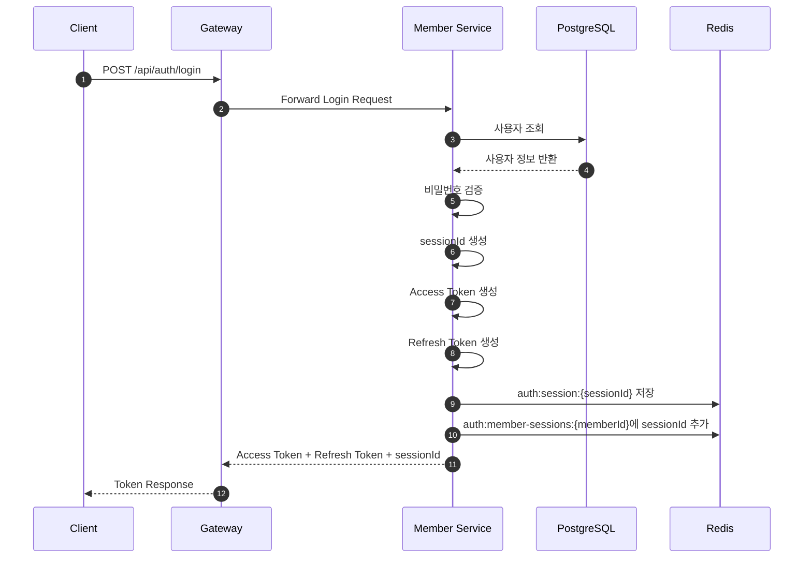
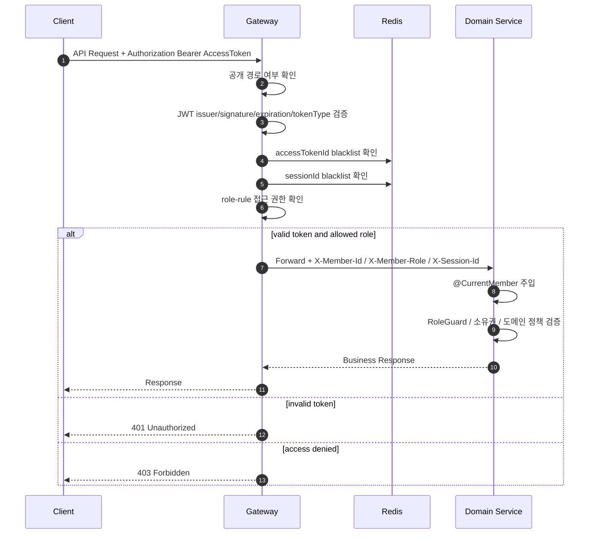
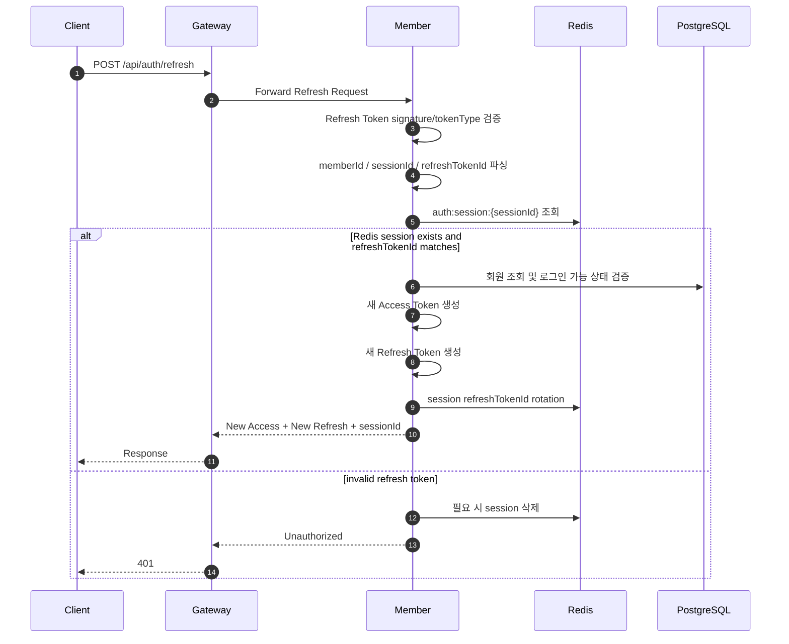
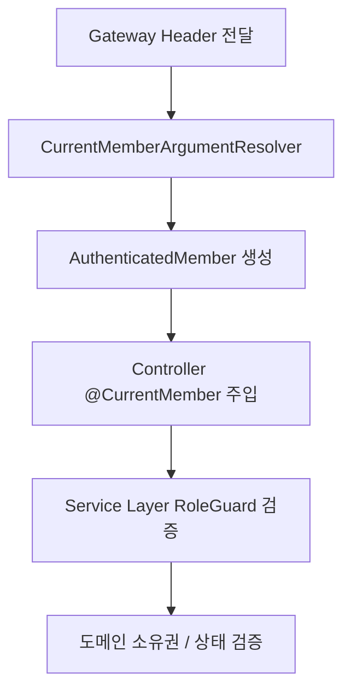

# Authentication Flow

## Table of Contents

- [1. Overview](#1-overview)
- [2. Architecture](#2-architecture)
  - [2.1 Why This Authentication Architecture?](#21-why-this-authentication-architecture)
  - [2.2 Authentication Architecture](#22-authentication-architecture)
  - [2.3 Authentication Lifecycle](#23-authentication-lifecycle)
- [3. Core Flows](#3-core-flows)
  - [3.1 Login Flow](#31-login-flow)
  - [3.2 API Authentication Flow](#32-api-authentication-flow)
  - [3.3 Refresh Token Flow](#33-refresh-token-flow)
  - [3.4 Session / Logout Flow](#34-session--logout-flow)
- [4. State and Token Strategy](#4-state-and-token-strategy)
  - [4.1 Token Claims](#41-token-claims)
  - [4.2 Redis Key Strategy](#42-redis-key-strategy)
  - [4.3 Token Strategy](#43-token-strategy)
- [5. Authorization](#5-authorization)
  - [5.1 Public / Role Rule Strategy](#51-public--role-rule-strategy)
  - [5.2 Service Authorization Flow](#52-service-authorization-flow)
  - [5.3 Authentication vs Authorization](#53-authentication-vs-authorization)
- [6. Operations](#6-operations)
  - [6.1 Failure Scenarios](#61-failure-scenarios)
  - [6.2 Trade-offs](#62-trade-offs)
- [7. Related Docs](#7-related-docs)

---

## 1. Overview

이 프로젝트는 Gateway 기반 인증 구조를 사용한다.

Gateway는 보호 API 요청의 JWT를 검증하고, 인증된 사용자 정보를 내부 헤더로 downstream service에 전달한다. 각 서비스는 전달받은 사용자 정보를 기반으로 비즈니스 권한 검증을 수행한다.

Access Token은 JWT 기반 stateless 구조를 사용한다. Refresh Token, 로그인 세션, access token blacklist, session blacklist는 Redis를 사용한다.

---

## 2. Architecture

### 2.1 Why This Authentication Architecture?

### 기존 Session 기반 구조의 한계

```text
Session 기반 구조에서는 서버가 인증 상태를 직접 저장해야 하므로
서비스 확장 시 session 공유 문제가 발생할 수 있다.
```

### JWT 구조를 선택한 이유

- Access Token을 stateless하게 검증할 수 있다.
- Gateway에서 인증을 중앙 처리할 수 있다.
- downstream service에는 검증된 사용자 정보만 전달할 수 있다.
- 서비스별 인증 필터 중복 구현을 줄일 수 있다.

### Redis를 사용하는 이유

- Refresh Token을 session 단위로 저장한다.
- 로그인 세션 목록을 관리한다.
- 현재 세션 로그아웃, 특정 세션 로그아웃, 전체 세션 로그아웃을 처리한다.
- Access Token blacklist와 Session blacklist를 TTL 기반으로 관리한다.

### Gateway 인증 구조를 선택한 이유

- 인증 책임을 Gateway로 중앙화한다.
- 라우팅, 공개 경로, 역할 기반 1차 접근 제어를 한 곳에서 관리한다.
- 각 서비스는 인증 토큰 파싱 대신 authorization과 도메인 정책에 집중한다.

---

### 2.2 Authentication Architecture



---

### 2.3 Authentication Lifecycle

```text
로그인
→ Access Token / Refresh Token 발급
→ Redis session 저장
→ API 요청
→ Gateway JWT 검증
→ Gateway blacklist 검증
→ Gateway role-rule 검증
→ X-Member-Id / X-Member-Role / X-Session-Id 전달
→ 서비스 비즈니스 처리
→ Refresh Token rotation
→ Logout / Session Blacklist
```

---

## 3. Core Flows

### 3.1 Login Flow



### 3.1.1 Login Responsibilities

| Component | Responsibility |
|---|---|
| Gateway | 로그인 요청 라우팅 |
| Member Service | 사용자 인증, session 생성, token 발급 |
| PostgreSQL | 사용자 계정 정보 저장 |
| Redis | session, refreshTokenId, userAgent, ipAddress 저장 |

---

### 3.2 API Authentication Flow



### 3.2.1 Gateway Responsibilities

- `OPTIONS` 요청 통과
- `/api/`가 아닌 경로 통과
- public path / public rule 통과
- `Authorization: Bearer <token>` 형식 검사
- JWT issuer, signature, expiration, tokenType 검증
- Access Token `jti` 존재 여부 검증
- `sessionId` claim 존재 여부 검증
- Access Token blacklist 검사
- Session blacklist 검사
- role-rule 기반 1차 접근 제어
- 인증 성공 시 내부 인증 헤더 전달

### 3.2.2 전달 헤더

| Header | Description |
|---|---|
| `X-Member-Id` | 인증된 회원 ID |
| `X-Member-Role` | 인증된 회원 역할 |
| `X-Session-Id` | 현재 로그인 세션 ID |

---

### 3.3 Refresh Token Flow

Refresh는 Access Token만 재발급하지 않는다. 현재 구현은 Refresh Token rotation을 수행한다.



---

### 3.4 Session / Logout Flow

### 3.4.1 세션 조회

```text
GET /api/auth/sessions
```

현재 회원의 Redis session 목록을 조회한다. 응답에는 현재 access token의 `sessionId`와 일치하는 세션 여부도 포함된다.

### 3.4.2 현재 세션 로그아웃

```text
POST /api/auth/logout/current
```

처리:

```text
1. Access Token 파싱
2. auth:session:{sessionId} 삭제
3. auth:member-sessions:{memberId}에서 sessionId 제거
4. auth:blacklist:access:{accessTokenId} 저장
5. auth:blacklist:session:{sessionId} 저장
```

### 3.4.3 특정 세션 로그아웃

```text
DELETE /api/auth/sessions/{sessionId}
```

현재 로그인 사용자가 소유한 다른 세션을 종료한다. 대상 sessionId가 현재 세션이면 현재 세션 로그아웃과 동일하게 처리한다.

### 3.4.4 전체 세션 로그아웃

```text
POST /api/auth/logout/all
```

처리:

```text
1. Access Token 파싱
2. 회원의 모든 sessionId 조회
3. 각 sessionId를 session blacklist에 저장
4. 회원의 모든 Redis session 삭제
5. 현재 Access Token blacklist 저장
```

---

## 4. State and Token Strategy

### 4.1 Token Claims

### 4.1.1 Access Token

Access Token은 Gateway 검증 대상이다.

| Claim | Description |
|---|---|
| `jti` | Access Token ID. blacklist key로 사용 |
| `sub` | 회원 ID |
| `memberId` | 회원 ID |
| `sessionId` | 로그인 세션 ID |
| `email` | 회원 이메일 |
| `role` | 회원 역할 |
| `tokenType` | `ACCESS` |
| `iss` | `member-service` |
| `exp` | 만료 시각 |

### 4.1.2 Refresh Token

Refresh Token은 Member Service 검증 대상이다.

| Claim | Description |
|---|---|
| `jti` | Refresh Token ID. Redis session의 `refreshTokenId`와 비교 |
| `sub` | 회원 ID |
| `memberId` | 회원 ID |
| `sessionId` | 로그인 세션 ID |
| `tokenType` | `REFRESH` |
| `iss` | `member-service` |
| `exp` | 만료 시각 |

---

### 4.2 Redis Key Strategy

| Key | Owner | Purpose |
|---|---|---|
| `auth:session:{sessionId}` | Member | session 상세 정보와 refreshTokenId 저장 |
| `auth:member-sessions:{memberId}` | Member | 회원별 sessionId set |
| `auth:blacklist:access:{accessTokenId}` | Member / Gateway | logout된 access token 차단 |
| `auth:blacklist:session:{sessionId}` | Member / Gateway | logout된 session 차단 |

`auth:blacklist:*`는 Member Service가 저장하고 Gateway가 검증한다.

---

### 4.3 Token Strategy

### 4.3.1 Access Token

| Item | Description |
|---|---|
| Type | JWT |
| 특징 | Stateless |
| 용도 | API 요청 인증 |
| 만료 시간 | 짧게 유지 |
| 저장 위치 | Client |
| 검증 위치 | Gateway |
| 강제 무효화 | access token blacklist 또는 session blacklist |

### 4.3.2 Refresh Token

| Item | Description |
|---|---|
| Type | JWT |
| 저장 위치 | Client |
| 서버 상태 | Redis session에 refreshTokenId 저장 |
| 목적 | Access Token / Refresh Token 재발급 |
| 특징 | Rotation 사용 |
| 검증 위치 | Member Service |

---

## 5. Authorization

### 5.1 Public / Role Rule Strategy

Gateway는 `gateway.auth.public-paths`, `public-rules`, `role-rules` 설정으로 접근 정책을 관리한다.

### 5.1.1 Public Path 예시

- `POST /api/auth/login`
- `POST /api/auth/refresh`
- `/api/auth/email-verifications/**`
- `/api/auth/oauth/kakao/**`
- `/api/auth/profile-images/presign`
- `/api/auctions/ws`
- `/swagger/**`
- `/swagger-ui.html`

### 5.1.2 Public Rule 예시

- `POST /api/members`
- `GET /api/products/**`
- `GET /api/categories/**`
- `GET /api/auctions/**`
- `GET /api/ai/**`

### 5.1.3 Role Rule 예시

| Pattern | Roles |
|---|---|
| `/api/carts/**` | `USER`, `SELLER`, `ADMIN` |
| `/api/orders/**` | `USER`, `SELLER`, `ADMIN` |
| `/api/products/seller` | `SELLER`, `ADMIN` |
| `/api/products/**` 변경 요청 | `SELLER`, `ADMIN` |
| `/api/categories/admin/**` | `ADMIN` |
| `/api/settlements/**` | `SELLER`, `ADMIN` |
| `/api/admin/member-reports/**` | `ADMIN` |

---

### 5.2 Service Authorization Flow

각 서비스는 JWT를 직접 검증하지 않는다. Gateway가 추가한 헤더를 공통 보안 모듈이 읽어 `AuthenticatedMember`로 변환한다.



### 5.2.1 공통 구성 요소

| Component | Responsibility |
|---|---|
| `@CurrentMember` | 컨트롤러 파라미터에 현재 사용자 주입 |
| `AuthenticatedMember` | `memberId`, `role`, `sessionId` 보관 |
| `CurrentMemberArgumentResolver` | `X-Member-*`, `X-Session-Id` 헤더 해석 |
| `RoleGuard` | 역할/소유자 권한 검증 |

---

### 5.3 Authentication vs Authorization

| Layer | Responsibility |
|---|---|
| Gateway | JWT 인증, blacklist 검증, role-rule 기반 1차 접근 제어 |
| Service | 역할 검증, 리소스 소유권 검증, 도메인 상태 기반 권한 검증 |

예:

```text
Gateway:
"유효한 토큰인가?"
"이 경로에 접근 가능한 역할인가?"

Order Service:
"이 주문의 소유자인가?"
"현재 상태에서 취소 가능한가?"
```

---

## 6. Operations

### 6.1 Failure Scenarios

| Scenario | Risk | Handling |
|---|---|---|
| Access Token 누락 | 인증 불가 | `401 Unauthorized` |
| 만료된 Access Token | 인증 실패 | `401 Unauthorized` |
| `tokenType != ACCESS` | Refresh Token으로 API 접근 | `401 Unauthorized` |
| JWT `jti` 누락 | blacklist 검증 불가 | `401 Unauthorized` |
| JWT `sessionId` 누락 | session 검증 불가 | `401 Unauthorized` |
| Logout된 Access Token 재사용 | 인증 우회 위험 | access blacklist 확인 |
| Logout된 Session 재사용 | 전체/특정 세션 로그아웃 우회 위험 | session blacklist 확인 |
| Refresh Token 탈취 의심 | 다른 refreshTokenId 전달 | session 삭제 후 invalid token |
| Redis session 만료 | refresh 불가 | 재로그인 요구 |
| Gateway role-rule 누락 | 접근 차단 또는 정책 누락 | 설정 점검 |
| 권한 부족 | 비인가 접근 | `403 Forbidden` |
| Redis 장애 | blacklist/refresh 검증 실패 | retry / 장애 대응 정책 |

---

### 6.2 Trade-offs

### 6.2.1 얻는 것

- Gateway 중심 인증 일관성
- 서비스별 JWT 파싱 중복 제거
- Access Token stateless 검증
- session 단위 logout 제어
- Refresh Token rotation
- 역할 기반 1차 접근 제어

### 6.2.2 잃는 것

- Redis 의존성 증가
- Gateway 설정 복잡성 증가
- Gateway 장애 영향도 증가
- 완전한 stateless 구조는 아님
- public rule / role rule 누락 시 운영 리스크 발생

---

## 7. Related Docs

- [User Flow](01-user-flow.md)
- [Request Flow](04-request-flow.md)
- [Gateway Service](service/gateway.md)
- [Member Service](service/member-service.md)
- [Engineering Decisions](09-engineering-decisions.md)
- [JWT Strategy](tech/jwt.md)
- [Redis](tech/redis.md)
