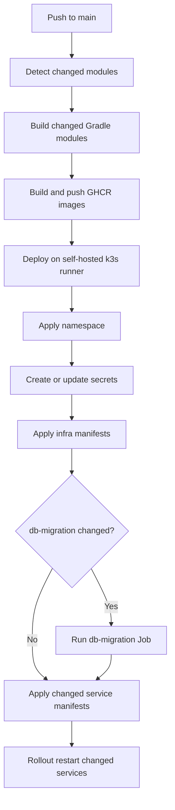
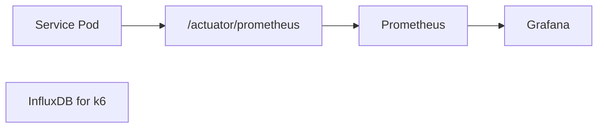

# Deployment

## Table of Contents

- [1. Overview](#1-overview)
- [2. Deployment Targets](#2-deployment-targets)
- [3. Ports](#3-ports)
  - [3.1 Application Services](#31-application-services)
  - [3.2 Infrastructure](#32-infrastructure)
  - [3.3 Monitoring](#33-monitoring)
- [4. Kubernetes Deployment](#4-kubernetes-deployment)
  - [4.1 Namespace](#41-namespace)
  - [4.2 Resource Groups](#42-resource-groups)
    - [4.2.1 Common Infrastructure](#421-common-infrastructure)
    - [4.2.2 Service Deployment Resources](#422-service-deployment-resources)
    - [4.2.3 Exception Resources](#423-exception-resources)
- [5. CD Flow](#5-cd-flow)
  - [5.1 CD Steps](#51-cd-steps)
- [6. Image Strategy](#6-image-strategy)
- [7. Environment Variables](#7-environment-variables)
- [8. Ingress](#8-ingress)
- [9. Health Checks](#9-health-checks)
- [10. Node Placement](#10-node-placement)
- [11. Monitoring](#11-monitoring)
  - [11.1 Application Metrics](#111-application-metrics)
  - [11.2 Monitoring Stack](#112-monitoring-stack)
  - [11.3 Monitoring Flow](#113-monitoring-flow)
- [12. Deployment Checklist](#12-deployment-checklist)
- [13. Failure Scenarios](#13-failure-scenarios)
- [14. Related Docs](#14-related-docs)

---

## 1. Overview

이 프로젝트의 배포 기준은 Kubernetes와 GitHub Actions CD workflow이다.

공통 인프라는 PostgreSQL, Kafka, Redis, Elasticsearch로 구성되며, 애플리케이션 서비스는 Gateway를 단일 진입점으로 사용한다.

---

## 2. Deployment Targets

| Target | Purpose | Main Files |
|---|---|---|
| Kubernetes | 운영 또는 클러스터 배포 | `infra/k8s/**` |
| GitHub Actions CD | 이미지 빌드, GHCR push, k8s apply/rollout | `.github/workflows/cd.yml` |

---

## 3. Ports

### 3.1 Application Services

| Service | Port |
|---|---|
| Gateway | `8080` |
| Product | `8081` |
| Payment | `8082` |
| Member | `8083` |
| Order | `8084` |
| Settlement | `8085` |
| Cart | `8086` |
| Notification | `8087` |
| AI | `8088` |
| Auction | `8090` |

### 3.2 Infrastructure

| Component | Port |
|---|---|
| PostgreSQL | `5432` |
| Redis | `6379` |
| Kafka | `9092` / `29092` |
| Kafka UI | `8089` |
| Elasticsearch | `9200` |

### 3.3 Monitoring

| Component | Internal Port | External Port |
|---|---|---|
| Prometheus | `9090` | `30090` |
| Grafana | `3000` | `30300` |
| InfluxDB | `8086` | `30086` |

---

## 4. Kubernetes Deployment

Kubernetes 배포는 `goods-mall` namespace를 사용한다.

```text
infra/k8s/infra
infra/k8s/{service}
```

### 4.1 Namespace

```yaml
apiVersion: v1
kind: Namespace
metadata:
  name: goods-mall
```

### 4.2 Resource Groups

`infra/k8s` 아래 리소스는 크게 세 묶음으로 이해하면 된다.

#### 4.2.1 Common Infrastructure

서비스들이 공통으로 의존하는 기반 리소스다. 주로 `infra/k8s/infra/**` 아래에 있다.

| Resource | Purpose |
|---|---|
| `namespace.yaml` | `goods-mall` namespace 생성 |
| `infra/common/configmap.yaml` | 공통 DB/Kafka/Redis 환경변수 |
| `infra/common/secret.example` | 공통 Secret 구조 예시 |
| `infra/postgres/**` | PostgreSQL 배포와 저장소 |
| `infra/kafka/**` | Kafka, Zookeeper, Kafka UI 배포 |
| `infra/redis/**` | Redis 배포 |
| `infra/elasticsearch/**` | Elasticsearch 배포와 저장소 |
| `infra/ingress.yaml` | 외부 트래픽을 Gateway로 전달 |
| `infra/traefik-config.yaml` | Traefik 관련 보조 설정 |

이 묶음은 서비스 배포 전에 먼저 준비되어야 하는 공용 런타임 환경이다.

#### 4.2.2 Service Deployment Resources

각 서비스를 실제로 실행하기 위한 배포 리소스다. 주로 `infra/k8s/{service}/**`에 위치한다.

| Resource | Purpose |
|---|---|
| `deployment.yaml` | Pod 배포 정의 |
| `service.yaml` | 클러스터 내부 서비스 노출 |
| `configmap.yaml` | 서비스별 non-secret 환경변수. 필요한 서비스에만 존재 |
| `secret.example` | 서비스별 secret 예시. 필요한 서비스에만 존재 |

대상 서비스는 `ai`, `auction`, `cart`, `gateway`, `member`, `notification`, `order`, `payment`, `product`, `settlement`이다.

현재 서비스별 리소스 구성은 아래와 같다.

| Service | Resources |
|---|---|
| `ai` | `deployment.yaml`, `service.yaml`, `configmap.yaml`, `secret.example`, `hpa.yaml` |
| `auction` | `deployment.yaml`, `service.yaml`, `configmap.yaml`, `secret.example` |
| `cart` | `deployment.yaml`, `service.yaml` |
| `gateway` | `deployment.yaml`, `service.yaml`, `configmap.yaml`, `secret.example` |
| `member` | `deployment.yaml`, `service.yaml`, `configmap.yaml`, `secret.example` |
| `notification` | `deployment.yaml`, `service.yaml`, `configmap.yaml`, `secret.example` |
| `order` | `deployment.yaml`, `service.yaml`, `configmap.yaml`, `secret.example` |
| `payment` | `deployment.yaml`, `service.yaml`, `configmap.yaml`, `secret.example` |
| `product` | `deployment.yaml`, `service.yaml`, `configmap.yaml`, `secret.example` |
| `settlement` | `deployment.yaml`, `service.yaml` |

#### 4.2.3 Exception Resources

모든 서비스에 공통으로 존재하지는 않지만, 특정 운영 목적 때문에 별도로 관리되는 리소스다.

| Resource | Location | Purpose |
|---|---|---|
| `hpa.yaml` | `infra/k8s/ai/hpa.yaml` | AI 서비스 오토스케일링 |
| `job.yaml` | `infra/k8s/db-migration/job.yaml` | DB migration 일회성 실행 |
| `pvc.yaml` | `infra/k8s/infra/postgres/pvc.yaml`, `infra/k8s/infra/elasticsearch/pvc.yaml` | 영속 스토리지 보존 |
| `ingress.yaml` | `infra/k8s/infra/ingress.yaml` | 외부 트래픽 진입 |
| `traefik-config.yaml` | `infra/k8s/infra/traefik-config.yaml` | Ingress controller 보조 설정 |

`db-migration`은 일반 서비스처럼 지속 실행되는 Deployment가 아니라, 배포 시점에 실행되는 Job으로 분리되어 있다.

---

## 5. CD Flow

CD workflow는 `.github/workflows/cd.yml`에 정의되어 있으며 `main` branch push에서 실행된다.

변경 감지 대상은 서비스 코드, `db-migration`, `infra/k8s/**`이다.



### 5.1 CD Steps

| Step | Description |
|---|---|
| Change detection | 변경된 서비스, `db-migration`, k8s manifest를 계산한다. |
| Module build | 변경된 Gradle module만 `./gradlew :{module}:build`로 빌드한다. |
| Image publish | `{service}:latest`와 `{service}:sha-{shortSha}` 이미지를 GHCR에 push한다. |
| Cluster access check | self-hosted `ec2`, `k3s` runner에서 `kubectl get nodes`로 접근을 확인한다. |
| Namespace apply | `infra/k8s/infra/namespace.yaml`을 적용한다. |
| Secret apply | `ghcr-secret`, `common-secret`, 서비스별 Secret을 GitHub Secrets 기반으로 생성/갱신한다. |
| Infra apply | `infra/k8s/infra/`를 recursive apply한다. |
| DB migration | `db-migration` 변경 시 기존 Job을 삭제하고 새 Job을 실행 완료까지 대기한다. |
| Service apply | 변경된 서비스와 k8s manifest 변경 서비스를 대상으로 `infra/k8s/{service}/`를 적용한다. |
| Rollout restart | `latest` tag 재사용 때문에 변경 서비스 Deployment를 강제 재시작하고 rollout status를 대기한다. |

---

## 6. Image Strategy

Kubernetes deployment는 GHCR 이미지를 사용한다.

```text
ghcr.io/prgrms-be-adv-devcourse/beadv5_2_todaylunchmenu_be/{service}:latest
```

이미지 pull에는 `ghcr-secret`이 필요하다.

```yaml
imagePullSecrets:
  - name: ghcr-secret
```

---

## 7. Environment Variables

공통 환경변수는 `common-config`와 `common-secret`에서 주입된다.

| Variable | K8s Value | Used By |
|---|---|---|
| `DB_URL` | `jdbc:postgresql://postgres:5432/goods_mall` | 전체 |
| `KAFKA_BOOTSTRAP_SERVERS` | `kafka:9092` | Kafka 사용 서비스 |
| `REDIS_HOST` | `redis` | gateway, member, order, ai |
| `REDIS_PORT` | `6379` | gateway, member, order, ai |
| `DB_USER_NAME` | Secret | 전체 |
| `DB_USER_PASSWORD` | Secret | 전체 |

서비스별 환경변수와 Secret 목록은 [K8s ENV Vars](../infra/k8s/ENV_VARS.md)를 기준으로 관리한다.

---

## 8. Ingress

외부 트래픽은 Ingress를 통해 Gateway로 들어간다.

| Ingress | EntryPoint | Backend |
|---|---|---|
| `goods-mall-ingress` | `web` | `gateway:8080` |
| `goods-mall-ingress-tls` | `websecure` | `gateway:8080` |

TLS Ingress는 현재 `3.36.235.7.nip.io` host와 `letsencrypt` resolver를 사용한다.

---

## 9. Health Checks

서비스 Deployment는 TCP probe를 사용한다.

| Probe | Purpose |
|---|---|
| `startupProbe` | 애플리케이션 초기 기동 대기 |
| `livenessProbe` | 비정상 컨테이너 재시작 |
| `readinessProbe` | 트래픽 수신 가능 여부 판단 |

예:

```yaml
startupProbe:
  tcpSocket:
    port: 8080
  failureThreshold: 30
  periodSeconds: 10
```

---

## 10. Node Placement

서비스 Deployment는 `nodeSelector.role`로 배치 대상을 구분한다.

| Node Role | Services |
|---|---|
| `infra` | `ai`, `cart`, `gateway`, `notification`, `settlement` |
| `app` | `auction`, `member`, `order`, `payment`, `product` |

배포 전 클러스터 노드에 `role=infra`와 `role=app` label이 존재하는지 확인해야 한다. label이 없으면 Pod가 scheduling되지 않는다.

---

## 11. Monitoring

현재 모니터링은 애플리케이션 내부 계측과 Kubernetes 내 수집/시각화 스택으로 나뉜다.

### 11.1 Application Metrics

대부분의 서비스는 `common-monitoring` 모듈을 통해 Spring Boot Actuator와 Prometheus registry를 공통으로 사용한다.

| Component | Role |
|---|---|
| `spring-boot-starter-actuator` | `health`, `info`, `metrics`, `prometheus` endpoint 노출 |
| `micrometer-registry-prometheus` | Micrometer 메트릭을 Prometheus scrape 형식으로 변환 |
| `common-monitoring` | 공통 기본값과 auto-configuration 제공 |

`common-monitoring`의 기본 설정은 아래와 같다.

| Property | Value |
|---|---|
| `management.endpoints.web.exposure.include` | `health,info,metrics,prometheus` |
| `management.endpoint.prometheus.enabled` | `true` |
| `management.endpoint.health.show-details` | `always` |

즉 서비스는 기본적으로 `/actuator/health`, `/actuator/info`, `/actuator/metrics`, `/actuator/prometheus`를 노출하는 구조다.

### 11.2 Monitoring Stack

`infra/k8s/monitoring/**`에는 별도 `monitoring` namespace에 배포하는 모니터링 스택이 있다.

| Resource | Purpose |
|---|---|
| `prometheus.yaml` | 각 서비스의 `/actuator/prometheus`를 scrape |
| `grafana.yaml` | Prometheus 메트릭 시각화 |
| `influxdb.yaml` | `k6` 부하테스트 결과 저장용 InfluxDB |
| `apply.sh` | `monitoring` namespace 생성 후 모니터링 리소스 적용 |

현재 Prometheus scrape 대상 서비스는 `auction`, `ai`, `cart`, `gateway`, `member`, `notification`, `order`, `payment`, `product`, `settlement`이다.

### 11.3 Monitoring Flow



현재 저장소 기준으로는 Prometheus + Grafana 중심 메트릭 수집/시각화는 존재하지만, Alertmanager나 OpenTelemetry 기반 분산 추적 설정은 포함되어 있지 않다.

---

## 12. Deployment Checklist

1. `goods-mall` namespace 생성
2. `ghcr-secret`, `common-secret`, 서비스별 Secret 생성
3. 공통 infra ConfigMap/Secret 적용
4. PostgreSQL, Redis, Kafka, Elasticsearch, Ingress 적용
5. `db-migration` 변경 시 migration Job 실행
6. 변경된 서비스별 manifest 적용
7. 변경된 서비스 Deployment rollout restart/status 확인
8. Gateway `/swagger-ui.html` 또는 주요 API로 라우팅 확인
9. Kafka UI로 topic/consumer 상태 확인
10. node label과 Pod scheduling 상태 확인

---

## 13. Failure Scenarios

| Scenario | Risk | Check |
|---|---|---|
| Secret 누락 | Pod 기동 실패 또는 인증 실패 | `kubectl describe pod` |
| DB migration 실패 | 서비스 기동 후 테이블 없음 | db-migration Job logs |
| Kafka 미기동 | 이벤트 발행/소비 실패 | Kafka pod, Kafka UI |
| Redis 미기동 | 인증 blacklist/refresh 실패 | Redis pod 상태 |
| Ingress 오설정 | 외부 접근 실패 | Ingress, Traefik logs |
| GHCR 인증 실패 | image pull 실패 | `ghcr-secret` |
| node label 누락 | Pod scheduling 실패 | node labels |

---

## 14. Related Docs

- [Architecture](02-architecture.md)
- [Service Responsibilities](03-service-responsibilities.md)
- [Event Strategy](05-event-strategy.md)
- [Kubernetes](tech/kubernetes.md)
- [CI/CD](tech/cicd.md)
- [Troubleshooting](10-troubleshooting.md)
