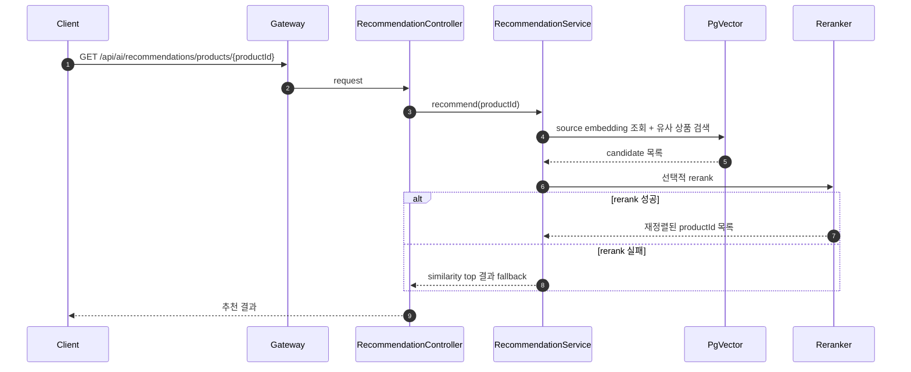
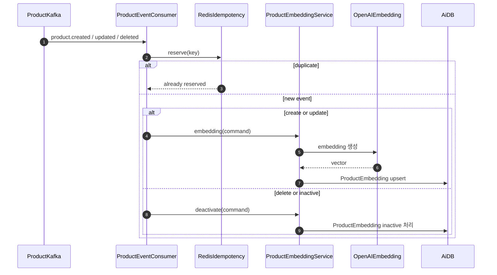
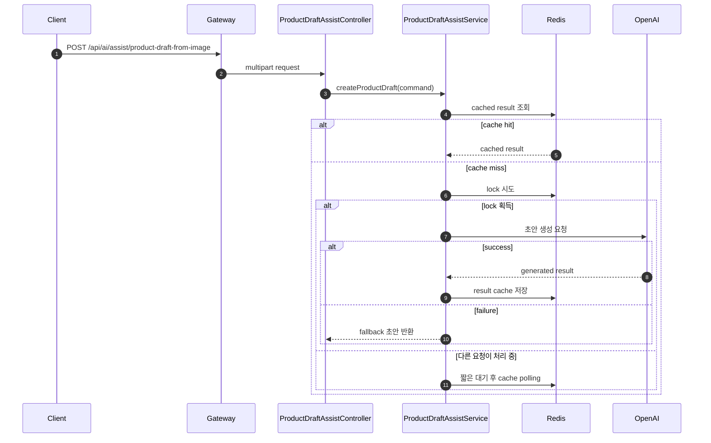

# AI Service

## Table of Contents

- [1. 개요](#1-개요)
- [2. 소유 도메인 / 데이터](#2-소유-도메인--데이터)
- [3. 주요 유스케이스](#3-주요-유스케이스)
- [4. API 표면](#4-api-표면)
- [5. 서비스 내부 요청 흐름](#5-서비스-내부-요청-흐름)
  - [5.1 상품 유사 추천 조회](#51-상품-유사-추천-조회)
  - [5.2 상품 이벤트 기반 임베딩 갱신](#52-상품-이벤트-기반-임베딩-갱신)
  - [5.3 상품 등록 초안 보조](#53-상품-등록-초안-보조)
- [6. 이벤트 연동](#6-이벤트-연동)
  - [6.1 발행 이벤트](#61-발행-이벤트)
  - [6.2 소비 이벤트](#62-소비-이벤트)
  - [6.3 실패 처리](#63-실패-처리)
- [7. 외부 의존성](#7-외부-의존성)
- [8. 보안 / 인가](#8-보안--인가)
- [9. 트랜잭션 / 일관성](#9-트랜잭션--일관성)
- [10. 운영 메모](#10-운영-메모)
- [11. 관련 파일](#11-관련-파일)
- [12. 관련 문서](#12-관련-문서)

---

## 1. 개요

AI Service는 추천, 임베딩, 상품 등록 초안 보조, 경매 가격 추천 같은 AI 보조 기능을 제공한다.

핵심 책임:

- 상품 임베딩 생성과 비활성화
- 유사 상품 추천
- 사용자 맞춤 추천 캐시 갱신
- 이미지 기반 상품 등록 초안 생성
- 경매 가격 추천
- 임베딩 백필 / 전체 재색인 운영 기능

AI Service는 주문, 결제, 상품 원본 상태를 직접 소유하지 않는다. Product, Cart 이벤트와 Product API 조회를 바탕으로 AI 전용 파생 데이터를 유지한다.

---

## 2. 소유 도메인 / 데이터

주요 영속 도메인:

- `ProductEmbedding`

주요 파생 저장소:

- Redis 사용자 추천 캐시
- Redis 이벤트 멱등 키
- Redis 상품 초안 보조 실행 결과 / lock

데이터 특성:

- `ProductEmbedding`은 pgvector 기반 유사도 검색 대상이다.
- 사용자 추천은 `user:recommendations:{memberId}` 키로 Redis에 저장된다.
- 상품 이벤트 소비 멱등 처리는 Redis TTL 키로 수행한다.
- 상품 초안 보조는 fingerprint 기반 결과 캐시와 lock을 사용한다.

---

## 3. 주요 유스케이스

- 특정 상품 기준 유사 상품 추천
- 장바구니 이벤트 기반 사용자 맞춤 추천 갱신
- 이미지 기반 상품 등록 초안 생성
- 경매 가격 추천
- 상품 생성/수정/삭제 이벤트 기반 임베딩 갱신
- 누락 임베딩 백필
- 전체 임베딩 재색인

---

## 4. API 표면

주요 외부 API:

| Endpoint | Method | Purpose | Auth |
|---|---|---|---|
| `/api/ai/recommendations/products/{productId}` | `GET` | 유사 상품 추천 조회 | public |
| `/api/ai/recommendations/me` | `GET` | 내 맞춤 추천 조회 | authenticated |
| `/api/ai/assist/product-draft-from-image` | `POST` | 이미지 기반 상품 초안 생성 | public |
| `/api/ai/auction-price-recommendation` | `POST` | 경매 가격 추천 | public |
| `/api/ai/admin/embeddings/backfill-missing` | `POST` | 누락 임베딩 백필 | `ADMIN` |
| `/api/ai/admin/embeddings/reindex-all` | `POST` | 전체 임베딩 재색인 | `ADMIN` |

특징:

- 추천 조회 API는 읽기 중심이다.
- 상품 초안 보조는 multipart 요청을 사용한다.
- 관리자 임베딩 API는 `RoleGuard.requireAdmin`으로 관리자 권한을 강제한다.

---

## 5. 서비스 내부 요청 흐름

### 5.1 상품 유사 추천 조회

추천 조회는 저장된 임베딩을 읽고 pgvector 유사도 검색 결과를 가져온 뒤, 선택적으로 rerank를 수행한다.

추천 결과는 cache key generator를 통해 캐시된다.

### 5.2 상품 이벤트 기반 임베딩 갱신

상품 생성/수정/삭제 이벤트를 받아 임베딩을 upsert 또는 deactivate 한다.

source timestamp가 더 오래된 이벤트는 stale 이벤트로 간주하고 건너뛴다.

### 5.3 상품 등록 초안 보조

상품 등록 초안 보조는 동일 요청의 중복 실행을 Redis lock과 fingerprint 캐시로 제어한다.

OpenAI 호출 실패 시에도 fallback 초안을 반환하는 것이 현재 구현의 기본 전략이다.

---

## 6. 이벤트 연동

### 6.1 발행 이벤트

현재 확인된 기준으로 AI Service는 다른 서비스가 소비하는 도메인 이벤트를 발행하지 않는다.

### 6.2 소비 이벤트

주요 소비 이벤트:

- `product.created`
- `product.updated`
- `product.deleted`
- `cart.item.added`

소비 목적:

- 상품 이벤트: 임베딩 생성 / 갱신 / 비활성화
- 장바구니 이벤트: 사용자 추천 캐시 갱신

DLQ:

- `ai.product-event.dlq`

### 6.3 실패 처리

- 상품 이벤트는 Redis 멱등 키를 먼저 예약하고, 처리 실패 시 키를 release해 재시도를 허용한다.
- Redis 멱등 저장 실패 시 consumer 전체 중단 대신 중복 허용을 선택한다.
- 장바구니 이벤트는 역직렬화 실패나 추천 갱신 실패를 warn 로그로 남기고 종료한다.
- 상품 초안 보조는 OpenAI 실패 시 fallback 결과를 캐시해 응답한다.
- 추천 rerank 실패 시 similarity top 결과로 fallback 한다.
- 경매 가격 추천은 OpenAI 실패 시 규칙 기반 결과로 fallback 한다.

---

## 7. 외부 의존성

- OpenAI API: embedding, rerank, 상품 초안 생성, 경매 가격 추천
- Product API: 관리자 재색인 시 전체 상품 snapshot 조회
- PostgreSQL + pgvector: 임베딩 저장과 유사도 검색
- Redis: 추천 캐시, 멱등 키, draft assist 실행 캐시/lock
- Kafka: 상품 / 장바구니 이벤트 소비

---

## 8. 보안 / 인가

- Gateway가 JWT를 검증하고 사용자 정보를 전달한다.
- `/api/ai/recommendations/me`는 인증 사용자 기준으로 동작한다.
- 임베딩 운영 API는 `RoleGuard.requireAdmin`으로 admin만 허용한다.
- 추천, 경매 가격 추천, 초안 보조는 현재 public 또는 약한 인증 전제다.

---

## 9. 트랜잭션 / 일관성

- 추천과 AI 보조 기능은 원본 상품 상태를 직접 소유하지 않는다.
- 임베딩 갱신은 상품 이벤트 기반이므로 Product Service와 eventual consistency 관계다.
- 사용자 맞춤 추천은 장바구니 이벤트 이후 Redis 캐시에 반영되므로 즉시성이 완전하지 않다.
- OpenAI 호출 실패 시 fallback을 허용하는 대신, AI 품질보다 서비스 응답 연속성을 우선한다.

---

## 10. 운영 메모

- OpenAI 관련 설정이 비어 있으면 embedding, rerank, draft assist, auction price recommendation 일부 기능이 degrade될 수 있다.
- recommendation cache TTL은 600초, user recommendation TTL은 3600초다.
- product draft assist lock TTL은 기본 30초, result TTL은 기본 60초다.
- 누락 임베딩 백필과 전체 재색인은 Product API 전체 조회에 의존하므로 운영 시간대 선택이 중요하다.
- 장바구니 추천은 현재 `cart.item.added` 이벤트에만 반응한다. 구매, 찜, 조회 로그 같은 다른 행동 신호는 아직 없다.

---

## 11. 관련 파일

- `service/ai/src/main/java/com/example/ai/presentation/controller/RecommendationController.java`
- `service/ai/src/main/java/com/example/ai/presentation/controller/UserRecommendationController.java`
- `service/ai/src/main/java/com/example/ai/presentation/controller/ProductDraftAssistController.java`
- `service/ai/src/main/java/com/example/ai/presentation/controller/AuctionPriceRecommendationController.java`
- `service/ai/src/main/java/com/example/ai/presentation/controller/EmbeddingAdminController.java`
- `service/ai/src/main/java/com/example/ai/application/service/RecommendationService.java`
- `service/ai/src/main/java/com/example/ai/application/service/UserRecommendationService.java`
- `service/ai/src/main/java/com/example/ai/application/service/ProductEmbeddingService.java`
- `service/ai/src/main/java/com/example/ai/application/service/ProductDraftAssistService.java`
- `service/ai/src/main/java/com/example/ai/application/service/AuctionPriceRecommendationService.java`
- `service/ai/src/main/java/com/example/ai/infrastructure/messaging/kafka/ProductEventConsumer.java`
- `service/ai/src/main/java/com/example/ai/infrastructure/messaging/kafka/CartItemEventConsumer.java`
- `service/ai/src/main/java/com/example/ai/infrastructure/recommendation/UserRecommendationRedisRepository.java`
- `service/ai/src/main/java/com/example/ai/infrastructure/embedding/RedisEventIdempotencyRepository.java`

---

## 12. 관련 문서

- [04-request-flow.md](../04-request-flow.md)
- [05-event-strategy.md](../05-event-strategy.md)
- [06-auth-flow.md](../06-auth-flow.md)
- [product-service.md](./product-service.md)
- [cart-service.md](./cart-service.md)
- [auction-service.md](./auction-service.md)
