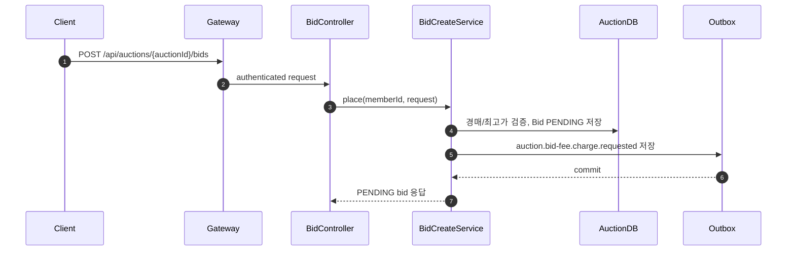
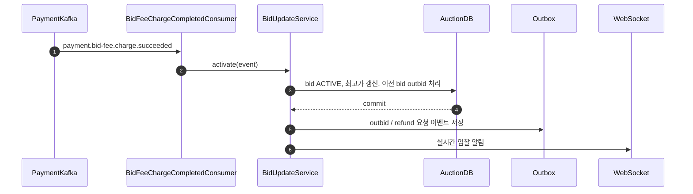
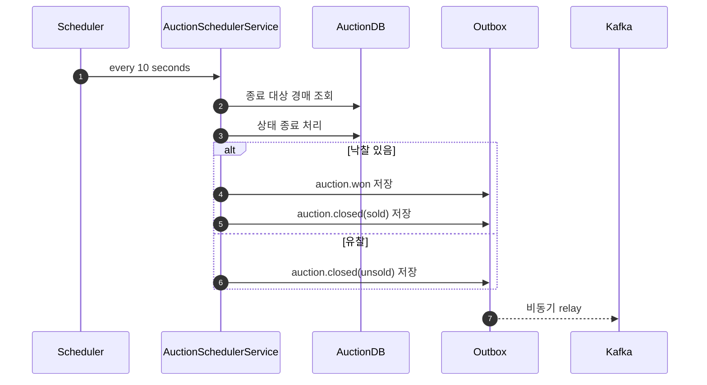

# Auction Service

## Table of Contents

- [1. 개요](#1-개요)
- [2. 소유 도메인 / 데이터](#2-소유-도메인--데이터)
- [3. 주요 유스케이스](#3-주요-유스케이스)
- [4. API 표면](#4-api-표면)
- [5. 서비스 내부 요청 흐름](#5-서비스-내부-요청-흐름)
  - [5.1 입찰 생성](#51-입찰-생성)
  - [5.2 입찰 보증금 성공 반영](#52-입찰-보증금-성공-반영)
  - [5.3 경매 종료 처리](#53-경매-종료-처리)
- [6. 이벤트 연동](#6-이벤트-연동)
  - [6.1 발행 이벤트](#61-발행-이벤트)
  - [6.2 소비 이벤트](#62-소비-이벤트)
  - [6.3 실패 처리](#63-실패-처리)
- [7. 외부 의존성](#7-외부-의존성)
- [8. 보안 / 인가](#8-보안--인가)
- [9. 트랜잭션 / 일관성](#9-트랜잭션--일관성)
- [10. 운영 메모](#10-운영-메모)
- [11. 관련 파일](#11-관련-파일)
- [12. 관련 문서](#12-관련-문서)

---

## 1. 개요

Auction Service는 경매와 입찰 상태를 소유한다. 입찰 보증금 차감 자체는 Payment Service가 수행하고, Auction Service는 그 결과를 받아 입찰을 활성화하거나 취소한다.

핵심 책임:

- 경매 생성과 조회
- 입찰 생성과 조회
- 입찰 `PENDING -> ACTIVE / CANCELED` 전환
- 최고 입찰가 갱신과 종료 시간 연장
- 스케줄러 기반 경매 시작/종료
- 낙찰, 유찰, outbid, 보증금 refund 요청 이벤트 발행
- WebSocket 기반 실시간 입찰 알림 보조
- 경매 관련 outbox relay

즉, 금액 이동은 Payment Service, 주문 생성은 Order Service가 맡고, Auction Service는 경매 상태 기계와 입찰 경쟁 규칙을 책임진다.

---

## 2. 소유 도메인 / 데이터

주요 영속 도메인:

- `Auction`
- `Bid`
- `OutboxEvent`

주요 상태:

- `AuctionStatus`
- `BidStatus`
- `OutboxEventStatus`

데이터 특성:

- 입찰 요청은 먼저 `PENDING`으로 저장된다.
- 결제 성공 이벤트를 받은 뒤 `ACTIVE`가 된다.
- 경매 종료 시 active winning bid가 있으면 `PENDING_PAYMENT`으로 바뀌고 `auction.won` outbox를 저장한다.

---

## 3. 주요 유스케이스

- 판매자 경매 생성
- 경매 목록/상세 조회
- 입찰 생성
- 경매별 입찰 목록 조회
- 보증금 성공/실패 결과 반영
- 최고가 갱신과 이전 최고 입찰 outbid 처리
- 대기 경매 시작
- 만료 경매 종료와 낙찰/유찰 처리

---

## 4. API 표면

주요 외부 API:

| Endpoint | Method | Purpose | Auth |
|---|---|---|---|
| `/api/auctions` | `POST` | 경매 생성 | `SELLER`, `ADMIN` |
| `/api/auctions` | `GET` | 경매 목록 조회 | public |
| `/api/auctions/{auctionId}` | `GET` | 경매 상세 조회 | public |
| `/api/auctions/{auctionId}/bids` | `POST` | 입찰 생성 | `USER`, `SELLER`, `ADMIN` |
| `/api/auctions/{auctionId}/bids` | `GET` | 입찰 목록 조회 | public |

주요 내부 API:

| Endpoint | Method | Purpose |
|---|---|---|
| `/internal/auctions/sellers/{sellerId}/blocking-summary` | `GET` | 판매자 정산/탈퇴 차단 여부 판단용 경매 요약 |

---

## 5. 서비스 내부 요청 흐름

### 5.1 입찰 생성

입찰 요청은 바로 활성화되지 않는다. 먼저 `PENDING` bid를 저장하고 `auction.bid-fee.charge.requested` outbox를 적재한 뒤 Payment Service의 결과를 기다린다.

### 5.2 입찰 보증금 성공 반영

Payment Service가 보증금 차감 성공 이벤트를 보내면, Auction Service가 실제 active bid 전환과 최고가 갱신을 수행한다.

보증금 실패 이벤트를 받으면 `PENDING` bid를 취소하고 사용자에게 실패 알림을 보낸다.

### 5.3 경매 종료 처리

스케줄러가 주기적으로 종료 시각을 지난 경매를 정리한다. 낙찰자가 있으면 `auction.won`을 적재하고, 없으면 유찰 처리한다.

---

## 6. 이벤트 연동

### 6.1 발행 이벤트

주요 발행 이벤트:

- `auction.bid-fee.charge.requested`
- `auction.bid-fee.refund.requested`
- `auction.bid.outbid`
- `auction.won`
- `auction.closed`

특징:

- 입찰 생성, 낙찰 처리, outbid 처리 모두 outbox 기반이다.
- 입찰 보증금 요청 payload는 `EventEnvelope`로 감싼다.
- 낙찰과 유찰 모두 종료 이벤트를 남긴다.

### 6.2 소비 이벤트

주요 소비 이벤트:

- `payment.bid-fee.charge.succeeded`
- `payment.bid-fee.charge.failed`

현재 코드에는 다음 consumer도 존재한다.

- `order.confirmed`
- `product.thumbnail-changed`

확인된 역할:

- 보증금 성공: bid 활성화, 최고가 갱신, outbid/refund 후속 처리
- 보증금 실패: bid 취소와 실패 알림

### 6.3 실패 처리

- 보증금 성공 consumer는 optimistic lock 충돌 시 최대 3회 재시도한다.
- 보증금 실패 consumer는 `PENDING` bid만 취소한다.
- 현재 `OutboxProcessor`는 Kafka 발행 완료 전에 상태를 `PUBLISHED`로 바꾸는 예외 구현을 가지고 있다.
- 외부 비동기 send 실패는 로그만 남기고 `PENDING`으로 되돌리지 않는 경로가 있어, 다른 서비스의 outbox 처리보다 신뢰성이 낮다.

---

## 7. 외부 의존성

- Payment Service: 입찰 보증금 hold / refund
- Order Service: 낙찰 이후 주문 후속 흐름
- PostgreSQL: 경매, 입찰, outbox 저장
- Kafka: 경매/결제/주문 이벤트 송수신
- WebSocket/STOMP: 실시간 입찰 알림

---

## 8. 보안 / 인가

- Gateway가 JWT를 검증하고 사용자 정보를 전달한다.
- 경매 생성은 판매자 권한을 전제로 한다.
- 입찰은 로그인 사용자만 가능하며, 본인 입찰 여부와 현재 최고 입찰 여부는 서비스 내부에서 검증한다.
- 내부 API는 판매자 관련 차단 상태를 다른 서비스가 확인할 때 사용한다.

---

## 9. 트랜잭션 / 일관성

- 입찰 생성 시 bid 저장과 보증금 요청 outbox 저장은 같은 트랜잭션으로 묶인다.
- 실제 입찰 활성화는 보증금 성공 이벤트 이후에 일어나므로 eventual consistency를 가진다.
- 경매 종료도 스케줄러 polling 기반이므로 종료 시점과 실제 이벤트 발행 시점 사이에 지연이 존재할 수 있다.
- outbox 처리 구현은 다른 서비스와 달리 published 전환 시점이 앞서 있어 문서상 예외로 봐야 한다.

---

## 10. 운영 메모

- 스케줄러는 10초 주기로 대기 경매 시작과 만료 경매 종료를 처리한다.
- 입찰이 `PENDING`에서 오래 머무르면 Payment Service 이벤트 지연 또는 outbox relay 이상을 먼저 의심해야 한다.
- WebSocket 알림은 사용자 경험 보조 수단이고, 최종 상태는 DB와 API 조회 결과가 기준이다.
- `OutboxProcessor`의 legacy 동작 때문에 Kafka send 실패 누락 여부를 별도로 봐야 한다.

---

## 11. 관련 파일

- `service/auction/src/main/java/com/todaylunch/auction/presentation/controller/AuctionController.java`
- `service/auction/src/main/java/com/todaylunch/auction/presentation/controller/BidController.java`
- `service/auction/src/main/java/com/todaylunch/auction/presentation/controller/AuctionInternalController.java`
- `service/auction/src/main/java/com/todaylunch/auction/application/service/BidCreateService.java`
- `service/auction/src/main/java/com/todaylunch/auction/application/service/BidUpdateService.java`
- `service/auction/src/main/java/com/todaylunch/auction/application/service/AuctionSchedulerService.java`
- `service/auction/src/main/java/com/todaylunch/auction/infrastructure/messaging/kafka/consumer/BidFeeChargeCompletedConsumer.java`
- `service/auction/src/main/java/com/todaylunch/auction/infrastructure/messaging/kafka/consumer/BidFeeChargeFailedConsumer.java`
- `service/auction/src/main/java/com/todaylunch/auction/infrastructure/messaging/kafka/OutboxProcessor.java`

---

## 12. 관련 문서

- [04-request-flow.md](../04-request-flow.md)
- [05-event-strategy.md](../05-event-strategy.md)
- [06-auth-flow.md](../06-auth-flow.md)
- [order-service.md](./order-service.md)
- [payment-service.md](./payment-service.md)
- [product-service.md](./product-service.md)
