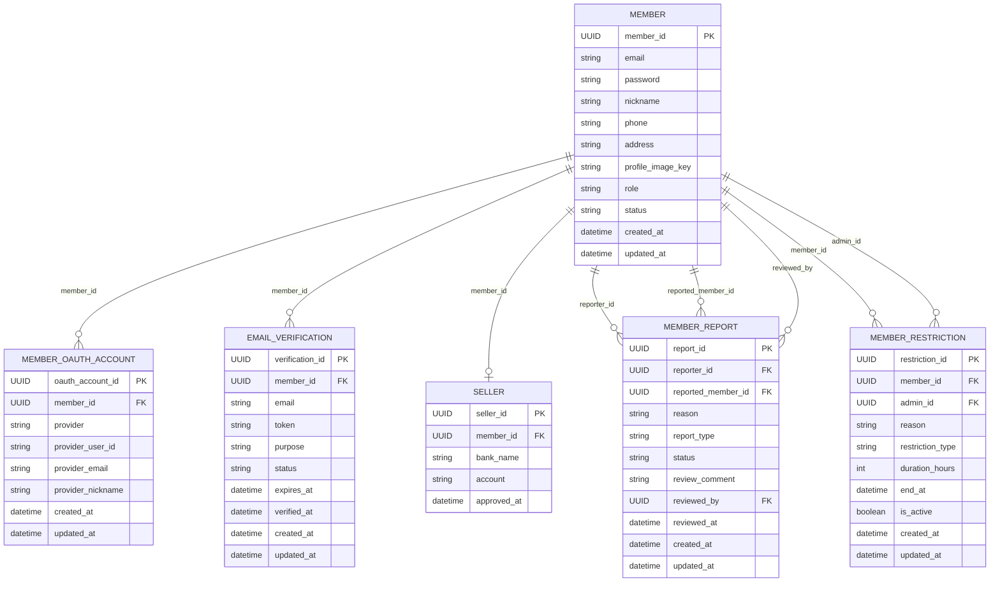

# Member Service

## 목차

- [1. 개요](#1-개요)
- [2. 서비스 책임 경계](#2-서비스-책임-경계)
- [3. 도메인 패키지 문서](#3-도메인-패키지-문서)
- [4. 도메인 관계 다이어그램](#4-도메인-관계-다이어그램)
- [5. 패키지 간 주요 흐름](#5-패키지-간-주요-흐름)
- [6. 관련 문서](#6-관련-문서)

---

## 1. 개요

Member Service는 회원 계정, 인증 세션, 이메일/계좌 검증, 판매자 전환, 신고, 제재를 담당한다.

이 문서는 기존 링크 호환을 위한 허브 문서다. 패키지별 상세 내용은 [member/README.md](member/README.md)를 기준으로 본다.

---

## 2. 서비스 책임 경계

| 영역 | 비고 |
|---|---|
| 회원 기본 정보, 역할, 상태 | `member` package |
| 로그인, 토큰, 세션, OAuth | `auth` package |
| 이메일 인증, 계좌 인증 | `verification` package |
| 판매자 등록/전환 | `seller` package |
| 회원 신고/제재 | `report`, `restriction` package |

---

## 3. 도메인 패키지 문서

| 패키지 | 문서 | 책임 |
|---|---|---|
| `member` | [member/member.md](member/member.md) | 회원 기본 정보, 회원가입, 프로필, 탈퇴 |
| `auth` | [member/auth.md](member/auth.md) | 로그인, 토큰, 세션, OAuth, 비밀번호 재설정 |
| `verification` | [member/verification.md](member/verification.md) | 이메일 인증, 계좌 인증 |
| `seller` | [member/seller.md](member/seller.md) | 판매자 등록, 계좌 인증 후 판매자 전환, 판매자 등록 draft |
| `report` | [member/report.md](member/report.md) | 회원 신고 |
| `restriction` | [member/restriction.md](member/restriction.md) | 회원 제재 |
| `common` | [member/common.md](member/common.md) | 공통 설정, 응답, 예외, Kafka topic, 인증 컨텍스트 |

---

## 4. 도메인 관계 다이어그램

이 다이어그램은 Member Service가 소유한 주요 영속 엔티티의 논리 FK 관계를 표현한다. 현재 코드에서는 JPA 연관관계(`@ManyToOne`) 대신 `member_id`, `reporter_id`, `admin_id` 같은 UUID 컬럼으로 참조를 관리한다.

`SellerDraft`, 계좌 인증 세션, 로그인 세션, refresh token, blacklist는 Redis 상태이므로 위 영속 엔티티 ERD에는 포함하지 않는다. Payment Service의 wallet, 현재 예치금 잔액, 거래 이력과 Settlement Service의 정산 데이터도 Member Service 소유 엔티티가 아니다.

---

## 5. 패키지 간 주요 흐름

- 회원가입: `member` -> `verification` -> `member` event publish
- 로그인: `auth` -> `member` lookup -> `restriction` check -> Redis session/token 저장
- 판매자 전환: `seller` -> `verification` -> `seller` promotion -> `member` role 변경
- 회원 탈퇴: `member` -> 외부 서비스 잔여 상태 조회 -> `member` status 변경 -> `auth` session/token 정리

---

## 6. 관련 문서

- [member/README.md](member/README.md)
- [../02-architecture.md](../02-architecture.md)
- [../04-request-flow.md](../04-request-flow.md)
- [../05-event-strategy.md](../05-event-strategy.md)
- [../06-auth-flow.md](../06-auth-flow.md)
- [../08-deployment.md](../08-deployment.md)