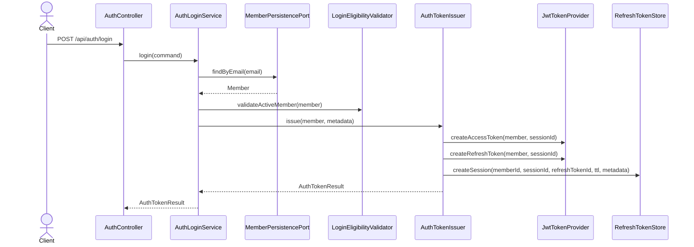
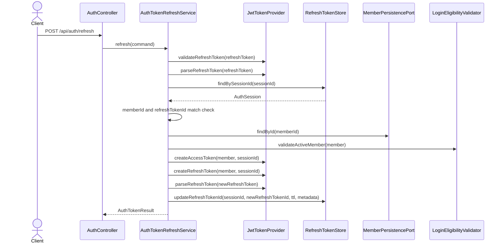
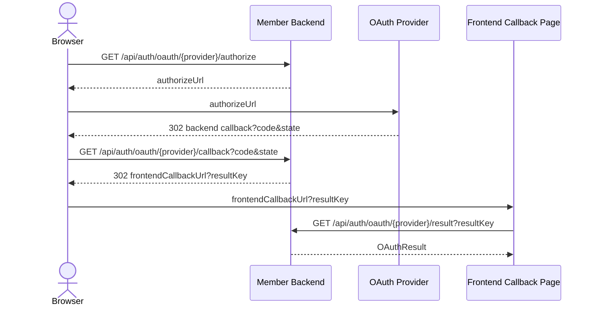

# Auth Package

## 1. Scope

`service/member`의 `auth` 패키지는 로그인, 토큰 발급/갱신, 세션 관리, OAuth 로그인, 비밀번호 재설정을 담당한다.

주요 책임:

- Email/password login
- Access token / refresh token 발급
- Refresh token rotation
- Redis session whitelist 관리
- 현재 세션, 특정 세션, 전체 세션 로그아웃
- Kakao / Google OAuth login
- Password reset token 관리

## 2. Authentication Model

현재 인증 모델은 `session whitelist` 기반이다.

Access token은 JWT 형식이지만, Gateway는 JWT 서명/만료만 보지 않는다. Access token의 `sessionId`를 Redis의 `auth:session:{sessionId}`와 대조한다. 따라서 세션이 Redis에서 삭제되면 해당 `sessionId`를 가진 access token은 만료 전이라도 Gateway에서 거부된다.

Access token 주요 claim:

| Claim | Description |
|---|---|
| `jti` | Access token id |
| `memberId` | Member id |
| `sessionId` | Login session id |
| `email` | Member email |
| `role` | Member role |
| `tokenType` | `ACCESS` |
| `exp` | Access token expiration |

Refresh token 주요 claim:

| Claim | Description |
|---|---|
| `jti` | Refresh token id |
| `memberId` | Member id |
| `sessionId` | Login session id |
| `tokenType` | `REFRESH` |
| `exp` | Refresh token expiration |

## 3. Gateway Validation

Gateway의 `GatewayJwtValidator`는 보호 API 요청에서 access token을 다음 순서로 검증한다.

1. JWT issuer, signature, expiration 검증
2. `tokenType == ACCESS` 확인
3. `memberId`, `sessionId`, `role`, `jti` claim 존재 확인
4. Redis `auth:session:{sessionId}` 조회
5. Redis session의 `memberId`와 token의 `memberId` 일치 확인
6. Gateway role rule 확인
7. downstream service에 `X-Member-Id`, `X-Member-Role`, `X-Session-Id` header 주입

Gateway는 더 이상 `auth:blacklist:*` key를 조회하지 않는다.

관련 클래스:

| Class | Responsibility |
|---|---|
| `GatewayJwtValidator` | JWT 및 Redis session whitelist 검증 |
| `SessionWhitelistStore` | Gateway session whitelist 조회 port |
| `RedisSessionWhitelistStore` | `auth:session:{sessionId}` Redis 조회 구현 |
| `JwtAuthenticationFilter` | 공개 API 제외, 인증/인가 처리, downstream header 주입 |

## 4. Redis State

### 4.1 Login Session

`RedisRefreshTokenStore`가 refresh token rotation 상태와 login session metadata를 저장한다.

| Redis key | Type | TTL | Description |
|---|---|---|---|
| `auth:session:{sessionId}` | hash | refresh token TTL | 단일 로그인 세션 |
| `auth:member-sessions:{memberId}` | set | refresh token TTL | 회원별 sessionId 목록 |

`auth:session:{sessionId}` fields:

| Field | Type | Description |
|---|---|---|
| `memberId` | UUID | Session owner |
| `sessionId` | UUID | Session id |
| `refreshTokenId` | String | 현재 유효한 refresh token id |
| `createdAt` | Instant | Session created time |
| `lastAccessedAt` | Instant | Last access/refresh time |
| `lastRefreshedAt` | Instant | Last refresh token rotation time |
| `userAgent` | String | Login/refresh request user-agent |
| `ipAddress` | String | Login/refresh request IP |

### 4.2 Token Blacklist

`auth:blacklist:access:{accessTokenId}`와 `auth:blacklist:session:{sessionId}`는 더 이상 사용하지 않는다.

이전 blacklist 방식은 token/session 무효 상태를 Redis에 저장하고 Gateway가 매 요청 조회하는 구조였다. 현재는 Gateway가 `auth:session:{sessionId}` whitelist를 확인하므로, session 삭제가 access token 무효화 기준이다.

운영 Redis에 과거 `auth:blacklist:*` key가 남아 있어도 현재 코드에서는 조회하지 않으며 TTL 이후 자연 만료된다.

### 4.3 OAuth State / Result

OAuth flow의 일회성 state와 callback 결과는 provider별 Redis key로 저장한다.

| Redis key | Type | Default TTL | Description |
|---|---|---|---|
| `oauth:{provider}:state:{state}` | hash | 10m | OAuth callback state 검증 |
| `oauth:{provider}:result:{resultKey}` | hash | 3m | Frontend가 조회할 OAuth callback 결과 |

지원 provider:

- `KAKAO`
- `GOOGLE`
- `NAVER` enum은 존재하지만 현재 profile service 구현은 없다.

### 4.4 Password Reset

| Redis key | Type | Default TTL | Description |
|---|---|---|---|
| `auth:password-reset:{token}` | hash | 30m | Password reset request token |

## 5. Login Flow



로그인 성공 시:

- 새 `sessionId`를 생성한다.
- access token과 refresh token을 발급한다.
- refresh token의 `jti`를 `auth:session:{sessionId}.refreshTokenId`로 저장한다.
- `auth:member-sessions:{memberId}`에 `sessionId`를 추가한다.

## 6. Refresh Token Rotation



검증 규칙:

| Condition | Result |
|---|---|
| Refresh token signature/expiration/type invalid | `InvalidTokenException` |
| Redis session missing | `RefreshTokenNotFoundException` |
| Redis session memberId != token memberId | `InvalidTokenException` |
| Redis session refreshTokenId != token jti | 모든 세션 삭제 후 `InvalidTokenException` |
| Member inactive/restricted | 로그인 제한 예외 |

## 7. Refresh Token Reuse Detection

Refresh token은 rotation 방식으로 운영한다. 정상 refresh 요청이 성공하면 새 refresh token이 발급되고, Redis session의 `refreshTokenId`가 새 token의 `jti`로 갱신된다.

이후 이전 refresh token이 다시 사용되면 다음 조건이 발생한다.

```text
auth:session:{sessionId}.refreshTokenId != requestRefreshToken.jti
```

이는 refresh token 재사용 또는 탈취 의심 이벤트로 처리한다.

현재 정책:

1. 요청 refresh token의 `memberId`를 기준으로 `deleteAllSessions(memberId)` 실행
2. 해당 member의 모든 `auth:session:{sessionId}` 삭제
3. `auth:member-sessions:{memberId}` 삭제
4. `InvalidTokenException` 반환
5. 기존 access token도 Gateway session whitelist 검증에서 거부됨

## 8. Logout Flow

Session whitelist 모델에서는 logout 시 blacklist를 저장하지 않는다. 세션 삭제만 수행한다.

| API | Behavior |
|---|---|
| `POST /api/auth/logout/current` | 현재 access token의 `sessionId` 세션 삭제 |
| `POST /api/auth/logout/all` | 현재 member의 모든 세션 삭제 |
| `DELETE /api/auth/sessions/{sessionId}` | 현재 member의 특정 세션 삭제 |
| `GET /api/auth/sessions` | 현재 member의 활성 세션 목록 조회 |

세션 삭제 이후:

- 같은 sessionId를 가진 access token은 Gateway에서 거부된다.
- 같은 sessionId를 가진 refresh token은 member-service refresh 단계에서 `RefreshTokenNotFoundException`이 된다.

## 9. OAuth Flow

Kakao와 Google OAuth는 backend callback 방식을 사용한다.



중요한 redirect URI 기준:

- OAuth provider console에 등록할 redirect URI는 backend callback URI다.
- 로컬 Google 예시: `http://localhost:8080/api/auth/oauth/google/callback`
- 프론트 callback URL은 backend가 OAuth 처리 후 browser를 돌려보내는 application URL이다.

Public OAuth endpoints:

| Provider | Endpoint |
|---|---|
| Kakao | `/api/auth/oauth/kakao/authorize` |
| Kakao | `/api/auth/oauth/kakao/callback` |
| Kakao | `/api/auth/oauth/kakao/result` |
| Google | `/api/auth/oauth/google/authorize` |
| Google | `/api/auth/oauth/google/callback` |
| Google | `/api/auth/oauth/google/result` |

## 10. Main Classes

| Class | Responsibility |
|---|---|
| `AuthController` | Login, refresh, session/logout API |
| `AuthLoginService` | Email/password login orchestration |
| `AuthTokenIssuer` | Token 발급 및 Redis session 생성 |
| `AuthTokenRefreshService` | Refresh token 검증, rotation, reuse 감지 |
| `AuthSessionService` | Session list/logout 처리 |
| `RedisRefreshTokenStore` | `auth:session:*`, `auth:member-sessions:*` 저장소 |
| `JwtTokenProvider` | Access/refresh JWT 생성 및 parsing |
| `OAuthFacade` | Provider별 OAuth callback/result orchestration |
| `OAuthLoginSignupService` | OAuth profile 기반 login/signup |
| `OAuthStateService` | OAuth state/result Redis 관리 |
| `PasswordResetService` | Password reset token 생성/확인 |

Gateway 관련:

| Class | Responsibility |
|---|---|
| `JwtAuthenticationFilter` | Gateway 인증/인가 필터 |
| `GatewayJwtValidator` | Access token 및 session whitelist 검증 |
| `RedisSessionWhitelistStore` | Gateway에서 Redis session whitelist 조회 |

## 11. Removed Model

다음 구성은 session whitelist 전환으로 제거되었다.

- member-service `TokenBlacklistStore`
- member-service `RedisTokenBlacklistStore`
- gateway `TokenBlacklistStore`
- gateway `RedisTokenBlacklistStore`
- `auth:blacklist:access:{accessTokenId}` 검증
- `auth:blacklist:session:{sessionId}` 검증

로그아웃과 강제 로그아웃은 Redis session 삭제로 표현한다.
