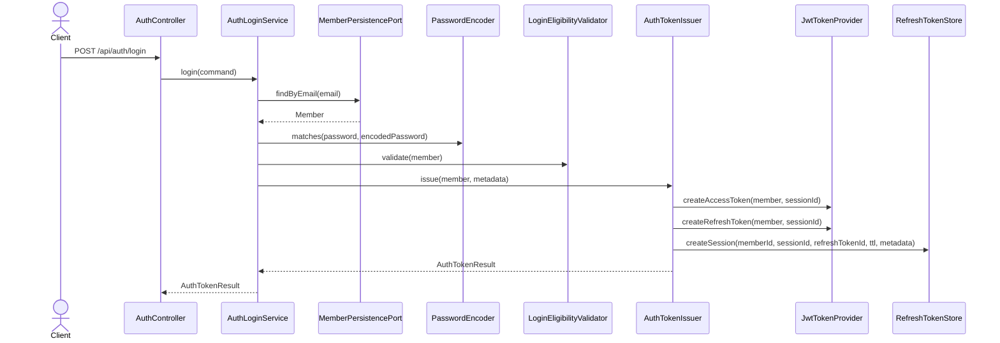
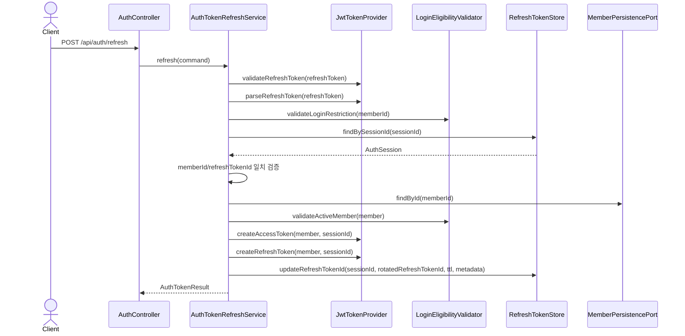
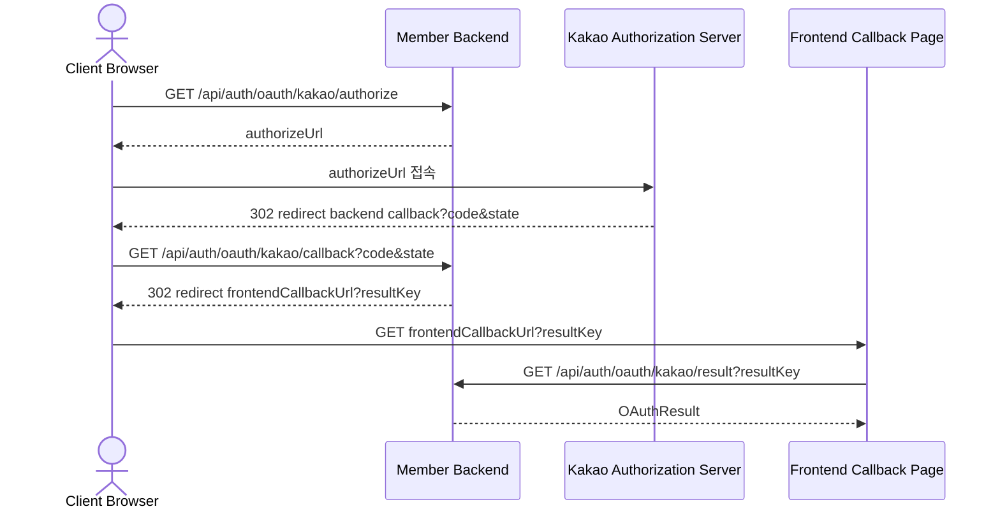
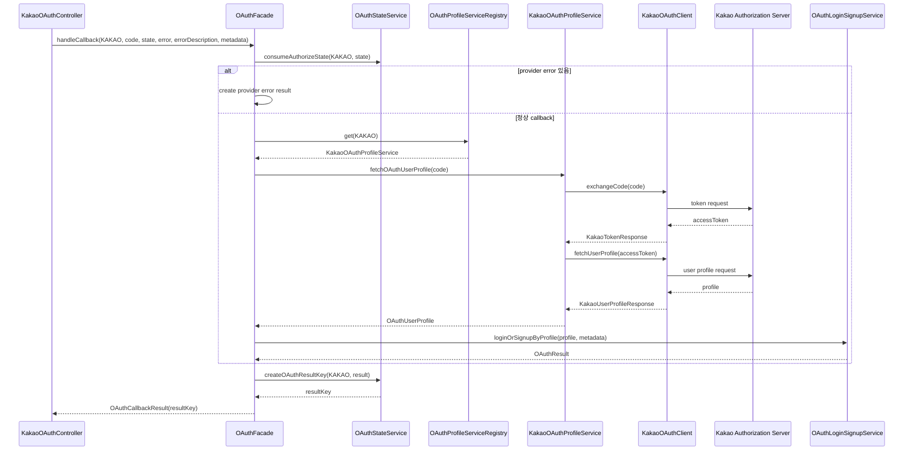
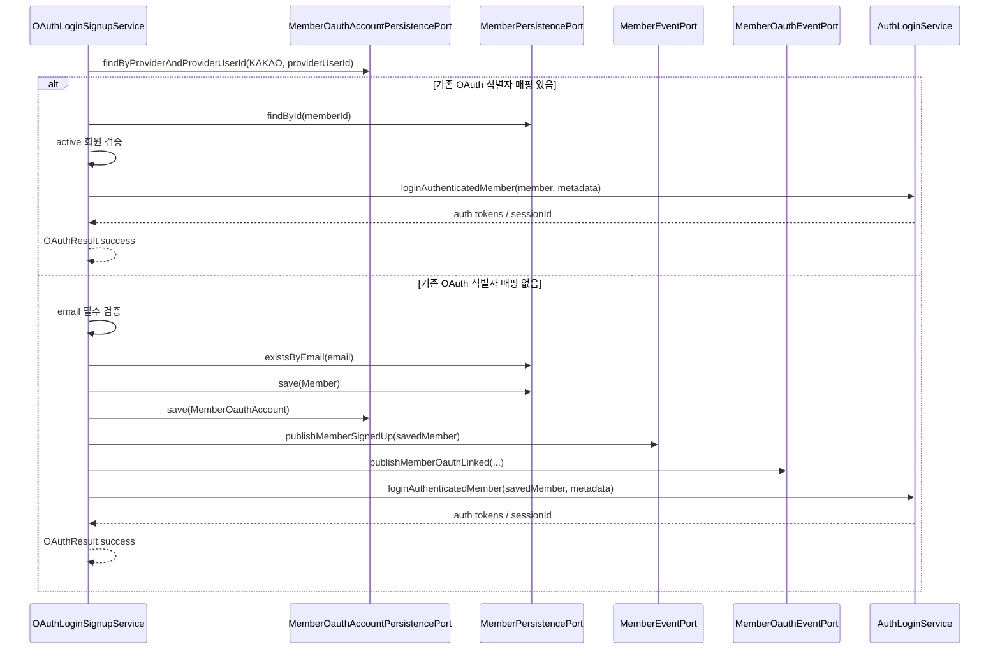
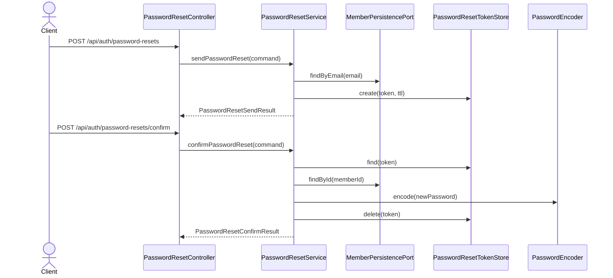

# Auth Package

## 목차

- [1. 책임](#1-책임)
- [2. 도메인 모델](#2-도메인-모델)
  - [2.1 `MemberOauthAccount`](#21-memberoauthaccount)
  - [2.2 `OAuthProvider`](#22-oauthprovider)
  - [2.3 제약과 주의사항](#23-제약과-주의사항)
- [3. Redis 상태](#3-redis-상태)
  - [3.1 인증 세션](#31-인증-세션)
  - [3.2 토큰 블랙리스트](#32-토큰-블랙리스트)
  - [3.3 OAuth 임시 상태](#33-oauth-임시-상태)
  - [3.4 비밀번호 재설정 토큰](#34-비밀번호-재설정-토큰)
  - [3.5 Redis 상태 주의사항](#35-redis-상태-주의사항)
- [4. 주요 서비스](#4-주요-서비스)
- [5. 포트](#5-포트)
- [6. 인프라 어댑터](#6-인프라-어댑터)
- [7. 주요 흐름](#7-주요-흐름)
  - [7.1 로그인](#71-로그인)
  - [7.2 토큰 재발급](#72-토큰-재발급)
  - [7.3 Kakao OAuth 로그인](#73-kakao-oauth-로그인)
  - [7.4 비밀번호 재설정](#74-비밀번호-재설정)
- [8. 관련 파일](#8-관련-파일)

---

## 1. 책임

`auth` 패키지는 인증과 세션 상태를 관리한다.

주요 책임:

- 이메일/비밀번호 로그인
- access token / refresh token 발급
- refresh token rotation
- 세션 조회
- 현재 세션 로그아웃
- 전체 세션 로그아웃
- access token / session blacklist 관리
- Kakao OAuth 로그인/회원가입
- 비밀번호 재설정

---

## 2. 도메인 모델

### 2.1 `MemberOauthAccount`

`MemberOauthAccount`는 OAuth provider 계정과 회원을 연결하는 로그인 식별자 매핑 엔티티다.

| 필드 | 타입 | 필수 | 설명 |
|---|---|---|---|
| `oauthAccountId` | `UUID` | Y | OAuth 식별자 매핑 식별자 |
| `memberId` | `UUID` | Y | OAuth 로그인으로 식별되는 회원 식별자 |
| `provider` | `OAuthProvider` | Y | OAuth provider |
| `providerUserId` | `String` | Y | provider가 제공하는 사용자 식별자 |
| `providerEmail` | `String` | N | provider가 제공하는 이메일 |
| `providerNickname` | `String` | N | provider가 제공하는 닉네임 |
| `createdAt` | `LocalDateTime` | Y | 생성 시각 |
| `updatedAt` | `LocalDateTime` | Y | 수정 시각 |

제약:

| 제약 | 의미 |
|---|---|
| `uq_member_oauth_provider_user` | 같은 provider의 같은 provider user는 하나의 회원에만 매핑 가능 |
| `uq_member_oauth_member_provider` | 한 회원은 같은 provider 로그인 식별자를 하나만 보유 가능 |

주요 생성 메서드:

| 메서드 | 역할 |
|---|---|
| `create(...)` | OAuth 식별자 매핑 엔티티 생성 |

### 2.2 `OAuthProvider`

| 값 | 의미 |
|---|---|
| `KAKAO` | Kakao OAuth provider. 현재 구현됨 |
| `GOOGLE` | Google OAuth provider. 현재 구현됨 |
| `NAVER` | Naver OAuth provider. 확장 예정 |

현재 auth 패키지의 OAuth provider enum은 `KAKAO`, `GOOGLE`, `NAVER`를 포함한다. 실제 profile service 구현은 현재 `KAKAO`, `GOOGLE`이 등록되어 있으며, Naver는 provider별 client와 profile service 추가가 필요하다.

### 2.3 제약과 주의사항

- `MemberOauthAccount`는 현재 JPA annotation을 포함하고 있지만, TODO에 따라 장기적으로 persistence mapping과 domain model 분리가 필요하다.
- `memberId`는 `Member`를 논리적으로 참조하지만 JPA 연관관계로 매핑되어 있지는 않다.
- OAuth 로그인 과정의 임시 state/result는 DB가 아니라 Redis에 저장된다.
- OAuth 식별자 매핑 조회/삭제 API는 요구사항에서 제외되어 현재 외부 API로 제공하지 않는다.

---

## 3. Redis 상태

### 3.1 인증 세션

로그인 세션과 refresh token rotation 상태는 `RedisRefreshTokenStore`가 Redis에 저장한다.

| Redis key | 자료구조 | TTL | 설명 |
|---|---|---|---|
| `auth:session:{sessionId}` | hash | refresh token 만료 시간 | 단일 로그인 세션 메타데이터 |
| `auth:member-sessions:{memberId}` | set | refresh token 만료 시간 | 회원별 sessionId 목록 |

`auth:session:{sessionId}` fields:

| 필드 | 타입 | 설명 |
|---|---|---|
| `memberId` | `UUID` | 회원 식별자 |
| `sessionId` | `UUID` | 세션 식별자 |
| `refreshTokenId` | `String` | 현재 유효한 refresh token id |
| `createdAt` | `Instant` | 세션 생성 시각 |
| `lastAccessedAt` | `Instant` | 마지막 접근 시각 |
| `lastRefreshedAt` | `Instant` | 마지막 refresh token rotation 시각 |
| `userAgent` | `String` | 로그인/갱신 요청 user-agent |
| `ipAddress` | `String` | 로그인/갱신 요청 IP |

관련 Redis 조회 모델:

| record | 역할 |
|---|---|
| `AuthSession` | `auth:session:{sessionId}` hash를 application에서 다루는 조회 모델 |

### 3.2 토큰 블랙리스트

로그아웃 또는 세션 무효화 시 access token blacklist를 저장한다.

| Redis key | 자료구조 | TTL | 상태 | 설명 |
|---|---|---|---|---|
| `auth:blacklist:access:{accessTokenId}` | string | access token 잔여 만료 시간 | 사용 중 | 특정 access token 무효화 |
| `auth:blacklist:session:{sessionId}` | string | session 잔여 만료 시간 | 미사용, 삭제 예정 | 현재 검증 경로에서 사용되지 않는 session blacklist |

저장 값은 `1`이며, access token blacklist는 key 존재 여부로 무효화 여부를 판단한다.

`auth:blacklist:session:{sessionId}`는 현재 로그아웃 시 저장되지만 검증 경로에서 사용되지 않는다. `auth:session:{sessionId}` whitelist 검증으로 대체하는 방향이며, 추후 코드에서 제거할 예정이다.

### 3.3 OAuth 임시 상태

OAuth flow의 state와 frontend 전달 결과는 `RedisOAuthAuthorizeStateStore`가 provider별 Redis key로 저장한다.

| Redis key | 자료구조 | TTL 설정 | 설명 |
|---|---|---|---|
| `oauth:{provider}:state:{state}` | hash | provider별 `state-ttl`, 기본 `10m` | authorize callback 검증 |
| `oauth:{provider}:result:{resultKey}` | hash | provider별 `result-ttl`, 기본 `3m` | OAuth callback 결과를 frontend가 조회하기 위한 임시 결과 |

`oauth:{provider}:state:{state}` fields:

| 필드 | 타입 | 설명 |
|---|---|---|
| `createdAt` | `Instant` | state 생성 시각 |

`oauth:{provider}:result:{resultKey}` 주요 fields:

| 필드 | 타입 | 설명 |
|---|---|---|
| `status` | `OAuthResultStatus` | OAuth 처리 결과 상태 |
| `linkRequired` | `boolean` | 1차 호환 필드, 현재 항상 `false` |
| `linkToken` | `String` | 1차 호환 필드, 현재 항상 `null` |
| `provider` | `String` | OAuth provider |
| `providerUserId` | `String` | provider 사용자 식별자 |
| `email` | `String` | provider 이메일 |
| `nickname` | `String` | provider 닉네임 |
| `accessToken` | `String` | 로그인 성공 시 발급된 access token |
| `refreshToken` | `String` | 로그인 성공 시 발급된 refresh token |
| `sessionId` | `UUID` | 로그인 세션 식별자 |
| `tokenType` | `String` | token type |
| `accessTokenExpiresIn` | `long` | access token 만료 초 |
| `refreshTokenExpiresIn` | `long` | refresh token 만료 초 |
| `errorCode` | `String` | 실패 코드 |
| `errorMessage` | `String` | 실패 메시지 |

### 3.4 비밀번호 재설정 토큰

비밀번호 재설정 요청 검증 토큰은 `RedisPasswordResetTokenStore`가 Redis에 저장한다.

| Redis key | 자료구조 | TTL 설정 | 설명 |
|---|---|---|---|
| `auth:password-reset:{token}` | hash | `member.password-reset.expiration`, 기본 `30m` | 비밀번호 재설정 요청 검증 토큰 |

`auth:password-reset:{token}` fields:

| 필드 | 타입 | 설명 |
|---|---|---|
| `memberId` | `UUID` | 비밀번호를 재설정할 회원 식별자 |
| `email` | `String` | 요청 이메일 |
| `createdAt` | `Instant` | token 생성 시각 |

### 3.5 Redis 상태 주의사항

- Redis 상태는 인증 flow의 임시 상태이며, 회원 원본 데이터는 DB의 `Member`와 `MemberOauthAccount`가 소유한다.
- refresh token rotation은 `auth:session:{sessionId}`의 `refreshTokenId`를 갱신하는 방식으로 처리한다.
- `consumeAuthorizeState(...)`, `consumeOAuthResult(...)`는 조회 후 Redis key를 삭제한다.
- access token blacklist와 session blacklist는 key 존재 여부로 무효화 여부를 판단한다.

---
## 4. 주요 서비스

| 클래스 | 책임 | 파일 |
|---|---|---|
| `AuthLoginService` | 이메일/비밀번호 로그인과 인증된 회원 로그인 흐름 조율 | [AuthLoginService.java](C:/my_project/GoodsMall_BE/service/member/src/main/java/com/example/member/auth/application/service/session/AuthLoginService.java) |
| `AuthTokenIssuer` | access/refresh token 발급과 Redis 세션 생성 | [AuthTokenIssuer.java](C:/my_project/GoodsMall_BE/service/member/src/main/java/com/example/member/auth/application/service/session/AuthTokenIssuer.java) |
| `AuthTokenRefreshService` | refresh token 검증, rotation, 신규 access/refresh token 발급 | [AuthTokenRefreshService.java](C:/my_project/GoodsMall_BE/service/member/src/main/java/com/example/member/auth/application/service/session/AuthTokenRefreshService.java) |
| `AuthSessionService` | 현재 세션, 특정 세션, 전체 세션 로그아웃과 세션 목록 조회 | [AuthSessionService.java](C:/my_project/GoodsMall_BE/service/member/src/main/java/com/example/member/auth/application/service/session/AuthSessionService.java) |
| `LoginEligibilityValidator` | 로그인 가능한 회원 상태 검증 | [LoginEligibilityValidator.java](C:/my_project/GoodsMall_BE/service/member/src/main/java/com/example/member/auth/application/service/session/LoginEligibilityValidator.java) |
| `OAuthFacade` | provider별 OAuth controller의 공통 진입점. authorize URL 생성, callback 처리, result 조회 조율 | [OAuthFacade.java](C:/my_project/GoodsMall_BE/service/member/src/main/java/com/example/member/auth/application/service/oauth/OAuthFacade.java) |
| `OAuthLoginSignupService` | OAuth profile 기반 기존 회원 로그인과 신규 회원가입 단일 흐름 처리 | [OAuthLoginSignupService.java](C:/my_project/GoodsMall_BE/service/member/src/main/java/com/example/member/auth/application/service/oauth/OAuthLoginSignupService.java) |
| `OAuthStateService` | provider별 OAuth state/result Redis 상태 생성과 소비 | [OAuthStateService.java](C:/my_project/GoodsMall_BE/service/member/src/main/java/com/example/member/auth/application/service/oauth/OAuthStateService.java) |
| `OAuthProviderPropertiesRegistry` | `OAuthProvider` 기준 provider별 OAuth 설정 조회 | [OAuthProviderPropertiesRegistry.java](C:/my_project/GoodsMall_BE/service/member/src/main/java/com/example/member/auth/application/service/oauth/OAuthProviderPropertiesRegistry.java) |
| `OAuthErrorResultMapper` | OAuth callback 처리 중 발생한 예외를 frontend 전달용 error result로 변환 | [OAuthErrorResultMapper.java](C:/my_project/GoodsMall_BE/service/member/src/main/java/com/example/member/auth/application/service/oauth/OAuthErrorResultMapper.java) |
| `OAuthProfileService` | provider별 authorize URL 생성과 OAuth profile 조회 계약 | [OAuthProfileService.java](C:/my_project/GoodsMall_BE/service/member/src/main/java/com/example/member/auth/application/service/oauth/profile/OAuthProfileService.java) |
| `OAuthProfileServiceRegistry` | `OAuthProvider` 기준 provider별 `OAuthProfileService` 구현체 선택 | [OAuthProfileServiceRegistry.java](C:/my_project/GoodsMall_BE/service/member/src/main/java/com/example/member/auth/application/service/oauth/profile/OAuthProfileServiceRegistry.java) |
| `KakaoOAuthProfileService` | Kakao authorize URL 생성, token 교환, profile 조회 | [KakaoOAuthProfileService.java](C:/my_project/GoodsMall_BE/service/member/src/main/java/com/example/member/auth/application/service/oauth/profile/KakaoOAuthProfileService.java) |
| `GoogleOAuthProfileService` | Google authorize URL 생성, token 교환, profile 조회 | [GoogleOAuthProfileService.java](C:/my_project/GoodsMall_BE/service/member/src/main/java/com/example/member/auth/application/service/oauth/profile/GoogleOAuthProfileService.java) |
| `PasswordResetService` | 비밀번호 재설정 메일 발송과 재설정 확정 | [PasswordResetService.java](C:/my_project/GoodsMall_BE/service/member/src/main/java/com/example/member/auth/application/service/password/PasswordResetService.java) |
---

## 5. 포트

| 포트 | 방향 | 설명 |
|---|---|---|
| `AuthLoginUsecase` | in | 로그인 유스케이스 |
| `AuthTokenRefreshUsecase` | in | 토큰 재발급 유스케이스 |
| `AuthSessionUsecase` | in | 세션 관리 유스케이스 |
| `MemberOauthAccountPersistencePort` | out | OAuth 계정 저장소 접근 |
| `MemberOauthEventPort` | out | OAuth 식별자 매핑 이벤트 발행 |

---

## 6. 인프라 어댑터

| 어댑터 | 설명 |
|---|---|
| `JwtTokenProvider` | JWT 생성/검증 보조 |
| `RedisRefreshTokenStore` | refresh token과 session 저장 |
| `RedisTokenBlacklistStore` | token/session blacklist 저장 |
| `RedisOAuthAuthorizeStateStore` | provider별 OAuth state/result 저장 |
| `RedisPasswordResetTokenStore` | 비밀번호 재설정 토큰 저장 |
| `KakaoOAuthClient` | Kakao OAuth API 호출 |
| `MemberOauthAccountJpaAdapter` | OAuth 계정 JPA 저장소 adapter |
| `MemberOauthEventKafkaProducer` | OAuth 식별자 매핑 이벤트 Kafka 발행 |

---

## 7. 주요 흐름

`auth` 패키지의 주요 흐름은 인증 토큰 발급, refresh token 재발급, OAuth 로그인/회원가입, 비밀번호 재설정을 중심으로 표현한다.

### 7.1 로그인

이메일/비밀번호 로그인은 회원 검증 후 access token, refresh token, Redis 세션을 생성한다.

| 단계 | 책임 | 설명 |
|---|---|---|
| 1 | `AuthController` | `LoginRequest`를 `LoginCommand`로 변환하고 세션 메타데이터를 추출한다. |
| 2 | `AuthLoginService` | 요청 본문과 이메일/비밀번호 필수값을 검증한다. |
| 3 | `MemberPersistencePort` | 이메일로 회원을 조회한다. |
| 4 | `PasswordEncoder` | 요청 비밀번호와 저장 비밀번호를 비교한다. |
| 5 | `LoginEligibilityValidator` | 회원 상태와 로그인 제한 여부를 검증한다. |
| 6 | `AuthTokenIssuer` | 새 `sessionId`를 생성하고 access/refresh token을 발급한다. |
| 7 | `RefreshTokenStore` | `auth:session:{sessionId}`, `auth:member-sessions:{memberId}`를 저장한다. |

| 실패 조건 | 결과 |
|---|---|
| 요청 본문 없음 | `IllegalArgumentException` |
| 이메일/비밀번호 누락 | `IllegalArgumentException` |
| 회원 없음 또는 비밀번호 불일치 | `InvalidLoginException` |
| 비활성/제재/탈퇴 회원 | 로그인 제한 예외 |

### 7.2 토큰 재발급

토큰 재발급은 refresh token을 검증하고 Redis 세션의 `refreshTokenId`를 rotation한다.

| 단계 | 책임 | 설명 |
|---|---|---|
| 1 | `AuthController` | `TokenRefreshRequest`를 `TokenRefreshCommand`로 변환한다. |
| 2 | `JwtTokenProvider` | refresh token 서명, 만료, token type을 검증한다. |
| 3 | `AuthTokenRefreshService` | refresh token에서 `memberId`, `sessionId`, `refreshTokenId`를 추출한다. |
| 4 | `RefreshTokenStore` | `auth:session:{sessionId}`를 조회한다. |
| 5 | `AuthTokenRefreshService` | Redis의 `memberId`, `refreshTokenId`와 JWT 값을 비교한다. |
| 6 | `MemberPersistencePort` | 회원을 조회한다. |
| 7 | `LoginEligibilityValidator` | active 회원인지 검증한다. |
| 8 | `RefreshTokenStore` | 새 refresh token id로 세션을 갱신한다. |

| 실패 조건 | 결과 |
|---|---|
| 요청 본문 없음 | `IllegalArgumentException` |
| refresh token 누락 | `IllegalArgumentException` |
| refresh token 위조/만료/type 불일치 | `InvalidTokenException` |
| Redis 세션 없음 | `RefreshTokenNotFoundException` |
| refresh token id 불일치 | 세션 삭제 후 `InvalidTokenException` |

### 7.3 Kakao OAuth 로그인

Kakao/Google OAuth 로그인은 `OAuthFacade`를 진입점으로 사용하고, 기존 OAuth 식별자 매핑 로그인과 신규 OAuth 회원가입을 단일 흐름으로 처리한다. 현재는 기존 callback/resultKey API를 유지하므로 callback 결과는 Redis에 저장되고 frontend가 `resultKey`로 재조회한다.

현재 정책:

| 조건 | 처리 |
|---|---|
| `provider + providerUserId`에 해당하는 기존 OAuth 식별자 매핑 있음 | 해당 회원으로 로그인하고 token/session을 발급한다. |
| 기존 OAuth 식별자 매핑 없음 + Kakao email 있음 | 신규 회원을 `ACTIVE` 상태로 생성하고 `MemberOauthAccount`를 저장한 뒤 token/session을 발급한다. |
| 기존 OAuth 식별자 매핑 없음 + Kakao email 없음 | 신규 OAuth 회원가입을 실패 처리한다. |
| Kakao email이 기존 회원 email과 중복 | 자동 연결하지 않고 신규 OAuth 회원가입을 실패 처리한다. |

주의사항:

| 항목 | 내용 |
|---|---|
| 외부 OAuth 계정 관리 | 요구사항에서 제외되어 조회/연결/해제 API를 제공하지 않는다. |
| email 정책 | 기존 OAuth 계정 로그인은 `providerUserId`로 식별하므로 email 재제공을 필수로 보지 않는다. 신규 OAuth 회원가입에는 email이 필수다. |
| password 정책 | DB 스키마 변경을 피하기 위해 OAuth 신규 회원에도 랜덤 비밀번호를 암호화해 저장한다. 장기적으로 credential 분리를 검토한다. |
| result Redis | 기존 callback UX 호환을 위해 유지한다. 추후 `POST /api/auth/oauth/{provider}/login` 방식으로 전환하면 제거 또는 축소할 수 있다. |

#### 7.3.1 전체 외부 흐름

브라우저, Kakao Authorization Server, backend, frontend 사이의 redirect와 result 조회 흐름만 표현한다.

#### 7.3.2 Callback 내부 처리

backend callback에서 state 검증, provider error 처리, Kakao profile 조회, result 저장까지의 서버 내부 흐름을 표현한다.

#### 7.3.3 로그인/회원가입 분기

`OAuthLoginSignupService`가 OAuth profile을 기준으로 기존 회원 로그인과 신규 회원가입을 선택하는 비즈니스 흐름을 표현한다.

| 흐름 | 책임 | 설명 |
|---|---|---|
| 전체 외부 흐름 | `KakaoOAuthController` / browser / Kakao / frontend | authorize URL 요청, Kakao 인증, backend callback, frontend callback, result 조회 순서를 표현한다. |
| Callback 내부 처리 | `OAuthFacade` / `OAuthStateService` / `KakaoOAuthProfileService` / `KakaoOAuthClient` | state 소비, provider error 처리, Kakao token/profile 조회, `OAuthUserProfile` 변환, result 저장을 조율한다. |
| 로그인/회원가입 분기 | `OAuthLoginSignupService` / `MemberPersistencePort` / `MemberOauthAccountPersistencePort` / `AuthLoginService` | 기존 OAuth 매핑 로그인 또는 신규 회원가입을 처리하고 token과 Redis 세션을 발급한다. |
| 이벤트 발행 | `MemberEventPort` / `MemberOauthEventPort` | 신규 OAuth 회원가입 시 일반 회원가입 이벤트와 OAuth 식별자 매핑 이벤트를 발행한다. |

| 실패 조건 | 결과 |
|---|---|
| state 없음/만료 | `OAuthErrorResultMapper`가 OAuth error result로 변환 |
| provider error | `OAuthErrorResultMapper`가 OAuth error result로 변환 |
| Kakao email 미제공 | `KAKAO_OAUTH_EMAIL_REQUIRED` error result |
| Kakao email이 기존 회원 email과 중복 | `KAKAO_OAUTH_EMAIL_ALREADY_REGISTERED` error result |
| 기존 회원 로그인 제한 | `OAuthErrorResultMapper`가 OAuth error result로 변환 |
| OAuth resultKey 없음/만료 | 결과 조회 실패 예외 |
### 7.4 비밀번호 재설정

비밀번호 재설정은 이메일로 reset token을 발송하고, token 확인 시 새 비밀번호를 저장한다.

| 단계 | 책임 | 설명 |
|---|---|---|
| 1 | `PasswordResetController` | 이메일 발송 요청을 command로 변환한다. |
| 2 | `PasswordResetService` | 이메일이 존재하면 reset token을 생성하고 Redis에 저장한다. |
| 3 | `PasswordResetService` | 회원 존재 여부와 관계없이 동일한 응답 메시지를 반환한다. |
| 4 | `PasswordResetController` | token과 새 비밀번호를 확인 command로 전달한다. |
| 5 | `PasswordResetTokenStore` | reset token을 조회한다. |
| 6 | `PasswordEncoder` | 새 비밀번호를 암호화한다. |
| 7 | `PasswordResetTokenStore` | 사용된 token을 삭제한다. |

| 실패 조건 | 결과 |
|---|---|
| 이메일 누락 | `IllegalArgumentException` |
| token 없음/만료 | `InvalidPasswordResetTokenException` |
| 새 비밀번호 누락 또는 정책 위반 | `IllegalArgumentException` |
| 회원 없음 | 비밀번호 재설정 실패 예외 |

---
## 8. 관련 파일

- `service/member/src/main/java/com/example/member/auth/**`
- `service/member/src/main/java/com/example/member/auth/application/service/oauth/OAuthFacade.java`
- `service/member/src/main/java/com/example/member/auth/application/service/oauth/OAuthStateService.java`
- `service/member/src/main/java/com/example/member/auth/application/service/oauth/profile/OAuthProfileService.java`
- `service/member/src/main/java/com/example/member/auth/application/service/oauth/profile/OAuthProfileServiceRegistry.java`
- `service/member/src/main/java/com/example/member/auth/application/service/oauth/profile/KakaoOAuthProfileService.java`
- `service/member/src/main/java/com/example/member/auth/application/service/oauth/profile/GoogleOAuthProfileService.java`
- `service/member/src/main/java/com/example/member/auth/application/service/oauth/OAuthLoginSignupService.java`
- `service/member/src/main/java/com/example/member/auth/application/service/oauth/OAuthErrorResultMapper.java`
