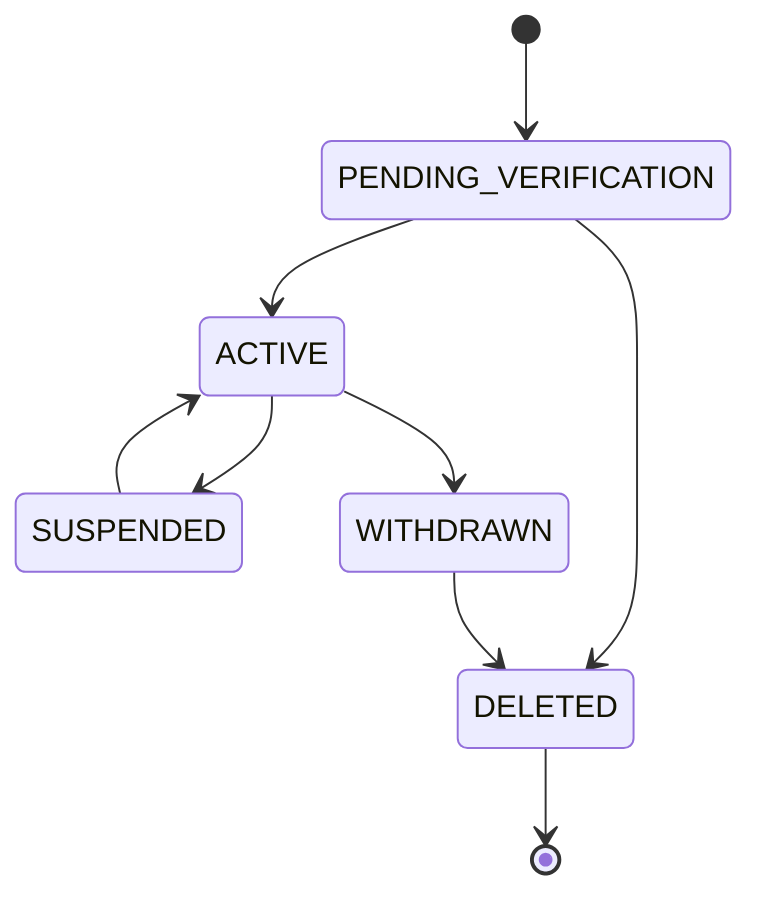
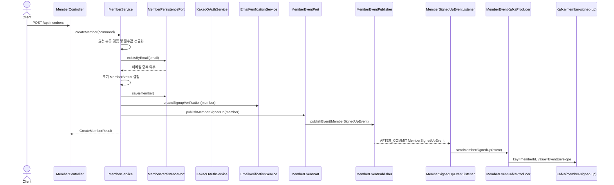
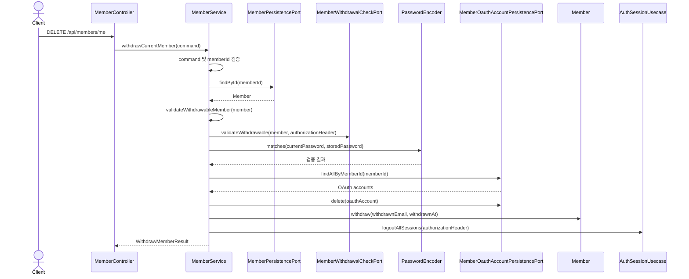
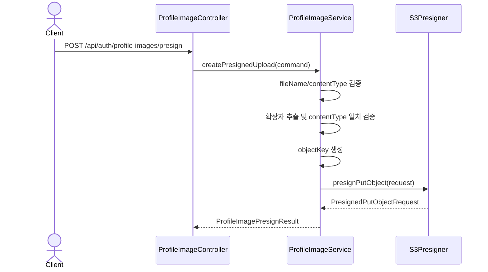

# Member Package

## 목차

- [1. 책임](#1-책임)
- [2. 도메인 모델](#2-도메인-모델)
  - [2.1 `Member`](#21-member)
  - [2.2 `MemberStatus`](#22-memberstatus)
  - [2.3 상태 전이](#23-상태-전이)
  - [2.4 주요 도메인 메서드](#24-주요-도메인-메서드)
  - [2.5 `MemberRole`](#25-memberrole)
  - [2.6 제약과 주의사항](#26-제약과-주의사항)
- [3. 주요 서비스](#3-주요-서비스)
- [4. 포트](#4-포트)
- [5. 인프라 어댑터](#5-인프라-어댑터)
- [6. 주요 흐름](#6-주요-흐름)
  - [6.1 회원가입](#61-회원가입)
  - [6.2 회원 탈퇴](#62-회원-탈퇴)
  - [6.3 프로필 이미지 업로드 URL 발급](#63-프로필-이미지-업로드-url-발급)
- [7. 관련 파일](#7-관련-파일)

---

## 1. 책임

`member` 패키지는 회원 자체의 생명주기를 관리한다.

주요 책임:

- 회원가입
- 내 정보 조회/수정
- 비밀번호 변경 요청 진입점 제공
- 프로필 이미지 presigned URL 발급
- 회원 탈퇴
- 탈퇴 가능 여부 검증을 위한 외부 서비스 조회

---

## 2. 도메인 모델

### 2.1 `Member`

`Member`는 회원의 원본 계정 상태를 나타내는 aggregate다.

| 필드 | 타입 | 필수 | 설명 |
|---|---|---|---|
| `memberId` | `UUID` | Y | 회원 식별자 |
| `email` | `String` | Y | 로그인 이메일 |
| `password` | `String` | Y | 암호화된 비밀번호 |
| `nickname` | `String` | Y | 닉네임 |
| `phone` | `String` | N | 연락처 |
| `address` | `String` | N | 주소 |
| `profileImageKey` | `String` | N | S3 profile image key |
| `role` | `MemberRole` | Y | 회원 역할 |
| `status` | `MemberStatus` | Y | 회원 상태 |
| `createdAt` | `LocalDateTime` | Y | 생성 시각 |
| `updatedAt` | `LocalDateTime` | Y | 수정 시각 |

### 2.2 `MemberStatus`

| 상태 | 의미 |
|---|---|
| `PENDING_VERIFICATION` | 이메일 인증 등 가입 검증 대기 |
| `ACTIVE` | 정상 활동 가능 |
| `SUSPENDED` | 제재로 활동 제한 |
| `WITHDRAWN` | 탈퇴 처리됨 |
| `DELETED` | 삭제 완료 또는 삭제 예정 최종 상태 |

### 2.3 상태 전이

상태 전이는 `Member.changeStatus(...)` 내부의 `validateStatusTransition(...)`이 검증한다.

### 2.4 주요 도메인 메서드

| 메서드 | 역할 |
|---|---|
| `create(...)` | 회원 aggregate 생성 |
| `changeNickname(...)` | 닉네임 변경 |
| `updateAccount(...)` | 이메일, 비밀번호, 닉네임, 연락처, 주소, 프로필 이미지를 함께 갱신 |
| `updateProfile(...)` | 연락처, 주소, 프로필 이미지를 갱신 |
| `changePassword(...)` | 비밀번호 갱신 |
| `withdraw(...)` | 이메일 익명화 후 탈퇴 상태로 변경 |
| `changeStatus(...)` | 허용된 상태 전이를 검증하고 상태 변경 |
| `changeRole(...)` | 회원 역할 변경 |
| `isActive()` | 현재 회원이 활성 상태인지 확인 |

### 2.5 `MemberRole`

`MemberRole`은 `common-security` 모듈의 공통 enum을 사용한다.

| 역할 | 의미 |
|---|---|
| `USER` | 일반 회원 |
| `SELLER` | 판매자 전환 완료 회원 |
| `ADMIN` | 관리자 |

### 2.6 제약과 주의사항

- `Member`는 현재 JPA annotation을 포함하고 있지만, TODO에 따라 장기적으로 persistence mapping과 domain model 분리가 필요하다.
- 상태 변경은 `changeStatus(...)`를 통해 허용된 전이만 수행해야 한다.
- `withdraw(...)`는 이메일을 익명화한 뒤 `WITHDRAWN`으로 전환한다.
- 판매자 전환은 `seller` 패키지의 `SellerPromotionService`가 `changeRole(MemberRole.SELLER, now)`를 호출해 처리한다.
- 현재 예치금, wallet 잔액, 거래 이력은 `Member`가 소유하지 않는다. 해당 상태는 Payment Service의 `Wallet`이 소유한다.

---

## 3. 주요 서비스

| 클래스 | 책임 | 파일 |
|---|---|---|
| `MemberService` | 회원가입, 조회, 수정, 탈퇴 | [MemberService.java](C:/my_project/GoodsMall_BE/service/member/src/main/java/com/example/member/member/application/service/MemberService.java) |
| `ProfileImageService` | 프로필 이미지 URL 처리 | [ProfileImageService.java](C:/my_project/GoodsMall_BE/service/member/src/main/java/com/example/member/member/application/service/ProfileImageService.java) |

---

## 4. 포트

| 포트 | 방향 | 설명 |
|---|---|---|
| `MemberUsecase` | in | 회원 API 유스케이스 |
| `MemberPersistencePort` | out | 회원 저장소 접근 |
| `MemberWithdrawalCheckPort` | out | 탈퇴 가능 여부 확인 |
| `ProfileImageUrlPort` | out | 프로필 이미지 URL 생성 |
| `MemberEventPort` | out | 회원 이벤트 발행 |

---

## 5. 인프라 어댑터

| 어댑터 | 설명 |
|---|---|
| `MemberJpaAdapter` | `MemberPersistencePort`의 JPA 구현 |
| `MemberWithdrawalCheckFeignAdapter` | 주문/결제/상품/경매/정산 서비스에 탈퇴 가능 여부 조회 |
| `ProfileImageUrlResolver` | S3 presigned URL 생성 |
| `MemberEventPublisher` | `MemberEventPort` 구현체. `MemberSignedUpEvent`를 Spring application event로 발행 |
| `MemberSignedUpEventListener` | transaction commit 이후 `MemberSignedUpEvent`를 Kafka producer로 전달 |
| `MemberEventKafkaProducer` | `EventEnvelope<MemberSignedUpEvent>`를 `member-signed-up` topic으로 발행 |

---

## 6. 주요 흐름

`member` 패키지의 주요 흐름은 controller 진입점, application service 처리, port 호출, domain 상태 변경을 함께 표현한다.

### 6.1 회원가입

회원가입은 `Member`를 생성하고, 설정에 따라 이메일 인증 상태를 부여한 뒤, 회원 생성 이벤트를 발행한다.

| 단계 | 책임 | 설명 |
|---|---|---|
| 1 | `MemberController` | `CreateMemberRequest`를 `CreateMemberCommand`로 변환한다. |
| 2 | `MemberService` | command null 여부, 이메일/비밀번호/닉네임 필수값을 검증하고 정규화한다. |
| 3 | `MemberPersistencePort` | 이메일 중복 여부를 확인한다. |
| 4 | `MemberService` | `memberSignupProperties.requireEmailVerification()` 값에 따라 `PENDING_VERIFICATION` 또는 `ACTIVE`를 초기 상태로 선택한다. |
| 5 | `MemberPersistencePort` | `Member.create(...)`로 생성한 회원을 저장한다. |
| 6 | `EmailVerificationService` | 이메일 인증이 필요한 경우 가입 인증을 생성한다. |
| 7 | `MemberEventPort` | 회원 생성 application event 발행을 요청한다. |
| 8 | `MemberEventPublisher` | `MemberSignedUpEvent(memberId, email)`를 Spring application event로 발행한다. |
| 9 | `MemberSignedUpEventListener` | transaction commit 이후 이벤트를 수신한다. |
| 10 | `MemberEventKafkaProducer` | `EventEnvelope<MemberSignedUpEvent>`를 Kafka `member-signed-up` topic으로 발행한다. |

발행 이벤트:

| 이벤트 목적 | Kafka topic | Kafka key | payload | envelope | 발행 시점 | 소비 기대 동작 | 멱등성 기준 |
|---|---|---|---|---|---|---|---|
| 지갑 생성 알림 | `member-signed-up` | `memberId` | `memberId`, `email` | `EventEnvelope<MemberSignedUpEvent>` | `@TransactionalEventListener(phase = AFTER_COMMIT)` | Payment Service wallet 생성 | `eventId` 우선, 필요 시 `memberId` 보조 |

Kafka 이벤트 주의사항:

- Kafka 발행은 회원 저장 transaction이 commit된 뒤 수행된다.
- Kafka 직렬화 또는 발행 실패는 로그로 기록되지만, 이미 commit된 회원가입 transaction을 롤백하지 않는다.
- 현재 `member` 패키지 문서에서는 `MemberSignedUpEvent`만 다룬다. `SELLER_PROMOTED`, `MEMBER_OAUTH_LINKED`, `ACCOUNT_VERIFICATION_*`는 각각 `seller`, `auth`, `verification` 패키지 문서에서 다룬다.

| 실패 조건 | 결과 |
|---|---|
| 요청 본문이 없음 | `IllegalArgumentException` |
| 이메일/비밀번호/닉네임 누락 | `IllegalArgumentException` |
| 이메일 중복 | `DuplicateMemberEmailException` |
| `profileImageKey` 형식이 지원되지 않음 | `IllegalArgumentException` |

### 6.2 회원 탈퇴

회원 탈퇴는 member 내부 상태 검증과 외부 도메인 잔여 상태 검증을 모두 통과해야 완료된다.

| 단계 | 책임 | 설명 |
|---|---|---|
| 1 | `MemberController` | 현재 로그인 회원, authorization header, 현재 비밀번호를 `WithdrawMemberCommand`로 변환한다. |
| 2 | `MemberService` | command null 여부와 `memberId` 필수 여부를 검증한다. |
| 3 | `MemberPersistencePort` | 탈퇴 대상 회원을 조회한다. |
| 4 | `MemberService` | 관리자 계정, 이미 탈퇴한 회원, `ACTIVE`가 아닌 회원을 차단한다. |
| 5 | `MemberWithdrawalCheckPort` | 주문, 결제, 상품, 경매, 정산 등 외부 도메인의 탈퇴 가능 여부를 검증한다. |
| 6 | `PasswordEncoder` | 현재 비밀번호가 저장된 비밀번호와 일치하는지 확인한다. |
| 7 | `MemberOauthAccountPersistencePort` | 회원의 OAuth 식별자 매핑을 조회하고 삭제한다. |
| 8 | `Member` | 이메일을 `withdrawn+{memberId}@deleted.local` 형식으로 익명화하고 `WITHDRAWN` 상태로 변경한다. |
| 9 | `AuthSessionUsecase` | 해당 회원의 모든 세션을 로그아웃 처리한다. |

| 실패 조건 | 결과 |
|---|---|
| 요청 본문이 없음 | `IllegalArgumentException` |
| `memberId` 누락 | `IllegalArgumentException` |
| 회원 없음 | `MemberNotFoundException` |
| 관리자 계정 탈퇴 시도 | `MemberWithdrawalException` |
| 이미 탈퇴한 회원 | `MemberWithdrawalException` |
| 회원 상태가 `ACTIVE`가 아님 | `MemberWithdrawalException` |
| 외부 도메인에 미정산/진행 중 상태 존재 | `MemberWithdrawalException` 또는 외부 검증 어댑터 예외 |
| 현재 비밀번호 불일치 | `MemberWithdrawalException` |

### 6.3 프로필 이미지 업로드 URL 발급

프로필 이미지 업로드 URL 발급은 S3에 직접 업로드할 수 있는 presigned PUT URL과 저장될 object key를 생성한다.

| 단계 | 책임 | 설명 |
|---|---|---|
| 1 | `ProfileImageController` | 요청을 `ProfileImagePresignCommand`로 변환한다. |
| 2 | `ProfileImageService` | command null 여부, `fileName`, `contentType` 필수 여부를 검증한다. |
| 3 | `ProfileImageService` | 파일 확장자를 추출하고 지원 확장자인지 확인한다. |
| 4 | `ProfileImageService` | 확장자와 `contentType`이 일치하는지 확인한다. |
| 5 | `ProfileImageService` | `profileImagePrefix/{uuid}.{extension}` 형식의 object key를 생성한다. |
| 6 | `S3Presigner` | S3 PUT presigned URL을 생성한다. |
| 7 | `ProfileImageService` | object key, upload URL, 만료 시간을 반환한다. |

| 지원 확장자 | contentType |
|---|---|
| `jpg` | `image/jpeg` |
| `jpeg` | `image/jpeg` |
| `png` | `image/png` |
| `webp` | `image/webp` |

| 실패 조건 | 결과 |
|---|---|
| 요청 본문이 없음 | `IllegalArgumentException` |
| `fileName` 누락 | `IllegalArgumentException` |
| `contentType` 누락 | `IllegalArgumentException` |
| 지원하지 않는 확장자 | `IllegalArgumentException` |
| 확장자와 `contentType` 불일치 | `IllegalArgumentException` |
| `aws.s3.profile-image-prefix` 누락 | `IllegalArgumentException` |
---

## 7. 관련 파일

- `service/member/src/main/java/com/example/member/member/**`
- `service/member/src/main/java/com/example/member/member/application/event/MemberSignedUpEvent.java`
- `service/member/src/main/java/com/example/member/member/infrastructure/messaging/MemberEventPublisher.java`
- `service/member/src/main/java/com/example/member/member/infrastructure/messaging/MemberSignedUpEventListener.java`
- `service/member/src/main/java/com/example/member/member/infrastructure/messaging/MemberEventKafkaProducer.java`
- `service/member/src/main/java/com/example/member/common/infrastructure/messaging/kafka/KafkaTopics.java`
- `common-security/src/main/java/com/todaylunch/common/security/auth/enumtype/MemberRole.java`