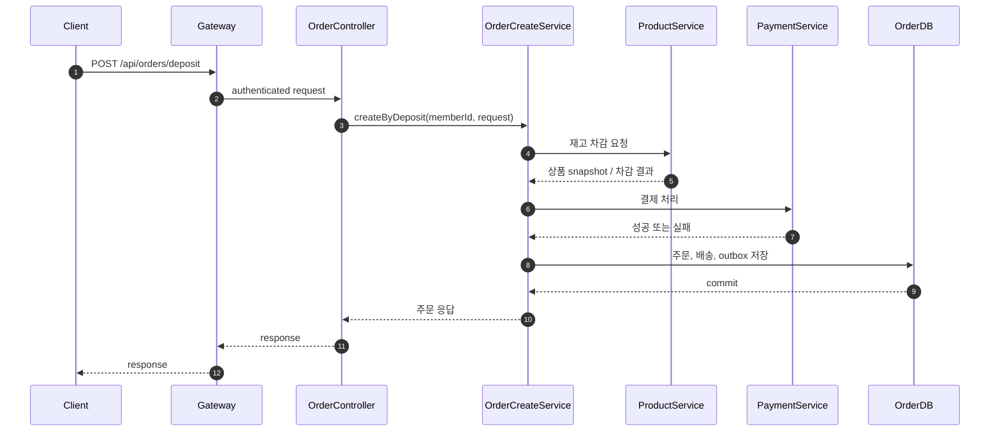
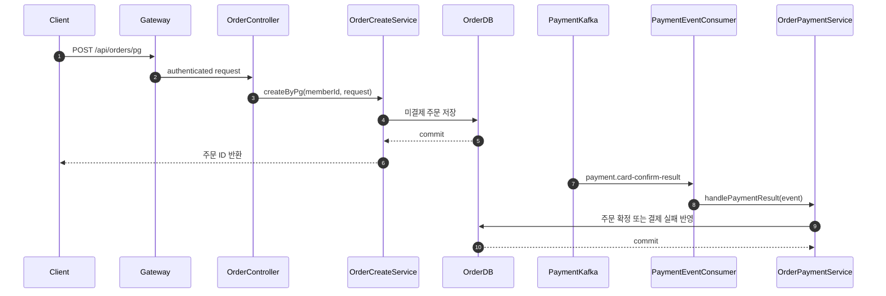
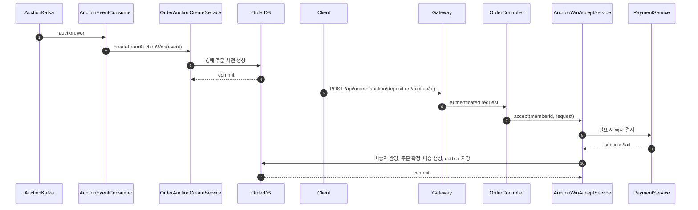

# Order Service

## Table of Contents

- [1. 개요](#1-개요)
- [2. 소유 도메인 / 데이터](#2-소유-도메인--데이터)
- [3. 주요 유스케이스](#3-주요-유스케이스)
- [4. API 표면](#4-api-표면)
- [5. 서비스 내부 요청 흐름](#5-서비스-내부-요청-흐름)
  - [5.1 일반 상품 주문 생성](#51-일반-상품-주문-생성)
  - [5.2 PG 주문 생성과 결제 결과 반영](#52-pg-주문-생성과-결제-결과-반영)
  - [5.3 경매 낙찰 주문 수락](#53-경매-낙찰-주문-수락)
- [6. 이벤트 연동](#6-이벤트-연동)
  - [6.1 발행 이벤트](#61-발행-이벤트)
  - [6.2 소비 이벤트](#62-소비-이벤트)
  - [6.3 실패 처리](#63-실패-처리)
- [7. 외부 의존성](#7-외부-의존성)
- [8. 보안 / 인가](#8-보안--인가)
- [9. 트랜잭션 / 일관성](#9-트랜잭션--일관성)
- [10. 운영 메모](#10-운영-메모)
- [11. 관련 파일](#11-관련-파일)
- [12. 관련 문서](#12-관련-문서)

---

## 1. 개요

Order Service는 일반 주문과 경매 낙찰 주문의 생명주기를 소유한다.

핵심 책임:

- 일반 상품 주문 생성
- 경매 낙찰 주문 사전 생성과 수락
- 주문 상세/목록 조회
- 결제 결과 반영
- 배송 생성, 배송 시작, 배송 추적 조회
- 주문 취소, 반품 요청/검수
- 구매 확정과 seller 단위 후속 이벤트 발행
- 주문 관련 outbox 저장과 Kafka relay

상품 원본 데이터와 재고 차감 로직은 Product Service가 책임지고, 실제 금액 이동은 Payment Service가 책임진다. Order Service는 주문 상태, 배송 상태, 반품 상태, 주문 시점 snapshot을 중심으로 동작한다.

---

## 2. 소유 도메인 / 데이터

주요 영속 도메인:

- `Order`
- `OrderItem`
- `Delivery`
- `Claim`
- `ReturnRequest`
- `OutboxEvent`

주요 상태:

- `OrderStatus`
- `OrderItemStatus`
- `DeliveryStatus`
- `ReturnRequestStatus`
- `OutboxStatus`

소유 데이터 특성:

- 주문 생성 시 상품 이름, 가격, 썸네일 key를 snapshot으로 저장한다.
- 일반 주문과 경매 낙찰 주문이 같은 주문 모델을 사용한다.
- 배송은 주문 확정 이후 생성된다.
- 구매 확정 이벤트는 seller 단위로 분리 발행된다.

---

## 3. 주요 유스케이스

- 일반 상품 주문 생성
- 지갑 결제 주문 생성과 즉시 결제
- PG 결제용 주문 생성
- 경매 낙찰 주문 사전 생성
- 경매 낙찰 주문 수락과 결제
- 내 주문 목록/상세 조회
- 주문 취소
- 주문 단위 또는 주문 항목 단위 구매 확정
- 판매자 배송 시작과 배송 추적 조회
- 판매자 반품 검수

---

## 4. API 표면

주요 외부 API:

| Endpoint | Method | Purpose | Auth |
|---|---|---|---|
| `/api/orders/deposit` | `POST` | 지갑 결제 일반 주문 생성 | `USER`, `SELLER`, `ADMIN` |
| `/api/orders/pg` | `POST` | PG 결제 일반 주문 생성 | `USER`, `SELLER`, `ADMIN` |
| `/api/orders/auction/deposit` | `POST` | 지갑 결제 경매 낙찰 주문 수락 | `USER`, `SELLER`, `ADMIN` |
| `/api/orders/auction/pg` | `POST` | PG 결제 경매 낙찰 주문 수락 | `USER`, `SELLER`, `ADMIN` |
| `/api/orders` | `GET` | 내 주문 목록 조회 | `USER`, `SELLER`, `ADMIN` |
| `/api/orders/{orderId}` | `GET` | 주문 상세 조회 | `USER`, `SELLER`, `ADMIN` |
| `/api/orders/{orderId}/payment-validation` | `POST` | 결제 결과 검증 | `USER`, `SELLER`, `ADMIN` |
| `/api/orders/{orderId}/cancel` | `POST` | 주문 취소 | `USER`, `SELLER`, `ADMIN` |
| `/api/orders/{orderId}/confirm` | `POST` | 주문 단위 구매 확정 | `USER`, `SELLER`, `ADMIN` |
| `/api/orders/{orderId}/items/{orderItemId}/confirm` | `POST` | 주문 항목 단위 구매 확정 | `USER`, `SELLER`, `ADMIN` |
| `/api/deliveries/{deliveryId}/tracking` | `GET` | 배송 추적 조회 | `USER`, `SELLER`, `ADMIN` |
| `/api/deliveries/seller` | `GET` | 판매자 배송 목록 조회 | `SELLER`, `ADMIN` |
| `/api/deliveries/seller/counts` | `GET` | 판매자 배송 상태 카운트 | `SELLER`, `ADMIN` |
| `/api/deliveries/{deliveryId}/ship` | `POST` | 배송 시작 처리 | `SELLER`, `ADMIN` |
| `/api/return-requests/seller` | `GET` | 판매자 반품 요청 조회 | `SELLER`, `ADMIN` |
| `/api/return-requests/{returnRequestId}/inspect` | `POST` | 판매자 반품 검수 | `SELLER`, `ADMIN` |

주요 내부 API:

| Endpoint | Method | Purpose |
|---|---|---|
| `/internal/orders/members/{memberId}/withdrawal-summary` | `GET` | 회원 탈퇴 가능 여부 판단용 주문 요약 |
| `/internal/deliveries/sellers/{sellerId}/status-counts` | `GET` | 판매자 배송 상태 요약 |

---

## 5. 서비스 내부 요청 흐름

### 5.1 일반 상품 주문 생성

지갑 결제 주문은 주문 생성 중에 상품 재고 차감과 결제 처리가 같이 진행된다. 결제가 성공하면 주문을 확정하고 배송을 생성한 뒤 `order.confirmed` outbox를 저장한다.

`createByDeposit`는 결제 실패 시 `order.payment-failed` outbox를 저장하고 예외를 다시 던진다.

### 5.2 PG 주문 생성과 결제 결과 반영

PG 결제 주문은 주문만 먼저 생성하고, 이후 Payment Service가 발행한 `payment.card-confirm-result` 이벤트를 받아 확정 또는 실패 처리한다.

성공 시 배송을 생성하고 `order.confirmed` outbox를 저장한다. 실패 시 주문을 취소하고 `order.payment-failed` outbox를 저장한다.

### 5.3 경매 낙찰 주문 수락

경매 종료 후 `auction.won` 이벤트로 주문이 사전 생성되고, 낙찰자가 배송지와 결제 수단을 제출하면 실제 수락이 진행된다.

---

## 6. 이벤트 연동

### 6.1 발행 이벤트

주요 발행 이벤트:

- `order.confirmed`
- `order.canceled`
- `order.payment-failed`
- `order.purchase-confirmed`
- `order.return-requested`
- `order.return-completed`

특징:

- 대부분 `OutboxEvent`를 저장한 뒤 `OutboxProcessor`가 Kafka로 relay한다.
- 구매 확정 이벤트는 order item이 속한 seller별로 분리 발행한다.
- `createByDeposit`와 `handlePaymentResult`는 성공/실패에 따라 서로 다른 outbox를 저장한다.

### 6.2 소비 이벤트

주요 소비 이벤트:

- `auction.won`
- `payment.card-confirm-result`

소비 목적:

- `auction.won`: 낙찰 주문 사전 생성
- `payment.card-confirm-result`: PG 결제 결과를 주문 상태에 반영

### 6.3 실패 처리

- outbox relay는 `PENDING -> PROCESSING -> PUBLISHED` 순서로 진행한다.
- Kafka 전송 실패 시 `PENDING`으로 되돌리고 재시도 대상에 남긴다.
- 결제 결과 소비 시 이미 처리된 주문 상태인지 먼저 검증한다.
- 취소/반품/구매 확정은 주문 현재 상태를 다시 검사한 뒤 진행한다.

---

## 7. 외부 의존성

- Product Service: 상품 정보 조회, 재고 차감
- Payment Service: 주문 결제 처리와 결과 생성
- SweetTracker: 배송 추적 조회
- PostgreSQL: 주문, 배송, 반품, outbox 저장
- Kafka: 주문/경매/결제 이벤트 송수신
- Redis: 일부 조회/보조 상태

---

## 8. 보안 / 인가

- Gateway가 JWT를 검증하고 사용자 정보를 전달한다.
- 외부 API는 대부분 로그인 사용자를 전제로 하며 `@CurrentMember` 기반으로 memberId를 복원한다.
- 판매자 API는 role 검증 이후 seller 소유 데이터만 조회/수정하도록 서비스 내부에서 한 번 더 검증한다.
- 내부 API는 다른 서비스가 회원 탈퇴 가능 여부나 판매자 상태 요약을 조회할 때 사용한다.

---

## 9. 트랜잭션 / 일관성

- 주문 생성, 결제 성공 반영, 배송 생성은 use case 단위 트랜잭션으로 묶인다.
- 상품 재고 차감과 금액 이동은 외부 서비스가 소유하므로 Order Service 기준으로는 분산 트랜잭션이 아니다.
- PG 결제 주문은 주문 생성과 결제 확정이 분리되어 eventual consistency를 가진다.
- 이벤트 전파는 outbox 기반이고, 주문 상태 변경 commit 이후 비동기로 다른 서비스에 전달된다.

---

## 10. 운영 메모

- `OutboxProcessor`가 주기적으로 `PENDING` 이벤트를 relay한다.
- `payment.card-confirm-result`가 늦게 오면 미결제 주문 상태가 오래 유지될 수 있다.
- 배송 조회는 SweetTracker 연동 상태에 영향을 받는다.
- 경매 낙찰 주문은 사전 생성 후 수락되므로, 사전 생성 주문이 오래 남는 경우를 운영에서 확인해야 한다.

---

## 11. 관련 파일

- `service/order/src/main/java/com/example/order/presentation/controller/OrderController.java`
- `service/order/src/main/java/com/example/order/presentation/controller/DeliveryController.java`
- `service/order/src/main/java/com/example/order/presentation/controller/ReturnRequestController.java`
- `service/order/src/main/java/com/example/order/presentation/controller/OrderInternalController.java`
- `service/order/src/main/java/com/example/order/application/service/OrderCreateService.java`
- `service/order/src/main/java/com/example/order/application/service/OrderPaymentService.java`
- `service/order/src/main/java/com/example/order/application/service/AuctionWinAcceptService.java`
- `service/order/src/main/java/com/example/order/application/service/OrderConfirmService.java`
- `service/order/src/main/java/com/example/order/application/service/OrderAuctionCreateService.java`
- `service/order/src/main/java/com/example/order/infrastructure/kafka/OutboxProcessor.java`

---

## 12. 관련 문서

- [04-request-flow.md](../04-request-flow.md)
- [05-event-strategy.md](../05-event-strategy.md)
- [06-auth-flow.md](../06-auth-flow.md)
- [payment-service.md](./payment-service.md)
- [auction-service.md](./auction-service.md)
- [product-service.md](./product-service.md)
