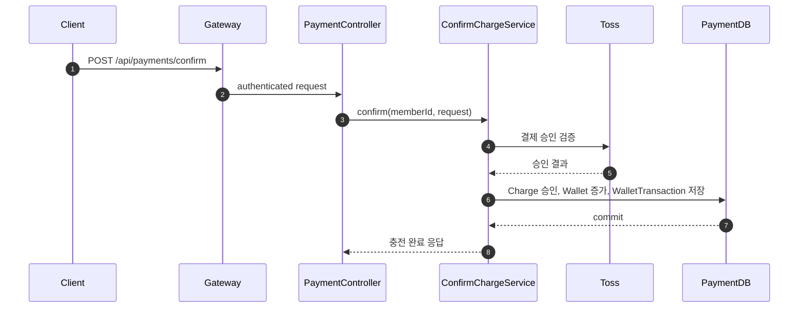
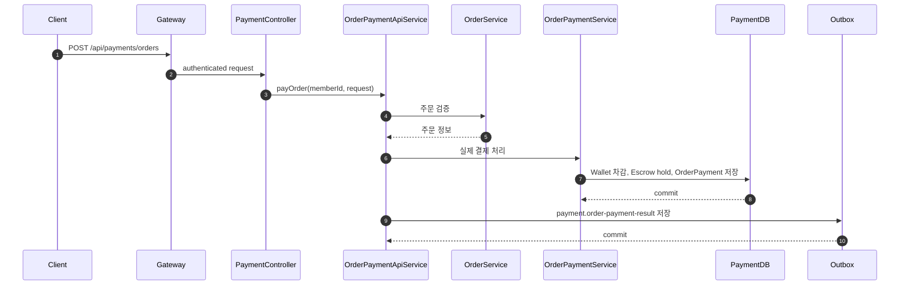
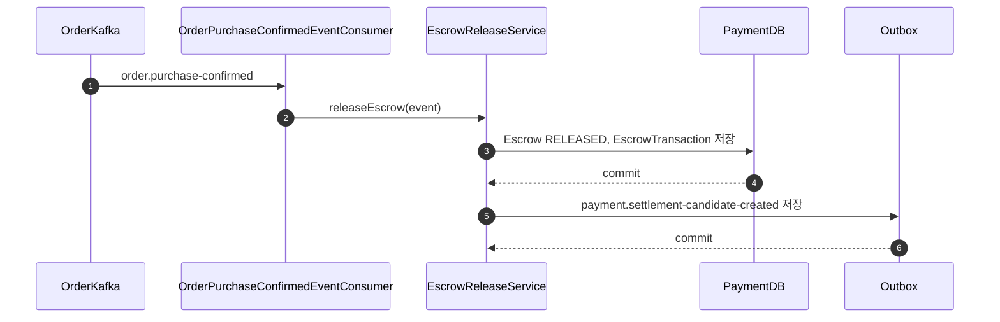

# Payment Service

## Table of Contents

- [1. 개요](#1-개요)
- [2. 소유 도메인 / 데이터](#2-소유-도메인--데이터)
- [3. 주요 유스케이스](#3-주요-유스케이스)
- [4. API 표면](#4-api-표면)
- [5. 서비스 내부 요청 흐름](#5-서비스-내부-요청-흐름)
  - [5.1 지갑 충전 확정](#51-지갑-충전-확정)
  - [5.2 주문 결제 처리](#52-주문-결제-처리)
  - [5.3 구매 확정 후 escrow release](#53-구매-확정-후-escrow-release)
- [6. 이벤트 연동](#6-이벤트-연동)
  - [6.1 발행 이벤트](#61-발행-이벤트)
  - [6.2 소비 이벤트](#62-소비-이벤트)
  - [6.3 실패 처리](#63-실패-처리)
- [7. 외부 의존성](#7-외부-의존성)
- [8. 보안 / 인가](#8-보안--인가)
- [9. 트랜잭션 / 일관성](#9-트랜잭션--일관성)
- [10. 운영 메모](#10-운영-메모)
- [11. 관련 파일](#11-관련-파일)
- [12. 관련 문서](#12-관련-문서)

---

## 1. 개요

Payment Service는 금액 이동과 정산 후보 생성을 소유한다. 현재 코드 기준으로 wallet, order payment, card transaction, refund, escrow, auction deposit, outbox 모듈이 한 서비스 안에 같이 들어 있다.

핵심 책임:

- 지갑 충전과 출금
- 주문 지갑 결제
- 카드 결제 확정 결과 반영
- 주문 취소/판매자 환불 처리
- escrow hold / release
- 경매 입찰 보증금 hold / refund
- 정산 후보 생성과 판매자 지급 결과 이벤트 발행
- payment outbox relay

Order Service와 Auction Service는 결제 요청의 맥락을 만들고, 실제 잔액 차감, escrow 상태 변경, 환불, 정산 후보 생성은 Payment Service가 최종 책임을 가진다.

---

## 2. 소유 도메인 / 데이터

주요 영속 도메인:

- `Wallet`
- `WalletTransaction`
- `Charge`
- `WithdrawRequest`
- `OrderPayment`
- `OrderPaymentAllocation`
- `CardTransaction`
- `PaymentRefund`
- `PaymentRefundItem`
- `PaymentRefundAllocation`
- `Escrow`
- `EscrowTransaction`
- `AuctionDeposit`
- `OutboxEvent`

주요 상태:

- `ChargeStatus`
- `WithdrawStatus`
- `OrderPaymentStatus`
- `PaymentRefundStatus`
- `EscrowStatus`
- `AuctionDepositStatus`
- `OutboxStatus`

데이터 특성:

- wallet 잔액과 wallet transaction은 Payment Service 원본 데이터다.
- order payment와 escrow는 주문 금액의 hold/release 상태를 표현한다.
- 경매 입찰 보증금은 `AuctionDeposit`으로 별도 관리한다.
- 외부 이벤트 전파는 `OutboxEvent`에 적재한 뒤 relay한다.

---

## 3. 주요 유스케이스

- 회원 가입 후 wallet 생성
- 충전 요청 생성과 Toss confirm
- 주문 지갑 결제
- 카드 결제 confirm과 escrow 생성
- 주문 취소/판매자 환불
- 경매 입찰 보증금 hold와 refund
- 구매 확정 후 seller escrow release
- 정산 후보 이벤트 생성
- 판매자 출금 요청 처리

---

## 4. API 표면

주요 외부 API:

| Endpoint | Method | Purpose | Auth |
|---|---|---|---|
| `/api/payments/wallet` | `GET` | 내 지갑 조회 | `USER`, `SELLER`, `ADMIN` |
| `/api/payments/charge` | `POST` | 충전 요청 생성 | `USER`, `SELLER`, `ADMIN` |
| `/api/payments/confirm` | `POST` | 충전 확정 | `USER`, `SELLER`, `ADMIN` |
| `/api/payments/charge/fail` | `POST` | 충전 실패 반영 | `USER`, `SELLER`, `ADMIN` |
| `/api/payments/orders` | `POST` | 주문 지갑 결제 | `USER`, `SELLER`, `ADMIN` |
| `/api/payments/orders/{orderId}` | `GET` | 주문 결제 조회 | `USER`, `SELLER`, `ADMIN` |
| `/api/payments/card/confirm` | `POST` | 카드 결제 확정 | `USER`, `SELLER`, `ADMIN` |
| `/api/payments/cancellations` | `POST` | 주문 취소 환불 | `USER`, `SELLER`, `ADMIN` |
| `/api/payments/seller/refunds/confirm` | `POST` | 판매자 환불 승인 | `SELLER`, `ADMIN` |
| `/api/payments/auctions/bid-fees` | `POST` | 경매 입찰 보증금 검증/처리 | `USER`, `SELLER`, `ADMIN` |
| `/api/payments/transactions` | `GET` | wallet 거래 내역 조회 | `USER`, `SELLER`, `ADMIN` |
| `/api/payments/charges` | `GET` | 충전 이력 조회 | `USER`, `SELLER`, `ADMIN` |
| `/api/payments/charges/{chargeId}` | `GET` | 충전 상세 조회 | `USER`, `SELLER`, `ADMIN` |
| `/api/payments/withdrawals` | `GET` | 출금 요청 조회 | `SELLER`, `ADMIN` |
| `/api/payments/withdrawals` | `POST` | 출금 요청 생성 | `SELLER`, `ADMIN` |
| `/api/payments/seller/pending-incomes` | `GET` | 판매자 미정산 수익 조회 | `SELLER`, `ADMIN` |
| `/api/payments/seller/orders/{orderId}/escrow-transactions` | `GET` | 주문별 escrow 거래 조회 | `SELLER`, `ADMIN` |

주요 내부 API:

| Endpoint | Method | Purpose |
|---|---|---|
| `/internal/payments/sellers/{sellerId}/withdrawal-summary` | `GET` | 판매자 출금 가능 여부 요약 |

---

## 5. 서비스 내부 요청 흐름

### 5.1 지갑 충전 확정

충전은 요청 생성과 확정이 분리되어 있다. 요청 생성 시에는 `Charge`만 `PENDING`으로 만들고, 확정 시점에 외부 PG 결과를 검증한 뒤 wallet 잔액을 증가시킨다.

### 5.2 주문 결제 처리

주문 지갑 결제는 buyer wallet 차감, escrow hold 생성, 주문 결제 레코드 저장을 하나의 use case에서 처리한다. 카드 결제는 별도 confirm API 또는 비동기 결과 이벤트를 통해 같은 결과 상태를 만든다.

### 5.3 구매 확정 후 escrow release

Order Service가 `order.purchase-confirmed`를 발행하면, Payment Service가 seller escrow를 release하고 정산 후보 이벤트를 만든다.

---

## 6. 이벤트 연동

### 6.1 발행 이벤트

주요 발행 이벤트:

- `payment.order-payment-result`
- `payment.order-refund-result`
- `payment.card-confirm-result`
- `payment.settlement-candidate-created`
- `payment.seller-payout-result`
- `payment.bid-fee.charge.succeeded`
- `payment.bid-fee.charge.failed`

특징:

- 대부분 `EventEnvelope` 기반 payload를 `OutboxEvent`로 저장한다.
- 주문 결제 성공/실패, 환불 결과, 정산 후보 생성, 판매자 지급 결과가 outbox 기반으로 전파된다.
- 경매 보증금 처리 성공/실패도 Kafka 이벤트로 알린다.

### 6.2 소비 이벤트

주요 소비 이벤트:

- `member-signed-up`
- `auction.bid-fee.charge.requested`
- `auction.bid-fee.refund.requested`
- `order.purchase-confirmed`
- `settlement.seller-payout-requested`

소비 목적:

- 회원 가입 시 wallet 생성
- 경매 입찰 보증금 hold / refund
- 구매 확정 후 seller escrow release
- 정산 서비스의 지급 요청 반영

### 6.3 실패 처리

- `PaymentOutboxProcessor`는 `PENDING -> PROCESSING -> PUBLISHED` 순서로 relay한다.
- Kafka 전송 실패 시 outbox를 `PENDING`으로 되돌리고 마지막 오류를 저장한다.
- 주문 취소 환불은 `orderCancelRequestId` 단위로 중복을 방지한다.
- escrow release는 이미 release된 경우 다시 처리하지 않는다.
- 판매자 지급 요청 consumer는 재시도 가능한 오류를 상위로 던져 Kafka 재시도를 유도한다.

---

## 7. 외부 의존성

- Order Service: 주문 검증과 주문 상태 맥락 조회
- Toss Payments: 충전/카드 결제 승인 확인
- PostgreSQL: wallet, payment, refund, escrow, outbox 저장
- Kafka: 주문/경매/정산 이벤트 송수신
- Feign clients: 다른 서비스 내부 API 호출

---

## 8. 보안 / 인가

- Gateway가 JWT를 검증하고 사용자 식별자를 전달한다.
- buyer wallet 관련 API는 요청 사용자 본인 기준으로 동작한다.
- seller 출금과 seller 환불 API는 seller role과 seller 소유 주문 여부를 같이 확인한다.
- 내부 API는 다른 서비스가 seller 출금 가능 여부를 판단할 때 사용한다.

---

## 9. 트랜잭션 / 일관성

- wallet 차감, escrow hold, payment 저장은 각 use case 트랜잭션 안에서 같이 commit된다.
- 외부 서비스 상태 반영은 outbox를 통해 비동기로 전파된다.
- 주문 생성과 카드 결제 확정은 서비스 경계가 나뉘므로 eventual consistency를 가진다.
- 현재 서비스는 여러 payment 하위 도메인을 한 모듈에 함께 두고 있어, 내부적으로는 한 DB 트랜잭션으로 묶이는 범위가 넓다.

---

## 10. 운영 메모

- `PaymentOutboxProcessor`가 relay를 담당하므로, 누적 `PENDING` outbox 수를 봐야 한다.
- wallet/escrow는 금액 정합성이 중요하므로 중복 처리 방지 조건이 누락되지 않았는지 확인해야 한다.
- settlement 지급 실패는 `payment.seller-payout-result`로만 끝나지 않고 재처리 절차가 필요할 수 있다.
- card confirm과 order payment result 흐름이 둘 다 존재하므로, 주문별 결제 경로를 구분해서 봐야 한다.

---

## 11. 관련 파일

- `service/payment/src/main/java/com/example/payment/payment/presentation/controller/PaymentController.java`
- `service/payment/src/main/java/com/example/payment/payment/presentation/controller/PaymentInternalController.java`
- `service/payment/src/main/java/com/example/payment/payment/application/service/OrderPaymentApiService.java`
- `service/payment/src/main/java/com/example/payment/payment/application/service/OrderPaymentService.java`
- `service/payment/src/main/java/com/example/payment/payment/application/service/CardPaymentConfirmService.java`
- `service/payment/src/main/java/com/example/payment/payment/application/service/PaymentRefundService.java`
- `service/payment/src/main/java/com/example/payment/wallet/application/service/ConfirmChargeService.java`
- `service/payment/src/main/java/com/example/payment/wallet/application/service/WithdrawService.java`
- `service/payment/src/main/java/com/example/payment/escrow/application/service/EscrowReleaseService.java`
- `service/payment/src/main/java/com/example/payment/outbox/infrastructure/messaging/kafka/PaymentOutboxProcessor.java`

---

## 12. 관련 문서

- [04-request-flow.md](../04-request-flow.md)
- [05-event-strategy.md](../05-event-strategy.md)
- [06-auth-flow.md](../06-auth-flow.md)
- [order-service.md](./order-service.md)
- [auction-service.md](./auction-service.md)
- [settlement-service.md](./settlement-service.md)
