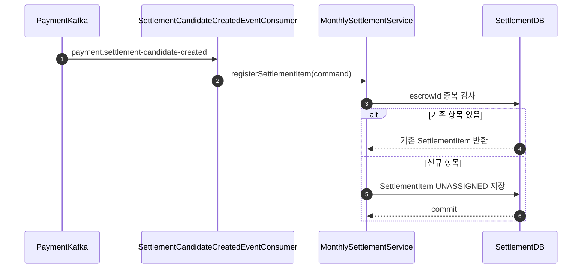
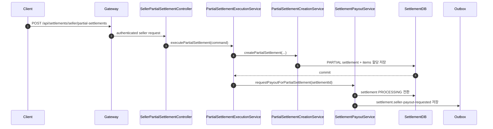
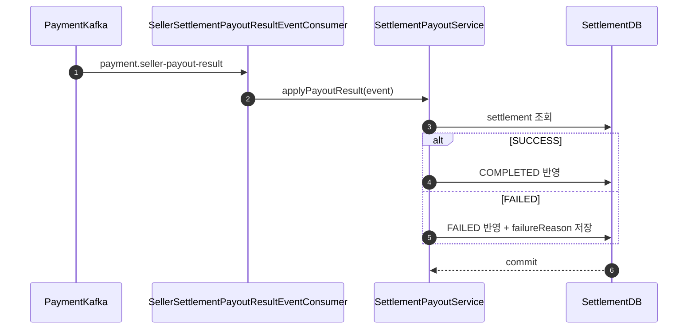

# Settlement Service

## Table of Contents

- [1. 개요](#1-개요)
- [2. 소유 도메인 / 데이터](#2-소유-도메인--데이터)
- [3. 주요 유스케이스](#3-주요-유스케이스)
- [4. API 표면](#4-api-표면)
- [5. 서비스 내부 요청 흐름](#5-서비스-내부-요청-흐름)
  - [5.1 정산 후보 적재](#51-정산-후보-적재)
  - [5.2 부분 정산 실행](#52-부분-정산-실행)
  - [5.3 정산 지급 결과 반영](#53-정산-지급-결과-반영)
- [6. 이벤트 연동](#6-이벤트-연동)
  - [6.1 발행 이벤트](#61-발행-이벤트)
  - [6.2 소비 이벤트](#62-소비-이벤트)
  - [6.3 실패 처리](#63-실패-처리)
- [7. 외부 의존성](#7-외부-의존성)
- [8. 보안 / 인가](#8-보안--인가)
- [9. 트랜잭션 / 일관성](#9-트랜잭션--일관성)
- [10. 운영 메모](#10-운영-메모)
- [11. 관련 파일](#11-관련-파일)
- [12. 관련 문서](#12-관련-문서)

---

## 1. 개요

Settlement Service는 Payment Service에서 release된 escrow를 seller 정산 단위로 묶고, 지급 요청과 결과 반영을 관리한다.

핵심 책임:

- 정산 후보 적재
- 월별 정산 집계
- 판매자 부분 정산 실행
- 지급 요청 이벤트 발행
- 지급 결과 반영
- retryable 실패 건 자동 재시도
- 비재시도 실패 건 수동 재시도 / DLQ replay 지원
- settlement outbox relay

즉, Payment Service가 금액을 escrow에서 release하면, Settlement Service는 그 release 결과를 seller 기준 정산 건으로 변환하고 실제 지급 요청 수명주기를 관리한다.

---

## 2. 소유 도메인 / 데이터

주요 영속 도메인:

- `Settlement`
- `SettlementItem`
- `OutboxEvent`

주요 상태:

- `SettlementStatus`
- `SettlementItemStatus`
- `SettlementType`
- `OutboxStatus`

데이터 특성:

- `SettlementItem`은 release된 escrow 1건을 정산 원천 항목으로 표현한다.
- `Settlement`는 seller, 연월, 정산 유형별 집계 단위다.
- 정산 유형은 `MONTHLY`, `PARTIAL`로 나뉜다.
- payout 요청은 `OutboxEvent`로 적재한 뒤 Kafka로 relay한다.

---

## 3. 주요 유스케이스

- payment에서 전달된 정산 후보 적재
- 판매자 월별 정산 목록 / 상세 조회
- 판매자 부분 정산 가능 항목 조회
- 판매자 부분 정산 실행
- 월별 정산 집계 배치
- 정산 지급 요청 발행
- 지급 결과 성공 / 실패 반영
- retryable 실패 정산 자동 재시도
- 운영 수동 재시도와 DLQ replay

---

## 4. API 표면

주요 외부 API:

| Endpoint | Method | Purpose | Auth |
|---|---|---|---|
| `/api/settlements/seller` | `GET` | 판매자 정산 목록 조회 | `SELLER` |
| `/api/settlements/seller/{settlementId}` | `GET` | 판매자 정산 상세 조회 | `SELLER` |
| `/api/settlements/seller/partial-settlements/available` | `GET` | 부분 정산 가능 항목 조회 | `SELLER` |
| `/api/settlements/seller/partial-settlements` | `POST` | 부분 정산 실행 | `SELLER` |
| `/api/settlements/failed-payout/manual-retry` | `POST` | 실패 정산 수동 재시도 요청 | authenticated |
| `/api/settlements/failed-payout/replay` | `POST` | 실패 정산 DLQ replay 처리 | authenticated |

주요 내부 API:

| Endpoint | Method | Purpose |
|---|---|---|
| `/internal/settlements/sellers/{sellerId}/withdrawal-summary` | `GET` | 판매자 출금 가능 여부 판단용 정산 요약 |

주의:

- seller 조회 API는 controller에서 `SELLER` role을 직접 검증한다.
- 운영 API는 현재 controller에서 별도 admin role 검증을 하지 않는다. 문서상 운영 전제와 실제 구현이 완전히 일치하지 않는 부분이다.

---

## 5. 서비스 내부 요청 흐름

### 5.1 정산 후보 적재

Payment Service가 `payment.settlement-candidate-created`를 발행하면, Settlement Service가 `SettlementItem`을 만들고 이후 월별 집계 또는 부분 정산 대상으로 사용한다.

`escrowId` 기준 중복 적재를 막는다. 같은 release 이벤트가 다시 들어와도 기존 항목을 반환한다.

### 5.2 부분 정산 실행

부분 정산은 선택한 `SettlementItem` 집합으로 `PARTIAL` settlement를 만들고, 곧바로 지급 요청 outbox를 적재한다.

부분 정산 생성과 지급 요청은 같은 서비스 안에서 연속 수행되지만, 실제 지급 결과는 비동기로 돌아온다.

### 5.3 정산 지급 결과 반영

Payment Service가 seller 지급 성공 또는 실패 결과를 보내면, Settlement Service가 정산 상태를 `COMPLETED` 또는 `FAILED`로 바꾼다.

retryable 실패는 스케줄러가 다시 `PENDING`으로 되돌린 뒤 재요청한다.

---

## 6. 이벤트 연동

### 6.1 발행 이벤트

주요 발행 이벤트:

- `settlement.seller-payout-requested`

특징:

- `SettlementPayoutRequestedOutboxEventSaver`가 `EventEnvelope<SellerSettlementPayoutRequestedMessage>`를 만들어 outbox에 저장한다.
- 저장 직후 `OutboxEventPendingTrigger`를 발행해 relay를 유도한다.

### 6.2 소비 이벤트

주요 소비 이벤트:

- `payment.settlement-candidate-created`
- `payment.seller-payout-result`

소비 목적:

- 정산 후보 적재
- payout 성공 / 실패 결과 반영

DLQ 토픽:

- `payment.settlement-candidate-created.dlq`
- `payment.seller-payout-result.dlq`

### 6.3 실패 처리

- `SettlementOutboxProcessor`는 `PENDING -> PROCESSING -> PUBLISHED` 순서로 relay한다.
- 비동기 Kafka 발행 실패 시 `revertToPending(lastError)`로 복구한다.
- `SettlementOutboxRecoveryJob`가 5분 이상 `PROCESSING`에 머문 outbox를 1분마다 `PENDING`으로 되돌린다.
- `SettlementCandidateCreatedEventConsumer`는 envelope와 payload를 강하게 검증하고, validation 오류는 DLQ 대상으로 분류한다.
- `SettlementPayoutService`는 retryable failure reason만 자동 재시도 대상으로 보고, non-retryable은 수동 조치 대상으로 둔다.

---

## 7. 외부 의존성

- Payment Service: 정산 후보 생성, payout 결과 회신
- PostgreSQL: settlement, settlement item, outbox 저장
- Kafka: 정산 후보, payout 요청, payout 결과 이벤트 연동
- Scheduler: 월별 정산 집계와 retryable 실패 재시도

---

## 8. 보안 / 인가

- Gateway가 JWT를 검증하고 사용자 정보를 전달한다.
- seller 정산 조회와 부분 정산은 controller에서 `SELLER` role을 직접 검사한다.
- 내부 API는 다른 서비스가 판매자 출금 가능 여부를 판단할 때 사용한다.
- 운영 API는 현재 인증 사용자 정보를 받지만 권한 검증이 명시적이지 않다. 운영 문서상 admin 전용으로 볼 수 있으나, 구현은 더 약하다.

---

## 9. 트랜잭션 / 일관성

- settlement item 등록, settlement 생성, 상태 전환은 각각 로컬 DB 트랜잭션으로 commit된다.
- payout 요청은 DB 상태 변경 이후 outbox를 통해 비동기로 전달된다.
- 월별 정산 집계는 `UNASSIGNED -> PROCESSING` claim 후 seller별 집계를 수행해 재실행 시 중복 누적을 줄인다.
- Payment Service의 payout 결과가 늦게 오면 settlement는 `PROCESSING` 상태로 오래 남을 수 있다.

---

## 10. 운영 메모

- 월별 정산 집계 스케줄러는 매월 1일 03:05 KST에 직전 월 정산을 집계하고 payout 요청까지 이어서 수행한다.
- retryable 실패 재시도 스케줄러는 10분마다 현재 월 failed payout을 다시 요청한다.
- stuck `PROCESSING` outbox 복구 작업은 1분마다 동작한다.
- `FAILED` settlement는 failure reason에 따라 자동 재시도 대상과 수동 조치 대상으로 나뉜다.
- 운영 API가 권한 검증을 명시적으로 하지 않는 점은 별도 보완 대상이다.

---

## 11. 관련 파일

- `service/settlement/src/main/java/com/example/settlement/presentation/controller/SellerSettlementController.java`
- `service/settlement/src/main/java/com/example/settlement/presentation/controller/SellerPartialSettlementController.java`
- `service/settlement/src/main/java/com/example/settlement/presentation/controller/SettlementOpsController.java`
- `service/settlement/src/main/java/com/example/settlement/presentation/controller/SettlementInternalController.java`
- `service/settlement/src/main/java/com/example/settlement/application/service/MonthlySettlementService.java`
- `service/settlement/src/main/java/com/example/settlement/application/service/PartialSettlementExecutionService.java`
- `service/settlement/src/main/java/com/example/settlement/application/service/SettlementPayoutService.java`
- `service/settlement/src/main/java/com/example/settlement/infrastructure/messaging/kafka/SettlementCandidateCreatedEventConsumer.java`
- `service/settlement/src/main/java/com/example/settlement/infrastructure/messaging/kafka/SellerSettlementPayoutResultEventConsumer.java`
- `service/settlement/src/main/java/com/example/settlement/infrastructure/messaging/kafka/SettlementOutboxProcessor.java`
- `service/settlement/src/main/java/com/example/settlement/infrastructure/messaging/kafka/SettlementOutboxRecoveryJob.java`
- `service/settlement/src/main/java/com/example/settlement/infrastructure/scheduler/MonthlySettlementAggregationScheduler.java`
- `service/settlement/src/main/java/com/example/settlement/infrastructure/scheduler/RetryableFailedPayoutScheduler.java`

---

## 12. 관련 문서

- [04-request-flow.md](../04-request-flow.md)
- [05-event-strategy.md](../05-event-strategy.md)
- [06-auth-flow.md](../06-auth-flow.md)
- [payment-service.md](./payment-service.md)
- [member-service.md](./member-service.md)
