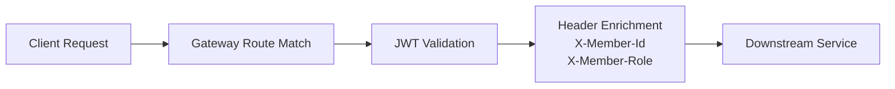

# Gateway ERD

## Mermaid Diagram

## 데이터 저장소
- gateway 모듈은 자체 영속 엔티티와 테이블을 가지지 않는다.
- 라우팅 정책, JWT 설정, 공개 경로 정책만 애플리케이션 설정으로 관리한다.

## 논리 모델
| 개체 | 설명 |
| --- | --- |
| `Route` | Path predicate 와 대상 서비스 매핑 |
| `GatewayAuthProperties` | JWT 검증 활성화 여부와 공개 경로 목록 |
| `JwtProperties` | JWT secret, issuer |
| `AuthenticatedPrincipal` | 토큰 검증 후 얻는 회원 식별 정보 |

## 구조 설명
- 요청은 게이트웨이에서 먼저 경로 매칭을 거친다.
- 인증이 필요한 경로는 JWT 검증 후 회원 헤더가 추가된다.
- 최종적으로 downstream 서비스로 전달된다.
