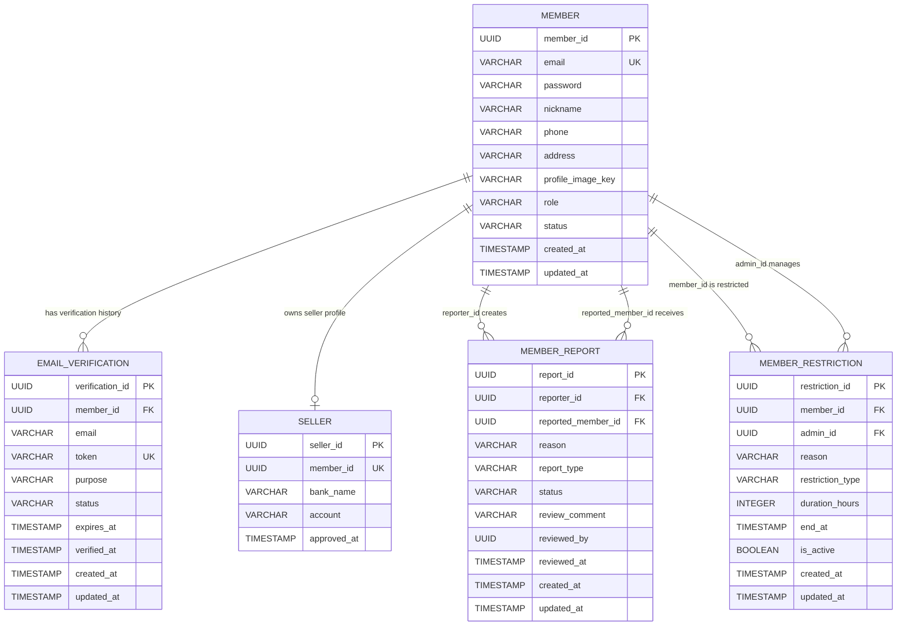

# Member ERD

## Mermaid Diagram

## 엔티티

### `member_service.member`
| 컬럼 | 타입 | 제약 |
| --- | --- | --- |
| `member_id` | UUID | PK |
| `email` | VARCHAR(255) | NOT NULL, UNIQUE |
| `password` | VARCHAR(255) | NOT NULL |
| `nickname` | VARCHAR(100) | NOT NULL |
| `phone` | VARCHAR(50) | NULL |
| `address` | VARCHAR(255) | NULL |
| `profile_image_key` | VARCHAR(500) | NULL |
| `role` | VARCHAR(30) | NOT NULL |
| `status` | VARCHAR(30) | NOT NULL |
| `created_at` | TIMESTAMP | NOT NULL |
| `updated_at` | TIMESTAMP | NOT NULL |

### `member_service.email_verification`
| 컬럼 | 타입 | 제약 |
| --- | --- | --- |
| `verification_id` | UUID | PK |
| `member_id` | UUID | NOT NULL |
| `email` | VARCHAR(255) | NOT NULL |
| `token` | VARCHAR(255) | NOT NULL, UNIQUE |
| `purpose` | VARCHAR(30) | NOT NULL |
| `status` | VARCHAR(30) | NOT NULL |
| `expires_at` | TIMESTAMP | NOT NULL |
| `verified_at` | TIMESTAMP | NULL |
| `created_at` | TIMESTAMP | NOT NULL |
| `updated_at` | TIMESTAMP | NOT NULL |

### `member_service.seller`
| 컬럼 | 타입 | 제약 |
| --- | --- | --- |
| `seller_id` | UUID | PK |
| `member_id` | UUID | NOT NULL, UNIQUE |
| `bank_name` | VARCHAR(100) | NULL |
| `account` | VARCHAR(100) | NULL |
| `approved_at` | TIMESTAMP | NULL |

### `member_service.member_report`
| 컬럼 | 타입 | 제약 |
| --- | --- | --- |
| `report_id` | UUID | PK |
| `reporter_id` | UUID | NOT NULL |
| `reported_member_id` | UUID | NOT NULL |
| `reason` | VARCHAR(255) | NOT NULL |
| `report_type` | VARCHAR(30) | NOT NULL |
| `status` | VARCHAR(30) | NOT NULL |
| `review_comment` | VARCHAR(255) | NULL |
| `reviewed_by` | UUID | NULL |
| `reviewed_at` | TIMESTAMP | NULL |
| `created_at` | TIMESTAMP | NOT NULL |
| `updated_at` | TIMESTAMP | NOT NULL |

### `member_service.member_restriction`
| 컬럼 | 타입 | 제약 |
| --- | --- | --- |
| `restriction_id` | UUID | PK |
| `member_id` | UUID | NOT NULL |
| `admin_id` | UUID | NOT NULL |
| `reason` | VARCHAR(255) | NOT NULL |
| `restriction_type` | VARCHAR(30) | NOT NULL |
| `duration_hours` | INTEGER | NOT NULL |
| `end_at` | TIMESTAMP | NOT NULL |
| `is_active` | BOOLEAN | NOT NULL |
| `created_at` | TIMESTAMP | NOT NULL |
| `updated_at` | TIMESTAMP | NULL |
