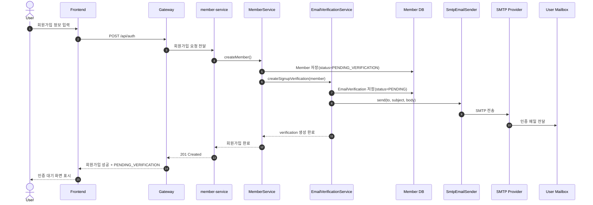
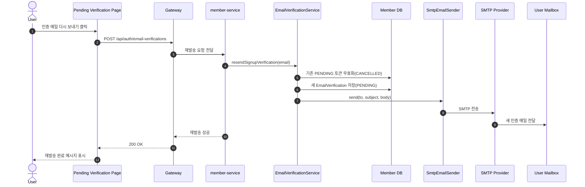
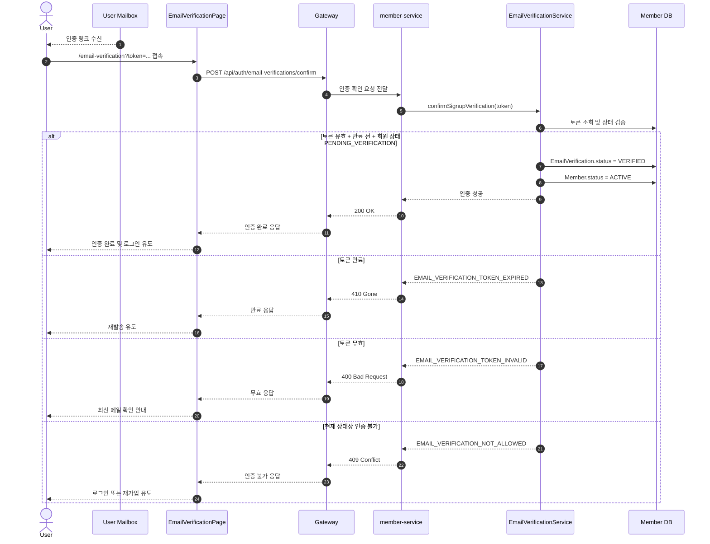
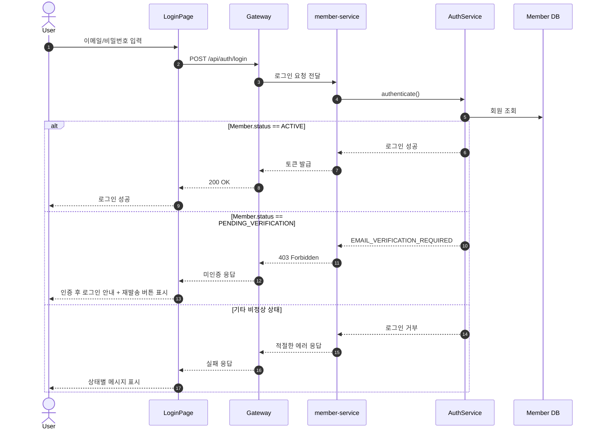
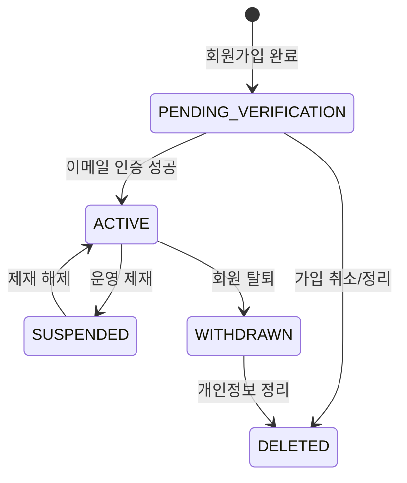
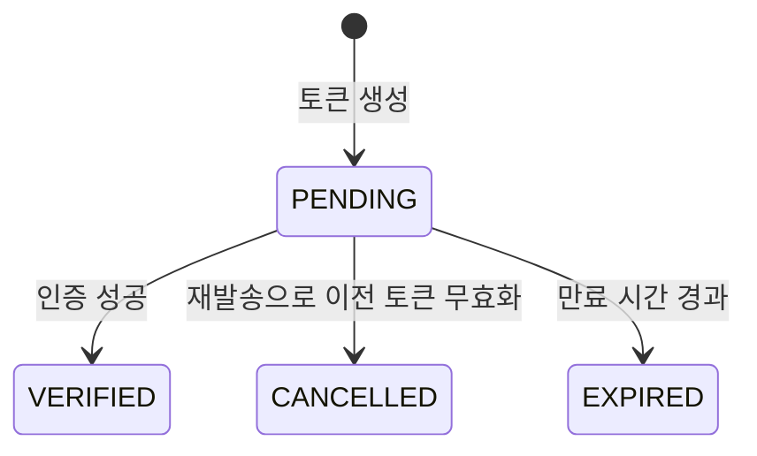

# SMTP Email Verification Flow Diagram

## 개요

이 문서는 `LoggingEmailSender` 대신 실제 `SmtpEmailSender`가 적용되었을 때,
회원가입부터 이메일 인증 완료까지의 흐름을 mermaid 다이어그램으로 설명한다.

주요 구성 요소:

- FE Signup / Login / Verification Pages
- Gateway
- member-service
- EmailVerificationService
- SmtpEmailSender
- 외부 SMTP provider
- 사용자 메일함

## 1. 회원가입 후 인증 메일 발송 흐름

## 2. 인증 메일 재발송 흐름

## 3. 이메일 인증 확인 흐름

## 4. 로그인 시 미인증 회원 차단 흐름

## 5. 회원 상태 전이

## 6. EmailVerification 상태 전이

## 7. SMTP 적용 시 추가 관찰 포인트

- `EmailVerificationService`는 토큰 생성과 상태 변경의 중심이다.
- 실제 메일 발송 책임은 `SmtpEmailSender`가 가진다.
- SMTP provider 장애가 발생하면 회원가입/재발송 요청도 실패 처리될 수 있다.
- local 환경은 `LoggingEmailSender`, staging/prod는 `SmtpEmailSender`로 분기하는 구성이 적합하다.
- FE는 이제 문자열이 아니라 `EMAIL_VERIFICATION_REQUIRED`, `EMAIL_VERIFICATION_TOKEN_EXPIRED` 같은 전용 코드로 UX를 분기한다.
