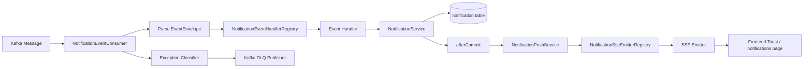

# Notification Architecture

## 목적
- notification 모듈이 어떤 입력을 받아 어떤 경로로 저장하고 전달하는지 설명한다.
- merge 이후 다른 팀원이 현재 구조를 빠르게 이해할 수 있도록 핵심 컴포넌트와 책임을 정리한다.

## 현재 구현 범위
- Kafka consumer로 실제 구독 중인 이벤트
  - `MEMBER_SIGNED_UP`
  - `ORDER_PAYMENT_RESULT`
- REST API
  - 내 알림 목록 조회
  - 미읽음 개수 조회
  - 읽음 처리
- SSE
  - `/api/notifications/stream` 구독
  - 저장 완료 후 실시간 push 시도
- DLQ
  - consumer 실패를 `DLQ / RETRY / IGNORE`로 분기
  - DLQ 대상은 Kafka DLQ topic으로 발행

## 상위 수준 흐름
1. Kafka 메시지가 notification consumer로 들어온다.
2. `NotificationEventConsumer`가 공통 envelope를 파싱한다.
3. `eventType` 기준으로 handler registry에서 적절한 handler를 찾는다.
4. handler가 payload를 자기 타입으로 변환하고 검증한 뒤 usecase를 호출한다.
5. `NotificationService`가 중복 여부를 확인하고 알림을 저장한다.
6. 트랜잭션 커밋 이후 `NotificationPushService`가 SSE push를 시도한다.
7. push 성공 시 `PUSHED`, 전송 예외 시 `FAILED`, emitter 부재 시 `STORED` 유지 또는 후속 retry 후보가 된다.

## 주요 컴포넌트

### 1. Unified Kafka Consumer
- 파일:
  - `notification/src/main/java/com/example/notification/infrastructure/messaging/kafka/consumer/NotificationEventConsumer.java`
- 역할:
  - 여러 토픽 구독
  - `EventEnvelope<JsonNode>` 파싱
  - `eventType -> handler` dispatch
  - 공통 예외 분류
  - `DLQ / RETRY / IGNORE` 분기

### 2. Event Handler Registry
- 파일:
  - `notification/src/main/java/com/example/notification/infrastructure/messaging/kafka/handler/NotificationEventHandlerRegistry.java`
- 역할:
  - `eventType`별 handler lookup
  - 중복 handler 등록 방지
  - 미지원 event type 차단

### 3. Event Handlers
- 파일:
  - `notification/src/main/java/com/example/notification/infrastructure/messaging/kafka/handler/MemberSignedUpNotificationEventHandler.java`
  - `notification/src/main/java/com/example/notification/infrastructure/messaging/kafka/handler/OrderPaymentResultNotificationEventHandler.java`
- 역할:
  - `JsonNode` payload를 typed payload로 변환
  - 이벤트별 validation 수행
  - 적절한 usecase 호출

### 4. Notification Service
- 파일:
  - `notification/src/main/java/com/example/notification/application/service/NotificationService.java`
- 역할:
  - 알림 저장
  - `eventId` 기준 멱등성 처리
  - 목록 조회 / 읽음 처리
  - 저장 후 `afterCommit` 시점 push 예약

### 5. Push Service
- 파일:
  - `notification/src/main/java/com/example/notification/application/service/NotificationPushService.java`
- 역할:
  - 현재 연결된 emitter 조회
  - SSE event 전송
  - `PUSHED / FAILED` 상태 갱신
  - 이미 `PUSHED`인 알림 no-op 처리

### 6. SSE Registry / Controller
- 파일:
  - `notification/src/main/java/com/example/notification/infrastructure/sse/NotificationSseEmitterRegistry.java`
  - `notification/src/main/java/com/example/notification/presentation/controller/NotificationSseController.java`
- 역할:
  - member별 활성 emitter 관리
  - SSE 연결 등록
  - stale callback이 새 emitter를 제거하지 않도록 emitter instance 기준 제거

### 7. DLQ Components
- 파일:
  - `notification/src/main/java/com/example/notification/infrastructure/messaging/kafka/dlq/DefaultNotificationConsumerExceptionClassifier.java`
  - `notification/src/main/java/com/example/notification/infrastructure/messaging/kafka/dlq/KafkaNotificationDlqPublisher.java`
- 역할:
  - consumer 예외를 reason 기반으로 분류
  - DLQ topic으로 실패 메시지 발행

## 데이터 흐름

### 이벤트 소비에서 저장까지
1. consumer가 raw message를 수신한다.
2. message를 `EventEnvelope<JsonNode>`로 파싱한다.
3. `eventType`으로 handler를 찾는다.
4. handler가 payload 타입 변환 및 필드 검증을 수행한다.
5. handler가 usecase를 호출한다.
6. `NotificationService`가 `eventId` 중복 여부를 확인한다.
7. 중복이 아니면 `Notification`을 `STORED` 상태로 저장한다.

### 저장 이후 실시간 push까지
1. 저장 트랜잭션이 commit 된다.
2. `NotificationService.pushAfterCommit(...)`가 `NotificationPushService.push(...)`를 호출한다.
3. emitter가 있으면 SSE `notification` 이벤트를 전송한다.
4. 성공 시 `PUSHED`, send 예외 시 `FAILED`로 상태를 갱신한다.
5. emitter가 없으면 현재는 `STORED`에 머무르며 delivery retry 후보로 본다.

### consumer 실패 처리
1. consumer 또는 handler에서 예외 발생
2. classifier가 예외를 `DLQ / RETRY / IGNORE`로 분류
3. `DLQ`
   - Kafka DLQ topic으로 발행
4. `RETRY`
   - 예외 재던짐
5. `IGNORE`
   - 조용히 종료

## 상태 해석
- `STORED`
  - 알림 저장 완료
  - 아직 push 성공은 아님
- `PUSHED`
  - 서버 기준 `emitter.send(...)` 성공
  - 브라우저 렌더링 완료 보장은 아님
- `FAILED`
  - SSE send 예외 등으로 delivery 실패
- `RETRYING`
  - retry 메커니즘 도입 시 사용할 상태

## Mermaid Diagram

## 현재 merge 범위 밖 항목
- retry job table + scheduler
- displayed ack
- DLQ replay 도구
- 추가 event handler
  - `AUTO_PURCHASE_CONFIRMED`
  - `SELLER_SETTLEMENT_PAYOUT_SUCCEEDED`
  - `SELLER_SETTLEMENT_PAYOUT_FAILED`

## 참고 문서
- [EventDesign.md](C:/my_project/beadv5_2_TodayLunchMenu_BE/notification/docs/EventDesign.md)
- [APISpec.md](C:/my_project/beadv5_2_TodayLunchMenu_BE/notification/docs/APISpec.md)
- [StateTransition.md](C:/my_project/beadv5_2_TodayLunchMenu_BE/notification/docs/StateTransition.md)
- [DLQImplementationPlan.md](C:/my_project/beadv5_2_TodayLunchMenu_BE/notification/docs/DLQImplementationPlan.md)
- [DLQStrategy.md](C:/my_project/beadv5_2_TodayLunchMenu_BE/notification/docs/DLQStrategy.md)
