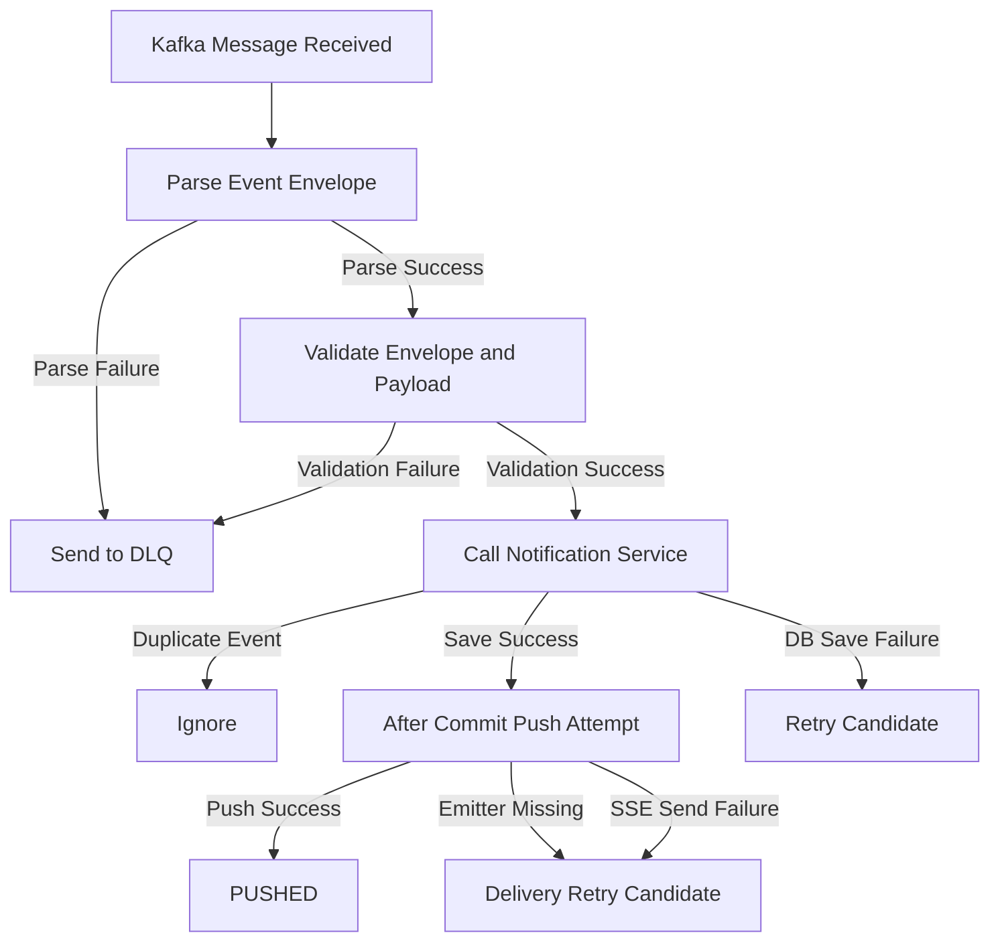
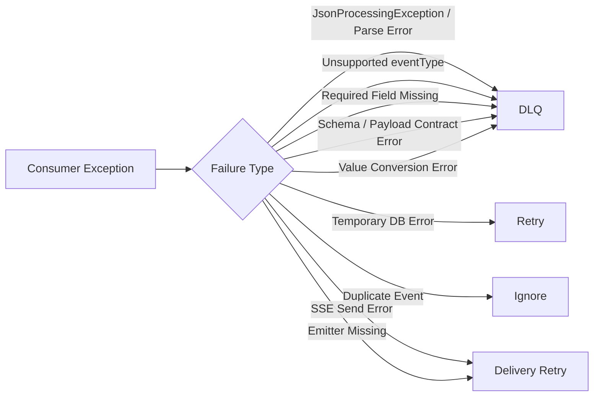
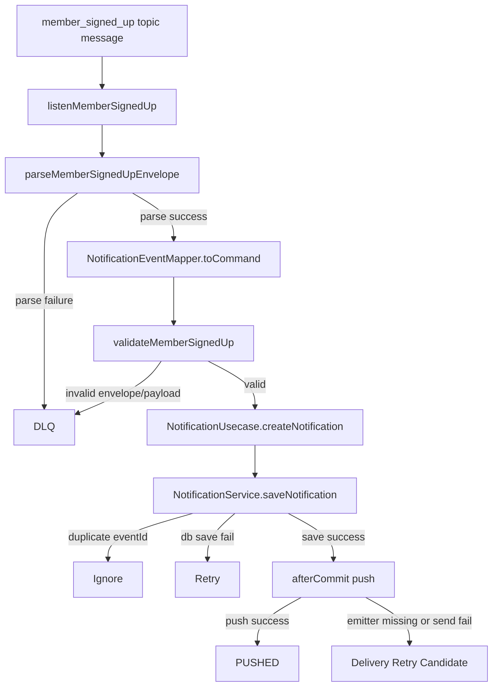
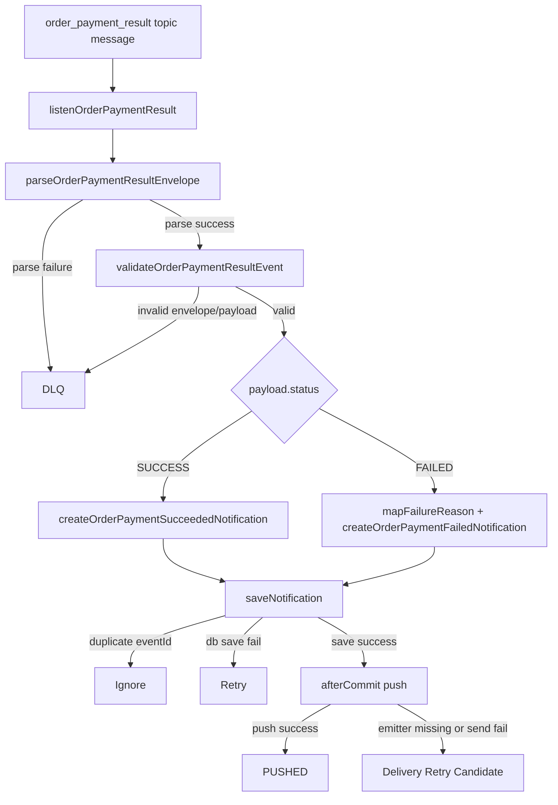
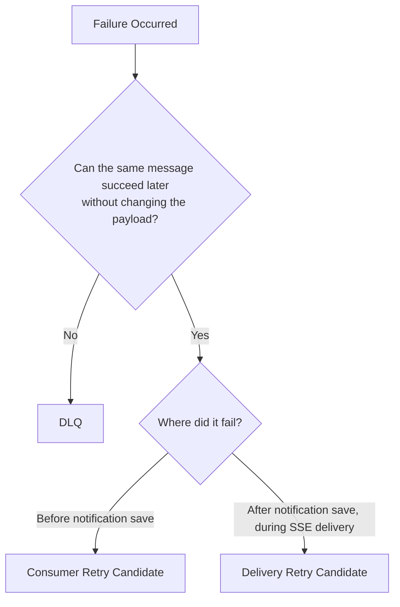
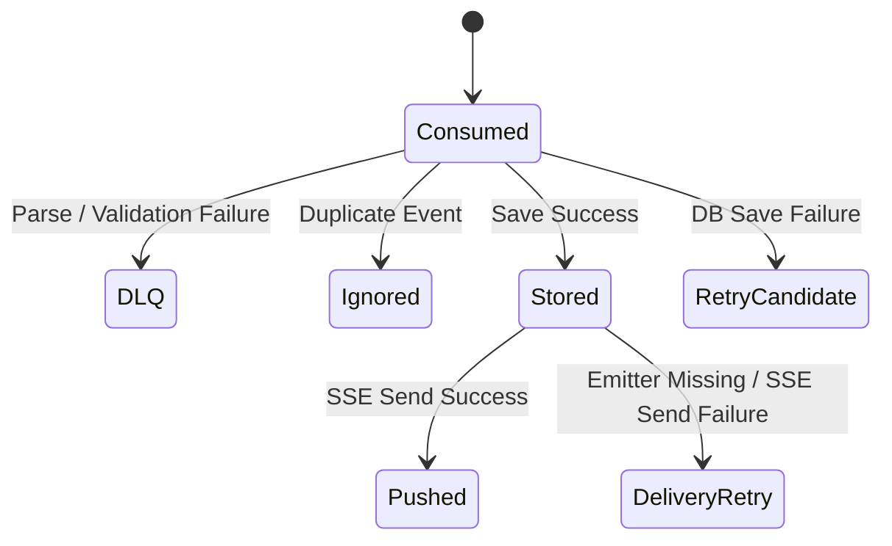

# Notification DLQ Diagram

## 목적
- notification 서비스에서 DLQ가 필요한 이유와 분기 기준을 시각적으로 설명한다.
- 현재 consumer 흐름 기준으로 어떤 실패가 `DLQ`, `RETRY`, `IGNORE`로 가는지 한눈에 보여준다.

## 1. 전체 개요

## 2. Consumer 기준 분기

## 3. MEMBER_SIGNED_UP 흐름

## 4. ORDER_PAYMENT_RESULT 흐름

## 5. DLQ와 Retry의 경계

## 6. 상태 관점 요약

## 7. 현재 프로젝트 기준 해석
- `DLQ`
  - 역직렬화 실패
  - 필수 필드 누락
  - event type 불일치
  - payload contract 위반
  - amount 변환 실패
- `RETRY`
  - DB 저장 실패
- `IGNORE`
  - `eventId` 기준 중복 이벤트
- `DELIVERY RETRY`
  - SSE send 예외
  - emitter 부재

## 8. 한 줄 정리
- 메시지 자체가 잘못되면 `DLQ`
- 같은 메시지를 나중에 다시 처리하면 성공할 수 있으면 `RETRY`
- 이미 처리한 이벤트면 `IGNORE`
- 알림 저장은 끝났고 브라우저 전달만 실패했으면 `DELIVERY RETRY`

## 참고 문서
- [CurrentConsumerFlowReview.md](C:/my_project/beadv5_2_TodayLunchMenu_BE/notification/docs/CurrentConsumerFlowReview.md)
- [DLQImplementationPlan.md](C:/my_project/beadv5_2_TodayLunchMenu_BE/notification/docs/DLQImplementationPlan.md)
- [RetryStrategy.md](C:/my_project/beadv5_2_TodayLunchMenu_BE/notification/docs/RetryStrategy.md)
