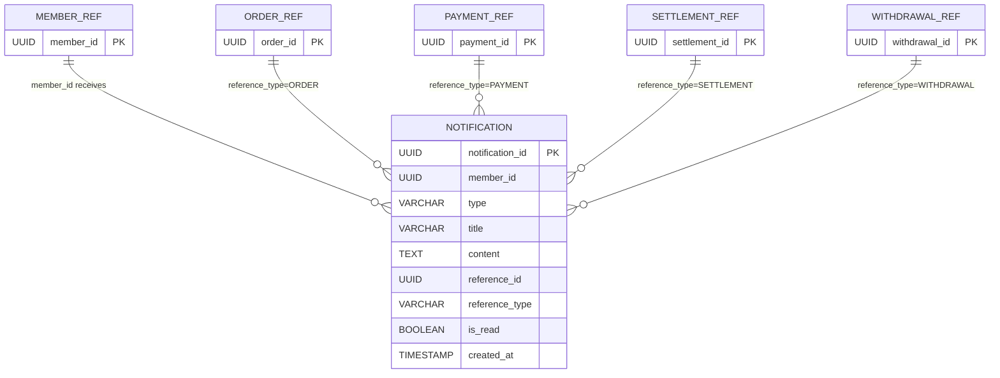

# Notification ERD

## Mermaid Diagram

## 관계 해설
- `MEMBER_REF -> NOTIFICATION`: 알림은 특정 회원에게 귀속된다.
- `ORDER_REF -> NOTIFICATION`: 주문 관련 알림일 때 `reference_id` 는 주문 ID 를 가진다.
- `PAYMENT_REF -> NOTIFICATION`: 결제 관련 알림일 때 `reference_id` 는 결제 ID 를 가진다.
- `SETTLEMENT_REF -> NOTIFICATION`: 정산 관련 알림일 때 `reference_id` 는 정산 ID 를 가진다.
- `WITHDRAWAL_REF -> NOTIFICATION`: 출금 관련 알림일 때 `reference_id` 는 출금 ID 를 가진다.
- 실제 테이블에는 외래키가 없고, `reference_type + reference_id` 조합으로 참조 대상을 표현한다.

## 엔티티

### `notification.notification`
| 컬럼 | 타입 | 제약 |
| --- | --- | --- |
| `notification_id` | UUID | PK |
| `member_id` | UUID | NOT NULL |
| `type` | VARCHAR(50) | NOT NULL |
| `title` | VARCHAR(255) | NOT NULL |
| `content` | TEXT | NOT NULL |
| `reference_id` | UUID | NULL |
| `reference_type` | VARCHAR(50) | NULL |
| `is_read` | BOOLEAN | NOT NULL, 기본값 `false` |
| `created_at` | TIMESTAMP | NOT NULL |

## 인덱스
- `idx_notification_member_created_at (member_id, created_at DESC)`
- `idx_notification_member_is_read (member_id, is_read)`

## reference_type 예시
| reference_type | reference_id 의미 | 예시 사용 시나리오 |
| --- | --- | --- |
| `ORDER` | 주문 ID | 자동 구매 확정, 주문 진행 알림 |
| `PAYMENT` | 결제 ID | 결제 성공, 결제 실패 알림 |
| `SETTLEMENT` | 정산 ID | 판매자 정산 지급 성공/실패 알림 |
| `WITHDRAWAL` | 출금 ID | 출금 요청, 출금 완료/실패 알림 |

## 관계
- `notification N : 1 member`
  - 물리적 FK 는 없지만 `member_id` 로 회원을 식별한다.
- `reference_id` 는 알림 종류에 따라 `order`, `payment`, `settlement`, `withdrawal` 같은 외부 집계 루트를 가리킨다.
- `reference_type` 은 `reference_id` 가 어떤 도메인 엔티티를 가리키는지 구분한다.
