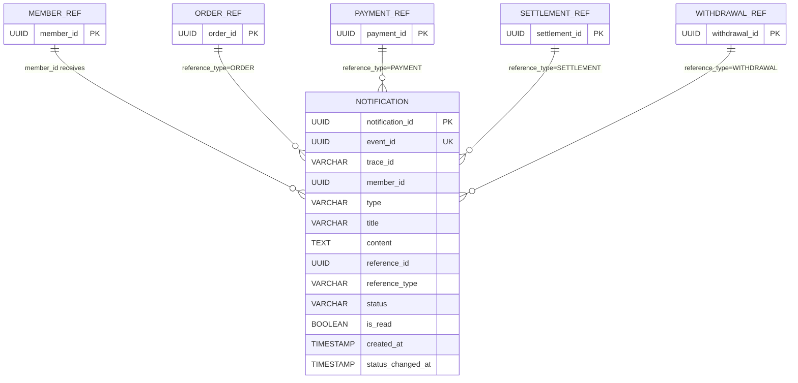

# Notification ERD

## Mermaid Diagram

## 관계 해설
- `MEMBER_REF -> NOTIFICATION`: 알림은 특정 회원에게 귀속된다.
- `reference_type + reference_id` 조합으로 외부 도메인 리소스를 표현한다.
- 실제 DB에는 물리적 외래키를 두지 않고 애플리케이션 레벨에서 참조 의미를 해석한다.
- `event_id`는 알림을 발생시킨 원본 이벤트 식별자로, 중복 생성 방지 키로 사용한다.

## 엔티티

### `notification.notification`
| 컬럼 | 타입 | 제약 |
| --- | --- | --- |
| `notification_id` | UUID | PK |
| `event_id` | UUID | NOT NULL, UNIQUE |
| `trace_id` | VARCHAR(100) | NULL |
| `member_id` | UUID | NOT NULL |
| `type` | VARCHAR(50) | NOT NULL |
| `title` | VARCHAR(255) | NOT NULL |
| `content` | TEXT | NOT NULL |
| `reference_id` | UUID | NULL |
| `reference_type` | VARCHAR(50) | NULL |
| `status` | VARCHAR(30) | NOT NULL |
| `is_read` | BOOLEAN | NOT NULL, 기본값 `false` |
| `created_at` | TIMESTAMP | NOT NULL |
| `status_changed_at` | TIMESTAMP | NOT NULL |

## 인덱스
- `idx_notification_member_created_at (member_id, created_at DESC)`
- `idx_notification_member_is_read (member_id, is_read)`
- `uq_notification_event_id (event_id)`

## reference_type 예시
| reference_type | reference_id 의미 | 예시 사용 시나리오 |
| --- | --- | --- |
| `ORDER` | 주문 ID | 자동 구매 확정, 주문 결제 결과 알림 |
| `PAYMENT` | 결제 ID | 결제 도메인 자원 참조 |
| `SETTLEMENT` | 정산 ID | 판매자 정산 지급 성공/실패 알림 |
| `WITHDRAWAL` | 출금 ID | 출금 관련 알림 |

## 상태 컬럼 의미
| 상태 | 설명 |
| --- | --- |
| `RECEIVED` | 이벤트를 수신한 상태 |
| `STORED` | 알림 저장 완료 |
| `PUSHED` | SSE 푸시 완료 |
| `FAILED` | 처리 실패 |
| `RETRYING` | 재시도 중 |
