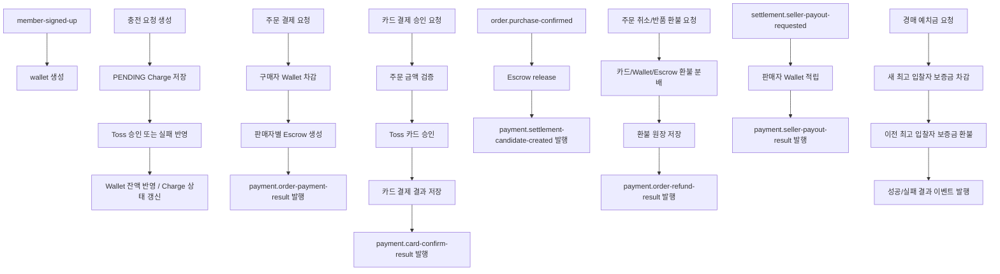

# Payment Service

`payment` 모듈은 Today Lunch Mall의 지갑, 충전, 카드 결제, 주문 결제, 에스크로, 환불, 출금, 판매자 정산금 적립을 담당하는 서비스입니다.

현재 구현 범위는 다음과 같습니다.

- 회원 가입 시 지갑 생성
- 지갑 충전 요청 생성 및 Toss 승인/실패 반영
- 카드 결제 승인 확정
- 주문 결제 시 구매자 지갑 차감 및 판매자별 에스크로 생성
- 구매 확정 이후 에스크로 release 및 정산 후보 이벤트 발행
- 주문 취소/반품 환불
- 예치금 출금
- 경매 입찰 예치금 차감 및 이전 최고 입찰자 환불
- settlement 모듈의 지급 요청을 받아 판매자 지갑에 정산금 적립

이 README는 배포 정보보다 현재 구현된 기능과 API, 이벤트 흐름을 기준으로 정리한 완성본입니다.

## 1. 핵심 역할

| 기능 | 설명 |
|---|---|
| 지갑 관리 | 회원별 `Wallet`을 생성하고 잔액을 조회합니다. |
| 충전 | `Charge`를 만들고 Toss 승인/실패 결과를 반영합니다. |
| 카드 결제 | 주문 기준 카드 결제를 승인하고 검증 결과를 기록합니다. |
| 주문 결제 | 구매자 지갑에서 금액을 차감하고 판매자별 `Escrow`를 생성합니다. |
| 에스크로 정산 준비 | 구매 확정 이후 `Escrow`를 release 하고 `payment.settlement-candidate-created`를 발행합니다. |
| 주문 환불 | 카드 환불, wallet 환불, 에스크로 환불을 분리 계산해 반영합니다. |
| 출금 | 지갑 잔액을 차감하고 출금 요청 및 거래 내역을 남깁니다. |
| 경매 예치금 | 새 최고 입찰자의 보증금을 잡고 이전 최고 입찰자의 보증금을 환불합니다. |
| 판매자 정산금 적립 | settlement의 지급 요청을 받아 판매자 지갑에 적립하고 결과 이벤트를 발행합니다. |

## 2. 제공 API

| Method | Path | 설명 |
|---|---|---|
| `GET` | `/api/payments/wallet` | 내 지갑 조회 |
| `GET` | `/api/payments/charges` | 내 충전 목록 조회 |
| `GET` | `/api/payments/charges/{chargeId}` | 충전 상세 조회 |
| `GET` | `/api/payments/transactions` | 내 지갑 거래내역 조회 |
| `GET` | `/api/payments/seller/pending-incomes` | 판매자 지급 대기 에스크로 조회 |
| `GET` | `/api/payments/withdrawals` | 내 출금 목록 조회 |
| `GET` | `/api/payments/seller/orders/{orderId}/escrow-transactions` | 판매자 주문별 에스크로 이력 조회 |
| `POST` | `/api/payments/charge` | 충전 요청 생성 |
| `POST` | `/api/payments/charge/fail` | 충전 실패 반영 |
| `POST` | `/api/payments/confirm` | 충전 승인 확정 |
| `POST` | `/api/payments/card/confirm` | 카드 결제 승인 확정 |
| `POST` | `/api/payments/orders` | 주문 결제 |
| `POST` | `/api/payments/cancellations` | 주문 취소 환불 |
| `POST` | `/api/payments/seller/refunds/confirm` | 판매자 반품 확인 후 환불 |
| `POST` | `/api/payments/withdrawals` | 예치금 출금 요청 |
| `POST` | `/api/payments/auctions/bid-fees` | 경매 예치금 차감 및 환불 처리 |

인증 특징:

- `wallet`, `charges`, `transactions`, `withdrawals` 계열은 인증이 필요합니다.
- `seller/orders/{orderId}/escrow-transactions` 와 `seller/refunds/confirm` 은 `SELLER` 권한이 필요합니다.
- `POST /api/payments/confirm` 과 `POST /api/payments/orders` 는 인증 없이 호출되는 내부/콜백 성격 API입니다.
- `POST /api/payments/card/confirm` 은 로그인한 구매자 기준으로 처리됩니다.

## 3. 전체 흐름도



## 4. 기능별 동작

### 4.1 지갑과 충전

충전 흐름은 두 단계입니다.

- `POST /api/payments/charge` 는 `PENDING` 충전 요청만 생성합니다.
- `POST /api/payments/confirm` 이 실제 승인 확정 단계이며, 승인되면 지갑 잔액이 증가합니다.
- `POST /api/payments/charge/fail` 은 PG 실패 결과를 charge 상태에 반영합니다.

주요 응답 필드:

- 충전 요청 생성: `chargeId`, `walletId`, `pgOrderId`, `amount`, `chargeStatus`
- 충전 승인 확정: `chargeId`, `chargeStatus`, `approvedAmount`, `walletBalance`, `approvedAt`
- 충전 실패 반영: `chargeId`, `chargeStatus`, `orderId`, `failureReason`, `failedAt`

### 4.2 카드 결제 승인

- 엔드포인트: `POST /api/payments/card/confirm`
- 로그인한 구매자 기준으로 동작합니다.
- 내부적으로 주문 서비스 결제 검증을 먼저 수행합니다.
- 검증이 통과하면 Toss 카드 승인을 호출합니다.
- 성공 시 카드 결제 결과를 저장하고 `payment.card-confirm-result` 이벤트를 발행합니다.
- 실패 시 한글 예외 메시지와 함께 원인을 반환합니다.

주요 응답 필드:

- `transactionGroupId`
- `orderId`
- `buyerId`
- `amount`
- `status`
- `approvedAt`

### 4.3 주문 결제와 에스크로

- 엔드포인트: `POST /api/payments/orders`
- 구매자 지갑에서 결제 금액을 차감합니다.
- 주문 라인 기준으로 판매자별 에스크로를 생성합니다.
- 결과는 HTTP 응답과 `payment.order-payment-result` 이벤트로 함께 전달합니다.

검증 포인트:

- `orderLines` 는 비어 있으면 안 됩니다.
- 각 금액은 양수여야 합니다.
- `sum(orderLines.lineTotalPrice) == totalPrice` 여야 합니다.

주요 응답 필드:

- `orderId`
- `buyerMemberId`
- `amount`
- `status`
- `reasonCode`

### 4.4 구매 확정과 정산 후보 발행

- `order.purchase-confirmed` 이벤트를 소비합니다.
- 해당 주문의 에스크로를 release 합니다.
- release 가 완료되면 `payment.settlement-candidate-created` 이벤트를 발행합니다.
- settlement 모듈은 이 이벤트를 받아 `SettlementItem`을 생성합니다.

### 4.5 주문 환불

환불은 `PaymentRefund` 기준으로 처리됩니다.

- 주문 취소 환불: `POST /api/payments/cancellations`
- 판매자 반품 확인 후 환불: `POST /api/payments/seller/refunds/confirm`

처리 방식:

- 카드 환불 금액과 wallet 환불 금액을 분리 계산합니다.
- 필요한 경우 구매자 wallet에 금액을 되돌리고 거래 내역을 남깁니다.
- 에스크로도 함께 환불 방향으로 반영합니다.
- 결과를 `payment.order-refund-result` 이벤트로 발행합니다.

응답 필드:

- `refundId`
- `orderId`
- `orderCancelRequestId`
- `refundStatus`
- `refundType`
- `totalRefundAmount`
- `itemResults`
- `processedAt`

### 4.6 예치금 출금

- 엔드포인트: `POST /api/payments/withdrawals`
- 인증된 사용자 공통 wallet 기능입니다.
- 출금 요청 금액만큼 지갑 잔액을 차감합니다.
- 계좌번호와 예금주는 암호화 저장합니다.
- 응답에는 마스킹된 계좌번호만 내려갑니다.
- 현재는 실제 은행 연동이 아니라 Mock 완료 처리입니다.

정책:

- 최소 출금 금액: `5000원`
- 고정 수수료: `1000원`
- `amount > fee`
- `wallet balance >= amount`

주요 응답 필드:

- `withdrawRequestId`
- `amount`
- `fee`
- `actualAmount`
- `maskedBankAccount`
- `status`
- `walletBalance`
- `requestedAt`
- `processedAt`

### 4.7 경매 예치금

- 엔드포인트: `POST /api/payments/auctions/bid-fees`
- 새 최고 입찰자의 예치금을 차감합니다.
- 이전 최고 입찰자가 있으면 기존 예치금을 환불합니다.
- 내부적으로 `AuctionDeposit` 과 `WalletTransaction` 을 함께 기록합니다.
- 결과는 성공/실패 이벤트로 발행됩니다.

요청 특징:

- `bidId`, `auctionId`, `highestBidderId`, `highestBidderFee` 가 핵심 필드입니다.
- 첫 입찰이 아니면 `previousBidderId`, `previousBidderPaidFee` 가 함께 와야 합니다.

### 4.8 판매자 정산금 적립

- `settlement.seller-payout-requested` 이벤트를 소비합니다.
- 판매자 wallet에 정산금을 적립합니다.
- `settlementType` 에 따라 `MONTHLY_SETTLEMENT` 또는 `PARTIAL_SETTLEMENT` 거래 원장을 남깁니다.
- 처리 결과를 `payment.seller-payout-result` 로 발행합니다.

## 5. 조회 API 요약

| API | 주요 데이터 |
|---|---|
| `GET /wallet` | `walletId`, `memberId`, `balance`, `updatedAt` |
| `GET /charges` | 충전 목록 페이징 조회 |
| `GET /charges/{chargeId}` | 충전 단건 상세 |
| `GET /transactions` | 충전/결제/환불/출금/정산 적립 거래내역 |
| `GET /seller/pending-incomes` | 판매자 지급 대기 에스크로 목록 |
| `GET /withdrawals` | 출금 요청 목록 |
| `GET /seller/orders/{orderId}/escrow-transactions` | 판매자 주문 단위 에스크로 변동 이력 |

특이사항:

- 모든 목록 조회 API는 `page`, `size` 기반 페이징을 사용합니다.
- 현재 `size <= 100` 제한이 있습니다.
- 판매자 주문 에스크로 이력 조회는 `SELLER` 권한이 필요합니다.

## 6. Kafka 이벤트

### 6.1 소비하는 토픽

| Topic | 목적 |
|---|---|
| `member-signed-up` | 회원 생성 시 wallet 생성 |
| `order.purchase-confirmed` | 구매 확정 이후 escrow release |
| `settlement.seller-payout-requested` | 판매자 정산금 적립 요청 |
| `auction.bid-fee.charge.requested` | 경매 예치금 처리 요청 |

### 6.2 발행하는 토픽

| Topic | 목적 |
|---|---|
| `payment.order-payment-result` | 주문 결제 결과 전달 |
| `payment.order-refund-result` | 주문 환불 결과 전달 |
| `payment.settlement-candidate-created` | 정산 후보 생성 알림 |
| `payment.seller-payout-result` | 판매자 정산금 적립 결과 전달 |
| `payment.card-confirm-result` | 카드 결제 승인 결과 전달 |
| `payment.bid-fee.charge.succeeded` | 경매 예치금 처리 성공 알림 |
| `payment.bid-fee.charge.failed` | 경매 예치금 처리 실패 알림 |

DLQ:

- `settlement.seller-payout-requested.dlq`

컨슈머 그룹:

- `payment-service`

## 7. 공통 응답 형식

모든 HTTP 응답은 `ApiResponse<T>` 포맷을 사용합니다.

성공:

```json
{
  "success": true,
  "data": {
    "...": "..."
  },
  "error": null
}
```

실패:

```json
{
  "success": false,
  "data": null,
  "error": {
    "code": "INVALID_INPUT_VALUE",
    "message": "입력값이 올바르지 않습니다."
  }
}
```

## 8. 주요 예외 코드

| 코드 | 의미 |
|---|---|
| `INVALID_CHARGE_REQUEST` | 충전 요청 오류 |
| `INVALID_CARD_PAYMENT_REQUEST` | 카드 결제 요청 오류 |
| `INVALID_ORDER_PAYMENT_REQUEST` | 주문 결제/환불 요청 오류 |
| `INVALID_AUCTION_BID_FEE_REQUEST` | 경매 예치금 요청 오류 |
| `INVALID_WITHDRAW_REQUEST` | 출금 요청 오류 |
| `INVALID_WITHDRAW_ACCOUNT` | 출금 계좌 정보 오류 |
| `WITHDRAW_AMOUNT_BELOW_MINIMUM` | 최소 출금 금액 미달 |
| `WITHDRAW_AMOUNT_NOT_GREATER_THAN_FEE` | 수수료 이하 출금 요청 |
| `INVALID_INPUT_VALUE` | 공통 입력값 오류 |
| `CHARGE_NOT_FOUND` | 충전 내역 없음 |
| `AUCTION_DEPOSIT_NOT_FOUND` | 경매 예치금 원장 없음 |
| `ESCROW_NOT_FOUND` | 에스크로 없음 |
| `WALLET_NOT_FOUND` | 지갑 없음 |
| `INSUFFICIENT_WALLET_BALANCE` | 잔액 부족 |
| `INVALID_STATE` | 현재 상태에서 처리 불가 |
| `PAYMENT_GATEWAY_ERROR` | Toss 연동 실패 |

예외 처리 특징:

- 인증 오류는 `INVALID_TOKEN` 으로 내려갑니다.
- Bean Validation 실패는 첫 번째 필드 오류 메시지로 응답합니다.
- `IllegalArgumentException` 은 `INVALID_INPUT_VALUE`, `IllegalStateException` 은 `INVALID_STATE` 로 변환됩니다.

## 9. 주요 도메인

| 개념 | 설명 |
|---|---|
| `Wallet` | 회원별 잔액 계좌 |
| `Charge` | 충전 요청 및 승인 상태 |
| `WalletTransaction` | 충전, 결제, 환불, 출금, 정산 적립 원장 |
| `AuctionDeposit` | 경매 입찰 예치금 원장 |
| `WithdrawRequest` | 출금 요청 이력 |
| `Escrow` | 주문 결제 후 판매자별 보관 금액 |
| `PaymentRefund` | 주문 환불 원장 |
| `PaymentRefundAllocation` | 카드 환불 / wallet 환불 분해 원장 |

정산 적립 관련 기준:

| 항목 | 값 |
|---|---|
| payout 요청 수신 토픽 | `settlement.seller-payout-requested` |
| 지급 구분 | `SettlementPayoutType.MONTHLY`, `SettlementPayoutType.PARTIAL` |
| 거래 원장 referenceType | `MONTHLY_SETTLEMENT`, `PARTIAL_SETTLEMENT` |