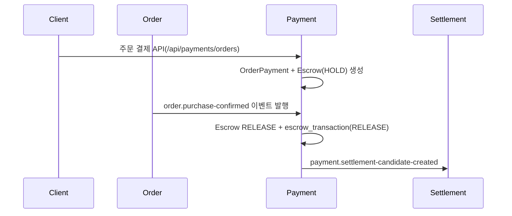
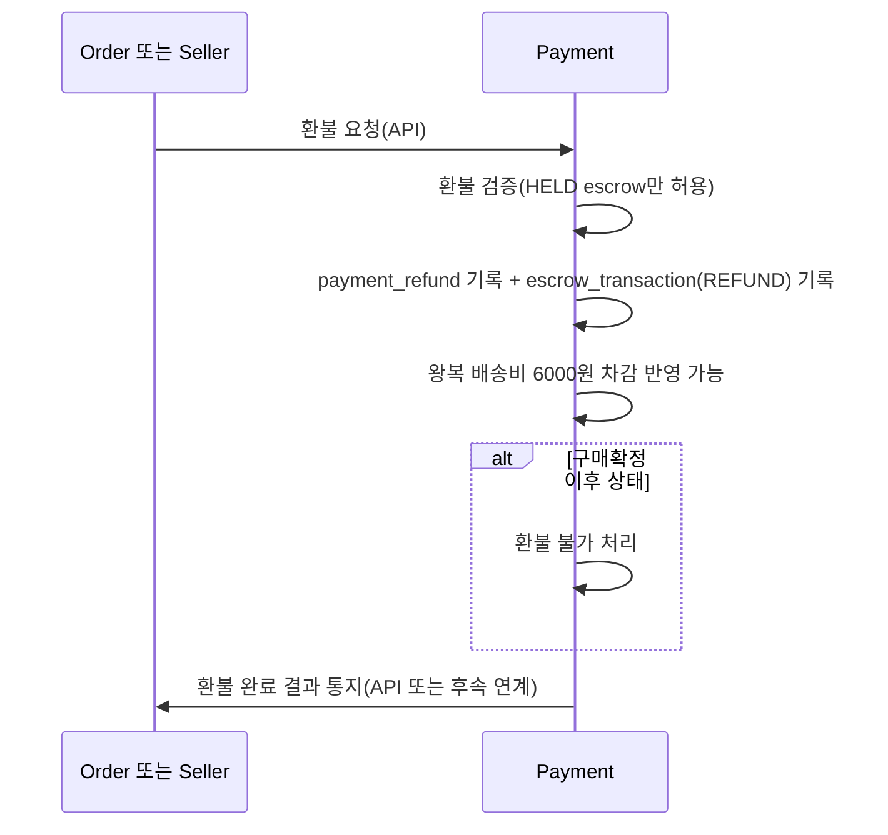

# Payment 모듈 정리 (주문 결제 ~ 정산/환불 연계)

작성일: 2026-04-15
최종 수정일: 2026-04-19

## 1. 문서 목적

이 문서는 `payment` 모듈이 주문 결제 이후 어떤 방식으로 `escrow`, `refund`, `settlement`와 연결되는지 팀원이 빠르게 파악하도록 정리한 안내서입니다.

## 문서 수정 메모

기존 문서에는 `ORDER_AUTO_PURCHASE_CONFIRM_DAYS = 7`, `7일 대기`가 payment 내부 정책처럼 적혀 있었는데, 현재 payment 코드에는 해당 대기 정책이 직접 구현되어 있지 않습니다.

현재 코드 기준으로 보면:

- payment는 `order.purchase-confirmed` 이벤트를 받으면 escrow release를 수행합니다.
- `7일 대기`는 payment 내부 로직이 아니라 상위 모듈 또는 운영 정책 설명에 더 가깝습니다.
- 판매자 환불 진입은 현재 `POST /api/payments/seller/refunds/confirm` API입니다.

## 2. Payment 책임 범위

| 구분 | 책임 |
|---|---|
| 결제 처리 | 주문 결제, 충전, 카드 승인, 결제 실패 반영 |
| 원장 관리 | `escrow`, `escrow_transaction`, `payment_refund`, `withdraw_request` 기록 |
| 환불 정책 실행 | 구매확정 전 `HELD escrow` 상태 기준 환불 처리 |
| 정산 연계 | 구매확정 이벤트 수신 후 정산 후보 생성 이벤트 발행 |

## 3. 전달 정책 값

| 항목 | 기본값 | 설명 |
|---|---|---|
| `payment.kafka.topics.order-purchase-confirmed` | `order.purchase-confirmed` | 구매확정 이벤트 수신 |
| `payment.kafka.topics.settlement-candidate-created` | `payment.settlement-candidate-created` | 정산 후보 생성 이벤트 발행 |

추가 설명:

- 현재 payment 문서에서는 `ORDER_AUTO_PURCHASE_CONFIRM_DAYS`를 내부 설정값으로 보지 않습니다.
- payment는 구매확정 대기 일수를 계산하지 않고, 구매확정 이벤트를 받은 뒤 후속 처리만 담당합니다.

## 4. 주문 결제 이후 처리 흐름

### 4.1 정상 흐름

현재 코드 기준 설명:

- payment는 `order.purchase-confirmed` 이벤트를 소비한 뒤 바로 release 로직을 수행합니다.
- `7일 대기`는 이 문서의 payment 내부 처리 순서에서 제거합니다.

### 4.2 환불 흐름

현재 코드 기준 설명:

- 주문 취소 환불은 `POST /api/payments/cancellations`
- 판매자 반품 환불은 `POST /api/payments/seller/refunds/confirm`
- 기존 문서의 `API 또는 Kafka` 표현은 현재 진입 방식 기준으로는 맞지 않으므로 API 기준으로 수정합니다.

## 5. API 통신과 이유

| 통신 | 경로 | 이유 | 역할 |
|---|---|---|---|
| API | `Order -> Payment` 주문 결제, 주문 취소 환불, 판매자 환불 | 즉시 응답 필요 | 결제, 환불 트랜잭션 시작 |
| API | `Payment -> Order` 환불 완료 알림 | 주문 상태와 환불 상태 정합성 유지 | 주문 후속 처리 |
| Kafka | `Order -> Payment` 구매확정 이벤트 | 비동기 후속 처리 | Escrow RELEASE 트리거 |
| Kafka | `Payment -> Settlement` 후보 생성 이벤트 | 모듈 분리와 비동기 반영 | 정산 반영 트리거 |

## 6. 주요 API 목록

| 메서드 | 경로 | 설명 |
|---|---|---|
| `POST` | `/api/payments/orders` | 주문 결제 |
| `POST` | `/api/payments/cancellations` | 주문 취소 환불 |
| `POST` | `/api/payments/seller/refunds/confirm` | 판매자 반품 수령 후 환불 |
| `POST` | `/api/payments/withdrawals` | 예치금 출금 |
| `GET` | `/api/payments/seller/orders/{orderId}/escrow-transactions` | 판매자 escrow 거래 조회 |

## 7. 데이터 관련 체크 포인트

| 테이블 | 체크 내용 |
|---|---|
| `payment.escrow` | `escrow_status`, `released_at`, `amount`, `refunded_amount` |
| `payment.escrow_transaction` | `HOLD`, `RELEASE`, `REFUND` append-only 기록 |
| `payment.payment_refund`, `payment_refund_item` | 환불 요청 멱등성(`order_cancel_request_id`)과 상태 추적 |
| `payment.withdraw_request` | 예치금 출금 요청 추적 |

## 8. 운영 시 주의사항

| 항목 | 설명 |
|---|---|
| 멱등성 | 같은 환불 요청은 `orderCancelRequestId` 기준으로 재진입 방지 |
| 구매확정 이후 환불 | 현재 정책상 허용하지 않음 |
| 트랜잭션 경계 | `PaymentRefundService`, `EscrowReleaseService`, `WithdrawService`는 각각 트랜잭션 경계에서 정합성을 맞춤 |
| 문서 해석 주의 | 구매확정 대기 일수는 payment 내부 설정으로 해석하지 않음 |
