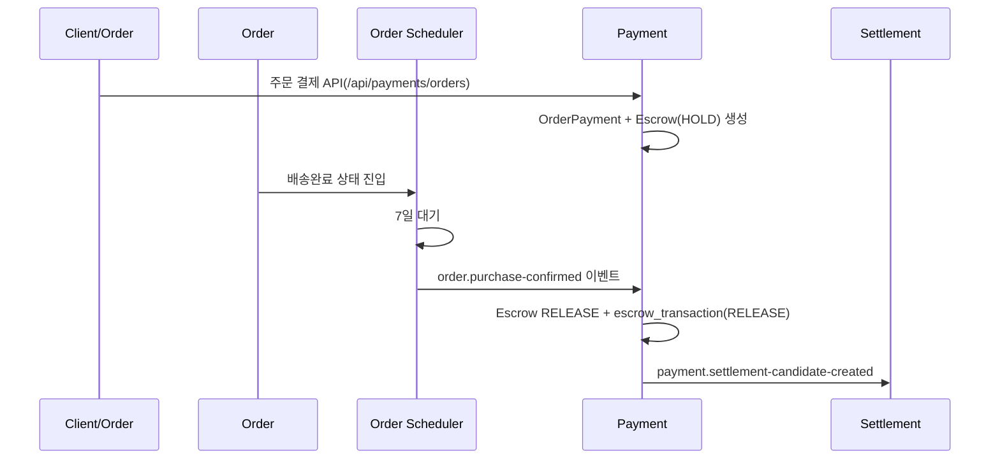
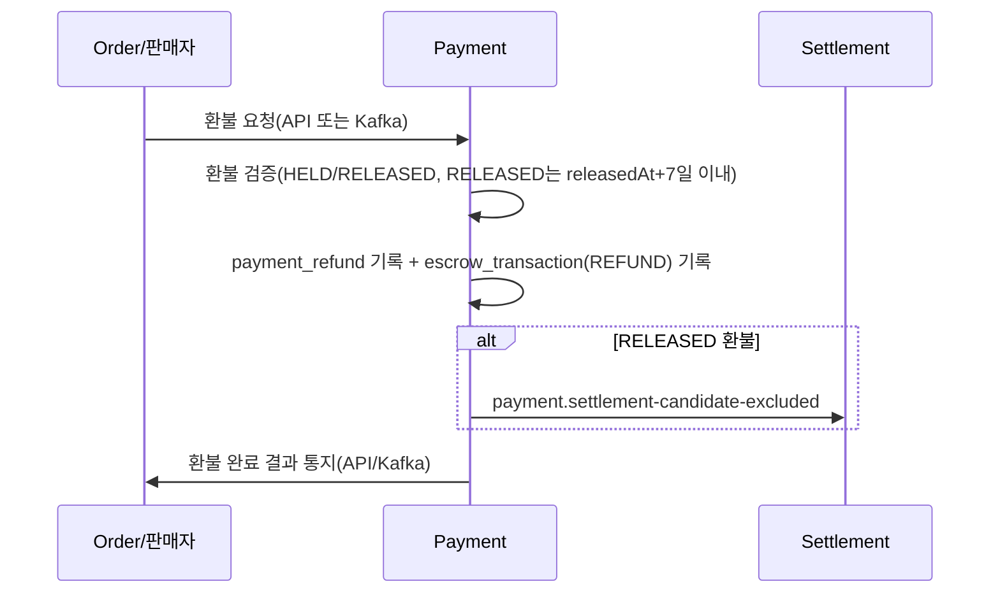

# Payment 모듈 정리 (주문 결제 ~ 정산/환불 연계)
작성일: 2026-04-15

## 1. 문서 목적
이 문서는 `payment` 모듈이 주문 결제 이후 어떤 방식으로 `escrow`, `refund`, `settlement`와 연결되는지 팀원이 빠르게 파악하도록 정리한 안내서다.

## 2. Payment 책임 범위
| 구분 | 책임 |
|---|---|
| 결제 처리 | 주문 결제/충전/카드 승인/결제 실패 반영 |
| 원장 관리 | `escrow`, `escrow_transaction`, `payment_refund` 기록 |
| 환불 정책 | HELD/RELEASED 환불 검증, 7일 환불 가능 기간 검증 |
| 정산 연계 | 구매확정 시 정산 후보 생성 이벤트, 환불 시 정산 제외 이벤트 발행 |

## 3. 핵심 정책 값
| 키 | 기본값 | 의미 |
|---|---|---|
| `ORDER_AUTO_PURCHASE_CONFIRM_DAYS` | 7 | order 스케줄러가 구매확정 이벤트를 발행하기 전 대기 일수 |
| `REFUND_AVAILABLE_DAYS` | 7 | RELEASED escrow 환불 허용 기간 |
| `payment.kafka.topics.settlement-candidate-created` | `payment.settlement-candidate-created` | 정산 후보 생성 이벤트 |
| `payment.kafka.topics.settlement-candidate-excluded` | `payment.settlement-candidate-excluded` | 정산 후보 제외 이벤트 |

## 4. 주문 결제 이후 처리 흐름
### 4.1 정상 흐름 (구매확정 후 정산 후보 생성)

### 4.2 환불 흐름 (RELEASED 환불 + 정산 제외)

## 5. API 통신을 둔 이유와 역할
| 통신 | 경로 | 이유 | 역할 |
|---|---|---|---|
| API | `Order -> Payment` 주문 결제/취소/판매자 환불 | 사용자 요청에 대한 즉시 응답 필요 | 결제/환불 트랜잭션 시작 |
| API | `Payment -> Order` 환불 완료 알림 | 주문 상태와 결제 환불 상태 정합성 | 주문 모듈 상태 후속 처리 |
| Kafka | `Order -> Payment` 구매확정 이벤트 | 비동기 정책 이벤트 처리 | Escrow RELEASE 트리거 |
| Kafka | `Payment -> Settlement` 후보 생성/제외 이벤트 | 모듈 분리 + 비동기 반영 | 정산 반영/제외 트리거 |

## 6. 주요 API 엔드포인트
| 메서드 | 경로 | 설명 |
|---|---|---|
| `POST` | `/api/payments/orders` | 주문 결제 |
| `POST` | `/api/payments/cancellations` | 주문 취소 환불 |
| `POST` | `/api/payments/seller/refunds/confirm` | 판매자 반품 수령 후 환불 |
| `GET` | `/api/payments/seller/orders/{orderId}/escrow-transactions` | 판매자 escrow 원장 조회 |

## 7. 데이터 관점 체크포인트
| 테이블 | 체크 내용 |
|---|---|
| `payment.escrow` | `escrow_status`, `released_at`, `amount/refunded_amount` |
| `payment.escrow_transaction` | `HOLD/RELEASE/REFUND` append-only 기록 |
| `payment.payment_refund`, `payment_refund_item` | 환불 요청 멱등성(`order_cancel_request_id`) 및 상태 추적 |

## 8. 운영 시 유의사항
| 항목 | 설명 |
|---|---|
| 멱등성 | 같은 환불 요청은 `orderCancelRequestId` 기준 재진입 방지 |
| 지급완료 역정산 | payment는 정산 차감까지 직접 하지 않고 settlement 수동처리 분기로 위임 |
| 트랜잭션 경계 | `PaymentRefundService`, `EscrowReleaseService`는 `@Transactional`로 정합성 유지 |

