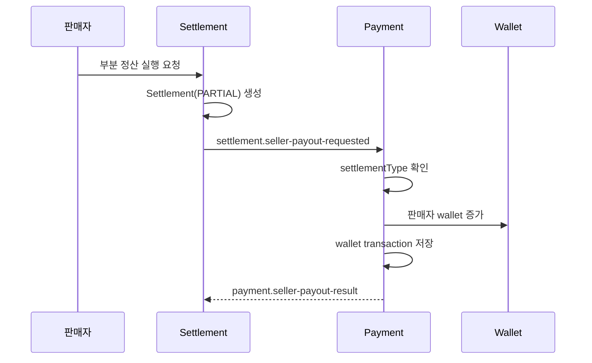

# Payment 부분 정산 연동 가이드

작성일: 2026-04-19  
대상: `payment` 모듈에서 부분 정산이 어떻게 반영되는지 정리

## 1. 문서 목적

이 문서는 부분 정산 기능이 추가된 뒤 `payment` 모듈이 어떤 역할을 하는지 팀원이 바로 이해할 수 있게 정리한 문서다.

핵심은 아래 두 가지다.

1. 부분 정산의 진입점은 `payment`가 아니라 `settlement`라는 점
2. `payment`는 payout 요청을 받아 `Wallet`과 거래 원장에 반영하는 역할이라는 점

## 2. payment 책임 범위

부분 정산에서 `payment`가 직접 하는 일은 아래와 같다.

| 구분 | 역할 |
|---|---|
| 구매확정 전 | `Escrow` 보관 |
| 구매확정 후 | 정산 후보 생성 이벤트 발행 |
| payout 요청 수신 | seller wallet 적립 |
| 거래 원장 기록 | 월 정산 / 부분 정산 구분 저장 |
| 지급 결과 회신 | settlement로 성공/실패 결과 이벤트 전달 |

즉, 부분 정산 화면 조회나 부분 정산 생성은 `settlement`가 맡고, `payment`는 지급 반영과 원장 기록을 맡는다.

## 3. 왜 payment가 부분 정산 조회 API를 만들지 않았는가

이유는 정산 대기 데이터의 실제 기준이 `Escrow`가 아니라 `SettlementItem`이기 때문이다.

| 단계 | 실제 기준 데이터 |
|---|---|
| 구매확정 전 | `Escrow` |
| 정산 대기 | `SettlementItem` |
| 실제 지급 | `Settlement` |
| 지갑 반영 | `Wallet` |

그래서 부분 정산의 조회와 실행은 `settlement`에 두고, `payment`는 payout 요청을 받았을 때만 동작하게 설계했다.

## 4. 현재 연동 흐름



## 5. 지급 요청 메시지 변경점

부분 정산 대응으로 payout 요청 메시지에 `settlementType`이 추가됐다.

### 현재 메시지 주요 필드

| 필드 | 설명 |
|---|---|
| `eventId` | 요청 이벤트 ID |
| `settlementId` | 정산 ID |
| `settlementType` | `MONTHLY` 또는 `PARTIAL` |
| `sellerMemberId` | 판매자 ID |
| `settlementYear` | 정산 연도 |
| `settlementMonth` | 정산 월 |
| `payoutAmount` | 지급 금액 |
| `requestedAt` | 요청 시각 |

## 6. payment 내부 처리 기준

`SellerSettlementPayoutRequestedEventConsumer`는 아래 순서로 동작한다.

1. 이벤트 필수값 검증
2. `settlementType` 확인
3. `referenceType` 결정
4. 중복 지급 여부 확인
5. seller wallet 조회
6. wallet 증가
7. wallet transaction 저장
8. settlement 결과 이벤트 발행

## 7. referenceType 구분

부분 정산 대응으로 wallet transaction의 referenceType을 나눴다.

| settlementType | referenceType | description |
|---|---|---|
| `MONTHLY` | `MONTHLY_SETTLEMENT` | `monthly settlement payout` |
| `PARTIAL` | `PARTIAL_SETTLEMENT` | `partial settlement payout` |

이제 payment 원장에서도 월 정산과 부분 정산을 구분해서 볼 수 있다.

## 8. 중복 방지 기준

지급 중복 방지는 아래 조합으로 처리한다.

```text
referenceId = settlementId
referenceType = MONTHLY_SETTLEMENT 또는 PARTIAL_SETTLEMENT
```

즉, 같은 `settlementId`라도 유형이 다르면 다른 건으로 구분되고, 같은 유형이면 중복 지급을 막는다.

## 9. 운영 시 확인 포인트

| 항목 | 확인 내용 |
|---|---|
| settlementType 누락 | 이벤트 계약 불일치 여부 확인 |
| wallet transaction referenceType | 월 정산 / 부분 정산 구분 저장 여부 확인 |
| 중복 지급 | 동일 `settlementId + referenceType` 거래 존재 여부 확인 |
| 결과 이벤트 | success / failed가 settlement로 정상 회신되는지 확인 |

## 10. 결론

현재 부분 정산에서 `payment`의 역할은 명확하다.

```text
부분 정산을 직접 생성하지 않는다.
부분 정산 payout 요청을 받으면 wallet에 반영한다.
원장에서는 월 정산과 부분 정산을 구분해서 저장한다.
```

따라서 부분 정산 기능 설명은 `settlement` 문서를 먼저 보고,
`payment`는 이 문서를 기준으로 payout 반영 구조를 이해하면 된다.
