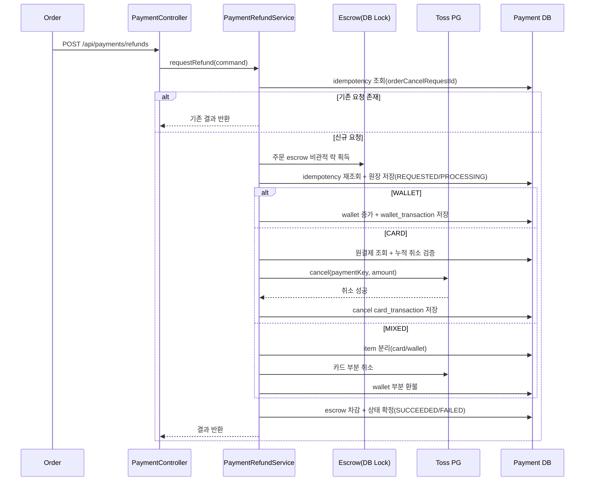
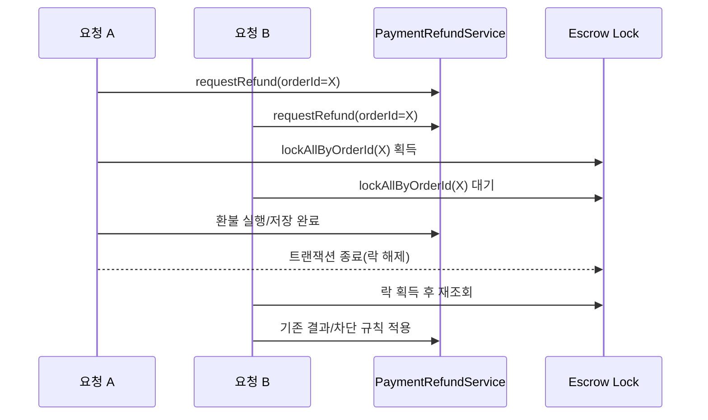

# 주문 환불 구현 가이드

이 문서는 Payment 모듈의 주문 환불 구현을 팀원과 공유하기 위한 문서입니다.
동시에, 환불 처리에서 중요한 멱등성/동시성(비관적 락) 개념을 이해하기 쉽게 정리한 참고 문서입니다.

---

## 이 문서에서 바로 얻을 수 있는 것

| 질문 | 문서에서 확인할 위치 |
|---|---|
| Payment와 Order가 각각 무엇을 책임지는가 | `책임 경계` |
| 환불 API는 무엇을 받고 무엇을 반환하는가 | `API 계약` |
| WALLET/CARD/MIXED가 어떻게 처리되는가 | `환불 처리 흐름` |
| 왜 비관적 락을 적용했는가 | `멱등성/동시성과 비관적 락` |
| 실제 코드에서 어디를 보면 되는가 | `코드 탐색 가이드` |

---

## 책임 경계

환불에서 가장 중요한 원칙은 책임을 섞지 않는 것입니다.

| 영역 | Order 책임 | Payment 책임 |
|---|---|---|
| 취소/환불 가능 여부 판단 | O | X |
| 환불 금액 계산(정책/수량 포함) | O | X |
| `paymentMethod` 확정 전달 | O | X |
| 실제 환불 실행(wallet/card) | X | O |
| 환불 원장/거래 이력 저장 | X | O |
| 멱등/동시성 제어 | X | O |

핵심 문장:
1. Order는 환불 **정책과 금액을 결정**합니다.
2. Payment는 전달받은 계약을 기준으로 **실행과 기록**을 담당합니다.

---

## 왜 이렇게 개발했는가 (의사결정 배경)

환불 구현에서 실제로 문제가 많이 발생하는 지점은 아래 3가지입니다.

| 문제 | 잘못 설계하면 생기는 이슈 |
|---|---|
| 환불 금액 계산 책임이 애매함 | Order/Payment 계산 불일치, CS 이슈 |
| 재시도/동시 요청 처리 미흡 | 이중 환불, 중복 원장, 정합성 깨짐 |
| 카드 취소 이력 누적 검증 부재 | 초과 환불 가능 |

이번 구조는 위 문제를 줄이기 위해 아래 원칙으로 설계했습니다.

| 설계 결정 | 이유 | 효과 |
|---|---|---|
| 환불 금액 계산은 Order 책임 | 주문 정책(수량, 부분취소)은 Order 도메인 | 경계 명확화 |
| Payment는 실행/원장 기록 책임 | PG 호출/지갑 증감/원장은 Payment 관심사 | 책임 집중 |
| `orderItemId` 기준 원장 정렬 | 카드 원결제, escrow, 환불 item 공통 축 | 추적성 향상 |
| 멱등 + 비관적 락 동시 적용 | 키 재요청 + 동시 요청 모두 대응 필요 | 이중 실행 방지 |
| 카드 누적 취소 합산 검증 | 기존 취소 이력 반영 필요 | 초과 환불 차단 |

요약:
- 이 구현은 “기능 구현”보다 “운영 중 사고 방지”를 우선한 설계입니다.

---

## 현재 지원 범위

| 항목 | 상태 | 설명 |
|---|---|---|
| WALLET 환불 | 지원 | wallet 잔액 증가 + wallet 거래 이력 저장 |
| CARD 환불 | 지원 | 원결제 검증 + Toss 취소 + cancel 거래 이력 저장 |
| MIXED 환불 | 지원(실행 로직) | 환불 item을 카드/지갑으로 분리 실행 |
| 환불 원장 저장 | 지원 | `payment_refund`, `payment_refund_item` |
| escrow 환불 반영 | 지원 | `orderItemId` 기준 차감, 0원이면 `REFUNDED` |
| 멱등 처리 | 지원 | `orderCancelRequestId` 기준 결과 재사용 |
| 동시성 제어 | 지원 | 주문 단위 escrow 비관적 락 적용 |

주의:
- MIXED 결제 생성 오케스트레이션은 Order 측 설계/구현 범위입니다.
- Payment는 요청으로 전달된 계약을 실행합니다.

---

## 데이터 모델 요약

### 환불 원장

| 테이블 | 역할 |
|---|---|
| `payment_refund` | 환불 헤더(요청 단위 상태 전이) |
| `payment_refund_item` | 환불 상세(주문 항목 단위 금액) |

### 자금 이동 이력

| 테이블 | 역할 |
|---|---|
| `wallet_transaction` | 예치금 환불 이력 |
| `card_transaction` | 카드 취소/환불 이력 |

### 정산 보류금(escrow)

| 컬럼 | 의미 |
|---|---|
| `reference_type`, `reference_id` | 현재 `ORDER_ITEM` + `orderItemId` 중심 |
| `amount` | 남은 보류 잔액 |
| `original_amount` | 최초 보류 금액 |
| `refunded_amount` | 누적 환불 금액 |
| `escrow_status` | `HELD`, `RELEASED`, `REFUNDED` |

---

## API 계약

### Endpoint

| 항목 | 값 |
|---|---|
| Method | `POST` |
| Path | `/api/payments/refunds` |
| 설명 | 주문 환불 요청 |

### Request 필드

| 필드 | 필수 | 설명 |
|---|---|---|
| `orderId` | Y | 주문 식별자 |
| `buyerMemberId` | Y | 구매자 식별자 |
| `orderCancelRequestId` | Y | 멱등 키 |
| `refundType` | Y | `FULL`, `PARTIAL` |
| `paymentMethod` | Y | `WALLET`, `CARD`, `MIXED` |
| `reason` | 조건부 | 카드 환불 포함 시 필수 |
| `items` | Y | 환불 대상 목록 |

요청 전제:
- `items.orderItemId`는 요청 1건 내에서 유니크해야 합니다.
- 환불 금액 계산 책임은 Order에 있습니다.

### Request 예시

```json
{
  "orderId": "f1a4d3f1-0000-0000-0000-000000000001",
  "buyerMemberId": "7f7ad7b2-0000-0000-0000-000000000001",
  "orderCancelRequestId": "2b5fb48e-0000-0000-0000-000000000001",
  "refundType": "PARTIAL",
  "paymentMethod": "CARD",
  "reason": "고객 단순 변심",
  "items": [
    {
      "orderItemId": "9a90c6d9-0000-0000-0000-000000000001",
      "refundAmount": 15000
    },
    {
      "orderItemId": "9a90c6d9-0000-0000-0000-000000000002",
      "refundAmount": 12000
    }
  ]
}
```

### Response 예시

```json
{
  "refundId": "53c0a8ca-0000-0000-0000-000000000001",
  "orderId": "f1a4d3f1-0000-0000-0000-000000000001",
  "orderCancelRequestId": "2b5fb48e-0000-0000-0000-000000000001",
  "refundStatus": "SUCCEEDED",
  "refundType": "PARTIAL",
  "totalRefundAmount": 27000,
  "itemResults": [
    {
      "orderItemId": "9a90c6d9-0000-0000-0000-000000000001",
      "status": "SUCCEEDED",
      "refundAmount": 15000
    },
    {
      "orderItemId": "9a90c6d9-0000-0000-0000-000000000002",
      "status": "SUCCEEDED",
      "refundAmount": 12000
    }
  ],
  "processedAt": "2026-04-15T10:00:00"
}
```

### MIXED 요청에 대한 계약 메모

| 항목 | 권장 |
|---|---|
| `paymentMethod` | 반드시 `MIXED` 명시 |
| `reason` | 카드 취소 포함 시 필수 |
| 수단별 금액 | Order가 `walletRefundAmount`, `cardRefundAmount`를 전달하는 구조 권장 |

---

## 환불 처리 흐름

### 다이어그램(한눈에 보기)

#### 1) 전체 환불 처리 시퀀스



#### 2) 동시 요청 제어(비관적 락) 시퀀스



### 공통 흐름

```text
Order -> POST /api/payments/refunds
      -> PaymentController
      -> PaymentRefundService.requestRefund()
         -> 요청 검증
         -> 멱등 조회
         -> 동시성 잠금(주문 단위)
         -> 환불 원장 저장
         -> 결제수단별 환불 실행
         -> escrow 차감
         -> 상태 확정(SUCCEEDED/FAILED)
```

### WALLET 흐름

```text
wallet 환불 실행
  -> buyer wallet 조회
  -> 잔액 증가
  -> wallet_transaction 저장
  -> escrow(orderItemId 기준) 차감
```

### CARD 흐름

```text
card 환불 실행
  -> 원결제 조회(orderItemId)
  -> buyer/paymentKey 검증
  -> 기존 CANCEL 성공 이력 합산
  -> 초과 환불 차단
  -> Toss cancel 호출
  -> cancel card_transaction 저장(remainingAmount 반영)
  -> escrow 차감
```

### MIXED 흐름

```text
mixed 환불 실행
  -> item을 card 대상 / wallet 대상 분리
  -> card 취소 실행
  -> wallet 환불 실행
  -> escrow 차감(공통)
```

---

## 멱등성/동시성과 비관적 락

### 멱등성은 무엇인가

같은 요청이 네트워크 재시도 등으로 여러 번 들어와도,
한 번 처리한 결과를 재사용해 중복 환불을 막는 성질입니다.

이 구현에서는 `orderCancelRequestId`를 멱등 키로 사용합니다.

```text
같은 orderCancelRequestId 재요청
  -> 기존 refund 조회
  -> 기존 결과 반환
```

### 동시성 문제는 왜 생기나

두 요청이 거의 동시에 들어오면 아래 순서가 겹칠 수 있습니다.

```text
요청 A: 기존 환불 없음 확인
요청 B: 기존 환불 없음 확인
요청 A/B 모두 환불 실행 시도 -> 이중 실행 위험
```

### 비관적 락이란 (쉽게 설명)

비관적 락은 “지금 내가 수정할 데이터는 잠깐 내가 먼저 잡고 처리하겠다”는 방식입니다.

비유:
- 은행 창구에서 한 계좌를 정리할 때, 담당자가 처리 끝날 때까지 같은 계좌 처리를 잠시 막는 것과 비슷합니다.

이 프로젝트에서는 주문 관련 escrow 레코드를 `PESSIMISTIC_WRITE`로 잠급니다.
그러면 같은 주문 환불 동시 요청이 직렬화됩니다.

텍스트 흐름(락 적용 순서):

```text
1) idempotency key 1차 조회
2) orderId 기준 escrow 비관적 락 획득
3) idempotency key 2차 재조회
4) 환불 원장 저장 및 실행
5) 트랜잭션 종료 시 락 해제
```

### 왜 적용했는가

| 이유 | 효과 |
|---|---|
| 같은 주문 환불 동시 진입 방지 | 중복 실행 위험 감소 |
| 멱등 조회-저장 사이 race 완화 | 처리 순서 안정화 |
| 초과 환불/이중 반영 방지 | 원장 정합성 강화 |

### 실제 적용 포인트

| 위치 | 역할 |
|---|---|
| `EscrowJpaRepository.findWithLockByOrderId(...)` | 주문 단위 비관적 락 조회 |
| `PaymentRefundService.requestRefund(...)` | 멱등 조회 -> 락 획득 -> 재조회 -> 저장 흐름 |
| `PaymentRefundRepository.findLatestByOrderId(...)` | 같은 주문의 신규 재시도 차단 |
| `PaymentRefundService.validateAndResolveRemainingAmounts(...)` | 카드 누적 취소 합산 검증 |

### 장단점

| 항목 | 내용 |
|---|---|
| 장점 | 안전한 직렬화, 이중 실행 방지에 강함 |
| 단점 | 동시 요청이 많으면 대기 증가 가능 |
| 운영 포인트 | 락 범위를 주문 단위로 제한해 영향 최소화 |

---

## 실패/재시도 정책

| 상황 | 처리 |
|---|---|
| 동일 `orderCancelRequestId` 재호출 | 기존 결과 반환 |
| 동일 주문에 다른 `orderCancelRequestId` 재요청 | 차단 |
| 동시 저장 경합으로 유니크 충돌 발생 | 기존 결과 복원 반환 시도 |

정책 의도:
- 단순 네트워크 재시도는 허용(같은 key)
- 같은 주문에 대한 새로운 키 재시도는 차단
- 운영상 “한 건 환불은 한 번의 계약”으로 취급

---

## 코드 탐색 가이드

| 먼저 볼 파일 | 확인 포인트 |
|---|---|
| `PaymentController.requestPaymentRefund(...)` | API 진입 |
| `PaymentRefundService.requestRefund(...)` | 전체 오케스트레이션 |
| `executeRefundByPaymentMethod(...)` | 결제수단 분기 |
| `executeCardCancellation(...)` | 카드 취소 핵심 로직 |
| `refundHeldEscrows(...)` | escrow 차감 로직 |
| `EscrowJpaRepository.findWithLockByOrderId(...)` | 비관적 락 |

---

## 팀 합의 시 체크할 질문

| 질문 | 확인 이유 |
|---|---|
| MIXED 결제 생성은 Order에서 어떤 순서로 확정할 것인가 | 환불 계약 기준 확정 |
| MIXED 환불 시 수단별 금액 필드를 계약에 추가할 것인가 | 추론 로직 제거/안정성 향상 |
| 실패 건 재요청 정책을 주문 전체 기준으로 유지할 것인가 | 운영 정책 일관성 |
