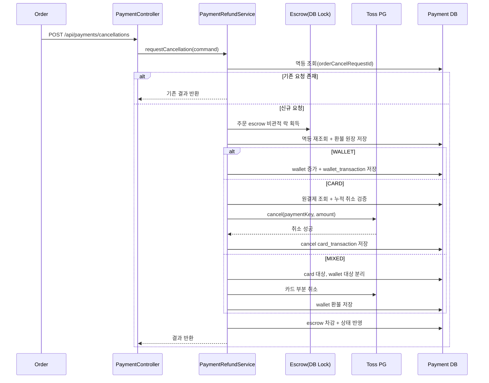
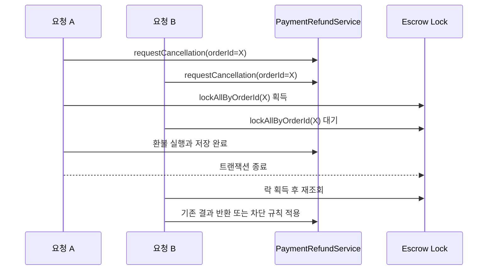

# 주문 환불 구현 가이드

이 문서는 Payment 모듈의 주문 환불 구현을 팀원과 공유하기 위한 문서입니다.
동시에 환불 처리에서 중요한 멱등성, 동시성, 카드 취소 누적 검증을 이해하기 쉽게 정리한 참고 문서입니다.

## 문서 수정 메모

이 문서는 기존 문서의 주제를 유지하면서 현재 코드와 맞지 않는 부분을 바로잡아 다시 작성했습니다.

- 기존 문서에 있던 `POST /api/payments/refunds` 설명은 현재 코드와 맞지 않습니다.
- 현재 주문 취소 환불 API는 `POST /api/payments/cancellations` 입니다.
- 현재 판매자 반품 환불 API는 `POST /api/payments/seller/refunds/confirm` 입니다.
- 현재 `PaymentCancellationRequest`에는 `paymentMethod` 필드가 없습니다.
- 현재 환불 결제수단은 `PaymentRefundService`가 카드 원거래 조회 결과를 기준으로 내부에서 판별합니다.

---

## 이 문서에서 바로 볼 수 있는 것

| 질문 | 문서에서 확인할 위치 |
|---|---|
| Order와 Payment가 각각 무엇을 책임지는가 | `책임 경계` |
| 환불 API는 무엇을 받고 무엇을 반환하는가 | `API 계약` |
| WALLET, CARD, MIXED가 어떻게 처리되는가 | `환불 처리 흐름` |
| 멱등성과 비관적 락을 왜 같이 쓰는가 | `멱등성과 동시성 제어` |
| 실제 코드에서 어디를 보면 되는가 | `코드 추적 가이드` |

---

## 책임 경계

환불 구현에서 가장 중요한 원칙은 책임을 섞지 않는 것입니다.

| 영역 | Order 책임 | Payment 책임 |
|---|---|---|
| 취소, 환불 가능 여부 판단 | O | X |
| 환불 금액 계산 | O | X |
| 결제수단 최종 실행 | X | O |
| wallet 환불 반영 | X | O |
| card 취소 실행 | X | O |
| 환불 원장 저장 | X | O |
| 멱등, 동시성 제어 | X | O |

정리:

1. Order는 환불 정책과 금액을 결정합니다.
2. Payment는 전달받은 계약을 기준으로 실행과 기록을 담당합니다.
3. 현재 코드 기준으로 결제수단은 요청 본문에서 직접 받지 않고 Payment 내부에서 판별합니다.

---

## 왜 이렇게 구현했는가

환불 구현에서 문제가 자주 발생하는 지점은 아래와 같습니다.

| 문제 | 잘못 설계하면 생기는 문제 |
|---|---|
| 환불 금액 계산 책임이 애매함 | Order와 Payment 계산 불일치 |
| 재시도, 동시 요청 처리 부족 | 중복 환불, 중복 원장 |
| 카드 누적 취소 검증 부족 | 초과 환불 가능 |

현재 구조는 아래 기준으로 설계되어 있습니다.

| 설계 결정 | 이유 | 효과 |
|---|---|---|
| 환불 금액 계산은 Order 책임 | 주문 정책은 Order 도메인에 있음 | 경계 명확화 |
| Payment는 실행과 원장 저장 책임 | wallet, card, escrow 조정은 Payment가 담당 | 책임 집중 |
| `orderCancelRequestId` 기반 멱등 처리 | 같은 요청 재시도 안전성 확보 | 중복 실행 방지 |
| 주문 단위 비관적 락 사용 | 동시에 같은 주문 환불 진입 방지 | 정합성 강화 |
| 카드 취소 누적 금액 검증 | 기존 취소 이력까지 반영 필요 | 초과 환불 차단 |

---

## 현재 지원 범위

| 항목 | 상태 | 설명 |
|---|---|---|
| WALLET 환불 | 지원 | wallet 잔액 증가와 wallet 거래 이력 저장 |
| CARD 환불 | 지원 | 원결제 검증, Toss 취소, cancel 거래 이력 저장 |
| MIXED 환불 | 지원 | 카드와 wallet 대상 주문 항목을 분리 실행 |
| 환불 원장 저장 | 지원 | `payment_refund`, `payment_refund_item`, `payment_refund_allocation` |
| escrow 환불 반영 | 지원 | `orderItemId` 기준 차감 후 상태 반영 |
| 멱등 처리 | 지원 | `orderCancelRequestId` 기준 재진입 방지 |
| 동시성 제어 | 지원 | 주문 단위 escrow 비관적 락 적용 |

주의:

- 현재 MIXED 환불은 요청에서 `paymentMethod`를 받지 않고, 카드 원거래 존재 여부로 내부에서 판별합니다.
- 판매자 반품 환불은 seller가 API를 호출하면 Payment가 escrow 기준으로 환불 항목을 구성합니다.

---

## 데이터 모델 요약

### 환불 원장

| 테이블 | 역할 |
|---|---|
| `payment_refund` | 환불 요청 헤더 |
| `payment_refund_item` | 주문 항목 단위 환불 상세 |
| `payment_refund_allocation` | wallet, card 환불 배분 이력 |

### 거래 이력

| 테이블 | 역할 |
|---|---|
| `wallet_transaction` | 예치금 환불 이력 |
| `card_transaction` | 카드 취소, 환불 이력 |

### escrow

| 컬럼 | 설명 |
|---|---|
| `reference_type`, `reference_id` | 현재 `ORDER_ITEM`, `orderItemId` 기준 추적 |
| `amount` | 현재 escrow 잔액 |
| `original_amount` | 최초 escrow 금액 |
| `refunded_amount` | 누적 환불 금액 |
| `escrow_status` | `HELD`, `RELEASED`, `REFUNDED` |

---

## API 계약

### 1. 주문 취소 환불 API

| 항목 | 값 |
|---|---|
| Method | `POST` |
| Path | `/api/payments/cancellations` |
| 설명 | 주문 취소 환불 요청 |

#### Request 필드

| 필드 | 필수 | 설명 |
|---|---|---|
| `orderId` | Y | 주문 식별자 |
| `buyerMemberId` | Y | 구매자 회원 ID |
| `orderCancelRequestId` | Y | 멱등 키 |
| `refundType` | Y | `FULL`, `PARTIAL` |
| `reason` | 조건부 | 카드 환불 포함 시 사용 |
| `items` | Y | 환불 대상 목록 |

추가 설명:

- 현재 코드 기준으로 `paymentMethod`는 요청 필드가 아닙니다.
- `items.orderItemId`는 요청 1건 내에서 중복되면 안 됩니다.
- 환불 금액 계산 책임은 Order에 있습니다.

#### Request 예시

```json
{
  "orderId": "f1a4d3f1-0000-0000-0000-000000000001",
  "buyerMemberId": "7f7ad7b2-0000-0000-0000-000000000001",
  "orderCancelRequestId": "2b5fb48e-0000-0000-0000-000000000001",
  "refundType": "PARTIAL",
  "reason": "고객 단순 변심",
  "items": [
    {
      "orderItemId": "9a90c6d9-0000-0000-0000-000000000001",
      "refundAmount": 15000
    },
    {
      "orderItemId": "9a90c6d9-0000-0000-0000-000000000002",
      "refundAmount": 12000
    }
  ]
}
```

#### Response 예시

```json
{
  "refundId": "53c0a8ca-0000-0000-0000-000000000001",
  "orderId": "f1a4d3f1-0000-0000-0000-000000000001",
  "orderCancelRequestId": "2b5fb48e-0000-0000-0000-000000000001",
  "refundStatus": "SUCCEEDED",
  "refundType": "PARTIAL",
  "totalRefundAmount": 27000,
  "itemResults": [
    {
      "orderItemId": "9a90c6d9-0000-0000-0000-000000000001",
      "status": "SUCCEEDED",
      "refundAmount": 15000
    },
    {
      "orderItemId": "9a90c6d9-0000-0000-0000-000000000002",
      "status": "SUCCEEDED",
      "refundAmount": 12000
    }
  ],
  "processedAt": "2026-04-15T10:00:00"
}
```

### 2. 판매자 반품 환불 API

| 항목 | 값 |
|---|---|
| Method | `POST` |
| Path | `/api/payments/seller/refunds/confirm` |
| 설명 | 판매자 반품 수령 확인 후 환불 요청 |

추가 설명:

- seller 권한이 필요합니다.
- 요청 본문에는 `buyerMemberId`와 환불 금액이 직접 들어오지 않습니다.
- Payment가 escrow 조회를 통해 구매자와 환불 항목 금액을 구성합니다.

### MIXED 환불 관련 메모

| 항목 | 현재 코드 기준 |
|---|---|
| 결제수단 입력 방식 | 요청에서 직접 받지 않음 |
| MIXED 판별 방식 | 카드 원거래가 있는 orderItem과 없는 orderItem을 나눠 내부 판별 |
| `reason` | 카드 취소가 포함되면 함께 전달하는 것이 안전 |

---

## 환불 처리 흐름

### 1. 전체 환불 처리 시퀀스



### 2. 동시 요청 제어



### 공통 흐름

```text
Order -> POST /api/payments/cancellations
      -> PaymentController.requestOrderCancellation(...)
      -> PaymentRefundService.requestCancellation(...)
         -> 요청 검증
         -> 멱등 조회
         -> 주문 단위 락 획득
         -> 멱등 재조회
         -> 환불 원장 저장
         -> 결제수단별 환불 실행
         -> escrow 차감
         -> 상태 확정(SUCCEEDED/FAILED)
```

### 판매자 반품 환불 흐름

```text
Seller -> POST /api/payments/seller/refunds/confirm
       -> PaymentController.requestSellerRefundConfirm(...)
       -> PaymentRefundService.requestSellerRefund(...)
          -> escrow 기준 환불 항목 구성
          -> requestCancellation(...) 공통 로직 위임
```

---

## 멱등성과 동시성 제어

### 멱등성

같은 환불 요청이 네트워크 재시도 등으로 여러 번 들어와도 한 번 처리한 결과를 재사용하는 성질입니다.

현재 구현에서는 `orderCancelRequestId`를 멱등 키로 사용합니다.

```text
같은 orderCancelRequestId 요청
  -> 기존 refund 조회
  -> 기존 결과 반환
```

### 왜 동시성 제어가 필요한가

같은 주문에 대해 서로 다른 요청이 거의 동시에 들어오면 아래 문제가 생길 수 있습니다.

```text
요청 A: 기존 환불 없음 확인
요청 B: 기존 환불 없음 확인
요청 A/B 모두 환불 실행 시도 -> 이중 실행 위험
```

### 비관적 락 적용 방식

현재 프로젝트에서는 주문 관련 escrow 레코드를 `PESSIMISTIC_WRITE`로 잠급니다.
그러면 같은 주문 환불 동시 요청이 직렬화됩니다.

적용 순서:

```text
1. idempotency key 1차 조회
2. orderId 기준 escrow 락 획득
3. idempotency key 2차 재조회
4. 환불 저장 및 실행
5. 트랜잭션 종료 후 락 해제
```

### 왜 이렇게 적용했는가

| 이유 | 효과 |
|---|---|
| 같은 주문 환불 동시 진입 방지 | 중복 실행 위험 감소 |
| 멱등 조회와 저장 사이 race 완화 | 처리 순서 안정화 |
| 초과 환불, 이중 반영 방지 | 원장 정합성 강화 |

### 실제 적용 지점

| 위치 | 역할 |
|---|---|
| `EscrowJpaRepository.findWithLockByOrderId(...)` | 주문 단위 비관적 락 조회 |
| `PaymentRefundService.requestCancellation(...)` | 주문 취소 환불 오케스트레이션 |
| `PaymentRefundService.requestSellerRefund(...)` | 판매자 환불 오케스트레이션 |
| `PaymentRefundRepository.findByOrderCancelRequestId(...)` | 환불 요청 멱등 처리 |
| `PaymentRefundService.validateAndResolveRemainingAmounts(...)` | 카드 누적 취소 합산 검증 |

---

## 실패와 재시도 정책

| 상황 | 처리 |
|---|---|
| 동일 `orderCancelRequestId` 재호출 | 기존 결과 반환 |
| 같은 주문에 다른 `orderCancelRequestId`가 동시 진입 | 주문 락으로 직렬화 후 처리 |
| 카드 취소 금액 검증 실패 | 예외 발생 후 FAILED 처리 |
| wallet 미존재 | 예외 발생 |

정리:

- 단순 네트워크 재시도는 허용합니다.
- 같은 주문의 동시 환불은 직렬화합니다.
- 한 번의 환불 요청은 하나의 계약으로 취급합니다.

---

## 코드 추적 가이드

| 먼저 볼 파일 또는 메서드 | 확인 포인트 |
|---|---|
| `PaymentController.requestOrderCancellation(...)` | 주문 취소 환불 API 진입 |
| `PaymentController.requestSellerRefundConfirm(...)` | 판매자 반품 환불 API 진입 |
| `PaymentRefundService.requestCancellation(...)` | 전체 주문 취소 환불 흐름 |
| `PaymentRefundService.requestSellerRefund(...)` | 판매자 환불 공통 로직 진입 |
| `executeRefundByPaymentMethod(...)` | 결제수단 분기 |
| `executeCardCancellation(...)` | 카드 취소 핵심 로직 |
| `refundEscrows(...)` | escrow 차감 로직 |
| `EscrowJpaRepository.findWithLockByOrderId(...)` | 비관적 락 |

---

## 추가 확인 질문

| 질문 | 확인 이유 |
|---|---|
| MIXED 결제 계약에서 수단별 금액을 Order가 더 명확히 넘길 것인가 | 추론 로직 단순화 |
| 카드 취소가 포함된 경우 reason 정책을 더 엄격히 할 것인가 | 운영 안정성 향상 |
| 실패 후 재시도 정책을 주문 전체 기준으로 제한할 것인가 | 운영 정책 명확화 |
