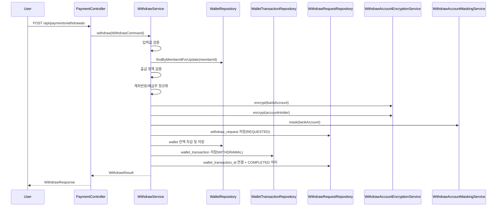

# Payment 출금 기능 구현 가이드

작성일: 2026-04-19  
대상 모듈: `payment`

## 1. 문서 목적

이 문서는 현재 `payment` 모듈에 적용된 출금 기능을 다른 사람이 빠르게 이해할 수 있도록 정리한 문서다.

아래 내용을 한 번에 확인할 수 있게 구성했다.

- 출금 기능이 어디에 붙어 있는지
- 사용자가 출금 요청을 하면 어떤 순서로 처리되는지
- 어떤 API가 추가되었는지
- 각 DTO, 엔티티, 메서드가 무슨 역할을 하는지
- 출금 이력이 어떤 컬럼 구조로 저장되는지
- 추후 수정 시 어디를 보면 되는지

이 문서는 `private_docs`를 보지 않아도 이해할 수 있도록 작성한다.

---

## 2. 출금 기능 한눈에 보기

## 2.1 한 줄 설명

출금 기능은 `wallet` 잔액을 가진 인증 사용자가 예치금을 출금 요청하면,
잔액을 차감하고, 출금 이력을 저장하고, Mock 기준으로 즉시 완료 처리하는 기능이다.

## 2.2 현재 기준 요약

| 항목 | 현재 구현 기준 |
|---|---|
| 출금 대상 | `wallet` 잔액을 가진 인증 사용자 |
| 모듈 위치 | `payment` 내부 |
| 실제 송금 | 하지 않음 |
| 처리 방식 | Mock 완료 처리 |
| 출금 이력 저장 | `withdraw_request` |
| 잔액 차감 원장 | `wallet_transaction(WITHDRAWAL)` |
| 계좌정보 저장 | 암호화 저장 |
| 응답 노출 | 마스킹된 계좌번호만 반환 |
| `bankCode` | 현재 구현 제외 |

## 2.3 왜 `payment` 안에 넣었는가

출금은 새로운 금융 모듈이 아니라 기존 wallet 기능의 마지막 단계에 가깝다.

이미 `payment` 안에는 아래 구조가 존재한다.

| 기존 구조 | 출금에서 재사용하는 이유 |
|---|---|
| `wallet` | 출금 가능 잔액 원장 |
| `wallet_transaction` | 차감 거래 원장 |
| `Wallet.decreaseBalance(...)` | 출금 금액 차감 |
| `WalletTransactionType.WITHDRAWAL` | 출금 거래 타입 |
| `PaymentController` | API 연결 지점 |
| `PaymentSearchService` | 출금 목록 조회 확장 지점 |

즉 출금 기능은 기존 wallet 구조를 재사용하고, `withdraw_request`만 새로 추가한 구조다.

---

## 3. 사용자 출금 요청 흐름

## 3.1 전체 흐름



## 3.2 쉬운 설명

```text
1. 사용자가 금액, 계좌번호, 예금주를 입력한다.
2. 서버가 입력값이 맞는지 먼저 확인한다.
3. 서버가 wallet을 잠금 조회해서 현재 잔액을 확인한다.
4. 최소 금액, 수수료, 잔액 조건을 검사한다.
5. 계좌번호와 예금주를 정리한 뒤 암호화한다.
6. 마스킹 계좌번호를 만든다.
7. 출금 요청 이력을 먼저 저장한다.
8. wallet 잔액을 출금 요청 금액만큼 차감한다.
9. wallet_transaction에 WITHDRAWAL 거래를 저장한다.
10. 출금 요청 상태를 COMPLETED로 바꾼다.
11. 프론트에는 마스킹 계좌번호와 차감 후 잔액을 반환한다.
```

---

## 4. 출금 정책

| 항목 | 값 |
|---|---|
| 최소 출금 금액 | `5000원` |
| 고정 수수료 | `1000원` |
| 출금 가능 조건 | `wallet.balance >= amount` |
| 추가 조건 | `amount > fee` |
| 상태 흐름 | `REQUESTED -> COMPLETED` |

## 4.1 계산 방식

```text
실수령액 = 출금 요청 금액 - 수수료
wallet 차감 금액 = 출금 요청 금액 전체
```

예시:

```text
출금 요청 금액: 10000원
수수료: 1000원
실수령액: 9000원
wallet 감소 금액: 10000원
```

## 4.2 현재 제외한 항목

| 항목 | 현재 처리 |
|---|---|
| 실제 은행 송금 | 구현하지 않음 |
| `bankCode` | 구현 제외 |
| 관리자 승인 단계 | 구현 제외 |
| 출금 상세 조회 API | 구현 제외 |

---

## 5. API 정리

## 5.1 출금 요청 API

### `POST /api/payments/withdrawals`

### 요청 예시

```json
{
  "amount": 10000,
  "bankAccount": "123-456-7890",
  "accountHolder": "홍길동"
}
```

### 응답 예시

```json
{
  "success": true,
  "data": {
    "withdrawRequestId": "uuid",
    "amount": 10000,
    "fee": 1000,
    "actualAmount": 9000,
    "maskedBankAccount": "123-****-7890",
    "status": "COMPLETED",
    "walletBalance": 40000,
    "requestedAt": "2026-04-19T14:00:00",
    "processedAt": "2026-04-19T14:00:00"
  },
  "error": null
}
```

### 용도

| 항목 | 설명 |
|---|---|
| 목적 | 출금 요청 생성 |
| 인증 | 필요 |
| 처리 결과 | Mock 기준 즉시 완료 |
| 주의점 | 평문 계좌번호는 응답으로 내리지 않음 |

## 5.2 출금 목록 조회 API

### `GET /api/payments/withdrawals?page=0&size=20`

### 목록 각 행 주요 필드

| 필드 | 설명 |
|---|---|
| `withdrawRequestId` | 출금 요청 ID |
| `amount` | 총 출금 금액 |
| `fee` | 수수료 |
| `actualAmount` | 실제 받는 금액 |
| `maskedBankAccount` | 마스킹된 계좌번호 |
| `status` | 현재 상태 |
| `requestedAt` | 요청 시각 |
| `processedAt` | 처리 시각 |

### 용도

| 항목 | 설명 |
|---|---|
| 목적 | 사용자 본인의 출금 목록 조회 |
| 인증 | 필요 |
| 정렬 | `requestedAt DESC` |
| 보안 | 마스킹 계좌번호만 반환 |

---

## 6. 클래스와 메서드 역할

## 6.1 컨트롤러

### `PaymentController`

| 메서드 | 역할 |
|---|---|
| `findAllWithdrawRequests(...)` | 출금 목록 조회 API 진입점 |
| `withdraw(...)` | 출금 요청 API 진입점 |

### `findAllWithdrawRequests(...)`

| 항목 | 설명 |
|---|---|
| 입력 | 인증 사용자, `page`, `size` |
| 내부 호출 | `paymentSearchUseCase.findAllWithdrawRequests(...)` |
| 반환 | `PagedResponse<WithdrawListItemResponse>` |

### `withdraw(...)`

| 항목 | 설명 |
|---|---|
| 입력 | 인증 사용자, `WithdrawCreateRequest` |
| 내부 변환 | `WithdrawCommand` 생성 |
| 내부 호출 | `withdrawUseCase.withdraw(...)` |
| 반환 | `WithdrawResponse` |

## 6.2 유스케이스

### `WithdrawUseCase`

| 항목 | 설명 |
|---|---|
| 역할 | 출금 요청 인터페이스 |
| 메서드 | `withdraw(WithdrawCommand command)` |

### 의미

- 컨트롤러가 구현체에 직접 붙지 않도록 분리
- 이후 관리자 승인형, 실송금형으로 바뀌어도 진입 인터페이스를 유지하기 쉬움

## 6.3 서비스

### `WithdrawService`

이 클래스가 출금 기능의 핵심 처리 클래스다.

| 메서드 | 역할 |
|---|---|
| `withdraw(...)` | 출금 전체 흐름 실행 |
| `validateCommand(...)` | 필수 입력 검증 |
| `validateWithdrawalPolicy(...)` | 최소 금액, 수수료, 잔액 정책 검증 |
| `calculateFee()` | 현재 고정 수수료 반환 |
| `createWithdrawRequest(...)` | 출금 엔티티 생성 |
| `createWithdrawalTransaction(...)` | 거래 원장 엔티티 생성 |
| `normalizeBankAccount(...)` | 계좌번호 정규화 및 형식 검증 |
| `normalizeAccountHolder(...)` | 예금주 정규화 |

### `withdraw(...)`가 실제로 하는 일

```text
1. 요청값 검증
2. wallet 잠금 조회
3. 정책 검증
4. 수수료 계산
5. 계좌 정규화
6. 암호화 / 마스킹
7. withdraw_request 저장
8. wallet 차감
9. wallet_transaction 저장
10. 출금 상태 COMPLETED 처리
11. 결과 DTO 반환
```

## 6.4 조회 서비스

### `PaymentSearchService.findAllWithdrawRequests(...)`

| 항목 | 설명 |
|---|---|
| 역할 | 출금 목록 조회 |
| 조회 조건 | `memberId` |
| 정렬 기준 | `requestedAt DESC` |
| 반환 | `PagedResult<WithdrawListItemResult>` |

## 6.5 암호화 / 마스킹 서비스

### `WithdrawAccountEncryptionService`

| 항목 | 설명 |
|---|---|
| 역할 | 계좌번호와 예금주 암호화/복호화 |
| 방식 | AES-GCM |
| 키 설정 | `payment.withdraw.crypto.secret-key` |
| 키 환경변수 | `PAYMENT_WITHDRAW_CRYPTO_SECRET_KEY` |

### `WithdrawAccountMaskingService`

| 항목 | 설명 |
|---|---|
| 역할 | 계좌번호를 화면 노출용 마스킹 값으로 변환 |
| 반환 예시 | `123-****-7890` |

---

## 7. DTO 역할 정리

## 7.1 요청 DTO

### `WithdrawCreateRequest`

| 필드 | 역할 |
|---|---|
| `amount` | 출금 요청 금액 |
| `bankAccount` | 사용자가 입력한 계좌번호 |
| `accountHolder` | 사용자가 입력한 예금주 |

### 설명

- HTTP 요청 본문을 받는 presentation DTO
- Bean Validation으로 1차 필수값 검증

## 7.2 명령 DTO

### `WithdrawCommand`

| 필드 | 역할 |
|---|---|
| `memberId` | 인증 사용자 식별자 |
| `amount` | 출금 금액 |
| `bankAccount` | 계좌번호 |
| `accountHolder` | 예금주 |

### 설명

- 컨트롤러에서 서비스 계층으로 넘기는 command DTO

## 7.3 결과 DTO

### `WithdrawResult`

| 필드 | 역할 |
|---|---|
| `withdrawRequestId` | 출금 요청 ID |
| `amount` | 총 출금 금액 |
| `fee` | 수수료 |
| `actualAmount` | 실수령액 |
| `maskedBankAccount` | 마스킹 계좌번호 |
| `status` | 출금 상태 |
| `walletBalance` | 차감 후 잔액 |
| `requestedAt` | 요청 시각 |
| `processedAt` | 처리 시각 |

### 설명

- 서비스가 처리 결과를 응답 계층으로 넘길 때 쓰는 DTO

## 7.4 목록 DTO

### `WithdrawListItemResult`

| 필드 | 역할 |
|---|---|
| `withdrawRequestId` | 출금 ID |
| `amount` | 출금 금액 |
| `fee` | 수수료 |
| `actualAmount` | 실수령액 |
| `maskedBankAccount` | 마스킹 계좌번호 |
| `status` | 상태 |
| `requestedAt` | 요청 시각 |
| `processedAt` | 처리 시각 |

### 설명

- 목록 한 줄을 표현하는 application DTO

## 7.5 응답 DTO

### `WithdrawResponse`

| 역할 | 설명 |
|---|---|
| 역할 | 출금 생성 응답 DTO |
| 변환 기준 | `WithdrawResult -> WithdrawResponse` |

### `WithdrawListItemResponse`

| 역할 | 설명 |
|---|---|
| 역할 | 출금 목록 행 응답 DTO |
| 변환 기준 | `WithdrawListItemResult -> WithdrawListItemResponse` |

---

## 8. 엔티티와 컬럼 역할

## 8.1 핵심 엔티티

### `WithdrawRequest`

이 엔티티는 출금 요청 자체의 이력을 저장한다.

쉽게 말하면:

- `wallet`은 잔액 원장
- `wallet_transaction`은 거래 원장
- `withdraw_request`는 출금 업무 이력

## 8.2 엔티티 컬럼 역할 표

| 컬럼 | 역할 |
|---|---|
| `withdraw_request_id` | 출금 요청 고유 ID |
| `member_id` | 요청한 사용자 ID |
| `wallet_id` | 연결된 wallet ID |
| `amount` | 총 출금 요청 금액 |
| `fee` | 수수료 |
| `actual_amount` | 실제 받는 금액 |
| `encrypted_bank_account` | 암호화된 계좌번호 |
| `encrypted_account_holder` | 암호화된 예금주 |
| `masked_bank_account` | 조회 응답용 마스킹 계좌번호 |
| `status` | 출금 상태 |
| `failure_reason` | 실패 사유 |
| `wallet_transaction_id` | 연결된 wallet 거래 ID |
| `requested_at` | 요청 시각 |
| `processed_at` | 처리 완료 시각 |
| `created_at` | 생성 시각 |
| `updated_at` | 마지막 수정 시각 |

## 8.3 상태값 의미

| 상태 | 의미 | 현재 사용 여부 |
|---|---|---|
| `REQUESTED` | 요청 생성 직후 | 사용 |
| `PROCESSING` | 실제 송금 진행 중 | 미사용 |
| `COMPLETED` | Mock 출금 완료 | 사용 |
| `FAILED` | 실패 | 구조는 있으나 현재 흐름에서는 제한적 |

## 8.4 엔티티 메서드 역할

| 메서드 | 역할 |
|---|---|
| `createRequested(...)` | 출금 요청 생성 |
| `linkWalletTransaction(...)` | 생성된 거래 원장과 연결 |
| `complete(...)` | 완료 상태로 전이 |
| `fail(...)` | 실패 상태로 전이 |

---

## 9. 저장 구조와 추적 포인트

## 9.1 왜 `withdraw_request`와 `wallet_transaction`이 둘 다 필요한가

| 저장 위치 | 의미 |
|---|---|
| `withdraw_request` | 출금 요청 자체의 이력 |
| `wallet_transaction` | 잔액이 어떻게 변했는지 보여주는 원장 |

출금 이력만 저장하면 잔액 차감 추적이 약하고,
거래 원장만 저장하면 출금 요청 상태와 계좌정보 추적이 약하다.

그래서 둘 다 저장한다.

## 9.2 `wallet_transaction`에 남는 값

```text
transaction_type = WITHDRAWAL
amount = -출금요청금액
reference_id = withdraw_request_id
reference_type = WITHDRAW_REQUEST
description = wallet withdraw
```

---

## 10. 동시성, 보안, 예외 처리

## 10.1 동시성

출금은 잔액 차감 작업이기 때문에 동시에 여러 요청이 들어오면 위험하다.

현재 구현은 wallet row를 잠금 조회하는 방식으로 이 문제를 줄인다.

| 항목 | 설명 |
|---|---|
| 사용 메서드 | `findByMemberIdForUpdate(...)` |
| 잠금 방식 | DB row 잠금 |
| 목적 | 같은 사용자의 동시 출금 차감 방지 |

## 10.2 보안

| 항목 | 현재 처리 |
|---|---|
| 계좌번호 | 암호화 저장 |
| 예금주 | 암호화 저장 |
| 목록/응답 | 마스킹된 계좌번호만 반환 |
| 평문 계좌번호 응답 | 하지 않음 |
| `bankCode` | 현재 저장하지 않음 |

## 10.3 예외 코드

| 에러 코드 | 의미 |
|---|---|
| `INVALID_WITHDRAW_REQUEST` | 출금 요청 자체가 잘못됨 |
| `INVALID_WITHDRAW_ACCOUNT` | 계좌번호/예금주 입력 오류 |
| `WITHDRAW_AMOUNT_BELOW_MINIMUM` | 최소 금액 미달 |
| `WITHDRAW_AMOUNT_NOT_GREATER_THAN_FEE` | 수수료 이하 금액 요청 |
| `INSUFFICIENT_WALLET_BALANCE` | 잔액 부족 |

---

## 11. 추적할 때 보면 좋은 파일

| 구분 | 파일 |
|---|---|
| 컨트롤러 | `payment.presentation.controller.PaymentController` |
| 출금 서비스 | `payment.application.service.WithdrawService` |
| 조회 서비스 | `payment.application.service.PaymentSearchService` |
| 유스케이스 | `payment.application.usecase.WithdrawUseCase` |
| 요청 DTO | `payment.presentation.dto.request.WithdrawCreateRequest` |
| 응답 DTO | `payment.presentation.dto.response.WithdrawResponse` |
| 목록 응답 DTO | `payment.presentation.dto.response.WithdrawListItemResponse` |
| 엔티티 | `payment.domain.entity.WithdrawRequest` |
| 상태 enum | `payment.domain.enumtype.WithdrawStatus` |
| 저장소 | `payment.domain.repository.WithdrawRequestRepository` |
| JPA 저장소 | `payment.infrastructure.repository.WithdrawRequestJpaRepository` |
| 암호화 서비스 | `payment.infrastructure.crypto.WithdrawAccountEncryptionService` |
| 마스킹 서비스 | `payment.infrastructure.crypto.WithdrawAccountMaskingService` |
| DB migration | `db-migration/.../V35__create_withdraw_request_table.sql` |

---

## 12. 결론

현재 출금 기능은 복잡한 별도 금융 시스템이 아니라,
기존 wallet 구조에 자연스럽게 연결된 기능이다.

핵심은 아래 세 줄이다.

```text
출금 가능 금액은 wallet.balance 기준이다.
출금 이력은 withdraw_request에 저장한다.
잔액 차감 원장은 wallet_transaction(WITHDRAWAL)로 남긴다.
```

이 문서를 기준으로 보면,
다른 사람도 출금 요청이 어디에서 시작되고 어디에 저장되며 어떤 값을 응답하는지 빠르게 추적할 수 있다.
