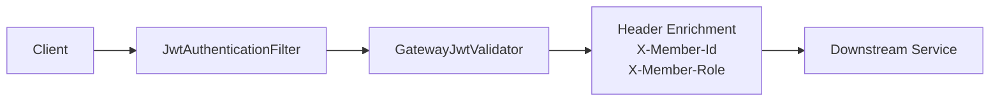

# 3. Auth Design

## 3.1. 개요
이 문서는 `gateway-service` 자체의 인증 처리 구조를 설명한다.
게이트웨이는 프로젝트의 공용 인증 진입점이며, 비공개 API 요청에 대해 Access Token 검증과 인증 헤더 주입을 담당한다.

## 3.2. 게이트웨이의 책임
| 영역 | 책임 |
| --- | --- |
| 요청 진입 제어 | 비공개 API 요청에 대한 인증 진입점 제공 |
| JWT 검증 | issuer, signature, 만료, tokenType 검증 |
| 공개 경로 예외 처리 | 로그인, 회원가입, 토큰 재발급, Swagger 경로 우회 |
| 인증 정보 전달 | `X-Member-Id`, `X-Member-Role` 헤더를 downstream 에 전달 |

## 3.3. 주요 구성 요소
| 구성 요소 | 역할 |
| --- | --- |
| `JwtAuthenticationFilter` | 전역 필터, 공개 경로 제외 및 JWT 검증 수행 |
| `GatewayJwtValidator` | Access Token claim 검증 |
| `GatewayAuthProperties` | 공개 경로, 검증 활성화 여부 설정 |
| `JwtProperties` | JWT secret, issuer 설정 |

## 3.4. 공개 경로
- `POST /api/members`
- `/api/auth/login`
- `/api/auth/refresh`
- `/api/auth/profile-images/presign`
- `/swagger/**`
- `/swagger-ui.html`

## 3.5. 게이트웨이 인증 흐름


### 3.5.1. 처리 순서
1. 요청이 `gateway-service` 로 진입
2. `OPTIONS` 요청이면 그대로 통과
3. `/api/` 로 시작하지 않는 경로면 그대로 통과
4. 공개 경로면 그대로 통과
5. `jwtValidationEnabled=false` 면 그대로 통과 🟡
6. `Authorization: Bearer <token>` 형식 검사
7. `GatewayJwtValidator` 가 토큰 검증
8. 성공 시 `X-Member-Id`, `X-Member-Role` 추가
9. 실패 시 `401 Unauthorized`

## 3.6. JWT 검증 규칙
| 검증 항목 | 설명 |
| --- | --- |
| issuer | `jwt.issuer` 와 일치해야 함 |
| signature | `jwt.secret` 기반 서명 검증 |
| expiration | 만료 토큰 거부 |
| tokenType | `ACCESS` 만 허용 |

### 3.6.1. 허용 claim 예시
```json
{
  "sub": "11111111-1111-1111-1111-111111111111",
  "memberId": "11111111-1111-1111-1111-111111111111",
  "email": "user@test.local",
  "role": "USER",
  "tokenType": "ACCESS",
  "iss": "member-service"
}
```

## 3.7. 전달 헤더
| 헤더 | 설명 |
| --- | --- |
| `X-Member-Id` | 인증된 회원 ID |
| `X-Member-Role` | 인증된 회원 역할 |

## 3.8. 설정 포인트
| 설정 키 | 설명 |
| --- | --- |
| `jwt.secret` | 게이트웨이 JWT 검증용 secret |
| `jwt.issuer` | 토큰 issuer |
| `gateway.auth.jwt-validation-enabled` | JWT 검증 활성화 여부 |
| `gateway.auth.public-paths` | 인증 제외 경로 목록 |

## 3.9. 한계와 결정 필요 사항
- Access Token 블랙리스트 검증은 아직 구현되어 있지 않다. 🟡
- 로그아웃 후 Access Token 즉시 무효화는 지원하지 않는다. 🟡
- 공개 경로 목록이 각 서비스 정책과 완전히 일치하는지 운영 점검이 필요하다. 🟡
- 내부 서비스 간 호출에 대한 별도 서비스 인증 체계는 없다. 🟡

## 3.10. 관련 문서
- 프로젝트 전반 인증/인가 설계: [AuthDesign_Project.md](/c:/my_project/beadv5_2_TodayLunchMenu_BE/gateway/docs/AuthDesign_Project.md)
