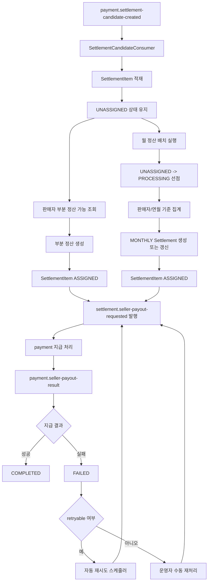

# Settlement Service

`settlement` 모듈은 판매자 정산을 담당하는 서비스입니다. payment 모듈에서 넘어온 정산 후보를 적재하고, 월 단위 집계 정산과 판매자 선택 기반 부분 정산을 만들며, 지급 요청과 지급 결과 반영, 실패 건 재시도/수동 재처리를 수행합니다.

## 1. 한눈에 보는 역할

- payment가 발행한 `settlement candidate` 이벤트를 받아 `settlement_item`으로 적재한다.
  - 현재는 seller별 집계 항목이 들어가나 부분 취소, 환불 요청으로 order_item 단위로 세분화할 수도 있다.
- 월 정산 대상 기간의 `UNASSIGNED settlement_item`을 판매자 + 정산 대상 연월 기준으로 집계한다.
- 판매자가 선택한 `SettlementItem`으로 `Settlement(PARTIAL)`를 생성한다.
- 월 정산 배치에서 `MONTHLY + PENDING settlement`에 대해 지급 요청 이벤트를 발행한다.
- 부분 정산 실행 시 즉시 payout 요청을 발행한다.
- payment가 회신한 지급 결과를 반영해 `COMPLETED` 또는 `FAILED` 상태로 변경한다.
- `RETRYABLE` 실패 건은 스케줄러로 자동 재시도한다.
- `NON_RETRYABLE` 실패 건은 운영 API로 수동 재처리할 수 있게 한다.
- DLQ 재처리 대상 settlement 목록을 운영 API로 일괄 replay 할 수 있다.

현재 중요한 전제:

- 월 정산과 부분 정산은 같은 `SettlementItem` 원천 데이터를 공유한다.
- 따라서 월 정산은 더 이상 "구매확정된 전체 정산 대기 건"을 의미하지 않는다.
- 정확히는 "`SettlementItemStatus = UNASSIGNED` 인 항목 중 월 정산 배치가 가져간 항목"이 월 정산 대상이다.
- 판매자가 부분 정산으로 먼저 가져간 항목은 월 정산 대상에서 제외된다.

## 2. 전체 흐름도



## 3. 실행 정보

| 항목 | 값 |
|---|---|
| 서비스 이름 | `settlement-service` |
| 내부 실행 포트 | `8085` |
| Docker 노출 포트 | `8085:8085` |
| Docker 이미지 실행 프로필 | `prod` |
| DB | PostgreSQL `goods_mall`, 기본 스키마 `settlement` |
| Swagger Docs | `/v3/api-docs` |
| Swagger UI | `/swagger-ui.html` |

추가 메모:

- 현재 저장소 기준 Docker 실행은 `prod` 프로필의 `application.yml` 기본값을 사용합니다.
- `Eureka`, `Config Server` 설명은 `settlement/src/main/resources/application-local.yml` 또는 외부 설정을 따로 붙이는 경우에만 해당합니다.

직접 호출 기준 기본 주소:

```text
http://localhost:8085
```

Gateway 경유 기준 기본 주소:

```text
http://localhost:8080
```

## 4. Docker 기준 실행

### 3.1 컨테이너 빌드/실행 방식

`service/settlement/Dockerfile`은 멀티 스테이지 빌드입니다.

- 빌드 스테이지: `eclipse-temurin:21-jdk`
- 런타임 스테이지: `eclipse-temurin:21-jre`
- 빌드 산출물: `settlement-0.0.1-SNAPSHOT.jar`
- 컨테이너 시작 명령: `java -Dspring.profiles.active=prod -jar /app/app.jar`
- 컨테이너 노출 포트: `8085`

Docker/AWS 환경에서는 기본적으로 `prod` 프로필로 실행됩니다.

### 3.2 docker-compose 기준 settlement 설정

현재 `docker-compose.dev.yml` 기준 `settlement` 컨테이너는 아래 값으로 실행됩니다.

- 컨테이너 이름: `goods-mall-settlement`
- 포트 매핑: `8085:8085`
- `env_file`: `.env`
- `DB_URL`: `${DB_URL}`
- `DB_USER_NAME`: `${DB_USER_NAME}`
- `DB_USER_PASSWORD`: `${DB_USER_PASSWORD}`
- `KAFKA_BOOTSTRAP_SERVERS`: `${SPRING_KAFKA_BOOTSTRAP_SERVERS}`

컨테이너 내부 통신 기준 의존 서비스:

- Kafka: `${SPRING_KAFKA_BOOTSTRAP_SERVERS}` 값이 `kafka:9092`를 가리키도록 주입
- PostgreSQL: `${DB_URL}`

현재 로컬 Docker 실행 경로에서는 `settlement` 컨테이너가 Eureka 또는 Config Server를 직접 사용하지 않습니다.

### 3.3 Docker에서 필요한 환경변수

| 분류 | 환경변수 |
|---|---|
| DB | `DB_URL`, `DB_USER_NAME`, `DB_USER_PASSWORD` |
| Kafka | `SPRING_KAFKA_BOOTSTRAP_SERVERS` 값을 컨테이너 환경변수 `KAFKA_BOOTSTRAP_SERVERS`로 전달 |
| Batch | 현재 Docker 실행 기준 별도 주입 없음. 기본값은 `application.yml`의 cron/zone 설정 사용 |

Settlement Kafka 토픽, 컨슈머 그룹, retry 값은 현재 코드 상수로 고정합니다.

## 5. AWS 배포 고려사항

### 4.1 AWS에서 반드시 분리해야 하는 값

`.env.example` 기준으로 아래 값들은 Git에 두지 않고 런타임 주입해야 합니다.

- `DB_URL`
- `DB_USER_NAME`
- `DB_USER_PASSWORD`
- `SPRING_KAFKA_BOOTSTRAP_SERVERS`
- `JWT_SECRET_KEY`
- `EUREKA_DEFAULT_ZONE` (Eureka 연동을 실제로 사용할 때만)

권장 저장 위치:

- AWS SSM Parameter Store
- AWS Secrets Manager
- ECS task definition secret injection 또는 EC2 환경변수 주입

### 4.2 AWS 네트워크 관점

이 서비스는 아래 연결이 필요합니다.

- PostgreSQL 접속 가능
- Kafka 또는 MSK bootstrap 서버 접속 가능
- Eureka 서버 등록 가능
- Config Server 접근 가능

권장 방향:

- 애플리케이션 간 통신은 Private Subnet 또는 내부 DNS 사용
- DB / Kafka / Eureka / Config 모두 내부 주소 사용 권장
- 배치 스케줄러가 반드시 단일 실행되도록 배포 토폴로지 검토 필요

### 4.3 AWS에서 자주 확인할 항목

- `server.port=8085` 로 서비스 포트가 맞는지
- ALB 또는 Target Group이 `8085`를 바라보는지
- Eureka 등록 hostname/ip 설정이 현재 배포 방식과 맞는지
- Kafka bootstrap 주소가 VPC 내부에서 해석되는지
- Config Server 또는 Eureka를 외부 설정으로 붙일 경우, 해당 장애 시 기동 정책을 별도로 검토해야 하는지
- 월 정산 배치와 실패 재시도 배치가 다중 인스턴스에서 중복 실행되지 않는지

## 6. 도메인 개념

| 개념 | 설명 |
|---|---|
| `SettlementItem` | payment의 `escrow release` 결과를 정산 대상으로 적재한 원천 항목 |
| `Settlement` | 월 정산 또는 부분 정산 지급 단위 |
| `SettlementType.MONTHLY` | 배치 집계 월 정산 |
| `SettlementType.PARTIAL` | 판매자 선택 기반 부분 정산 |
| `SettlementItemStatus.UNASSIGNED` | 아직 어떤 정산에도 연결되지 않은 상태 |
| `SettlementItemStatus.PROCESSING` | 월 정산 또는 부분 정산이 선점한 상태 |
| `SettlementItemStatus.ASSIGNED` | 특정 정산에 연결 완료된 상태 |
| `SettlementStatus.PENDING` | 정산 생성 완료, payout 요청 전 |
| `SettlementStatus.PROCESSING` | payout 요청 발행 완료, payment 결과 대기 |
| `SettlementStatus.COMPLETED` | 지급 완료 |
| `SettlementStatus.FAILED` | 지급 실패 |

정산 금액 계산 규칙:

- `grossAmount`: 판매자 총 매출
- `feeAmount`: `grossAmount * 10%`, 정수 나눗셈 기준 버림
- `netAmount`: `grossAmount - feeAmount`

도메인 해석 기준:

| 대상 | 의미 |
|---|---|
| `SettlementItem` | 정산 대기 원천 항목 |
| `Settlement(PARTIAL)` | 판매자가 직접 선택해 만든 부분 정산 |
| `Settlement(MONTHLY)` | 월 배치가 집계해 만든 월 정산 |

즉, 같은 `Settlement`를 쓰더라도 생성 주체와 생성 방식이 다르므로 `SettlementType` 구분이 필수다.

## 7. 모듈 간 통신 구조

### 6.1 HTTP로 받는 요청

| Method | Path | 인증 | 목적 |
|---|---|---|---|
| `GET` | `/api/settlements/seller/partial-settlements/available` | 필요 | seller 부분 정산 가능 항목 조회 |
| `POST` | `/api/settlements/seller/partial-settlements` | 필요 | seller 부분 정산 생성 및 즉시 payout 요청 |
| `POST` | `/api/settlements/failed-payout/manual-retry` | 필요 | FAILED 정산 1건 수동 재지급 요청 |
| `POST` | `/api/settlements/failed-payout/replay` | 필요 | FAILED 정산 다건 DLQ replay 처리 |

이 API는 `gateway`를 통해 호출하며, 로그인한 사용자 정보는 `@CurrentMember`로 전달됩니다.

- `/api/settlements/seller/partial-settlements*` 는 판매자용 API입니다.
- `/api/settlements/failed-payout/*` 는 운영용 API이며 `ADMIN` 권한을 가진 사용자가 호출하는 것을 기준으로 합니다.

### 6.2 Kafka로 받는 이벤트

| Topic | 메시지 타입 | 목적 |
|---|---|---|
| `payment.settlement-candidate-created` | `SettlementCandidateCreatedMessage` | payment에서 release된 escrow를 정산 후보로 적재 |
| `payment.seller-payout-result` | `SellerSettlementPayoutResultMessage` | payment의 정산금 지급 결과를 settlement 상태에 반영 |

### 6.3 Kafka로 발행하는 이벤트

| Topic | 메시지 타입 | 목적 |
|---|---|---|
| `settlement.seller-payout-requested` | `SellerSettlementPayoutRequestedMessage` | payment에 월 정산 또는 부분 정산 지급 요청 |

## 8. 공통 응답 형식

모든 HTTP 응답은 `ApiResponse<T>` 포맷을 사용합니다.

성공:

```json
{
  "success": true,
  "data": {
    "...": "..."
  },
  "error": null
}
```

실패:

```json
{
  "success": false,
  "data": null,
  "error": {
    "code": "INVALID_INPUT_VALUE",
    "message": "settlementId is required."
  }
}
```

### 자주 쓰는 에러 코드

| 코드 | HTTP Status | 의미 |
|---|---|---|
| `INVALID_TOKEN` | `401` | 인증 토큰 문제 |
| `INVALID_INPUT_VALUE` | `400` | UUID 형식, 리스트 크기, 필수값 오류 |
| `SETTLEMENT_NOT_FOUND` | `404` | 정산 건 없음 |
| `MANUAL_RETRY_NOT_ALLOWED` | `409` | 현재 상태나 실패 사유상 수동 재시도 불가 |

## 9. HTTP API 상세

### 8.0 `GET /api/settlements/seller/partial-settlements/available`

판매자가 현재 부분 정산 가능한 항목을 조회하는 API입니다.

- 인증: 필요
- 호출 대상: `SELLER`
- 조회 기준:
  - seller 본인
  - `settlementItemStatus == UNASSIGNED`
  - `grossAmount > 0`
- 응답 주요 필드:
  - `settlementItemId`
  - `escrowId`
  - `orderId`
  - `grossAmount`
  - `feeAmount`
  - `netAmount`
  - `releasedAt`

### 8.1 `POST /api/settlements/seller/partial-settlements`

판매자가 선택한 `settlementItemId` 목록으로 부분 정산을 생성하고 즉시 payout 요청까지 연결하는 API입니다.

- 인증: 필요
- 호출 대상: `SELLER`
- 요청 본문:

```json
{
  "settlementItemIds": [
    "UUID-1",
    "UUID-2"
  ]
}
```

- 검증 규칙:
  - 목록은 비어 있으면 안 됩니다.
  - 모든 `settlementItemId`가 존재해야 합니다.
  - 모두 같은 seller 소유여야 합니다.
  - 이미 다른 settlement에 연결된 항목이면 안 됩니다.
  - `grossAmount > 0` 이어야 합니다.

- 처리 순서:
  - `Settlement(PARTIAL)` 생성
  - `SettlementItem` 연결
  - payout 요청 발행
  - 상태 `PENDING -> PROCESSING`

### 8.2 `POST /api/settlements/failed-payout/manual-retry`

정산 지급이 실패한 건 1개를 다시 지급해보라고 요청하는 API입니다.

자동 재시도 대상이 아닌 실패 건을 운영자가 직접 다시 처리할 때 사용합니다.

- 인증: 필요
- 요청 본문:

```json
{
  "settlementId": "UUID"
}
```

- 필수값:
  - `settlementId`

- 처리 규칙:
  - `settlementId`는 UUID 문자열이어야 합니다.
  - 해당 정산 건이 현재 `FAILED` 상태여야 합니다.
  - 실패 사유가 자동 재시도 대상이면 이 API로는 다시 요청할 수 없습니다.
  - 다시 요청이 가능한 경우 settlement 상태를 `PENDING`으로 바꾸고, payment 모듈로 지급 요청 이벤트를 다시 보냅니다.

- 성공 응답 데이터:
  - `settlementId`
  - `requested`
  - `message`

예시:

```json
{
  "success": true,
  "data": {
    "settlementId": "11111111-1111-1111-1111-111111111111",
    "requested": true,
    "message": "Manual payout retry requested."
  },
  "error": null
}
```

### 8.3 `POST /api/settlements/failed-payout/replay`

정산 지급이 실패했던 건 여러 개를 한 번에 다시 확인하고 재처리하는 API입니다.

운영자가 DLQ 재처리나 장애 복구 상황에서 여러 settlement를 묶어서 다시 처리할 때 사용합니다.

- 인증: 필요
- 요청 본문:

```json
{
  "settlementIds": [
    "UUID-1",
    "UUID-2"
  ]
}
```

- 필수값:
  - `settlementIds`

- 검증 규칙:
  - 리스트는 비어 있으면 안 됩니다.
  - 최대 100건까지 처리할 수 있습니다.
  - 각 값은 UUID 문자열이어야 합니다.
  - 같은 settlementId가 여러 번 들어와도 내부에서는 한 번만 처리합니다.

- 처리 결과 분류:
  - `requestedRetryCount`: 다시 지급 요청을 보낸 건수
  - `manualActionRequiredCount`: 자동 재처리하지 않고 운영자가 직접 확인해야 하는 건수
  - `skippedCount`: 현재 상태상 다시 처리할 필요가 없어 건너뛴 건수
  - `notFoundCount`: settlement를 찾지 못한 건수

응답 예시:

```json
{
  "success": true,
  "data": {
    "requestedRetryCount": 3,
    "manualActionRequiredCount": 1,
    "skippedCount": 2,
    "notFoundCount": 0
  },
  "error": null
}
```

## 10. 배치와 비동기 처리 흐름

### 9.1 정산 후보 적재

1. payment가 `payment.settlement-candidate-created` 발행
2. settlement가 이벤트를 받아 `SettlementItem` 생성
3. 동일 `escrowId`가 이미 존재하면 중복 적재하지 않는다
4. 신규 `SettlementItem`은 기본적으로 `UNASSIGNED` 상태로 시작한다

### 9.2 월 정산 집계

1. `MonthlySettlementAggregationScheduler`가 매월 실행
2. 기준 시점의 직전 월 범위를 계산
3. 대상 기간의 `UNASSIGNED SettlementItem`을 조회
4. 조건부 상태 변경으로 `UNASSIGNED -> PROCESSING` 선점
5. 선점 성공한 항목만 seller 기준으로 그룹 집계
6. seller + 연월 기준으로 기존 `MONTHLY settlement`를 조회하거나 새로 생성
7. 집계가 끝나면 각 item을 `Settlement`에 연결하고 `ASSIGNED` 상태로 변경
8. 집계가 끝난 뒤 같은 월의 `MONTHLY + PENDING settlement`에 대해 지급 요청 이벤트를 발행

기본 스케줄:

- cron: `0 5 3 1 * *`
- zone: `Asia/Seoul`

즉, 매월 1일 03:05 KST에 직전 월을 집계합니다.

중요한 의미 변화:

- 예전 기준: `settlementId == null` 인 item을 월 정산이 가져간다
- 현재 기준: `UNASSIGNED` item을 월 정산이 먼저 선점한 뒤 집계한다

이 구조는 부분 정산과 월 정산이 같은 `SettlementItem`을 동시에 가져가려는 상황을 줄이기 위한 방향이다.

### 9.3 부분 정산 실행

1. 판매자가 부분 정산 가능 항목 조회 API를 호출한다.
2. settlement가 seller 기준 `UNASSIGNED SettlementItem`을 내려준다.
3. 판매자가 일부 `settlementItemId`를 선택한다.
4. settlement가 `Settlement(PARTIAL)`를 `PENDING` 상태로 생성한다.
5. 선택한 `SettlementItem`에 `settlementId`를 연결하고 `ASSIGNED` 상태로 변경한다.
6. 즉시 payout 요청 이벤트를 발행한다.
7. `Settlement` 상태를 `PROCESSING`으로 변경한다.

### 9.4 지급 요청

1. settlement가 `settlement.seller-payout-requested` 발행
2. payment가 판매자 wallet에 정산금을 적립
3. payment가 결과를 `payment.seller-payout-result`로 회신

월 정산과 부분 정산 모두 같은 payout 채널을 사용한다.
대신 이벤트의 `settlementType`으로 구분한다.

### 9.5 지급 결과 반영

1. settlement가 지급 결과 이벤트를 소비
2. 성공이면 `COMPLETED`
3. 실패면 `FAILED`와 `lastFailureReason` 저장
4. 이미 `COMPLETED`인 건에 대한 중복 성공 이벤트는 no-op 처리

### 9.6 실패 재시도

1. `RetryableFailedPayoutScheduler`가 현재 월의 `FAILED settlement`를 주기적으로 조회
2. `lastFailureReason`이 `retryable=true`인 경우만 자동 재시도
3. 상태를 다시 `PENDING`으로 바꾸고 지급 요청 이벤트를 재발행

기본 스케줄:

- cron: `0 */10 * * * *`
- zone: `Asia/Seoul`

즉, 10분마다 현재 월의 retryable 실패 건을 재시도합니다.

## 11. Kafka 메시지 핵심 필드

### settlement가 소비하는 메시지

| 메시지 | 주요 필드 |
|---|---|
| `SettlementCandidateCreatedMessage` | `eventId`, `orderId`, `escrowId`, `sellerMemberId`, `grossAmount`, `releasedAt`, `confirmationType`, `occurredAt` |
| `SellerSettlementPayoutResultMessage` | `eventId`, `requestEventId`, `settlementId`, `sellerMemberId`, `payoutAmount`, `resultStatus`, `failureReason`, `processedAt` |

### settlement가 발행하는 메시지

| 메시지 | 주요 필드 |
|---|---|
| `SellerSettlementPayoutRequestedMessage` | `eventId`, `settlementId`, `settlementType`, `sellerMemberId`, `settlementYear`, `settlementMonth`, `payoutAmount`, `requestedAt` |

### 지급 실패 사유 분류

`PayoutFailureReason`은 자동 재시도 가능 여부를 함께 가집니다.

자동 재시도 불가:

- `WALLET_NOT_FOUND`
  - 판매자 wallet 자체가 없어서 지급할 대상이 없습니다.
  - 시스템이 다시 시도해도 wallet이 자동으로 생기지 않으므로 운영 확인이 먼저 필요합니다.
- `INVALID_PAYOUT_AMOUNT`
  - 지급 금액이 0 이하이거나 정산 금액 자체가 잘못 계산된 경우입니다.
  - 데이터가 잘못된 상태라 같은 요청을 다시 보내도 정상 처리될 수 없습니다.
- `DUPLICATE_PAYOUT`
  - 같은 `settlementId`에 대해 이미 지급이 처리된 상태입니다.
  - 다시 시도하면 중복 지급이 될 수 있으므로 자동 재시도하면 안 됩니다.

자동 재시도 가능:

- `SETTLEMENT_NOT_FOUND`
  - 결과를 반영하는 시점에 settlement 조회가 잠시 어긋났거나 처리 순서가 맞지 않은 경우입니다.
  - 일시적인 타이밍 문제일 수 있어 다시 시도하면 정상 반영될 가능성이 있습니다.
- `TEMPORARY_DB_ERROR`
  - DB 연결 문제나 일시적인 잠금/경합처럼 잠깐 후 다시 시도하면 풀릴 수 있는 오류입니다.
  - 데이터 자체가 잘못된 것이 아니라 순간적인 인프라 문제로 보는 케이스입니다.
- `KAFKA_PUBLISH_ERROR`
  - 이벤트 발행 시점의 Kafka 연결 문제나 브로커 일시 장애 같은 경우입니다.
  - 메시지 브로커 상태가 회복되면 다시 발행할 수 있으므로 재시도 대상입니다.
- `INTERNAL_ERROR`
  - 특정 코드로 분류되지 않은 일반 런타임 예외입니다.
  - 원인이 일시적일 가능성을 열어두고 우선 재시도 가능한 오류로 분류합니다.

## 12. 운영 시 참고사항

- settlement는 사용자-facing 결제 API가 아니라 운영/배치 중심 서비스입니다.
- 다만 현재는 seller 부분 정산 API가 추가되어 판매자 직접 진입 경로도 함께 가집니다.
- 실질적인 핵심 흐름은 HTTP보다 Kafka와 scheduler입니다.
- 월 정산은 `UNASSIGNED -> PROCESSING -> ASSIGNED` 상태 흐름을 통해 item을 선점하고 처리합니다.
- 부분 정산도 같은 `SettlementItem`을 사용하므로 `UNASSIGNED` 상태 item만 실행 대상이 됩니다.
- 월 정산과 부분 정산은 `SettlementType`으로 반드시 구분해서 해석해야 합니다.
- 월 정산 집계는 같은 `SettlementItem`을 다시 가져가지 않도록 상태 기반으로 동작합니다.
- 정산 후보 적재는 `escrowId` unique 기준으로 중복 적재를 방지합니다.
- 지급 결과 성공 이벤트가 중복으로 들어와도 이미 `COMPLETED`면 no-op 처리합니다.
- 재시도 기준은 `Settlement.lastFailureReason`을 `PayoutFailureReason` enum으로 해석할 수 있는지에 따라 결정됩니다.
- Docker 실행 시 기본 프로필은 `prod`입니다.
- AWS 운영에서는 배치 중복 실행, Kafka 재처리, 운영자 수동 재시도 경로를 함께 고려해야 합니다.

## 13. 현재 구현상 메모

- 정산 스케줄링 시간은 필요시 변경 가능합니다.
- 정산 집계는 현재 seller + year + month 기준 `MONTHLY settlement` 누적 방식입니다.
- 부분 정산은 판매자 선택 기준으로 즉시 생성하는 방식입니다.
- 월 정산과 부분 정산은 모두 같은 `SettlementItem`을 공유합니다.
- 월 정산 헤더는 `MONTHLY` 기준 seller/year/month 유니크 인덱스로 중복 생성을 막는 방향입니다.
- 상태 선점 이후 실패 복구나 stuck `PROCESSING` 대응은 후속 보완 범위입니다.
- 실패 재시도 스케줄러는 현재 월 기준만 대상으로 합니다.
- OpenAPI 설명상 운영 검증은 `ADMIN` 만 사용 가능한 것을 전제로 합니다
## 14. 변경 메모 (2026-04-20)

- settlement 모듈의 금액 필드(`grossAmount`, `feeAmount`, `netAmount`, `payoutAmount` 등) 문서 기준을 코드와 동일하게 `BigDecimal`로 정렬했습니다.
- 월 정산/부분 정산 집계 합계는 `BigDecimal` 누적 기준으로 해석합니다.
- 시간 필드(예: `remainingSeconds`)와 금액 필드를 명확히 분리해 타입 혼동을 방지합니다.

## 15. 변경 메모 (2026-04-27)

- 로컬 Docker 실행 기준 파일명을 `docker-compose.dev.yml`로 정정했습니다.
- `settlement` 컨테이너의 실제 환경변수 주입 방식과 Kafka 설정 키를 현재 구현 기준으로 정정했습니다.
- 현재 저장소 기준 `prod` 실행 경로에서 Eureka, Config Server가 직접 사용되지 않는다는 점을 명확히 했습니다.
