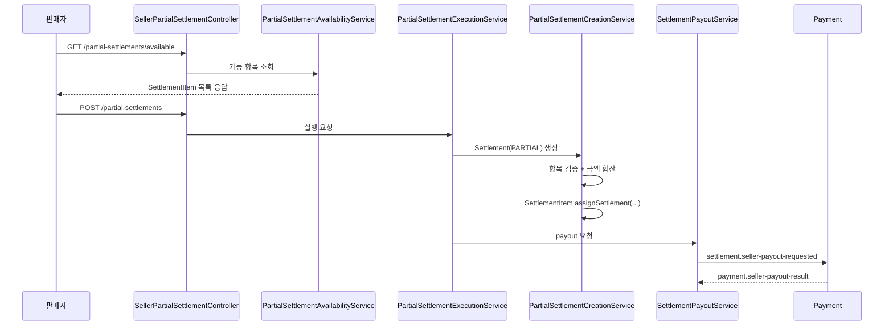

# Settlement 부분 정산 구현 가이드

작성일: 2026-04-19  
대상: `settlement` 모듈의 부분 정산 현재 구현 구조 정리

## 1. 문서 목적

이 문서는 `settlement` 모듈에 추가된 부분 정산 기능을 팀 문서 수준으로 정리한 가이드다.

현재 부분 정산은 아래 흐름을 기준으로 구현됐다.

- 판매자가 부분 정산 가능 항목 조회
- 판매자가 일부 `SettlementItem` 선택
- `Settlement(PARTIAL)` 생성
- 즉시 payout 요청
- payment가 wallet 반영
- settlement가 최종 상태 반영

## 2. 왜 settlement가 부분 정산을 맡는가

부분 정산은 아직 구매확정이 안 된 항목을 다루는 기능이 아니다.
이미 구매확정이 끝나고 정산 대기 중인 항목을 선택하는 기능이다.

정산 대기 기준 데이터는 `SettlementItem`이므로, 책임은 `settlement`가 가지는 것이 맞다.

| 단계 | 기준 데이터 | 담당 모듈 |
|---|---|---|
| 구매확정 전 | `Escrow` | `payment` |
| 정산 대기 | `SettlementItem` | `settlement` |
| 실제 정산 | `Settlement` | `settlement` |
| 지갑 반영 | `Wallet` | `payment` |

## 3. 현재 구현 범위

이번 구현에서 완료된 범위는 아래와 같다.

| 구분 | 상태 |
|---|---|
| 부분 정산 가능 항목 조회 API | 완료 |
| 부분 정산 실행 API | 완료 |
| `SettlementType` 추가 | 완료 |
| `Settlement(PARTIAL)` 생성 | 완료 |
| 즉시 payout 요청 | 완료 |
| payment wallet 반영 구분 | 완료 |

이번 구현에서 제외한 범위는 아래와 같다.

| 구분 | 상태 |
|---|---|
| 관리자 승인 API | 제외 |
| 별도 요청 이력 엔티티 | 제외 |
| 부분 정산 결과 전용 조회 API | 제외 |
| 최대 선택 건수 제한 | 제외 |

## 4. 핵심 도메인 변경점

## 4.1 SettlementType

`Settlement`에 정산 구분값을 추가했다.

| 값 | 의미 |
|---|---|
| `MONTHLY` | 월 정산 |
| `PARTIAL` | 판매자 선택 기반 부분 정산 |

## 4.2 SettlementStatus

부분 정산 흐름을 명확하게 보기 위해 상태 흐름을 아래처럼 사용한다.

| 상태 | 의미 |
|---|---|
| `PENDING` | 생성 완료, payout 요청 전 |
| `PROCESSING` | payout 요청 발행 완료 |
| `COMPLETED` | 지급 성공 |
| `FAILED` | 지급 실패 |

## 4.3 SettlementItem 기준

부분 정산 요청 식별자는 `settlementItemId`로 통일했다.

선택 가능 조건은 아래와 같다.

| 조건 | 설명 |
|---|---|
| 존재해야 함 | 잘못된 ID면 안 됨 |
| seller 본인 소유 | 다른 판매자 건 포함 불가 |
| `settlementId == null` | 이미 정산 연결된 건 제외 |
| `grossAmount > 0` | 의미 없는 정산 제외 |

## 5. API 구조

## 5.1 조회 API

### `GET /api/settlements/seller/partial-settlements/available`

역할:
- 판매자가 부분 정산 가능한 `SettlementItem` 목록을 조회한다.

응답 주요 필드:
- `settlementItemId`
- `escrowId`
- `orderId`
- `grossAmount`
- `feeAmount`
- `netAmount`
- `releasedAt`

## 5.2 실행 API

### `POST /api/settlements/seller/partial-settlements`

요청 예시:

```json
{
  "settlementItemIds": [
    "UUID-1",
    "UUID-2"
  ]
}
```

역할:
- 선택한 `settlementItemId` 목록으로 부분 정산을 생성하고 즉시 payout 요청까지 연결한다.

## 6. 현재 구현 흐름



## 7. 서비스 책임

| 서비스 | 역할 |
|---|---|
| `PartialSettlementAvailabilityService` | 부분 정산 가능 항목 조회 |
| `PartialSettlementCreationService` | `Settlement(PARTIAL)` 생성 |
| `PartialSettlementExecutionService` | 생성 후 payout 요청까지 실행 |
| `SettlementPayoutService` | payment로 payout 요청 발행, 결과 상태 반영 |

## 8. payout 연동 기준

부분 정산도 월 정산과 같은 Kafka payout 채널을 사용한다.

대신 이벤트의 `settlementType`으로 구분한다.

| 항목 | 값 |
|---|---|
| payout topic | `settlement.seller-payout-requested` |
| payout type | `PARTIAL` |
| payment referenceType | `PARTIAL_SETTLEMENT` |

## 9. 월 정산과 부분 정산 차이

| 항목 | 월 정산 | 부분 정산 |
|---|---|---|
| 생성 방식 | 배치 집계 | 판매자 직접 실행 |
| 기준 | seller + year + month | 선택한 `settlementItemId` 목록 |
| 타입 | `MONTHLY` | `PARTIAL` |
| payout 시점 | 월 집계 후 배치 | 생성 직후 즉시 |

## 10. 운영 시 체크 포인트

| 항목 | 확인 내용 |
|---|---|
| 조회 대상 | seller 본인 기준만 내려가는지 |
| 중복 실행 | 이미 settlement 연결된 `SettlementItem`이 다시 요청되지 않는지 |
| 상태 흐름 | `PENDING -> PROCESSING -> COMPLETED / FAILED`가 맞는지 |
| payment 반영 | `PARTIAL_SETTLEMENT`로 저장되는지 |
| 월 정산 분리 | `MONTHLY` 데이터와 조회/집계가 섞이지 않는지 |

## 11. 다음 확장 후보

현재 문서 기준 다음 단계 후보는 아래와 같다.

- 부분 정산 결과 조회 확장
- 관리자 승인 단계 도입
- 별도 요청 이력 엔티티 분리
- 최대 선택 건수 제한
- 프론트 화면 기준 응답 필드 보강

## 12. 결론

현재 부분 정산 구현은 기존 settlement 흐름을 크게 깨지 않고 자연스럽게 확장한 형태다.

핵심은 아래 세 줄이다.

```text
정산 대기 기준은 SettlementItem이다.
부분 정산은 Settlement(PARTIAL)로 생성한다.
생성 직후 payout 요청을 보내고 payment가 wallet을 반영한다.
```
