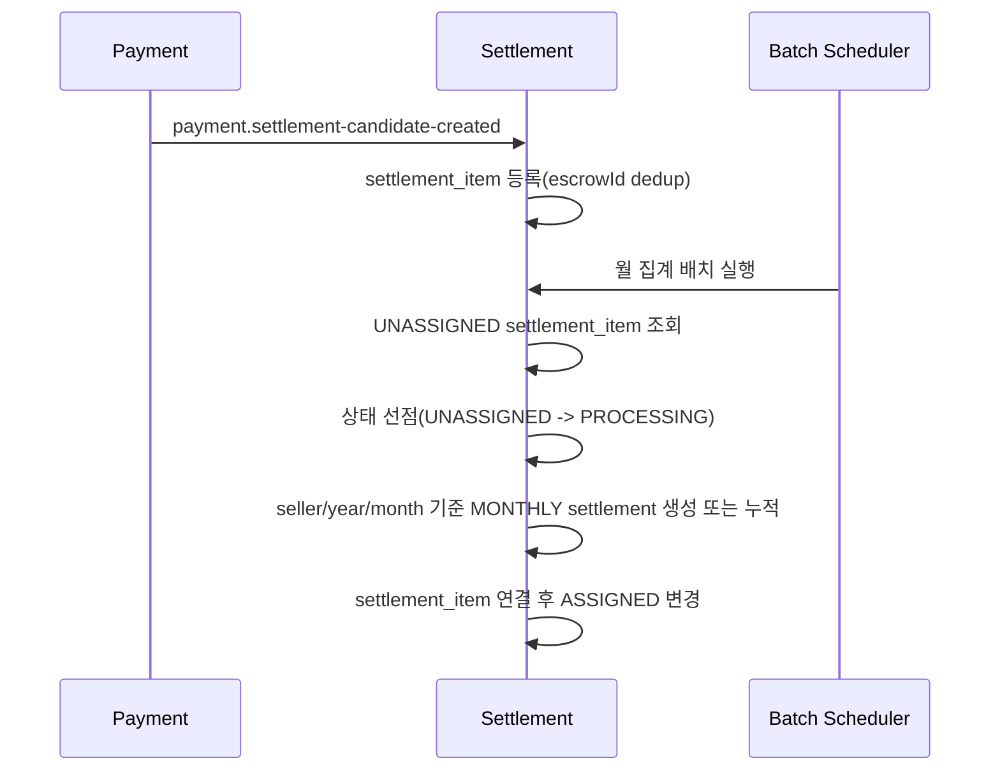
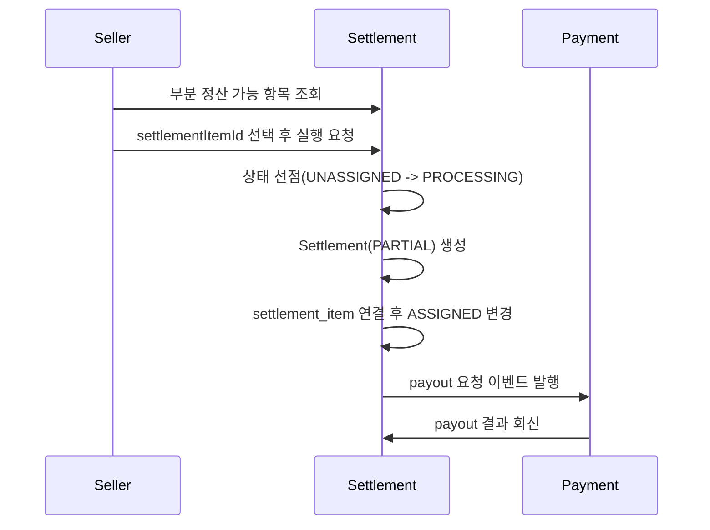
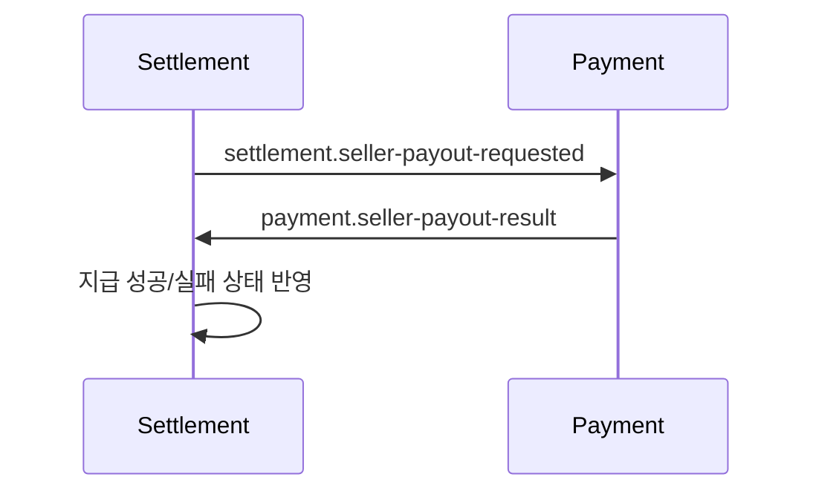

# Settlement 모듈 운영 가이드
작성일: 2026-04-15
최종 수정일: 2026-04-19

## 1. 문서 목적

이 문서는 현재 기준의 `settlement` 모듈 역할을 팀 공유용으로 정리한 문서다.

현재 정책 기준:

- 정산은 유지한다.
- 정산은 월 1회 수수료를 제외한 금액을 판매자에게 지급한다.
- 부분 정산이 도입되어 판매자가 일부 정산 대기 건을 먼저 가져갈 수 있다.
- 구매확정 이후 환불은 처리 대상이 아니다.
- 따라서 settlement에서 환불 제외나 수동 환불 조정 기능은 운영하지 않는다.

운영 관점에서 꼭 알아야 할 변화:

- 예전에는 월 정산이 사실상 "정산 대기 전체"를 가져가는 흐름으로 보일 수 있었다.
- 지금은 그렇지 않다.
- 월 정산과 부분 정산이 같은 `SettlementItem`을 공유하기 때문에, 부분 정산으로 먼저 가져간 항목은 월 정산 대상에서 제외된다.

## 2. Settlement 책임 범위

| 구분 | 책임 |
|---|---|
| 정산 원천 적재 | payment의 정산 후보 이벤트를 `settlement_item`으로 적재 |
| 월 집계 | `UNASSIGNED settlement_item`을 판매자/월 단위로 집계 |
| 부분 정산 | 판매자가 선택한 `SettlementItem`으로 `Settlement(PARTIAL)` 생성 |
| 지급 오케스트레이션 | `PENDING` 정산 지급 요청 발행, 결과 수신 후 상태 반영 |
| 실패 재처리 | 지급 실패 건 재시도 또는 운영 재처리 지원 |

## 3. 핵심 정책 요약

| 정책 | 처리 방식 |
|---|---|
| 구매확정 이후 금액 반영 | payment가 정산 후보 이벤트를 발행하면 settlement가 적재 |
| 월 정산 | 월 배치에서 `UNASSIGNED item`만 집계 |
| 부분 정산 | 판매자 선택 항목을 즉시 정산 생성 |
| 판매자 지급 | 생성된 정산을 기준으로 payout 요청 |
| 지급 실패 | 재시도 스케줄러 및 운영 API로 재처리 |

운영 해석 기준:

| 항목 | 현재 의미 |
|---|---|
| 월 정산 대상 | 아직 어떤 정산에도 연결되지 않은 `UNASSIGNED SettlementItem` |
| 부분 정산 대상 | seller가 직접 선택한 `UNASSIGNED SettlementItem` |
| 월 정산 금액 감소 이유 | 부분 정산으로 먼저 빠진 item이 있을 수 있음 |

## 4. 정산 처리 흐름

### 4.1 정산 후보 생성 및 월 집계

### 4.2 부분 정산 실행

### 4.3 판매자 지급

## 5. API/Kafka 통신 역할

| 통신 | 경로 | 역할 |
|---|---|---|
| Seller API | `/api/settlements/seller/partial-settlements/*` | 부분 정산 가능 항목 조회 및 실행 |
| Kafka In | `payment.settlement-candidate-created` | 정산 원천 적재 트리거 |
| Kafka Out | `settlement.seller-payout-requested` | payment 지급 모듈에 월 정산 또는 부분 정산 지급 요청 |
| Kafka In | `payment.seller-payout-result` | 지급 성공/실패 결과 반영 |
| Ops API | `/api/settlements/failed-payout/*` | 실패 건 재처리 |

## 6. 정산 상태/데이터 모델

### 6.1 settlement 상태

| 상태 | 의미 |
|---|---|
| `PENDING` | 정산 생성 완료, payout 요청 전 |
| `PROCESSING` | payout 요청 발행 완료, payment 결과 대기 |
| `COMPLETED` | 판매자 지급 완료 |
| `FAILED` | 지급 실패 |

### 6.2 settlement_item 상태

| 상태 | 의미 |
|---|---|
| `UNASSIGNED` | 아직 어떤 정산에도 연결되지 않음 |
| `PROCESSING` | 월 정산 또는 부분 정산이 선점한 상태 |
| `ASSIGNED` | 특정 정산에 연결 완료 |

### 6.3 핵심 테이블

| 테이블 | 목적 |
|---|---|
| `settlement.settlement` | 월 정산 또는 부분 정산 헤더 |
| `settlement.settlement_item` | escrow 단위 정산 원천 항목 |

운영상 중요한 구분:

| 구분 | 해석 기준 |
|---|---|
| 월 정산 헤더 | `settlement_type = MONTHLY` |
| 부분 정산 헤더 | `settlement_type = PARTIAL` |
| 월 정산 대상 item | `settlement_item_status = UNASSIGNED` 였다가 월 정산이 선점한 item |
| 부분 정산 대상 item | `settlement_item_status = UNASSIGNED` 였다가 부분 정산이 선점한 item |

## 7. 운영 관점 체크리스트

| 점검 항목 | 확인 포인트 |
|---|---|
| 이벤트 소비 | `payment.settlement-candidate-created` 토픽 lag 및 DLQ 여부 |
| 집계 정합성 | `settlement_item`과 `settlement` 합계 정합성 |
| 상태 정합성 | `UNASSIGNED`, `PROCESSING`, `ASSIGNED` 상태가 흐름에 맞는지 |
| 지급 처리 | 월 정산과 부분 정산 payout 요청/결과 반영이 정상인지 |
| 실패 재처리 | 수동 재지급 API, replay API 권한/배치 크기 제한 |

운영 시 특히 봐야 할 포인트:

- 월 정산 금액이 예상보다 적다면 부분 정산으로 먼저 빠진 항목이 있는지 본다.
- `PROCESSING settlement_item`이 오래 남아 있으면 선점 후 후속 처리 실패 가능성을 본다.
- `MONTHLY`와 `PARTIAL`을 타입 구분 없이 보면 운영 해석이 틀어질 수 있다.

## 8. 현재 제외 범위

현재 settlement에서 처리하지 않는 범위는 아래와 같다.

- 구매확정 이후 환불 반영
- 환불로 인한 정산 제외/차감
- 지급 완료 환불 수동 처리 큐/이력
- 자동 역정산 또는 상계 처리
- `PROCESSING settlement_item` stuck 자동 복구
- 부분 정산 관리자 승인 기능
