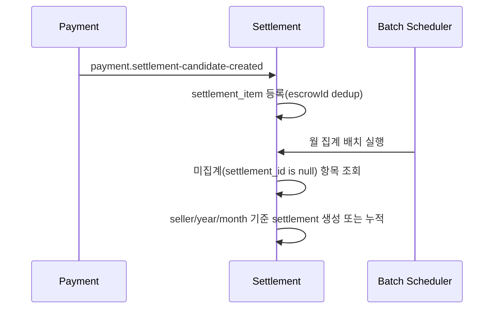
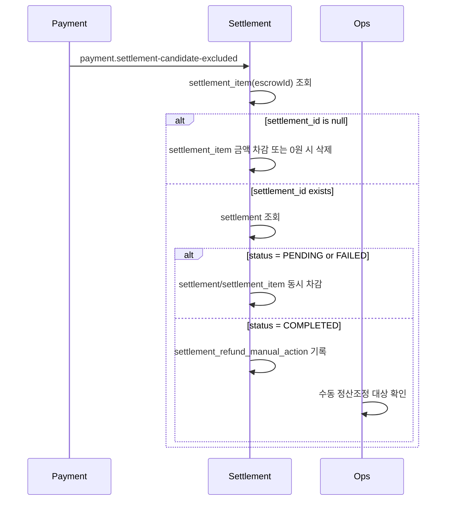

# Settlement 모듈 정리 (정산 집계/지급 + 환불 제외 반영)
작성일: 2026-04-15

## 1. 문서 목적
이 문서는 `settlement` 모듈이 payment 이벤트를 받아 월 정산을 생성/지급하고, 환불 시 정산 제외를 어떻게 처리하는지 팀 공유용으로 정리한 문서다.

## 2. Settlement 책임 범위
| 구분 | 책임 |
|---|---|
| 정산 원천 적재 | payment의 RELEASE 이벤트를 `settlement_item`으로 적재 |
| 월 집계 | `released_at` 기준 미집계 항목을 판매자/월 단위로 집계 |
| 지급 오케스트레이션 | `PENDING` 정산 지급 요청 발행, 결과 수신 후 상태 반영 |
| 환불 제외 반영 | payment의 정산 제외 이벤트 수신 후 차감/제외 처리 |
| 수동 처리 추적 | 지급완료 환불건(`COMPLETED`)을 수동 처리 이력으로 저장 |

## 3. 핵심 정책 요약
| 정책 | 처리 방식 |
|---|---|
| 구매확정 7일 대기 | order 스케줄러가 이벤트 발행 전 7일 대기 |
| 지급 전 환불 | settlement 항목/정산 금액 자동 차감 또는 항목 제거 |
| 지급 완료 환불 | 자동 역정산하지 않고 `settlement_refund_manual_action` 저장 |

## 4. 정산 처리 흐름
### 4.1 정산 후보 생성 및 월 집계

### 4.2 환불 제외 반영

## 5. API/Kafka 통신 역할
| 통신 | 경로 | 역할 |
|---|---|---|
| Kafka In | `payment.settlement-candidate-created` | 정산 원천 적재 트리거 |
| Kafka In | `payment.settlement-candidate-excluded` | 환불로 인한 정산 제외/차감 트리거 |
| Kafka Out | `settlement.seller-payout-requested` | payment 지급 모듈에 지급 요청 |
| Kafka In | `payment.seller-payout-result` | 지급 성공/실패 결과 반영 |
| Ops API | `/api/settlements/failed-payout/*` | 실패 건 재처리(수동 재지급/DLQ replay) |

## 6. 정산 상태/데이터 모델
### 6.1 settlement 상태
| 상태 | 의미 |
|---|---|
| `PENDING` | 지급 요청 대상(또는 재지급 대기) |
| `COMPLETED` | 판매자 지급 완료 |
| `FAILED` | 지급 실패 |

### 6.2 핵심 테이블
| 테이블 | 목적 |
|---|---|
| `settlement.settlement` | 월 정산 헤더(판매자/연월별 합계) |
| `settlement.settlement_item` | escrow 단위 정산 원천 항목 |
| `settlement.settlement_refund_manual_action` | 지급완료 환불 수동처리 큐/이력 |

## 7. 운영 관점 체크리스트
| 점검 항목 | 확인 포인트 |
|---|---|
| 이벤트 소비 | created/excluded 토픽 lag 및 DLQ 여부 |
| 집계 정합성 | `settlement_item` 차감 후 `settlement` 합계 불일치 없는지 |
| 수동 처리 큐 | `settlement_refund_manual_action` 누적 건 모니터링 |
| 실패 재처리 | 수동 재지급 API, replay API 권한/배치 크기 제한 |

## 8. 브랜치 기준 구현 범위/제외 범위
| 구분 | 항목 |
|---|---|
| 포함 | 지급 전 자동 제외, 지급완료 수동처리 이력, 관련 이벤트/테이블/테스트 |
| 제외 | 지급완료 자동 역정산, 상계 자동화, REVERSAL/ADJUSTMENT 원장 고도화 |

